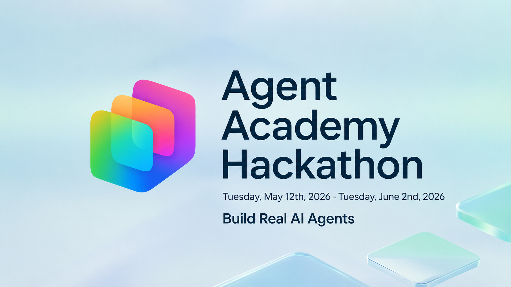

# 🏆 Agent Academy Hackathon

**Event dates:** May 12 – June 2, 2026 · **Status:** Closed

**Winners announced:** June 18, 2026

Builders applied what they learned from Agent Academy to create real, working AI agents using Microsoft AI tools, compete for prizes, and help shape future Agent Academy curriculum updates.

::: tip ✅ Hackathon Completed
The 2026 Agent Academy Hackathon has ended, and winners have been announced.

- [Read the winners announcement](https://devblogs.microsoft.com/powerplatform/agent-academy-hackathon-winners/)
- [Browse all submissions](https://github.com/microsoft/agent-academy/issues?q=is%3Aissue%20label%3Ahack-submission)
:::

::: info 📜 Official Rules & Important Links

- [Official Contest Rules](OFFICIAL_RULES.md)
- [Browse Submissions](https://github.com/microsoft/agent-academy/issues?q=is%3Aissue%20label%3Ahack-submission)
- [Winners Announcement](https://devblogs.microsoft.com/powerplatform/agent-academy-hackathon-winners/)
- [Disclaimer](DISCLAMER.md)
:::

## Kickoff Recording

Watch the kickoff recording from the start of the hackathon.

<!-- markdownlint-disable-next-line MD033 -->
<iframe width="560" height="315" src="https://www.youtube.com/embed/ijG4VPBn-Ls?si=1MMq-Ego4SppG_F2" title="YouTube video player" frameborder="0" allow="accelerometer; autoplay; clipboard-write; encrypted-media; gyroscope; picture-in-picture; web-share" referrerpolicy="strict-origin-when-cross-origin" allowfullscreen></iframe>

## How it worked

The hackathon was built around the Agent Academy learning tracks: learn, build, and submit.

1. **📚 Learn** — Builders worked through the [Agent Academy curriculum](https://aka.ms/agent-academy)
1. **📺 Watch** — The community joined [Agent Academy Live](https://aka.ms/agent-academy-live) on May 12 for kickoff
1. **🔨 Build** — Participants built real, working agents
1. **📤 Submit** — Teams submitted demo videos and architecture overviews by June 2
1. **🔄 Improve** — Feedback and project quality help shape future curriculum updates

## Entry period (closed)

**Start:** May 12, 2026 at 12:00 AM Pacific Time
**End:** June 2, 2026 at 11:59 PM Pacific Time

## Eligibility

- Must be **18 years of age or older**
- If 18+ but below the age of majority in your jurisdiction, a parent or legal guardian must consent
- Microsoft employees and their immediate family members are not eligible
- Void in Cuba, Iran, North Korea, Sudan, Syria, the Region of Crimea, Russia, and where prohibited by law

## Tracks

Participants chose the track matching their experience level. Submissions were limited to **one entry per track** and **two entries total**.

::: details 🟢 Recruit
**For:** First-time agent builders or projects based on the Recruit learning path.

Build a beginner-friendly agent that demonstrates the core fundamentals of agent creation. Submissions should show a clear use case, well-defined instructions, relevant knowledge sources, and a working agent experience that helps a user complete a real task.

[View Recruit curriculum →](/recruit/)
:::

::: details 🔵 Operative
**For:** Builders applying concepts from the Operative learning path.

Build a more advanced agent solution that demonstrates orchestration across multiple agents, agent flows, and AI prompt integration. Submissions should show how agents can coordinate work, trigger or support business processes, use prompts to reason over information, and produce useful outcomes beyond a basic single-agent experience.

[View Operative curriculum →](/operative/)
:::

::: details 🎯 Special Ops
**For:** Builders exploring advanced patterns, extension techniques, or specialized scenarios.

Build an agent or agent capability that explores a focused advanced scenario. Submissions may include MCP integrations, external systems, advanced actions, structured outputs, evaluation patterns, or other targeted agent-building concepts from Special Ops missions.

[View Special Ops →](/special-ops/)
:::

::: details 🤝 Cowork Collective
**For:** Builders using Copilot Cowork to delegate and complete real work.

Build a solution that uses Copilot Cowork to complete or support delegated work. Submissions should show how Cowork can reason across a task, use available context and tools, produce a useful work product, and fit into a real workflow where a person reviews or acts on the result.

[View Cowork Collective →](/cowork-collective/)
:::

## Entry requirements (archive)

- Must be your own original work
- Cannot have won another contest
- Demo video must be solely your own work
- Must have all necessary rights and consents for submitted content
- Must not contain obscene, offensive, violent, defamatory, or illegal content

## Judging criteria

All qualifying entries were scored using the weighted criteria below.

| Criteria | Weight |
|----------|--------|
| **Accuracy & Relevance** — Meets challenge requirements | 25% |
| **Technical Execution** — Clear problem-solving approach | 25% |
| **Creativity & Originality** — Novel ideas or unexpected execution | 15% |
| **User Experience & Presentation** — Clear, polished, demoable | 15% |
| **Reliability & Safety** — Solid patterns, avoids obvious pitfalls | 10% |
| **Use Case Impact** — Most impactful use case | 10% |

Winners were selected within **14 days** of the entry period close. In case of a tie, an additional judge breaks it. **All judge decisions are final.**

## Prizes

**$12,000 USD total prize pool** in Microsoft Store Gift Cards, awarded per track.

<!-- markdownlint-disable-next-line MD033 -->
<HackathonPrizes />

::: warning Prize rules

- One prize per person maximum during the entry period
- No substitution, transfer, or assignment of prizes permitted
- Taxes on prizes are the sole responsibility of the winner
- Potential winners notified within 7 days of judging via contact info provided at entry
- Prizes delivered within 28 days of winner selection
:::

## Key dates

| Milestone | Date |
|-----------|------|
| 🚀 Contest Start / Live Kickoff | May 12, 2026 |
| 🔨 Build Window | May 12 – June 2, 2026 |
| 📤 Submission Deadline | June 2, 2026 at 11:59 PM PT |
| ⚖️ Judging Window | Within 14 days of close |
| 📰 Winners Publicly Announced | June 18, 2026 |
| 🏆 Winners Notified | Within 7 days of judging |
| 🎁 Prizes Delivered | Within 28 days of selection |

## 2026 Winners

Winners were announced in the official post: [Meet the Agent Academy Hackathon Winners](https://devblogs.microsoft.com/powerplatform/agent-academy-hackathon-winners/).

### Recruit Track

| Place | Project | Builder | Links |
|-------|---------|---------|-------|
| 🥇 First | Performance Development Assistant | [@Ateina](https://github.com/Ateina) | [Repo](https://github.com/Ateina/performance-development-assistant) · [Demo](https://www.youtube.com/watch?v=B5tggLGtnqE&feature=youtu.be) |
| 🥈 Second | Meeting Tasks Agent | [@hutten358](https://github.com/hutten358) | [Repo](https://github.com/hutten358/MeetingTasksAgent) · [Demo](https://www.youtube.com/watch?v=hPbb13zlAx4) |
| 🥉 Third | Conversational AI Agent for Vehicle Insurance Self-Service Portal | [@anupamac985](https://github.com/anupamac985) | [Repo](https://github.com/anupamac985/Copilot-Insurance-Agent) · [Demo](https://www.youtube.com/watch?v=Jjh_LOcwxMc) |

### Operative Track

| Place | Project | Builder | Links |
|-------|---------|---------|-------|
| 🥇 First | VendorGuard — Autonomous Vendor Contract Compliance System | [@experienceswithanishh](https://github.com/experienceswithanishh) | [Repo](https://github.com/experienceswithanishh/vendorguard-copilot-studio) · [Demo](https://drive.google.com/file/d/17-Y30hhX2ZBwbPJKSK8ul-wcw1BraLUy/view) |
| 🥈 Second | Engagement Hub | [@leila-marspooner](https://github.com/leila-marspooner) | [Repo](https://github.com/leila-marspooner/engagement-hub-agent) · [Demo](https://www.youtube.com/watch?v=Tzn6pMMoEAw&feature=youtu.be) |
| 🥉 Third | FrostByte AI Advisor | [@JBearCode](https://github.com/JBearCode) | [Repo](https://github.com/JBearCode/frostbyte-ai-advisor) · [Demo](https://www.youtube.com/watch?v=qGv_eDVM1gQ&feature=youtu.be) |

### Special Ops Track

| Place | Project | Builder | Links |
|-------|---------|---------|-------|
| 🥇 First | SprintForge | [@Shrusti13](https://github.com/Shrusti13) | [Repo](https://github.com/Shrusti13/sprint-forge) · [Demo](https://github.com/Shrusti13/sprint-forge/blob/main/demo/SprintForgeDemoShort%201.mp4) |
| 🥈 Second | Calamity Agent — Weather & Fire Alerts | [@tagr](https://github.com/tagr) | [Repo](https://github.com/tagr/CalamityCopilotService) · [Demo](https://www.youtube.com/watch?v=cT6Jr3xLX-I) |
| 🥉 Third | Warehouse Picking Agent | [@granjan7779](https://github.com/granjan7779) | [Repo](https://github.com/granjan7779/rj-mcp-d365-server-2) · [Demo](https://www.youtube.com/watch?v=XXu6rNQmKAo&feature=youtu.be) |

### Cowork Collective Track

| Place | Project | Builder | Links |
|-------|---------|---------|-------|
| 🥇 First | Copilot Cowork Autonomous ITSM Platform on Microsoft 365 | [@ninihen1](https://github.com/ninihen1) | [Repo](https://github.com/ninihen1/copilot-studio-itsm-agent) · [Demo](https://www.youtube.com/watch?v=4oKlENZGW5M&feature=youtu.be) |
| 🥈 Second | Client Kick-off Skill | [@appieschot](https://github.com/appieschot) | [Repo](https://github.com/appieschot/client-kickoff-skill) · [Demo](https://www.youtube.com/watch?v=66Od72cKvM0&feature=youtu.be) |
| 🥉 Third | Team Yaito — A Multi-Agent PMO on Copilot Cowork | [@Jirawat-Yaito](https://github.com/Jirawat-Yaito) | [Repo](https://github.com/Jirawat-Yaito/team-yaito-pmo) · [Demo](https://www.youtube.com/watch?v=Sri1vZOrUAw) |

::: info Highlight
VendorGuard (Operative Track 🥇) was noted as the single highest-scoring entry across the entire hackathon.
:::

## Thank You

Congratulations to all winners, and thank you to everyone who participated in the 2026 Agent Academy Hackathon.

## Legal

**Governing law:** This contest is governed by the laws of the State of Washington. You consent to the exclusive jurisdiction of the courts of the State of Washington for any disputes.

**Privacy:** Personal data provided during entry will be used by Microsoft solely for administration and operation of this contest, in accordance with the [Microsoft Privacy Statement](https://privacy.microsoft.com/en-us/privacystatement).

**Winners list:** To receive a list of winners who received a prize worth $25 USD or more, send an email to [poweradvocates@microsoft.com](mailto:poweradvocates@microsoft.com) with the subject line "Agents Academy Live Challenge Contest winners" within 30 days of June 2, 2026.

**Use of entries:** By submitting, you grant Microsoft an irrevocable, royalty-free, worldwide license to use, review, assess, test, and analyze your entry in connection with this contest and for any non-commercial or commercial purpose including marketing, sale, or promotion of Microsoft products or services.

## Resources

- [Agent Academy Curriculum](https://aka.ms/agent-academy)
- [Agent Academy GitHub](https://github.com/microsoft/agent-academy)
- [Code of Conduct](https://github.com/microsoft/agent-academy/blob/hackathon/CODE_OF_CONDUCT.md)
- [Security Policy](https://github.com/microsoft/agent-academy/blob/hackathon/SECURITY.md)
- [Contributing Guidelines](https://github.com/microsoft/agent-academy/blob/hackathon/hackathon/CONTRIBUTING.md)
