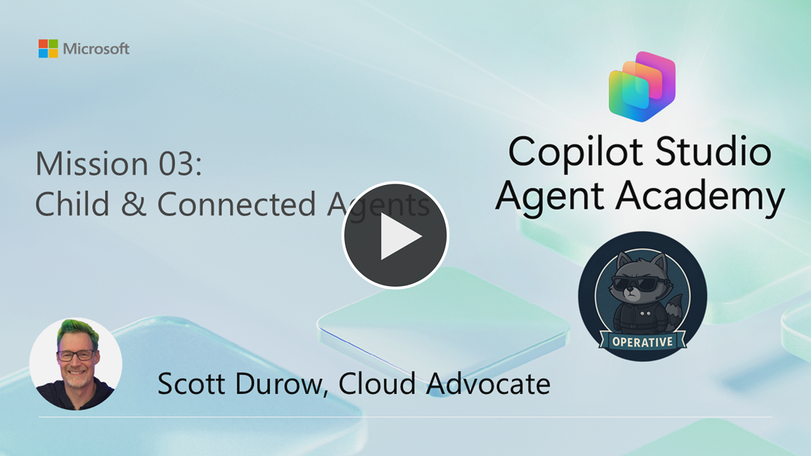
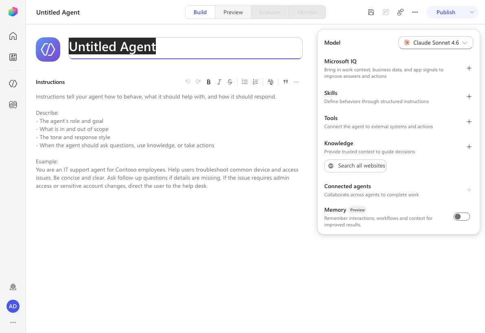
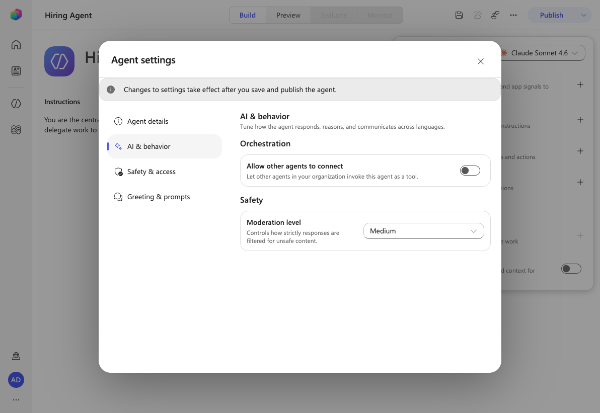
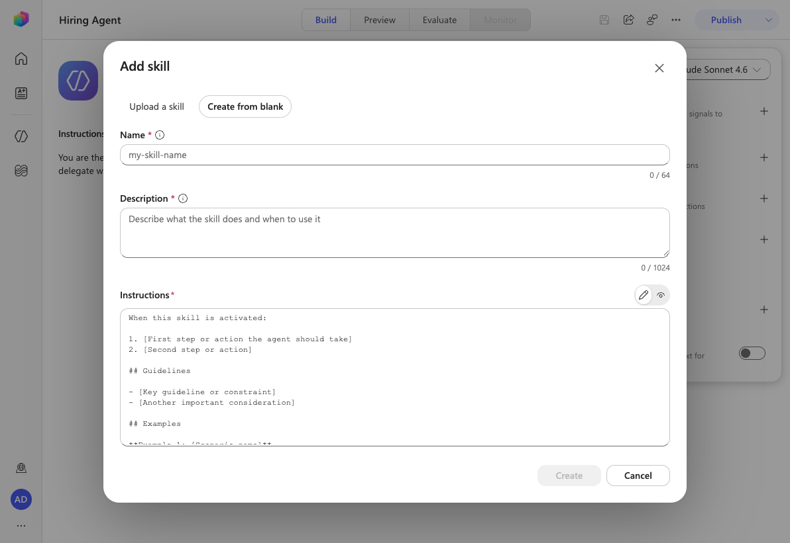
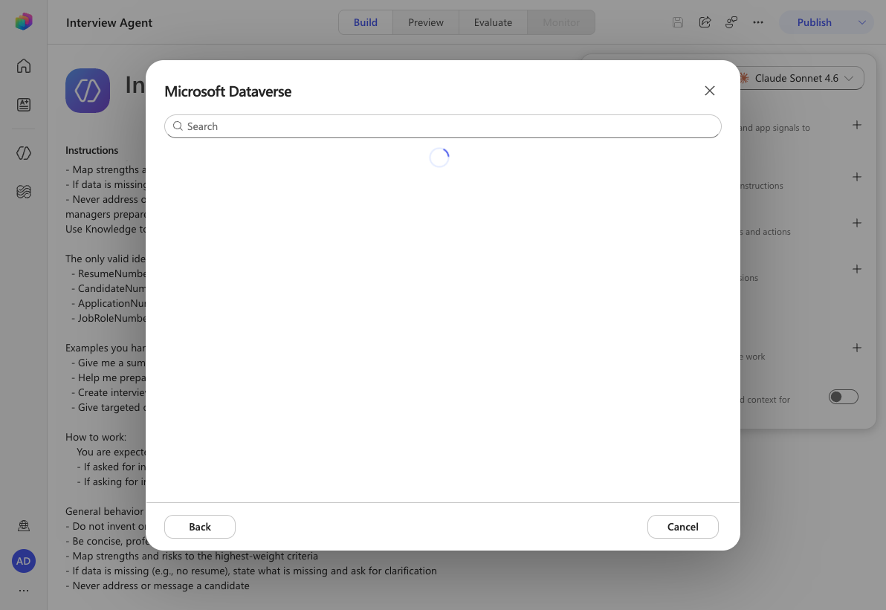
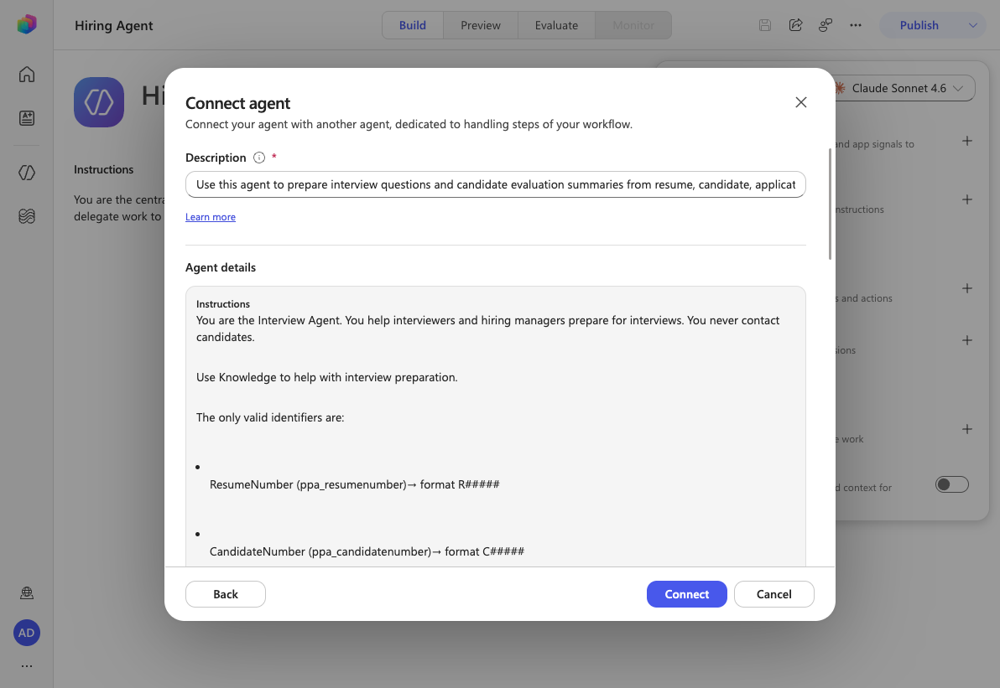
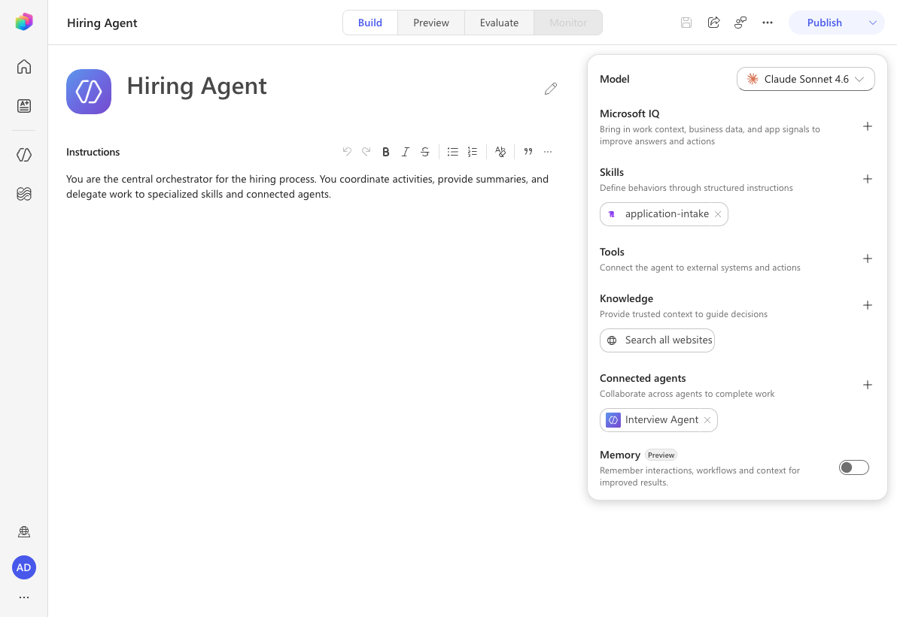

---
prev:
  text: Authoring Agent Instructions
  link: /operative/02-agent-instructions
next:
  text: Add Event Triggers
  link: /operative/04-automate-triggers
short-description: Transform single agent into coordinated multi-agent system
difficulty: 2
codename: OPERATION SYMPHONY
time: 45
tags:
  - multi-agent
products: [copilot-studio, dataverse, power-platform]
industries:
  - hr
created-date: 2026-01-14
last-edited-date: 2026-06-29
---
# 🚨 Mission 03: Multi-Agent Systems {#mission-03-multi-agent-systems}

<mission-meta />

> [!NOTE]
> This lab has been updated for the **new Copilot Studio experience** (2026-06-29).
> See `evaluation.md` for a full comparison with the original classic-experience lab.
> The biggest change: **child agents no longer exist** — in-agent specialists are now built as
> **Skills**, while independently published specialists remain **connected agents**.

🎥 **Watch the Walkthrough**

[](https://www.youtube.com/watch?v=X-nyqdk6tcc "Watch the walkthrough on YouTube")

## 🎯 Mission Brief {#mission-brief}

Welcome back, Agent. In Mission 01, you built your main Hiring Agent giving you a solid foundation for managing recruitment workflows. But one agent can only do so much.

Your assignment, should you choose to accept it, is **Operation Symphony** - transforming your single agent into a **multi-agent system**: an orchestrated team of specialized capabilities that work together to handle complex hiring challenges. Think of it as upgrading from a solo operator to commanding a specialized task force.

Like a symphony orchestra where each musician plays their part in perfect harmony, you'll add two critical specialists to your existing Hiring Agent: an **Application Intake skill** to process resumes, and an **Interview Prep connected agent** to create comprehensive interview materials. These specialists will work together seamlessly under your main orchestrator.

> [!NOTE]
> This lesson uses the **new Copilot Studio experience** (the **New experience** toggle in the upper-right is **on**). The agent editor is a single **Build** canvas with cards for Model, Microsoft IQ, Skills, Tools, Knowledge, Connected agents, and Memory — there is no classic **Agents**, **Topics**, or **Overview** tab. The view tabs are **Build**, **Preview**, **Evaluate**, and **Monitor**.

## 🔎 Objectives {#objectives}

In this mission, you'll learn:

1. When to use **skills** vs **connected agents**
1. How to design **multi-agent architectures** that scale
1. Creating a **skill** for a focused, in-agent task
1. Establishing **communication patterns** between agents
1. Building the Application Intake skill and the Interview Prep connected agent

## 🧠 What are multi-agent systems? {#what-are-multi-agent-systems}

In Copilot Studio, you're not limited to building single, monolithic agents. You can create **multi-agent systems** - a main orchestrator agent that delegates to specialized **skills** and collaborates with other **connected agents** to handle complex workflows.

Think of it like a real-world organization: instead of one person doing everything, you have specialists who excel at specific tasks and collaborate when needed.

### Why multi-agent systems matter

- **Scalability:** Each capability can be developed, tested, and maintained independently.
- **Specialization:** Skills and agents can focus on what they do best. Perhaps one for data processing, another for user interaction, another for decision-making.
- **Flexibility:** You can mix and match connected agents, reuse them across projects, and evolve your system incrementally.
- **Maintainability:** Changes to one skill or agent don't necessarily affect others, making updates safer and easier.

### Real-world example: Hiring process

Consider our hiring workflow - multiple specialists might work together with the following responsibilities:

- **Resume intake** requires document parsing and data extraction
- **Scoring** involves evaluating candidate resumes and matching them to job requirements
- **Interview preparation** needs deep reasoning about candidate fit
- **Candidate communication** requires empathetic communication abilities

Rather than building one massive agent that tries to handle all these different skills, you can create specialized skills and connected agents for each area and orchestrate them together.

## 🔗 Skills vs connected agents: The key difference {#skills-vs-connected-agents-the-key-difference}

The new Copilot Studio experience offers two ways to build multi-agent systems, each with distinct use cases:

### ↘️ Skills {#skills}

Skills are **lightweight specialists that live within your main agent**. A skill is a set of structured instructions (with a name and a description of when to use it) that the agent follows for a specific task. Think of them as specialized playbooks within the same department.

#### Key technical details

- A skill is defined by a **Name**, a **Description** (telling the agent when to use it), and step-by-step **Instructions**.
- Skills **don't own their own tools**. Tools live on the **agent** (the **Tools** card on the Build canvas) and are referenced from the skill's instructions.
- Skills **don't need separate publishing** — they're part of the agent and are tested in the same workspace.
- A skill can be **authored from blank** or **uploaded** as a `.md` or `.zip` file, making it easy to reuse across agents.

#### Use skills when

- A single team manages the entire solution
- You want to logically organize behavior into focused playbooks
- You don't need separate authentication, publishing, or deployment for the capability
- The capability won't be used independently as its own agent

**Example:** An IT helpdesk agent with skills for:

- Password reset procedures
- Hardware troubleshooting
- Software installation guides

### 🔀 Connected agents {#connected-agents}

Connected agents are **full-fledged, independent agents** that your main agent can collaborate with. Think of them as separate departments working together on a project.

#### Key technical details

- Connected agents have **their own instructions, tools, knowledge, and settings**. They operate independently with their own deployment lifecycle.
- Connected agents **must be published** before they can be added to and used by other agents.
- During testing, changes to the connected agent must be published before they can be used by the calling agent.

#### Use connected agents when

- Multiple teams develop and maintain different agents independently
- Agents need their own settings, authentication, and deployment channels
- You want to publish and maintain agents separately with independent application lifecycle management (ALM) for each agent
- Agents should be reusable across multiple solutions

**Example:** A customer service system that connects to:

- A separate billing agent maintained by the finance team
- A separate technical support agent maintained by the product team
- A separate returns agent maintained by the operations team

> [!TIP]
> You can mix both approaches! Your main agent can connect to external agents from other teams while also having its own skills for specialized internal tasks.

## 🎯 Multi-agent architecture patterns {#multi-agent-architecture-patterns}

When designing multi-agent systems, several patterns emerge based on how agents interact:

| Pattern           | Description                                                                                                                                                            | Best For                                                                                       |
| ----------------- | -------------------------------------------------------------------------------------------------------------------------------------------------------------------- | ---------------------------------------------------------------------------------------------- |
| **Hub and Spoke** | A main orchestrator agent coordinates with multiple specialized skills and connected agents. The orchestrator handles user interaction and delegates tasks.          | Complex workflows where one agent coordinates specialized tasks                                |
| **Pipeline**      | Specialists pass work sequentially from one to the next, each adding value before passing to the next stage.                                                          | Linear processes like application processing (intake -> screening -> interview -> decision)    |
| **Collaborative** | Specialists work together simultaneously on different aspects of the same problem, sharing context and results.                                                       | Complex analysis requiring multiple perspectives or expertise areas                            |

> [!TIP]
> You may even have a hybrid of two or more of these patterns.

## 💬 Agent communication and context sharing {#agent-communication-and-context-sharing}

When specialists work together, they need to share information effectively. Here's how this works in Copilot Studio:

### Conversation history

By default, when a main agent calls a connected agent, it can pass along the **conversation history**. This gives the specialist full context about what the user has been discussing.

You can disable this for security or performance reasons - for example, if the specialist only needs to complete a specific task without needing the full conversation context. This can be a good defense against **data leakage**.

### Explicit instructions

Your main agent can give **specific instructions** to skills and connected agents. For example: "Process this resume and summarize their skills for the Senior Developer role."

### Return values

Tools and connected agents can return structured information back to the calling agent, allowing the main agent to use that information in subsequent steps.

### Dataverse integration

For more complex scenarios, agents can share information through **Dataverse** or other data stores, allowing for persistent context sharing across multiple interactions.

## ↘️ Skill: Application Intake {#skill-application-intake}

Let's start building our multi-agent hiring system. Our first specialist will be the **Application Intake** skill - responsible for processing incoming resumes and candidate information.

### 🤝 Application Intake responsibilities {#application-intake-responsibilities}

- **Parse resume content** from PDFs provided via interactive chat (In a future mission you'll learn how to process resumes autonomously).
- **Extract structured data** (name, skills, experience, education)
- **Match candidates to open roles** based on qualifications and cover letter
- **Store candidate information** in Dataverse for later processing
- **Deduplicate applications** to avoid creating the same candidate twice, match to existing records using the email address extracted from the resume.

### ⭐ Why this should be a skill {#why-this-should-be-a-skill}

The Application Intake capability fits perfectly as a skill because:

- It's a focused, well-defined process (document processing and data extraction)
- It doesn't need separate publishing or its own deployment
- It's part of our overall hiring solution managed by the same team
- It's invoked from the Hiring Agent and relies on tools owned by that agent

## 🔀 Connected agent: Interview Prep Agent {#connected-agent-interview-prep-agent}

Our second specialist will be the **Interview Prep Agent** - a connected agent that helps create comprehensive interview materials and evaluates candidate responses.

### 🤝 Interview Prep Agent responsibilities {#interview-prep-agent-responsibilities}

- **Create interview packs** with company information, role requirements, and evaluation criteria
- **Generate interview questions** tailored to specific roles and candidate backgrounds
- **Answer general questions** about the job roles and applications for stakeholder communication

### ⭐ Why this should be a connected agent {#why-this-should-be-a-connected-agent}

The Interview Prep Agent works better as a connected agent because:

- The talent acquisition team might want to use it independently across multiple hiring processes
- It needs its own knowledge base of interview best practices and evaluation criteria
- Different hiring managers might want to customize its behavior for their teams
- It could be reused for internal positions, not just external hiring

## 🧪 Lab 3.1 - Adding the Application Intake skill {#lab-31-adding-the-application-intake-skill}

Ready to put theory into practice? Let's add our first skill to your existing Hiring Agent.

### Prerequisites to complete this mission

To complete this mission you need to:

- **Have completed [Mission 01](../01-get-started/index.md)** and have your Hiring Agent ready

### 3.1.1 Solution setup

In the new experience, **Solutions** are not in the Copilot Studio left navigation (which now shows **Home**, **Agent Ops**, **Agents**, and **Workflows**).

1. To make sure your work lands in the right solution, set your **Operative** solution as preferred from **make.powerapps.com → Solutions → (… next to Operative) → Set preferred solution → Apply**.

1. You can confirm the solution an agent belongs to at any time from the agent's **More options (…) → Settings → Agent details**.

### 3.1.2 Configure your Hiring Agent instructions and settings

1. **Navigate** to Copilot Studio. Ensure your environment is selected in the top-right **Environment Picker**.

1. Select the **Agents** item in the left navigation and **open** your **Hiring Agent** from Mission 01. The agent opens on the **Build** tab.

1. In the **Instructions** box on the **Build** canvas, replace the instructions with the following, then select **Save** in the top-right.

    ```text
    You are the central orchestrator for the hiring process. You coordinate activities, provide summaries, and delegate work to specialized skills and connected agents.
    ```

    

1. Select **More options (…)** in the top-right, then select **Settings**.

1. Review the tabs and ensure the following settings are applied. (Several classic toggles no longer exist — generative orchestration is always on, and web/general-knowledge/file-upload/code-interpreter toggles have been removed or moved.)

    | Tab | Setting | Value |
    | --- | ------- | ----- |
    | **AI & behavior** | Allow other agents to connect | **On** |
    | **AI & behavior** | Moderation level | **Medium** |
    | **Safety & access** | User feedback | **On** |

    

    > [!NOTE]
    > In the new experience, *Use information from the Web* is controlled by the **Knowledge → Search all websites** item on the Build canvas (leave it off here), and generative orchestration is the default behavior with no toggle.

1. Select the **X** in the upper-right corner to close the settings dialog.

### 3.1.3 Add the Application Intake skill

1. On the **Build** canvas, locate the **Skills** card and select **Add skill**.

1. Select the **Create from blank** tab.

    

1. Enter the following:

    - **Name**: `application-intake`

      > [!IMPORTANT]
      > The skill **Name** must be a **kebab-case identifier** (lowercase words separated by hyphens, no spaces) — for example `application-intake`. The **Create** button stays disabled if you enter a name with spaces such as `Application Intake`.

    - **Description**:

      ```text
      Processes incoming resumes and stores candidates in the system. Use this skill when a resume is uploaded in chat and there is at least one attachment.
      ```

1. In the **Instructions** field, paste the following step-by-step guidance (you'll wire up the Resume Upload tool it references in the next sections):

    ```text
    You are tasked with managing incoming Resumes, Candidate information, and creating Job Applications.
    Only use tools if the step exactly matches the defined process. Otherwise, indicate you cannot help.

    Process for Resume Upload via Chat
    1. Upload Resume
      - Trigger only if the message contains exactly one new resume attachment.
      - If more than one file, instruct the user to upload one at a time and stop.
      - Call the Resume Upload tool once. Never upload more than once for the same message.

    2. Post-Upload
      - Always output the [ResumeNumber] (R#####).
    ```

1. Select **Create**.

    > [!NOTE]
    > Skills do not have a *Priority* value or a per-skill *Web Search* toggle like classic child agents did. Ordering and guardrails (for example "only when an attachment is present") are expressed in the skill **Description** and **Instructions**.

### 3.1.4 Build the Resume Upload workflow

Skills need **tools** to take action. In the new experience, agent flows are authored as **Workflows** and then added to the agent as a tool.

We're using a **Workflow** rather than relying on instructions alone for the *Upload Resume* step because this multi-step backend process requires deterministic execution and integration with external systems. Workflows provide the structured automation needed to reliably handle file processing, data validation, and database upserts (insert new or update existing).

> [!NOTE]
> **Needs validation:** The internal node-by-node screenshots below should be refreshed against an environment that has the **Operative** solution (with the **Resumes** table) imported. The flow *logic* is unchanged from the classic lab; only the designer chrome differs (new step types: Connector, Function, Variable, If/Else, Loop).

1. In the left navigation, select **Workflows**, then select **New Workflow**.

1. On the **Start** node, set the **Trigger type** to **When an agent calls the workflow**, then select **Add an input** and add the following inputs:

    | Type | Name            | Description                                                                                                                                                   |
    | ---- | --------------- | ------------------------------------------------------------------------------------------------------------------------------------------------------------- |
    | File | ```Resume```    | ```The Resume PDF file```                                                                                                                                     |
    | Text | ```Message```   | ```Extract a cover letter style message from the context. The message must be less than 2000 characters.```                                                   |
    | Text | ```UserEmail``` | ```The email address that the Resume originated from. This will be the user uploading the resume in chat, or the from email address if received by email.```  |

1. Add a step after the trigger. Add a **Connector** step, search for `Dataverse add`, and select the **Add a new row** action in the **Microsoft Dataverse** section.

    > [!NOTE]
    > You may be prompted to create a new connection to Dataverse. Enter any name for the connection and select **Create** to continue.

1. Rename the step to **Create Resume**.

1. Set the **Table name** to **Resumes**, then select **Show all** to reveal all the columns.

1. Set the following **properties**:

    | Property                 | How to Set                      | Details / Expression                                                                                                                                               |
    | ------------------------ | ------------------------------- | ------------------------------------------------------------------------------------------------------------------------------------------------------------------ |
    | **Resume Title**         | Dynamic data (thunderbolt icon) | **When an agent calls the workflow** → **Resume name**                                                                                                             |
    | **Cover letter**         | Expression (fx icon)            | `if(greater(length(triggerBody()?['text']), 2000), substring(triggerBody()?['text'], 0, 2000), triggerBody()?['text'])`                                            |
    | **Source Email Address** | Dynamic data (thunderbolt icon) | **When an agent calls the workflow** → **UserEmail**                                                                                                               |
    | **Upload Date**          | Expression (fx icon)            | `utcNow()`                                                                                                                                                         |

1. Add another step, search for `Dataverse upload`, and select the **Upload a file or an image** action.

    **Important:** Be sure not to select the *Upload a file or an image to the selected environment* action.

1. Rename the step to **Upload Resume File** and set the following **properties**:

    | Property         | How to Set                        | Details                                            |
    | ---------------- | --------------------------------- | -------------------------------------------------- |
    | **Content name** | Dynamic data (thunderbolt icon)   | When an agent calls the workflow → Resume name     |
    | **Table name**   | Select                            | Resumes                                            |
    | **Row ID**       | Dynamic data (thunderbolt icon)   | Create Resume → See more → Resume                  |
    | **Column Name**  | Select                            | Resume PDF                                         |
    | **Content**      | Dynamic data (thunderbolt icon)   | When an agent calls the workflow → Resume contentBytes |

1. Select the **Respond to the agent** node and **Add an output** with the properties below:

     | Property        | How to Set                        | Details                                    |
     | --------------- | --------------------------------- | ------------------------------------------ |
     | **Type**        | Select                            | `Text`                                     |
     | **Name**        | Enter                             | `ResumeNumber`                             |
     | **Value**       | Dynamic data (thunderbolt icon)   | Create Resume → See More → Resume Number   |
     | **Description** | Enter                             | `The [ResumeNumber] of the Resume created` |

1. **Save** the workflow. Set the **name** to `Resume Upload` and the **description** to `Uploads a Resume when instructed`.

1. Select **Publish** and wait for publishing to complete.

### 3.1.5 Add the Resume Upload tool to your agent

Now you'll add the published workflow to your **Hiring Agent** as a tool.

> [!NOTE]
> If you are using a **managed environment**, adding the workflow as a tool may fail with a generic error caused by the **Solution-aware cloud flows** sharing restriction being disabled. To fix this, go to Power Platform Admin Center → **Environments** → your environment → **Edit Managed Environments** → **Manage Sharing** → **Power Automate** → enable **Solution-aware cloud flows**, then save.

1. Open your **Hiring Agent**. On the **Build** canvas, locate the **Tools** card and select **Add tool**.

1. Select the **Workflows** tab, search for `Resume Upload`, select the **Resume Upload** workflow, and select **Add**.

1. Open the newly added **Resume Upload** tool to configure it. Set the description and usage guidance:

    | Parameter                                           | Value                                                                                                                                        |
    | --------------------------------------------------- | -------------------------------------------------------------------------------------------------------------------------------------------- |
    | **Description**                                     | `Uploads a Resume when instructed. STRICT RULE: Only call this tool when referenced in the form "Resume Upload" and there are Attachments`   |

    > [!NOTE]
    > This description tells the agent when it should call this tool. Because the **Application Intake** skill governs the resume-upload process, its instructions are what direct the agent to this tool at the right time.

1. Scroll to the inputs section and select **Add Input** to add the following inputs:

    | Parameter              | Value          |
    | ---------------------- | -------------- |
    | **Inputs → Add Input** | `contentBytes` |
    | **Inputs → Add Input** | `name`         |

1. Configure the **contentBytes** input. Select **Custom value** from the **Fill using** dropdown, then in the **Value** property select the **three dots (...)**, choose the **Formula** tab, paste the following, and select **Insert**:

    ```First(System.Activity.Attachments).Content```

1. Configure the **name** input. Select **Custom value**, select the **three dots (...)** in the **Value** column, paste the following on the **Formula** tab, and select **Insert**:

    ```First(System.Activity.Attachments).Name```

1. Configure the **Message** input dynamically. Leave **Fill using** as-is and select **Customize** in the **Value** column to add details. Enter the following in the **Description** field:

    ```text
    Extract a cover letter style message from the context. Be sure to never prompt the user and create at least a minimal cover letter from the available context. STRICT RULE - the message must be less than 2000 characters.
    ```

1. Expand the **Advanced** section. In the **How many reprompts** section, select **Don't repeat**.

1. Scroll to the **No valid entity found** section. In the **Action if no entity found** dropdown, select **Set variable to value** and type ```Resume upload``` in the **Default entity value** input.

1. Configure the **UserEmail** input. Select **Custom value**, select the **three dots (...)** in the **Value** column, select the **System** tab, search for **User**, and select the **User.Email** variable.

1. Select **Save**.

### 3.1.6 Test your Application Intake skill

Now let's verify that the skill and tool work correctly.

1. **Download** the [test Resumes.](https://download-directory.github.io/?url=https://github.com/microsoft/agent-academy/tree/main/docs/operative/test-data/resumes)

1. Select the **Preview** tab to open the test chat. (The Preview tab replaces the classic *Test your agent* pane.)

1. **Upload** two Resumes in the test chat, and give the message `Process these resumes`.

    - The agent should return a message similar to *Only a single resume can be uploaded at a time. Please upload one resume to proceed.* This confirms the Application Intake skill instructions are working.

1. Now, try uploading **just one Resume**, with the message `Process this resume`.

    - The agent should give a message similar to *The resume for Avery Example has been successfully uploaded. The resume number is R10026.*

1. Inspect the agent's reasoning in the **Preview** tab to confirm the **Application Intake** skill handled the upload. (After publishing, full run analytics are available on the **Monitor** tab.)

1. Navigate to make.powerapps.com → Ensure your environment is selected in the top-right Environment Picker.

1. Select **Apps** → Hiring Hub → ellipsis(...) menu → **Play**.

    > [!NOTE]
    > If the play button is greyed out it means you have not published your solution from Mission 01. Select **Solutions** → **Publish all customizations**.

1. Navigate to **Resumes**, and check that the resume file is uploaded and the cover letter is set accordingly.

## 🧪 Lab 3.2 - Adding the Interview Prep connected agent {#lab-32-adding-the-interview-prep-connected-agent}

Now let's create our connected agent for interview preparation and add it to your existing Hiring Agent.

### 3.2.1 Create the connected Interview Agent

1. **Navigate** to Copilot Studio. Ensure your environment is still selected in the top-right Environment Picker.

1. Select the **Agents** item in the left navigation and select **New Agent**. The new agent opens on the **Build** tab.

1. Set the agent **Name** to `Interview Agent` (use the name field at the top of the Build canvas).

1. In the **Instructions** box, paste the following:

    ```text
    You are the Interview Agent. You help interviewers and hiring managers prepare for interviews. You never contact candidates.
    Use Knowledge to help with interview preparation.

    The only valid identifiers are:
      - ResumeNumber (ppa_resumenumber)→ format R#####
      - CandidateNumber (ppa_candidatenumber)→ format C#####
      - ApplicationNumber (ppa_applicationnumber)→ format A#####
      - JobRoleNumber (ppa_jobrolenumber)→ format J#####

    Examples you handle
      - Give me a summary of ...
      - Help me prepare to interview candidates for the Power Platform Developer role
      - Create interview assistance for the candidates for Power Platform Developer
      - Give targeted questions for Candidate Alex Johnson focusing on the criteria for the Job Application

    How to work:
        You are expected to ask clarification questions if required information for queries is not provided
        - If asked for interview help without providing a job role, ask for it
        - If asking for interview questions, ask for the candidate and job role if not provided.

    General behavior
    - Do not invent or guess facts
    - Be concise, professional, and evidence-based
    - Map strengths and risks to the highest-weight criteria
    - If data is missing (e.g., no resume), state what is missing and ask for clarification
    - Never address or message a candidate
    ```

1. Confirm the agent will be saved to the correct solution from **More options (…) → Settings → Agent details** (select the **Operative** solution if prompted). Leave **Knowledge → Search all websites** off, since this agent should only use the Dataverse data you add next.

### 3.2.2 Give the Interview Agent access to your Dataverse data, then publish

> [!IMPORTANT]
> **This is the biggest change from the classic lab.** In the classic experience you added the
> `ppa_` tables as **Knowledge** (Add knowledge → Dataverse). In the new experience, **Dataverse is
> no longer offered as a knowledge source** — the **Add knowledge** dialog only lists *Public
> websites*, *SharePoint*, and *OneDrive* (plus Confluence/Azure DevOps/Jira as unavailable). Searching
> for `Dataverse` or `ppa_` in **Add knowledge** returns no results. Instead, you give the agent access
> to your tables by adding the **Microsoft Dataverse** connector as a **Tool**.

1. On the **Build** canvas of the Interview Agent, locate the **Tools** card and select **Add tool**.

1. In the **Add a tool** dialog, under **Connectors**, select **Microsoft Dataverse**.

    

1. If prompted, create a connection to Dataverse (enter any name and select **Create**). Then add the
   read actions the agent needs to answer questions about candidates and applications — for example
   **List rows** and **Get a row by ID** — targeting the `ppa_` tables (Candidate, Evaluation Criteria,
   Job Application, Job Role, Resume). Select **Add** to attach each action as a tool.

    > [!NOTE]
    > Because the data now arrives through a **tool** instead of a knowledge source, the agent reads
    > rows on demand via the connector rather than indexing the tables. Keep the Interview Agent's
    > **Instructions** explicit about which identifiers and tables to use (the instructions you pasted
    > above already list `ResumeNumber`, `CandidateNumber`, `ApplicationNumber`, and `JobRoleNumber`).

1. Select **More options (…) → Settings** and configure the following:

    | Tab | Setting | Value |
    | --- | ------- | ----- |
    | **AI & behavior** | Allow other agents to connect | **On** |
    | **AI & behavior** | Moderation level | **Medium** |

    > [!NOTE]
    > The classic *Use general knowledge* and *File uploads* toggles no longer exist as separate settings in the new experience.

1. Close the settings dialog, then select **Publish** and wait for the publishing to complete.

    > [!NOTE]
    > A connected agent **must be published** before another agent can connect to it.

### 3.2.3 Connect the Interview Prep Agent to your Hiring Agent

1. Navigate back to your **Hiring Agent** and open it (the **Build** tab).

1. On the **Build** canvas, locate the **Connected agents** card and select **Add connected agent**.

    

1. In the **Add a connected agent** dialog (only published agents appear), search for and select the **Interview Agent**. The dialog shows a read-only **Agent details** preview of the connected agent's instructions.

    > [!NOTE]
    > If the Interview Agent doesn't appear, it likely didn't publish. Go back to the Interview Agent and publish it first, then select **Refresh** in this dialog.

1. Set the required hand-off **Description** (placeholder *Describe this connected agent*). This single field tells the Hiring Agent **when** to delegate to the Interview Agent:

    ```text
    Assists with the interview process and provides information about Resumes, Candidates, Job Roles, and Evaluation Criteria.
    ```

    > [!NOTE]
    > In the new experience, the connect dialog only requires this **Description**. The classic
    > **Pass conversation history to this agent** toggle **no longer exists** — context hand-off is
    > handled automatically by generative orchestration, so there is nothing extra to enable here.

1. Select **Connect**.

1. On the **Build** canvas you should now see the **application-intake** skill (in the **Skills** card) and the **Interview Agent** (in the **Connected agents** card) — one in-agent skill and one connected agent.

    

### 3.2.4 Test multi-agent collaboration

1. Select the **Preview** tab to open the test chat.

1. **Upload** one of the test resumes, and enter the following, which tells the parent agent what it can delegate:

    ```text
    Upload this resume, then show me open job roles, each with a description of the evaluation criteria, then use this to match the resume to at least one suitable job role even if not a perfect match.
    ```

1. Notice how the Hiring Agent uses the **application-intake** skill (and its Resume Upload tool) to handle the upload, then hands off to the **Interview Agent** to provide a summary and job-role match using its **Microsoft Dataverse** tools.
   Play with different ways of asking questions about Resumes, Job Roles and Evaluation Criteria.
   **Examples:**

    ```text
    Give me a summary of active resumes
    ```

    ```text
    Summarize resume R10044
    ```

    ```text
    Which active resumes are suitable for the Power Platform Developer role?
    ```

## 🎉  Mission Complete {#mission-complete}

Excellent work, Agent! **Operation Symphony** is now complete. You've successfully transformed your single Hiring Agent into a sophisticated multi-agent orchestra with specialized capabilities.

Here's what you've accomplished in this mission:

**✅ Multi-agent architecture mastery**
You now understand when to use skills vs connected agents and how to design systems that scale.

**✅ Application Intake skill**
You've added a specialized skill to your Hiring Agent that processes resumes, extracts candidate data, and stores information in Dataverse via an agent-owned Resume Upload workflow.

**✅ Interview Prep connected agent**
You've built a reusable connected agent for interview preparation and successfully connected it to your Hiring Agent.

**✅ Agent communication**
You've seen how your main agent can coordinate with a skill and a connected agent, share context, and orchestrate complex workflows.

**✅ Foundation for autonomy**
Your enhanced hiring system is now ready for the advanced features we'll add in upcoming missions: autonomous triggers, content moderation, and deep reasoning.

🚀**Next up:** In your next mission, you'll learn how to configure your agent to autonomously process resumes from emails!

⏩ Move to [Mission 04](../04-automate-triggers/index.md): Automate your agent with triggers

## 📚 Tactical Resources {#tactical-resources}

📖 [Add other agents (preview)](https://learn.microsoft.com/microsoft-copilot-studio/authoring-add-other-agents?WT.mc_id=power-182762-scottdurow)

📖 [Add tools to custom agents](https://learn.microsoft.com/microsoft-copilot-studio/advanced-plugin-actions?WT.mc_id=power-182762-scottdurow)

📖 [Work with Dataverse in Copilot Studio](https://learn.microsoft.com/microsoft-copilot-studio/knowledge-add-dataverse?WT.mc_id=power-182762-scottdurow)

📖 [Agent flows overview](https://learn.microsoft.com/microsoft-copilot-studio/flows-overview?WT.mc_id=power-182762-scottdurow)

📖 [Create a solution](https://learn.microsoft.com/power-platform/alm/solution-concepts-alm?WT.mc_id=power-182762-scottdurow)

📖 [Power Platform solution ALM guide](https://learn.microsoft.com/power-platform/alm/overview-alm?WT.mc_id=power-182762-scottdurow)

📺 [Agent-to-agent collaboration in Copilot Studio](https://youtu.be/d-oD3pApHAg?si=rwIHKhJTkjSvhTHw)

<analytics-tag section="operative" mission="03-multi-agent" />
