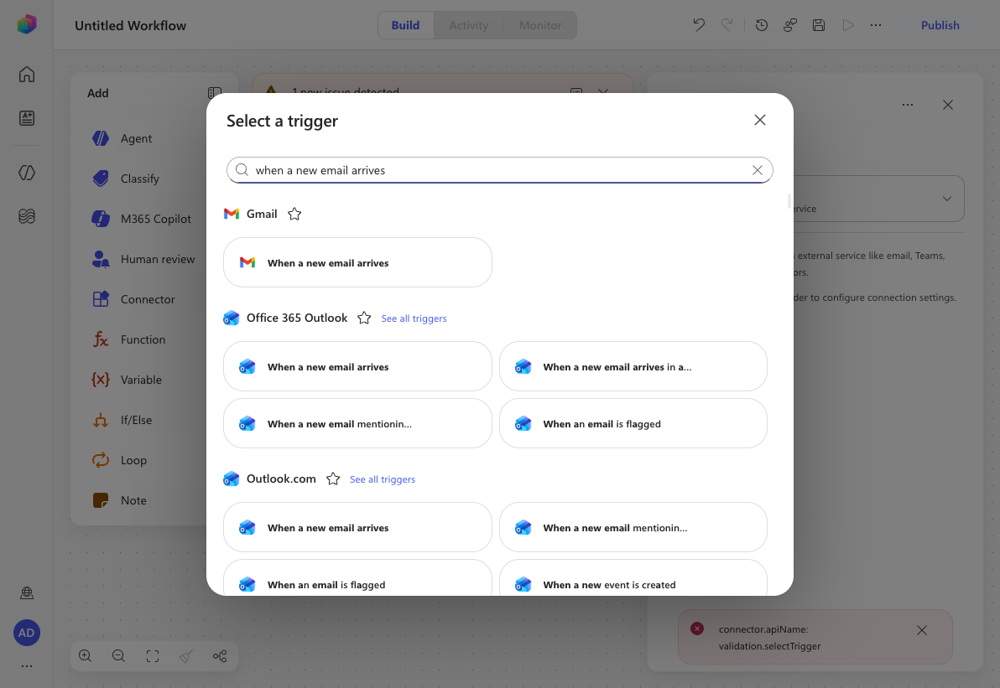
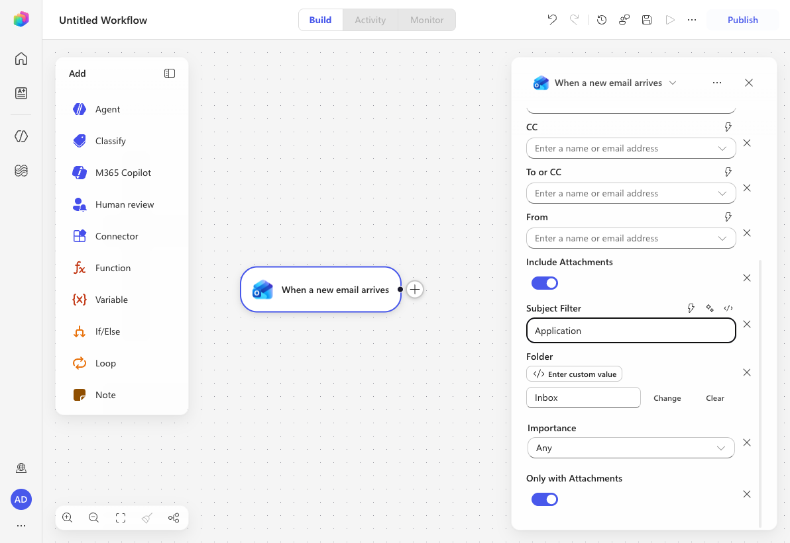
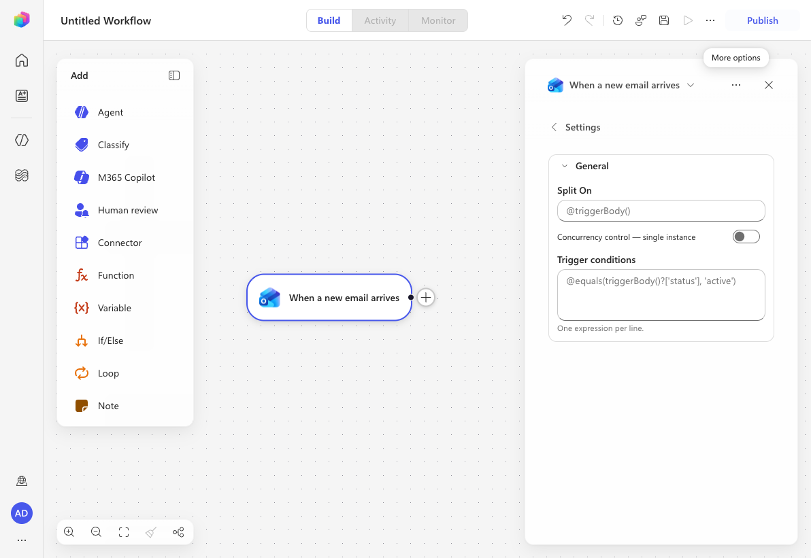
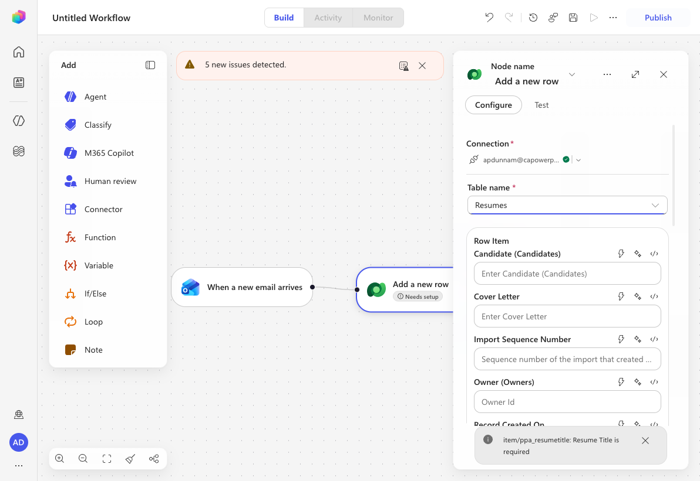
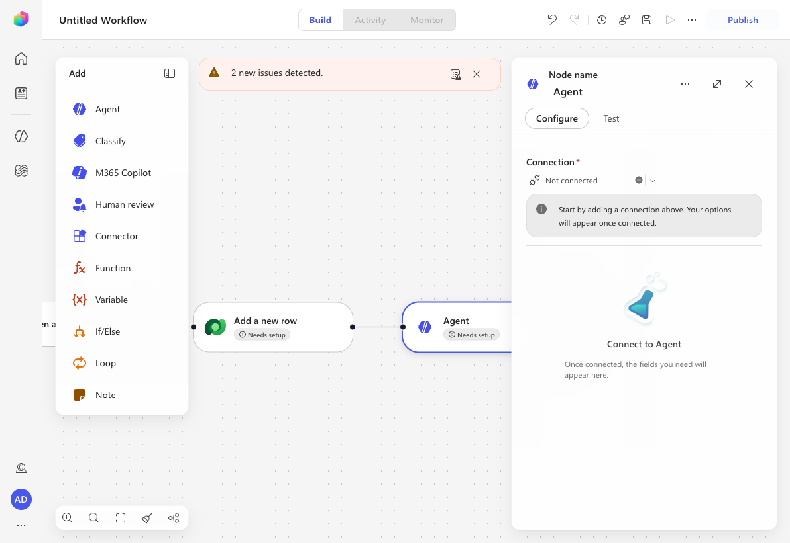
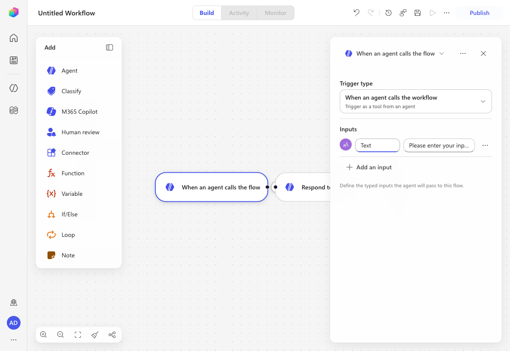
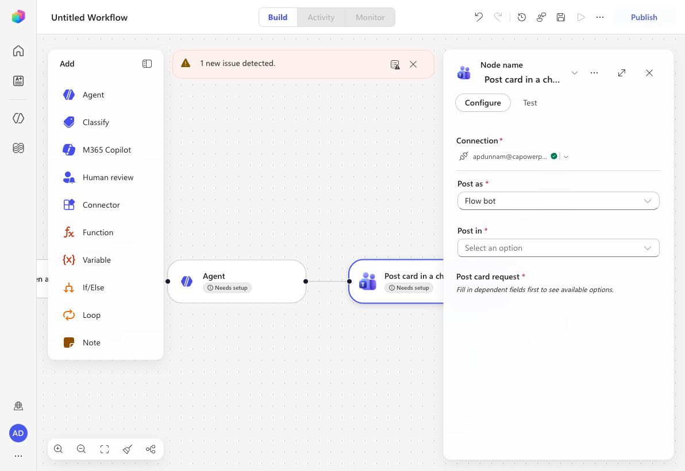

# Lab Rewrite Evaluation — operative/04-automate-triggers

**Original lab:** 🚨 Mission 04: Add Event Triggers to act autonomously
**Date evaluated:** 2026-06-29
**Environment:** <https://copilotstudio.preview.microsoft.com/environments/aab8f8eb-e060-e28b-958f-2ea6fd0ab517> (New experience ON; **has the Operative solution** — Hiring Agent, Resumes table)
**Plugin version:** AgentAcademyLabTestPlugin (rewrite-lab)

## Summary

| Metric | Count |
|---|---|
| Total step groups | 23 |
| Unchanged (concept/teaching) | 5 |
| Modified (UI changes) | 7 |
| New flow required | 9 |
| Removed / Not possible | 2 |
| Blocked | 0 |

> **Scope note (environment):** This re-validation ran in env `aab8f8eb-…`, which **does** contain the
> Operative solution (Hiring Agent, Application Intake skill, Resumes Dataverse table). All
> new-experience surfaces below were verified live: the four workflow trigger types (Manual, Recurrence,
> Connector, **When an agent calls the workflow**), the Office 365 Outlook *When a new email arrives*
> connector trigger with its attachment toggles + Subject Filter, the trigger **Settings → Split On**,
> the Microsoft Dataverse **Add a new row** action against the **Resumes** table (columns confirmed), the
> **Agent** step ("Connect to Agent"), and the agent-callable trigger's typed **Inputs** + auto-included
> **Respond to the agent** output node. Remaining NEEDS VALIDATION items are end-to-end run-time concerns
> only (live mail delivery, the adaptive-card JSON token-binding pickers, and model-driven-app URLs).

## 🧭 The big architectural shift

Mission 04 was built on three classic surfaces that **no longer exist** in the new experience:

1. **Agent Overview → Triggers and Channels.** The agent **Overview** tab is gone. There is no
   agent-level "Triggers and Channels" card to add "When a new email arrives (V3)".
1. **"Edit in Power Automate".** Agent flows are no longer authored in the Power Automate maker portal
   from inside the agent. They are **Workflows**, authored in the **Workflows** canvas in Copilot Studio.
1. **"Sends a prompt to the specified copilot for processing".** The Power-Automate action that handed
   control back to the agent is replaced by the workflow **Agent** step ("Connect to Agent").

**The new pattern (validated live):** An autonomous email automation is now a **Workflow** whose
**trigger type = Connector** → *Office 365 Outlook → "When a new email arrives"*. The whole flow body
(condition, loop, Dataverse, hand-off) is built right in the Workflows canvas using the native step
types, and an **Agent** step invokes the Hiring Agent at the end. The notification flow remains a second
**Workflow** (trigger = *When an agent calls the workflow*) attached to the agent as a **Tool**.

Mapping of classic flow constructs → new Workflow step types:

| Classic (Power Automate) | New Workflow step | Validated |
|---|---|---|
| Trigger "When a new email arrives (V3)" (added in agent Overview) | **Connector trigger** → Office 365 Outlook → *When a new email arrives* | ✅ live |
| **Condition** control | **If/Else** step | ✅ (step palette) |
| **Apply to each / For each** (auto-added) | **Loop** step | ✅ (step palette) |
| **Html to text** (Data Operations) | **Connector** step | ✅ (connector search) |
| **Dataverse → Add a new row** | **Connector** step (Dataverse) | ✅ **live (Resumes table, columns confirmed)** |
| **Dataverse → Upload a file or an image** | **Connector** step (Dataverse) | ✅ (connector search) |
| **Sends a prompt to the specified copilot** | **Agent** step ("Connect to Agent") | ✅ live |
| "Edit in Power Automate" / "Change plan to Copilot Studio" / Publish | Build + **Publish** in the Workflows canvas | ✅ live |
| Agent flow trigger "When an agent calls the flow" | **Trigger type → When an agent calls the workflow** | ✅ **live (selected; typed Inputs + Respond-to-agent node)** |
| Teams "Post card in a chat or channel" (adaptive card) | **Connector** step (Microsoft Teams) | ✅ live |
| Tools tab → Flow tab to add the flow | **Tools → Add a tool → Workflows** tab | ✅ (validated in Mission 03) |
| Child "Application Intake Agent" owns the flow tool | **Application Intake skill**; tool lives on the **Hiring Agent** (skills don't own tools) | ✅ (per Mission 03) |
| **Activity** tab (testing/observability) | **Monitor** tab (agent) + **Activity/Monitor** tab (workflow) | ✅ live |

## ⚠️ Removed Capabilities

### Step group: Agent-level event trigger on the Overview tab

- **Status:** removed (relocated)
- **Original:** "In the Hiring Agent, scroll down in the **Overview tab** to the **Triggers and Channels** section and select **+ Add**" → "When a new email arrives (V3)".
- **Reason:** The agent **Overview** tab and its **Triggers and Channels** card do not exist in the new
  agent editor (single **Build** canvas). There is no agent-attached event-trigger list.
- **Alternative (validated):** Build the automation as a **Workflow** with a **Connector trigger**
  (*Office 365 Outlook → When a new email arrives*). The agent is invoked from the workflow via the
  **Agent** step. Net behavior (autonomous email → process → notify) is fully preserved.
- **Impact:** Learners no longer "attach a trigger to the agent"; they author an autonomous **Workflow**
  and connect it to the agent. Conceptually identical (event → payload → agent acts), different surface.
- **Screenshot:** 

### Step group: "Edit in Power Automate" + "Change plan to Copilot Studio"

- **Status:** removed
- **Original:** Edit the trigger in the Power Automate maker portal; later change the flow **Plan** to
  **Copilot Studio** and confirm.
- **Reason:** Flows are authored natively in the Copilot Studio **Workflows** canvas; there is no
  round-trip to the Power Automate maker portal and no "Plan" switch — a workflow already runs on
  Copilot Studio capacity.
- **Alternative:** None needed — author and **Publish** directly in the Workflows canvas.
- **Impact:** Removes ~3 classic steps (Edit in PA, change plan, confirm). Simpler for learners.

## Step-by-Step Comparison

### Concept sections (Mission Brief, What is an Event trigger, Topic vs Event, Interactive vs Autonomous, Developer tips)

- **Status:** unchanged (mostly)
- **New instruction:** Keep the teaching. Two wording fixes: (a) event triggers are added in a
  **Workflow** (Connector trigger), not the agent Overview; (b) "requires generative orchestration"
  still holds — generative orchestration is the default in the new experience and the **Agent** step /
  tool calling depends on it.
- **What changed:** Surface names only.

### Lab 4.1 — steps 1-4 (add + name + configure the email trigger)

- **Status:** new_flow
- **New instruction:** Create a new **Workflow**; set **Trigger type → Connector**; choose
  **Office 365 Outlook → When a new email arrives** (use **See all triggers for Office 365 Outlook**).
  Configure **Include Attachments = On**, **Subject Filter = Application**, **Only with Attachments = On**
  (use **Show all** to reveal Subject Filter among the 9 advanced params). Name the workflow
  *Automate resume intake from email*.
- **What changed:** Same trigger and same inputs, now hosted as a Workflow Connector trigger.
  **Include Attachments** and **Only with Attachments** are now **toggle switches** (On/Off), not the
  classic Yes/No dropdowns.
- **Screenshot:** 

### Lab 4.1 — "Split On" trigger setting

- **Status:** modified — **CONFIRMED EXISTS**
- **New instruction:** Open the trigger's **More options (…) → Settings**. Under **General**, the
  **Split On** field is present (default `@triggerBody()`) alongside **Concurrency control** (single
  instance) and **Trigger conditions**. Keep Split On enabled so each email/attachment is processed as a
  separate run, exactly as in the classic lab.
- **What changed:** Split On is **not** removed — it relocated from the Power Automate trigger settings to
  the workflow trigger's **Settings** flyout. (This corrects the earlier draft, which claimed Split On was
  not exposed.)
- **Screenshot:** 

### Lab 4.1 — Condition (check contentType = application/pdf)

- **Status:** modified
- **New instruction:** Add an **If/Else** step. Left value = the attachment **Content-Type** (added via
  the token/dynamic-content picker); operator **is equal to**; right value `application/pdf`. Selecting
  the per-attachment Content-Type field places the If/Else inside a **Loop** (the new equivalent of the
  auto-added "For each").
- **What changed:** "Condition" → **If/Else**; "Apply to each" → **Loop**. Trigger-condition expression
  alternative (`@and(not(empty(...)),equals(...))`) still applies as an advanced option.

### Lab 4.1 — Html to text (True path)

- **Status:** modified
- **New instruction:** In the **True** branch, add a **Connector** step → search `html to text` →
  **Data Operations → Html to text**; set **Content** = trigger **Body**.
- **What changed:** Same action, added as a Connector step.

### Lab 4.1 — Dataverse "Add a new row" (Resume row)

- **Status:** modified — **columns CONFIRMED**
- **New instruction:** Add a **Connector** step → **Microsoft Dataverse → Add a new row** → **Table =
  Resumes**. Configure **Resume Title** (required) `item()?['name']`, **Cover Letter**
  `if(greater(length(body('Html_to_text')),2000),substring(body('Html_to_text'),0,2000),body('Html_to_text'))`,
  **Source Email Address** = trigger **From**, **Upload Date** `utcNow()`. (**Show all** reveals the full
  column list, which also includes the Candidate lookup and Status Reason.)
- **What changed:** Connector step instead of a PA action; expressions unchanged. Column names confirmed
  live against the Operative **Resumes** table (Resume Title, Cover Letter, Source Email Address, Upload
  Date) — they match the original lab.
- **Screenshot:** 

### Lab 4.1 — Dataverse "Upload a file or an image" (Resume PDF)

- **Status:** modified
- **New instruction:** Add a **Connector** step → **Microsoft Dataverse → Upload a file or an image** →
  Content name `item()?['name']`, Table = Resumes, Row ID = the **Resume** row id from the previous
  step, Column = **Resume PDF**, Content `item()?['contentBytes']`.
- **What changed:** Connector step; expressions unchanged.

### Lab 4.1 — "Sends a prompt to the specified copilot for processing"

- **Status:** new_flow
- **New instruction:** Add an **Agent** step → **Connect to Agent** → select the **Hiring Agent**. In the
  step's message/inputs, pass the new resume's **Id**, **Title**, and **Number** and instruct the agent
  to run the **Application Intake** skill / call the **Notify Teams Applicant channel** tool.
- **What changed:** The PA "send a prompt to copilot" action is the **Agent** step. The reference to a
  *child agent* "Application Intake Agent" becomes a reference to the **Application Intake skill** on the
  Hiring Agent (skills don't own tools — the Notify Teams workflow tool lives on the agent).
- **Screenshot:** 

### Lab 4.1 — Save / Back / change plan / Edit / Publish

- **Status:** modified (collapsed)
- **New instruction:** **Publish** the workflow from the Workflows canvas. (No "Edit in Power Automate",
  no "change plan to Copilot Studio".)

### Lab 4.2 — Create the notify flow (child agent → Tools → New tool → Agent flow)

- **Status:** new_flow — **CONFIRMED live**
- **New instruction:** In the **Workflows** hub, create a new workflow; set **Trigger type → When an
  agent calls the workflow** ("Trigger as a tool from an agent"). In the trigger's **Inputs** section,
  select **Add an input** and add three **Text** inputs: `ResumeId`, `ResumeTitle`, `ResumeNumber`.
- **What changed:** "Agent flow" is a **Workflow**; *When an agent calls the workflow* is one of the four
  selectable **trigger types** (Manual, Recurrence, Connector, When an agent calls the workflow). Inputs
  are defined directly on the trigger (types offered: Text, Number, Yes/No, Date, File). It is attached to
  the agent later as a Tool (not authored inside a child agent's Tools tab).
- **Screenshot:** 

### Lab 4.2 — Post the adaptive card to Teams

- **Status:** modified
- **New instruction:** Add a **Connector** step → **Microsoft Teams → Post card in a chat or channel**;
  **Post as = Flow bot**, **Post in = Channel**, pick a **Team** and **Channel**; paste the
  `3.2_ResumeTableUpdated.json` adaptive-card payload into the **Post card request / Adaptive Card**
  field; bind ResumeNumber/ResumeTitle/Due Date and the two model-driven-app URLs exactly as in the
  original.
- **What changed:** Same Teams action, added as a Connector step. **Adaptive cards are fully supported**
  in the new experience via Teams connector actions. **NEEDS VALIDATION:** the JSON token-binding UI
  (lightning-bolt / fx pickers) and the model-driven-app URLs require the Operative solution.
- **Screenshot:** 

### Lab 4.2 — "Respond to the agent" output (EndConversation = Finished)

- **Status:** modified — **CONFIRMED**
- **New instruction:** The *When an agent calls the workflow* trigger **auto-includes a "Respond to the
  agent" terminal node** on the canvas. Use it to return outputs/text to the calling agent to signal
  completion (the new equivalent of the classic "Respond to the agent" / EndConversation = Finished).
- **What changed:** Equivalent to the classic "Respond to the agent" action; it is now an auto-created
  terminal node on the agent-callable workflow rather than an action you add manually.
- **Screenshot:** 

### Lab 4.2 — Edit details, refresh AI description, Publish the flow

- **Status:** modified
- **New instruction:** Name the workflow **Notify Teams Applicant channel**, optionally generate a
  description, then **Publish** in the Workflows canvas.

### Lab 4.2 — Add the flow as a tool to the (child) Application Intake Agent

- **Status:** new_flow
- **New instruction:** On the **Hiring Agent** Build canvas, open the **Tools** card → **Add a tool** →
  **Workflows** tab → select **Notify Teams Applicant channel** → **Add and configure**. Keep inputs on
  **Dynamically fill with AI**.
- **What changed:** Tool is attached to the **Hiring Agent** (not a child agent). The **Application
  Intake skill** references the tool from its instructions.

### Lab 4.2 — Update child-agent instructions to call the tool

- **Status:** new_flow
- **New instruction:** Edit the **Application Intake skill** instructions (Skills card → Application
  Intake → Instructions) to call the **Notify Teams Applicant channel** tool with the three parameters.
  Use the agent **Tools** reference rather than a child-agent `/` mention.
- **What changed:** Child-agent instructions → **skill** instructions; tool referenced from the agent.

### Lab 4.2 — Publish the Hiring Agent

- **Status:** unchanged
- **New instruction:** Select **Publish** (upper right) and confirm.

### Lab 4.3 — Test (send email, view run, Activity tab, model-driven app, Teams card)

- **Status:** modified
- **New instruction:** Send the test email with the resume PDF (unchanged). View the run in the
  **Workflows** canvas (**Activity/Monitor** tab) instead of the Power Automate portal. In the agent,
  use the **Monitor** tab (classic **Activity** tab) to see the autonomous run. The Hiring Hub
  model-driven app and Teams adaptive-card verification are unchanged.
- **What changed:** Power Automate portal → Workflows **Activity/Monitor**; agent **Activity** tab →
  **Monitor** tab. **NEEDS VALIDATION** end-to-end (requires the Operative solution + mail).
