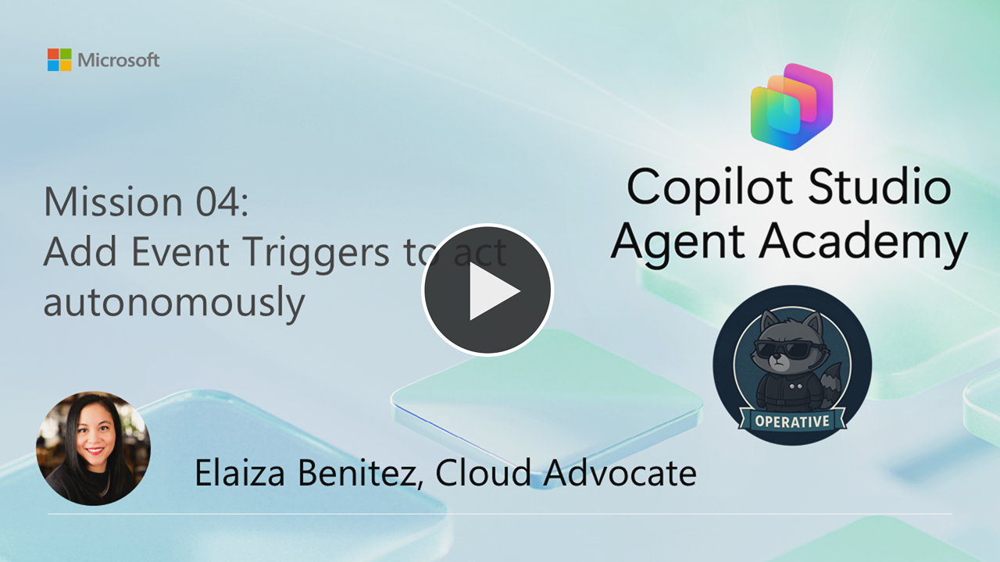

---
prev:
  text: Multi-Agent Systems
  link: /operative/03-multi-agent
next:
  text: Understanding Agent Models
  link: /operative/05-model-selection
short-description: Implement autonomous agent behaviors with event-driven triggers
difficulty: 2
codename: OPERATION SIGNAL POINT
time: 45
tags:
  - automation
  - triggers
products: [copilot-studio, dataverse, power-automate, outlook, teams]
industries:
  - hr
created-date: 2026-01-14
last-edited-date: 2026-06-29
---
# 🚨 Mission 04: Add Event Triggers to act autonomously {#mission-04-add-event-triggers-to-act-autonomously}

<mission-meta />

> [!NOTE]
> This lab has been updated for the **new Copilot Studio experience** (2026-06-29). The autonomous
> email automation is now built as a **Workflow** (Connector trigger) instead of an agent **Overview →
> Triggers** entry edited in Power Automate, and the agent hand-off uses the workflow **Agent** step
> instead of "Sends a prompt to the specified copilot." See `evaluation.md` for a full comparison with
> the original.

🎥 **Watch the Walkthrough**

[](https://youtu.be/lXdlj4DjR28?si=32nUxgFNUv2VVmTD "Watch the walkthrough on YouTube")

## 🎯 Mission Brief {#mission-brief}

Welcome back, Agent. In [Mission 03](../03-multi-agent/index.md) - you learned how to build an Application Intake **skill** and an Interview Prep **connected agent** to broaden your main Hiring Agent's capabilities.

Your assignment, should you choose to accept it, is **Operation Signal Point** - diving deeper into **event triggers** - elevating your agent system from reactive to **autonomous operation**. You'll transform your agents from waiting for human input to proactively responding to external events and taking intelligent action without supervision.

Think of it as upgrading from agents that _answer questions_ to agents that _anticipate needs_ and _act independently_. Through event triggers and automated workflows, your Hiring Agent will detect incoming resume emails, process attachments automatically, store data in Dataverse, and notify your HR recruitment team via Microsoft Teams - all while you focus on higher-value tasks.

Welcome to the world where automation meets intelligence.

> [!NOTE]
> This lesson uses the **new Copilot Studio experience** (the **New experience** toggle in the
> upper-right is **on**). In this experience the agent editor is a single **Build** canvas, and
> automations are authored as **Workflows** in the **Workflows** area - there is no classic
> **Overview** tab, no **Triggers and Channels** card, and no round-trip to the Power Automate maker
> portal.

## 🔎 Objectives {#objectives}

In this mission, you'll learn:

1. How event triggers enable autonomous agent behavior without user interaction
1. The differences between interactive and autonomous agents in Copilot Studio
1. How to create a **Workflow** with a connector trigger that automatically processes email attachments and uploads files to Dataverse
1. How to build a **Workflow** that posts an adaptive card to Teams channels for notifications
1. How to pass data between an autonomous workflow and your agent for end-to-end automation

## 🤔 What is an Event trigger? {#what-is-an-event-trigger}

Previously in [Recruit](../../recruit/10-add-event-triggers/index.md), we learned about event triggers. Let's do a quick recap on this in case you missed it.

**Event triggers** let an agent _act_ on _its_ own when something happens in another system - no user message required. When the configured event fires - such as “new SharePoint item,” “new email,” “Planner task assigned,” or even a time‑based recurrence, a connector sends a trigger payload that starts your automation. The automation then follows your instructions to decide which actions to take and when to call the agent.

### Key characteristics

- **Autonomous activation:**
      - Unlike topic/conversation triggers that start when a user types to the agent, event triggers fire from external events, enabling proactive behavior.

- **Payload-driven:**
      - Each event delivers a payload (variables + optional instructions) through a connector. Your workflow uses the payload to choose what to do next.
      - For example, _store data in Dataverse_ or _invoke the agent_ via the **Agent** step.

- **Examples out-of-the-box:**
      - Email arrives (Office 365 Outlook)
      - SharePoint/OneDrive file or item created
      - Planner task completed/assigned
      - Microsoft Forms response submitted
      - Recurrence/schedule

    Availability depends on your organization’s data policies configured for connectors.

- **Where you build it (new experience):**
      - In the new Copilot Studio experience, an autonomous event automation is a **Workflow** whose
        **Trigger type** is **Connector** ("Trigger from an external service"). You pick the connector
        event (for example, _Office 365 Outlook → When a new email arrives_) and build the rest of the
        logic in the same Workflows canvas.

- **Requires generative orchestration:**
      - The agent's ability to be invoked by the workflow and to call tools relies on generative orchestration, which is the default in the new experience.

- **Billing/usage:**
      - Each trigger delivery and each subsequent agent invocation counts toward Copilot Studio capacity.
      - For example a 10‑minute recurrence sends a message every 10 minutes.

- **Testing & observability:**
      - You can test the workflow from the Workflows canvas (**Activity/Monitor**) and inspect the agent's autonomous runs from the agent's **Monitor** tab before publishing.

> [!NOTE] TL;DR for developers
>
> Think of event triggers as **webhook-like signals** that push a structured payload into a workflow,
> letting it _initiate_ work and chain actions across systems - including calling your agent - without
> waiting for a user to ask.

### Conversation triggers - how they differ

Conversation (topic-style) triggers control _when the agent responds_, usually in response to a user message. In the new experience, generative orchestration's planner chooses which **skills**, **tools**, and **connected agents** to use based on the user's message and your instructions.

> [!NOTE] Core difference
>
> Conversation triggers are _user activity_ starters inside the chat.
>
> Event triggers are system _event_ starters delivered via connectors that can run an automation - and
> invoke the agent - without any conversation at all.

### Quick guide of Conversation trigger vs Event trigger

- **Conversation trigger:** User said/did X ➡️ agent's planner selects a skill/tool to respond.
- **Event trigger:** Email/SharePoint/Planner/Timer fired with payload P ➡️ workflow runs ➡️ stores data and calls the agent via the **Agent** step.

## 🏓 Interactive agent vs Autonomous agent - comparison {#interactive-agent-vs-autonomous-agent-comparison}

Now that you know the difference between event triggers and conversation triggers, let's next learn about the difference between an interactive agent vs an autonomous agent.

In Copilot Studio terms, "interactive" maps to agents that primarily engage via **chat** (skills, tools, connected agents). "Autonomous" maps to agents that are also driven by **event triggers** - via Workflows - to run without user input.

The following table summarizes their differences and similarities.

| Dimension                           | Interactive agent     | Autonomous agent                                                                                              |
|-------------------------------------|-----------------------|---------------------------------------------------------------------------------------------------------------|
| How it starts                       | User message; the planner selects skills/tools/connected agents.   | External event trigger (a **Workflow** Connector trigger) sends a payload. Example: email, SharePoint, schedule, etc. |
| Primary use                         | Q&A, guided workflows, request-driven actions in chat - Teams, web, etc.  | Proactive operations and background automation - react to system changes and then notify, file, or orchestrate tasks. |
| Trigger surface                     | Conversation in any connected channel; generative orchestration. | **Workflows** with Connector triggers; payload includes event data. |
| Planner (generative orchestration)  | Strongly leveraged to select/sequence skills and tools. | Used when the workflow's **Agent** step invokes the agent to decide which tools/skills to call. |
| Typical example                     | User asks "What's our refund policy?" → agent answers from knowledge. | New email with a resume → Workflow fires → stores a Dataverse record → calls the agent → agent posts a Teams notification. |
| Setup path                          | Build the agent (instructions, skills, tools, knowledge); publish to channels. | Build a **Workflow** (Connector trigger), add logic + an **Agent** step; publish; test via Workflows **Activity/Monitor**. |
| Auth and governance                 | Runs under channel/auth context. | Connectors run under the maker's account; availability depends on connector data policies. |
| Observability                       | Test in the agent's **Preview**; inspect runs in **Monitor**. | Use Workflows **Activity/Monitor** and the agent's **Monitor** tab to validate execution before publishing. |
| Capacity impact                     | Each user message/agent response consumes capacity. | Each event delivery + each agent invocation consumes capacity. Example: a 10‑minute recurrence = 6 messages/hour |

### When to use which?

- Choose **interactive** when users initiate the agent conversation - FAQ, guided intake, or command‑style tasks inside chat.
- Add **event triggers (autonomous)** via Workflows when the agent should start work itself - on incoming email, updates in SharePoint/Dataverse, or on a schedule. This moves you from reactive to proactive operations.

## Developer tips & gotchas

1. **Author automations as Workflows.** In the new experience, event-driven automations live in the
   **Workflows** area, not the agent **Overview** tab.

1. **Model the payload early.** Decide what minimal fields your automation needs from the trigger such
   as the attachment `contentType`, the sender, and the file `contentBytes`, and pass the resulting
   record ids to the agent through the **Agent** step.

1. **Auth scope matters.** Connector steps run under the maker's account. Ensure that account has the
   right connector permissions and complies with connector data policies.

1. **Control cost and noise.** High‑frequency triggers can rack up message consumption quickly - filter
   events at the trigger (Subject Filter, Only with Attachments) where possible.

1. **Test before publishing.** Use the Workflows **Activity/Monitor** tab and the agent **Monitor** tab
   to watch the run and called tools - iterate until behavior is stable.

## 🧪 Lab 4 - Automating candidate application emails {#lab-04-automating-candidate-application-emails}

We're next going to build a **Workflow** with an email event trigger that processes resumes and calls the **Hiring Agent**, then a second **Workflow** that posts an adaptive card to Teams. The notification workflow is attached to the Hiring Agent as a **tool** and referenced from the **Application Intake skill** you built in Mission 03.

### ✨ Use case scenario {#use-case-scenario}

**As an** HR Recruiter

**I want to** be notified when an email with a resume arrives in my Inbox and is automatically uploaded to Dataverse

**So that I can** stay notified of resumes sent by email for applications automatically uploaded to Dataverse

We'll be achieving this using two techniques

1. A **Workflow** with an email event trigger for when the email arrives,
    1. Check the `contentType` of the file equals `application/pdf` as the format type.
    1. Extract the file and upload to Dataverse using the Dataverse connector.
    1. Then invoke the **Hiring Agent** with the **Agent** step, passing the new record's parameters for further processing.

1. A second **Workflow** (attached to the **Hiring Agent** as a tool) which is invoked by the agent.
    1. Use the parameters passed by the agent in an adaptive card posted to a channel in Microsoft Teams to notify the HR Recruitment team. The adaptive card will have a link to the Dataverse row which can be viewed in the **Hiring Hub** model-driven app.

Let's begin!

### ✨ Prerequisites to complete this mission {#prerequisites-to-complete-this-mission}

To complete this lab you will need to:

- **Have completed [Mission 01](../01-get-started/index.md) and [Mission 03](../03-multi-agent/index.md)** and have your Hiring Agent ready (with the **Application Intake skill**).
- The **New experience** toggle in the upper-right of Copilot Studio is **on**.
- You'll also need access to **Microsoft Teams** to complete the second lab exercise of posting an adaptive card to Microsoft Teams.

### 🧪 Lab 4.1 - Automate uploading resumes to Dataverse received by email {#lab-41-automate-uploading-resumes-to-dataverse-received-by-email}

> [!NOTE]
> In the classic experience this automation was added on the agent's **Overview → Triggers and
> Channels** card and edited in Power Automate. In the new experience there is no Overview/Triggers
> card; you build the automation as a **Workflow** with a **Connector** trigger and invoke the agent
> with the **Agent** step.

1. In the left navigation, select **Workflows**, then select **+ New workflow** (or **New** → **Workflow**) to open the workflow canvas.

1. On the **Start** node, open the **Trigger type** dropdown and select **Connector** (_Trigger from an external service_).

    

1. In the **Select a trigger** search box, type the following,

    ```text
    when a new email arrives
    ```

    Then under **Office 365 Outlook**, select **When a new email arrives**. Make sure the **Connection** shows a green check; if not, sign in to create a connection.

    

1. Configure the trigger input properties. Select **Show all** to reveal the **Subject Filter** field, then set the following,

     | Property | How to Set | Details |
     |----------|------------|---------|
     | **Include Attachments** | Toggle | On (Yes) |
     | **Subject Filter** | Type/Enter with keyboard | Application |
     | **Only with Attachments** | Toggle | On (Yes) |

    

    > [!NOTE]
    > As a performant alternative to branching inside the workflow, you can also restrict when the
    > trigger fires. The following expression checks the attachments array is not empty **AND** the first
    > item's content type is `application/pdf`:
>
    > ```text
    > @and(not(empty(triggerOutputs()?['body/attachments'])),equals(toLower(first(triggerOutputs()?['body/attachments'])?['contentType']),'application/pdf'))
    > ```

1. Configure the trigger to process each incoming email separately. On the trigger, select **More options (…) → Settings**. Under **General**, locate the **Split On** field — it should be set to:

    ```text
    @triggerBody()
    ```

    Leave **Split On** enabled so the workflow starts a separate run for each email. The same **Settings** flyout also exposes **Concurrency control** and **Trigger conditions** (where you can paste the expression above if you prefer to filter at the trigger).

    

    ::: details Additional Learning: Split On
    **Split On** tells the workflow to "de-batch" an array returned by the trigger and start one run per item. In the classic experience this lived in the Power Automate trigger settings; in the new experience it moved to the trigger's **Settings** flyout — but the behavior is identical.
    :::

1. Let's add some logic to check the file type of the attachment - we only want to upload `.PDF` file attachments and not images (these could come from email signatures). Select the **+** below the trigger and add an **If/Else** step.

1. Configure the condition to check if the file attachment’s type is `.PDF`. In the left value, use the token picker to select the **Attachments Content-Type** parameter from the trigger.

    > [!NOTE]
    > Selecting the per-attachment **Content-Type** field wraps the condition in a **Loop** (the new
    > experience's equivalent of the classic "Apply to each" / "For each"), because attachments are an
    > array. This ensures the check runs once per attachment.

    ::: details Additional Learning: Loop (formerly "Apply to each" / "For each")
    When you reference a parameter that represents a list or array of items - for example a list of attachments - the workflow processes each item individually inside a **Loop** step. This ensures your actions run once for every item in the list, rather than trying to process the whole list at once.
    :::

1. In the right value of the **If/Else** condition, set the operator to **is equal to** and type the following,

    ```text
    application/pdf
    ```

    This will ensure that for each file attachment, it checks the file format is `.PDF`.

1. Now we'll configure the **True** path to extract the file from the email and upload it into the **Resume** Dataverse table.

    In the **True** branch, add a **Connector** step and search for `html to text`. Select the **Data Operations → Html to text** action. Set the **Content** field to the trigger **Body** parameter using the token picker.

    ::: details Additional Learning: Html to text action
    The **Html to text** action converts HTML-formatted content (like the body of an email) into plain text by stripping all HTML tags. It's useful for cleaning up data before storing it or sending it to systems that don't support HTML.
    :::

1. Add another **Connector** step below it, search for `Dataverse add`, and select **Microsoft Dataverse → Add a new row**. Rename the step:

    ```text
    Add a new Resume row
    ```

    For the **Table name** parameter, search for `res` and select the **Resumes** table.

    <!-- VALIDATED 2026-06-29 (env aab8f8eb, Operative solution present): the Resumes table and its
         columns "Resume Title" (required), "Cover Letter", "Source Email Address", and "Upload Date"
         were confirmed live in the Dataverse "Add a new row" action. -->

    

1. Configure the row's columns:

     | Column | How to Set | Value |
     |--------|------------|-------|
     | **Resume Title** | Expression (fx) | `item()?['name']` |
     | **Cover Letter** | Expression (fx) | `if(greater(length(body('Html_to_text')), 2000), substring(body('Html_to_text'), 0, 2000), body('Html_to_text'))` |
     | **Source Email Address** | Token | The **From** parameter from the trigger |
     | **Upload Date** | Expression (fx) | `utcNow()` |

    > The **Cover Letter** expression returns the first 2000 characters of the email text if it is longer
    > than 2000 characters; otherwise the full text. The `item()` function refers to the current
    > attachment in the **Loop**.

1. Add another **Connector** step below, search for `Dataverse upload`, and select **Microsoft Dataverse → Upload a file or an image**. Rename it:

    ```text
    Upload Resume File
    ```

    Configure:

     | Field | How to Set | Value |
     |-------|------------|-------|
     | **Content name** | Expression (fx) | `item()?['name']` |
     | **Table name** | Dropdown | Resumes |
     | **Row ID** | Token | The **Resume** id from the _Add a new Resume row_ step |
     | **Column name** | Dropdown | Resume PDF |
     | **Content** | Expression (fx) | `item()?['contentBytes']` |

    > `contentBytes` is the raw binary data of the attachment, encoded as a Base64 string.

1. Now we'll hand the new record off to the agent for further processing. Below **Upload Resume File** (still in the **True** path), add an **Agent** step and select **Connect to Agent**, then choose the **Hiring Agent**.

    

    > [!NOTE]
    > In the classic experience this step was the Power Automate action **"Sends a prompt to the
    > specified copilot for processing."** In the new experience the workflow **Agent** step plays the
    > same role - it invokes your agent and passes data to it.

1. In the **Agent** step, pass the new resume's details and instruct the agent to notify the team. Provide the **Resume** id, **Resume Title**, and **Resume Number** from the _Add a new Resume row_ step, and instruct the agent to use the **Application Intake skill** to call the **Notify Teams Applicant channel** tool (which you'll build in Lab 4.2). For example:

    ```text
    A new resume was uploaded. ResumeId = <Resume id>, ResumeTitle = <Resume Title>, ResumeNumber = <Resume Number>. Use the Application Intake skill to notify the Teams Applicant channel with these values.
    ```

    <!-- RUNTIME NOTE: the Agent step message is free text; bind the Resume id/title/number using the
         token picker from the "Add a new Resume row" step's outputs. The Resumes table and its columns
         were validated live (env aab8f8eb). -->

    

1. We've completed configuring the workflow 🙌🏻 Select **Publish** in the upper right to publish it.

    > [!NOTE]
    > There is no "Edit in Power Automate" and no "change the plan to Copilot Studio" step in the new
    > experience - workflows are authored and published directly in Copilot Studio and run on Copilot
    > Studio capacity.

Let's proceed to create the workflow that posts the adaptive card to Teams.

### 🧪 Lab 4.2 - Notify a Teams channel using an adaptive card

We're now going to create a second **Workflow** that uses the values passed by the agent to post an adaptive card to a Teams channel. This adaptive card alerts the HR recruitment team about the PDF that was automatically uploaded so they can review it. We'll then attach this workflow to the **Hiring Agent** as a tool and reference it from the **Application Intake skill**.

> [!NOTE]
> Adaptive cards are **fully supported** in the new experience - they're posted from **Workflows** using
> Microsoft Teams connector actions such as **Post card in a chat or channel**. (The classic in-agent
> "Ask with adaptive card" Topic node no longer exists, but Teams connector actions cover this scenario
> and more.)

Let's begin!

1. In the left navigation, select **Workflows**, then **+ New workflow**.

1. On the **Start** node, open the **Trigger type** dropdown and select **When an agent calls the workflow** (_Trigger as a tool from an agent_). The canvas adds a **Respond to the agent** terminal node automatically — you'll configure its output in a later step.

1. Add three **Text** inputs to the trigger. In the trigger's **Inputs** section, select **Add an input**, choose **Text** (the input types offered are Text, Number, Yes/No, Date, and File), and name them, one at a time:

    ```text
    ResumeId
    ```

    ```text
    ResumeTitle
    ```

    ```text
    ResumeNumber
    ```

    

1. Remember how in [Recruit](../../recruit/08-add-adaptive-card/index.md) we added an adaptive card within a Topic? This time we're going to post an adaptive card from a **Workflow** to a Teams channel.

    Select the **+** below the trigger, add a **Connector** step, and search for the following,

    ```text
    post card in a chat or channel
    ```

    Select the **Microsoft Teams → Post card in a chat or channel** action. If prompted, **Sign in** to create a Microsoft Teams connection with your user account and select **Allow access**.

    

1. Configure the following input parameters,

    | Parameter | How to Set | Details |
    |----------|------------|---------|
    | **Post as** | Dropdown | Select the `Flow bot` option |
    | **Post in** | Dropdown | Select the `Channel` option |
    | **Team** | Dropdown | Select a team available in your environment |
    | **Channel** | Dropdown | Select a channel available in your environment |

    

1. Next, configure the **Post card request / Adaptive Card** field. Open the [Resume Table Updated JSON file](https://raw.githubusercontent.com/microsoft/agent-academy/main/docs/operative/04-automate-triggers/assets/3.2_ResumeTableUpdated.json), copy its entire contents, and paste them into the field.

    <!-- RUNTIME NOTE: the Microsoft Teams "Post card in a chat or channel" action and pasting the
         Adaptive Card JSON were validated live. The token-binding inside the card (lightning-bolt / fx
         pickers) and the two model-driven-app URLs depend on the Hiring Hub app and are a content task,
         not a UI-surface unknown. -->

1. Now replace the placeholders in the JSON payload with actual values or dynamic content (same approach as the original lab):

    1. **System view URL** (in the `selectAction.url` property): replace with the **Resumes** system view URL from the **Hiring Hub** model-driven app.
    1. **`RESUME NUMBER PLACEHOLDER`** `text` property: bind to the **ResumeNumber** input.
    1. **`RESUME NAME PLACEHOLDER`** `text` property: bind to the **ResumeTitle** input.
    1. **Due Date** (`May 21, 2023` placeholder): replace with the expression `addDays(utcNow(), 3, 'MMM dd, yyyy')`.
    1. **View Resume URL** (in the `actions` array `url` property): replace with the **Resume row** URL from the **Hiring Hub** model-driven app, deleting the trailing record `GUID` and binding the **ResumeId** input in its place.

    | Function | Explanation |
    |----------|------------|
    | **addDays** | Adds a number of days to a date and returns the result as a formatted string |
    | **utcNow** | Returns the current date/time in UTC |

1. We've completed configuring the **Post card in a chat or channel** action 👏🏻

1. Finally, configure the workflow's response back to the agent so the agent knows processing is complete. Select the **Respond to the agent** node that the _When an agent calls the workflow_ trigger added to the canvas, and add a **Text** output named `EndConversation` with the value:

    ```text
    Finished
    ```

    <!-- VALIDATED 2026-06-29 (env aab8f8eb): the "When an agent calls the workflow" trigger
         auto-includes a "Respond to the agent" terminal node on the canvas; outputs are configured
         there. -->

    > [!NOTE]
    > In the classic experience this was a separate **Respond to the agent** action you added at the end
    > of the flow. In the new experience it's an auto-created terminal node on the agent-callable
    > workflow — you only need to fill in its outputs.

1. Before publishing, name the workflow. Open the workflow's details and set the name to:

    ```text
    Notify Teams Applicant channel
    ```

    Optionally generate a description, then save.

1. Select **Publish** to publish the workflow.

1. The workflow now needs to be added as a **tool** to the **Hiring Agent**. Navigate to the **Hiring Agent** and open its **Build** canvas. On the **Tools** card, select **+ Add a tool**.

1. In the **Add a tool** gallery, select the **Workflows** tab, choose **Notify Teams Applicant channel**, then select **Add and configure**.

    > [!NOTE]
    > In the classic experience this tool was attached to the **child** Application Intake Agent. In the
    > new experience, **skills don't own tools** - tools live on the agent's **Tools** card. The
    > Application Intake **skill** references the tool from its instructions (next step).

1. In the **Inputs** section, the three inputs you configured (ResumeId, ResumeTitle, ResumeNumber) are visible. Keep **Fill using** set to **Dynamically fill with AI** - the agent will extract these values from the message passed by the Lab 4.1 workflow's **Agent** step.

1. Now update the **Application Intake skill** so it calls the tool. On the **Build** canvas, open the **Skills** card, select the **Application Intake** skill, and in its **Instructions** add a new line after the `2. Post-Upload` instructions:

    ```text
    Process for Resume Upload via Email
    1. When you receive a message containing ResumeId, ResumeTitle, and ResumeNumber, call the "Notify Teams Applicant channel" tool with those values.
    ```

    > [!NOTE]
    > In the classic experience, the instruction referenced a _child agent_ ("…in the child agent
    > 'Application Intake Agent'") and the tool was inserted with a `/` mention. In the new experience,
    > the **Application Intake skill** references the tool that lives on the **Hiring Agent**'s Tools
    > card.

1. Select **Save** to save the skill instructions.

1. We now need to **Publish** the **Hiring Agent**. Select **Publish** on the upper right, and in the _Publish this agent_ modal that appears select **Publish**. A confirmation message will appear once published.

We can now test the agent!

### 🧪 Lab 4.3 - Test event trigger

1. To execute the event trigger, an email needs to be sent with a Resume PDF file. In Outlook, compose a new email message.

     | Email Component | Details |
     |----------|------------|
     | **To recipient** | Use your signed in user account as the value |
     | **File attachment** | Upload the [TAYLOR TESTPERSON (FICTITIOUS)](https://raw.githubusercontent.com/microsoft/agent-academy/main/docs/operative/test-data/resumes/TAYLOR%20TESTPERSON%20(FICTITIOUS).pdf) file |
     |**Subject**| Job Application|
     |**Body** | Copy and paste the following below as the body of the email |

    ```text
    Dear Hiring Manager,

    I am writing to express my interest in the Senior Power Platform Engineer position at your organization. With over nine years of experience delivering secure and scalable solutions on Microsoft cloud platforms, I am confident in my ability to contribute effectively to your team.

    In my most recent role as Lead Power Platform Engineer, I developed an automated resume-intake pipeline, reducing manual triage and improving searchability. I have delivered HR case management applications, introduced solution-aware flows, and implemented PR checks to enhance deployment lead times. My expertise includes Power Apps, Power Automate, Power Pages, Dataverse, and a range of Microsoft 365 services, as well as integration with Graph/REST APIs and Azure Functions.

    Previously, I developed Teams approvals with adaptive cards, cutting approval times to the same day, and created robust error-handling frameworks. My background also includes migrating legacy workflows to Power Automate and building self-service portals adopted by hundreds of employees.

    I hold a B.Sc. in Computer Science and am certified as a Power Platform Developer (PL-400) and Solution Architect (PL-600). I am also passionate about mentoring and have volunteered with local maker groups.

    Please find my CV attached for your consideration. I would welcome the opportunity to discuss how my skills and experience align with your needs.

    Thank you for your time and consideration.

    Kind regards,
    Taylor Testperson
    ```

    **Send** the email once composed.

1. In Copilot Studio, open the **Notify Teams Applicant channel** workflow (or the Lab 4.1 workflow) and select the **Activity** (or **Monitor**) tab to view the run that succeeded for the sent email.

    > [!NOTE]
    > In the classic experience you viewed flow runs in the Power Automate maker portal. In the new
    > experience, runs are viewed in the **Workflows** canvas under **Activity/Monitor**.

1. Back in the **Hiring Agent**, select the **Monitor** tab.

    > [!NOTE]
    > In the classic experience this was the agent's **Activity** tab. In the new experience, the
    > equivalent is the **Monitor** tab.

1. The **Monitor** tab will display the activities of the **Hiring Agent**. There will be an autonomous run that has a status of **Complete**. This represents the event trigger workflow and the agent invocation.

1. Select the run and inspect the inputs. Notice how the parameters passed to the agent contain the `ResumeId`, `ResumeTitle`, and `ResumeNumber` values from the **Dataverse** row that was created. This is how data passes from the autonomous workflow to your agent.

1. Navigate to the **Hiring Hub** model-driven app and in the **Resumes** system view, select **Refresh**. The newly created row for the emailed resume will be listed - it was created autonomously by the workflow.

1. Inspect the **Notify Teams Applicant channel** workflow run. Notice how its inputs have values from the Dataverse row, passed by the agent. This is how parameter values flow from the event trigger workflow → agent → notification workflow.

1. Finally, look at the adaptive card posted to the channel in **Microsoft Teams**. The card displays information about the newly created Resume row in Dataverse. Hover over the hyperlink at the start of the card - the URL is the Resumes system view URL configured in the adaptive-card JSON.

1. Select the hyperlink, and you'll be directed to the Resumes system view in the **Hiring Hub** model-driven app.

1. Back in Teams, hover over **View Resume** (the `Action.OpenURL` action). Notice the URL is the specific Resume row, configured with the **ResumeId** input.

1. Select the action, and you'll be directed to the Resume row form in the **Hiring Hub** model-driven app.

## ✅ Mission Complete {#mission-complete}

Congratulations! 👏🏻 Excellent work, Operative.

✅ Event trigger workflow: you've created a **Workflow** with an email connector trigger that uploads resumes to Dataverse and passes parameters to your agent via the **Agent** step.
✅ Built a notification workflow: consumes the parameters to post an adaptive card to a channel in Microsoft Teams to alert the HR recruitment team.
✅ Updated the **Application Intake skill**: to call the notification tool once the resume is processed.

This enables the **Hiring Agent** to work autonomously whenever resumes are received as email attachments and notify the HR recruitment team for manual review.

This is the end of **Lab 04 - Automating candidate application emails**, select the link below to move to the next mission.

⏭️ Move to mission [**Understanding Agent Models and Response Formatting**](../05-model-selection/index.md)

## 📚 Tactical Resources {#tactical-resources}

📖 [Make your agent autonomous in Copilot Studio](https://learn.microsoft.com/training/modules/autonomous-agents-online-workshop/?WT.mc_id=power-188561-ebenitez)

📖 [Add an event trigger](https://learn.microsoft.com/microsoft-copilot-studio/authoring-trigger-event?WT.mc_id=power-188561-ebenitez)

📖 [Use workflows with your agent](https://learn.microsoft.com/microsoft-copilot-studio/advanced-flow?WT.mc_id=power-188561-ebenitez)

📖 [Power Automate triggers introduction](https://learn.microsoft.com/power-automate/triggers-introduction?WT.mc_id=power-188561-ebenitez)

📖 [Data loss prevention for Copilot Studio](https://learn.microsoft.com/microsoft-copilot-studio/admin-data-loss-prevention?WT.mc_id=power-188561-ebenitez)

<analytics-tag section="operative" mission="04-automate-triggers" />
