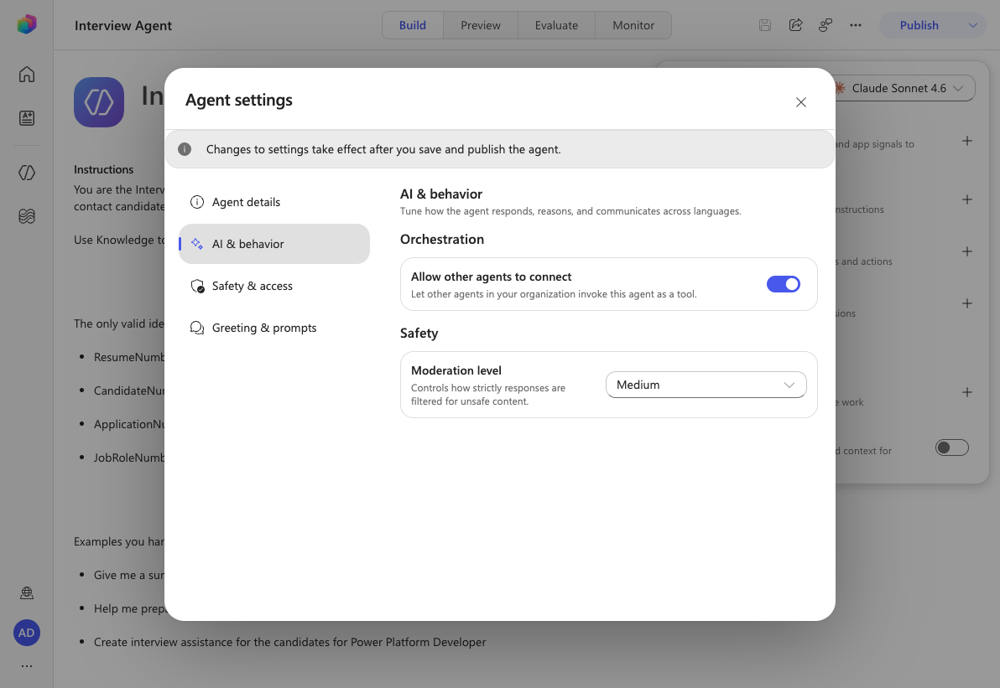
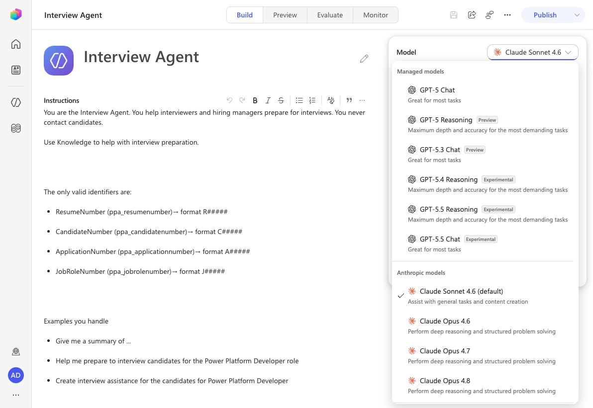
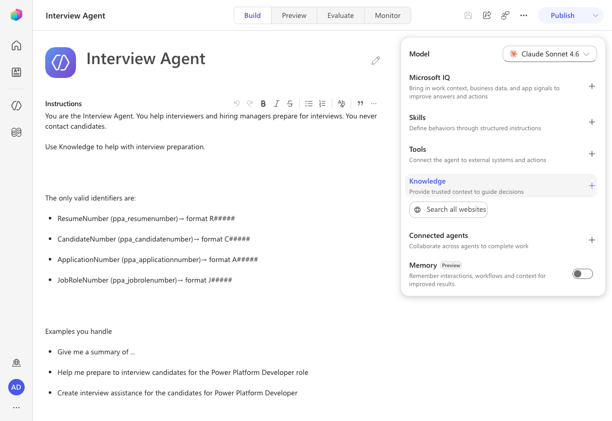

# Lab Rewrite Evaluation — operative/05-model-selection

**Original lab:** 🚨 Mission 05: Understanding Agent Models and Response Formatting
**Date evaluated:** 2026-06-29
**Environment:** https://copilotstudio.preview.microsoft.com/environments/aab8f8eb-e060-e28b-958f-2ea6fd0ab517 (New experience ON; has the Operative solution — Interview Agent, Resumes table)
**Plugin version:** AgentAcademyLabTestPlugin (rewrite-lab)

## Summary

| Metric | Count |
|---|---|
| Total step groups | 14 |
| Unchanged (concept/teaching) | 6 |
| Modified (UI changes) | 5 |
| New flow required | 0 |
| Removed / Not possible | 3 |
| Blocked | 0 |

> **Scope note (environment):** Validated live in env `aab8f8eb` (has the Operative solution and the
> Interview Agent, ID `a4952ccd-28d7-4704-a396-3e1a7319bc64`). All UI surfaces this lab depends on were
> verified live: the **Build → Model** dropdown and its full model list, the agent **Settings** dialog
> (confirming no Response formatting section), and the **Instructions** editor toolbar (confirming no
> Power Fx picker). The Lab 5.2 model-comparison *responses* are non-deterministic run-time output and
> were not re-captured; the lab's three test questions and compare-three-models structure are preserved.

## 🧭 The big architectural shifts

1. **Model selector moved off the Overview tab.** The agent **Overview** tab no longer exists. The agent
   editor now has **Build / Preview / Evaluate / Monitor** tabs, and the model is selected from the
   **Model** dropdown at the top of the right-hand panel on the **Build** page.
2. **The default model changed.** New agents now default to **Claude Sonnet 4.6**, not GPT-4.1. The model
   list is grouped as **Managed models** (OpenAI GPT-5.x), **Anthropic models** (Claude Sonnet 4.6 default,
   Claude Opus 4.6/4.7/4.8), and **Mistral models** (Mistral Medium 3.5, Experimental). GPT-4.1 is no
   longer offered in this environment.
3. **The "Response formatting" Settings section was removed.** The agent **Settings** dialog only has
   **Agent details / AI & behavior / Safety & access / Greeting & prompts**. Formatting rules now go in the
   main **Instructions** field.
4. **Power Fx insertion in instructions was removed.** The Instructions editor toolbar supports Bold,
   Italic, Strikethrough, bulleted/numbered lists, Blockquote, Inline code, and Insert link — there is no
   Power Fx / formula picker. Use a literal example value to demonstrate a desired format.

| Classic surface | New surface | Validated |
|---|---|---|
| Overview tab → chevron → "Select your agent's model" | **Build → Model** dropdown (Managed / Anthropic / Mistral groups) | ✅ live |
| Default model = GPT-4.1 | Default model = **Claude Sonnet 4.6** | ✅ live |
| Settings → **Response formatting** section | Rules added to the main **Instructions** field | ✅ live (section absent) |
| Power Fx icon in formatting instructions | (removed) literal example value | ✅ live (no Power Fx in editor) |
| Settings → Model → Generative AI tab → "Continue using retired models" toggle | Retired model (if any) selectable from the **Model** dropdown | ✅ live (no such toggle/section) |
| "Start a new test session" | **Preview** tab test pane → **New chat** | ✅ live |

## ⚠️ Removed Capabilities

### Step: Settings → Response formatting section
- **Status:** removed (relocated)
- **Original:** "In the **Interview Agent's Settings**, scroll down to the **Response formatting** section to update the instructions."
- **Reason:** The agent Settings dialog no longer has a Response formatting section (only Agent details / AI & behavior / Safety & access / Greeting & prompts).
- **Alternative (validated):** Add the formatting rules to the agent's main **Instructions** field on the Build page. Behavior is equivalent — the model is still instructed how to format responses.
- **Impact:** None functionally; one fewer place to look. Formatting and behavior live together in Instructions.
- **Screenshot:** 

### Step: Power Fx formula in formatting instructions
- **Status:** removed
- **Original:** "Click after the first `Example:` and select the **Power Fx** icon … `Text(DateTimeValue("2026-01-06T13:45:54Z"), "MMM dd, yyyy")` … Insert."
- **Reason:** The new Instructions editor has no Power Fx / formula picker.
- **Alternative:** Use a literal example date (`Jan 06, 2026`) to demonstrate the `MMM dd, yyyy` format. The model still learns the target pattern from the literal example.
- **Impact:** Learners no longer practice embedding a Power Fx expression in formatting text; the formatting outcome (consistent date format) is unchanged.

### Step: "Continue using retired models" toggle
- **Status:** removed (relocated)
- **Original:** "On your agent's **Settings** page, in the **Model** section in the **Generative AI** tab, there is a toggle labeled **'Continue using retired models'**."
- **Reason:** The new Settings dialog has no Model / Generative AI section. There is no standalone retired-models toggle.
- **Alternative:** A still-supported retired model remains selectable from the **Build → Model** dropdown during its grace window.
- **Impact:** Conceptual section only; learners select retired models the same way as any other model.

## Step-by-Step Comparison

### Concept: What is the Agent Model / Why it matters / model categories & availability tags
- **Status:** unchanged
- **New instruction:** Same teaching. Added a validated callout listing the current model groups
  (Managed / Anthropic / Mistral) and noting the default is now Claude Sonnet 4.6.

### Concept: OpenAI / Anthropic model tables
- **Status:** modified (content drift)
- **New instruction:** Kept for teaching, but the specific versions have moved on. GPT-4.1's availability
  changed from "Default" to "GA (legacy)". A validated note lists the models actually offered.
- **What changed:** Available model names/versions only; the category/availability concepts still apply.

### Concept: Changing and updating the model
- **Status:** modified
- **New instruction:** Switch the model from the **Build → Model** dropdown (not Overview → chevron).
- **Screenshot:** 

### Concept: Model updates and retired models
- **Status:** modified — see Removed Capabilities (retired-models toggle).

### Concept: Admin controls for AI model selection
- **Status:** unchanged
- **New instruction:** These settings live in the **Microsoft 365 Admin Center** and **Power Platform admin
  center** (external portals), unaffected by the Copilot Studio agent-editor redesign.

### Concept: Response Formatting / Available formatting options / Best practices
- **Status:** unchanged (mostly)
- **New instruction:** Kept. Added a note that the Power Fx formatting option is not insertable in the new
  Instructions editor, and updated the closing line to point to **Instructions** instead of a Settings
  "Response Formatting" section.

### Lab 5.1 — add response-formatting rules
- **Status:** modified
- **New instruction:** Add the formatting rules to the agent's **Instructions** field on the Build page
  (no Settings → Response formatting section). Use literal example dates (`Jan 06, 2026`) instead of Power
  Fx formulas. **Save** the agent.
- **Screenshot:** , 

### Lab 5.2 — compare model responses
- **Status:** modified
- **New instruction:** Compare three currently-available models (Claude Sonnet 4.6 default → GPT-5 Chat →
  an Experimental model). Switch models from the **Build → Model** dropdown; test in the **Preview** tab
  via **New chat**. The three test questions (resume summary, upload date, interview questions) are
  unchanged. Model-specific runtime response screenshots from the original (GPT-4.1 / GPT-5 / Claude Sonnet
  4.5) were dropped because those models are no longer offered and responses are non-deterministic.
- **Screenshot:** 

### Mission Complete / Tactical Resources
- **Status:** unchanged
