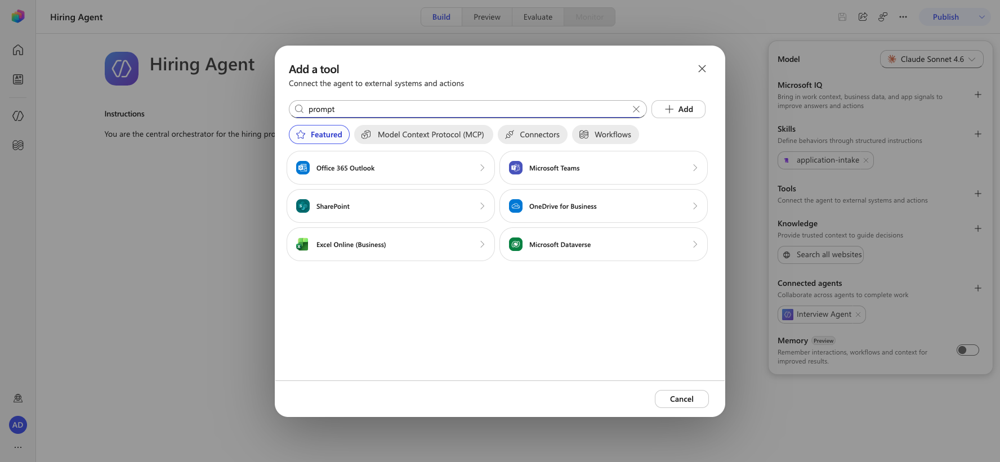
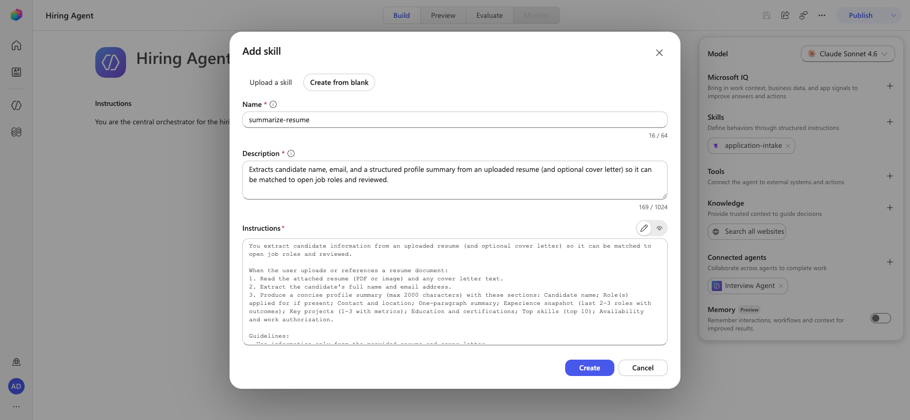
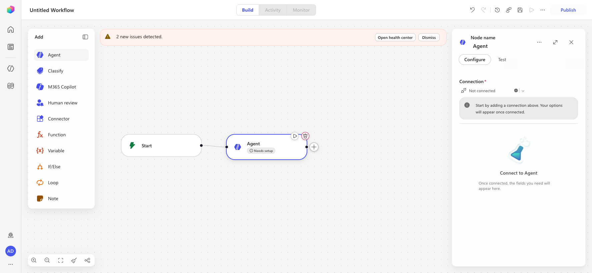
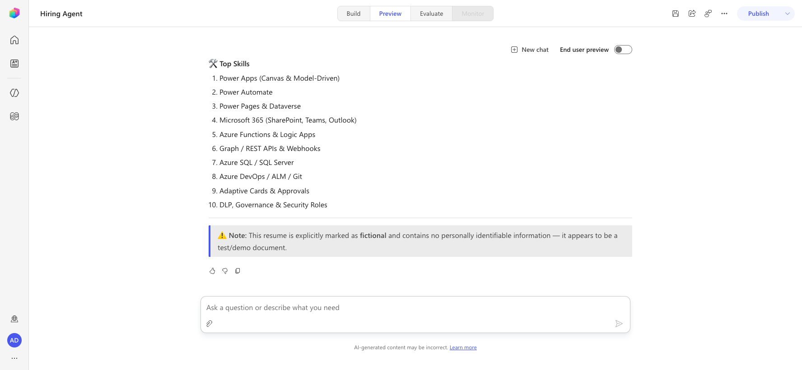

# Lab Rewrite Evaluation — operative/07-multimodal-prompts

**Original lab:** Multimodal Prompts — Document Resume Recon
**Date evaluated:** 2026-06-29
**Environment:** <https://copilotstudio.preview.microsoft.com/environments/aab8f8eb-e060-e28b-958f-2ea6fd0ab517>
**Plugin version:** rewrite-lab (agent-academy-tester)

## Headline finding

> **"Prompt is now called Agent."** The standalone **AI Builder Prompt** construct that this entire
> mission was built on **no longer exists** in the new Copilot Studio experience. There is no "Prompt"
> option in the agent **Add a tool** gallery (Featured / MCP / Connectors / Workflows), and searching
> "prompt" surfaces the rename notice. Multimodal document extraction is rebuilt as an agent **Skill**:
> the agent's model (Claude Sonnet 4.6 default) is **natively multimodal** and reads uploaded PDFs/images
> directly, so the skill only needs to describe the extraction behavior — no document/text input params,
> no JSON output toggle, no per-prompt model picker. **This skill path was validated live end-to-end**
> (skill loaded, PDF parsed, structured candidate data extracted).

## Summary

| Metric | Count |
|---|---|
| Total steps (lab sections 7.1–7.7) | 7 |
| Unchanged | 0 |
| Modified (UI changes) | 2 (7.6, 7.7) |
| New flow required | 3 (7.1, 7.2, 7.3–7.5) |
| Removed/Not possible | 1 (AI Builder Prompt create/JSON-toggle) |
| Blocked | 0 |

## ⚠️ Removed Capabilities

### AI Builder Prompt (the core of the original mission)

- **Status:** removed
- **Reason:** "Prompt is now called Agent." No standalone Prompt tool in the new experience; no Prompt in
  the agent **Add a tool** gallery; no `/document` `/text` input params; no **Output → JSON** toggle; no
  per-prompt model/temperature settings.
- **Alternative:** Rebuild extraction as an agent **Skill** (Build → Skills → Add skill → Create from
  blank: Name + Description + Instructions). The agent's native multimodal model reads the uploaded
  document; the skill describes what to extract and (optionally) the JSON shape. **Validated live.**
- **Impact:** Learners no longer learn the AI Builder Prompt UI (inputs, JSON toggle, model settings).
  They instead learn skills + native multimodality, which is the supported path. Strict-JSON output is
  best-effort (model may return friendly markdown) — instructions must explicitly demand "ONLY valid JSON"
  if a downstream system consumes it.
- **Screenshot:** 

## Step-by-Step Comparison

### 7.1 Create the resume-extraction Prompt → **Create the resume-extraction Skill**

- **Status:** new_flow
- **New instruction:** Build → **Skills** card → **+ Add skill** → **Create from blank**; Name
  `summarize-resume` (lowercase/hyphen), Description, Instructions describing the extraction. No document
  input parameter (model is multimodal).
- **What changed:** Prompt tool removed; rebuilt as a Skill. **Validated live** (skill created; chip
  "Remove skill summarize-resume" appeared).
- **Screenshot:** 

### 7.2 Configure JSON output → **Ask the skill for structured JSON in its instructions**

- **Status:** new_flow
- **New instruction:** A Skill has no **Output → Text/JSON** toggle and no "Configure for use in Agent"
  dialog. Append the desired JSON structure to the skill **Instructions**.
- **What changed:** Output-format toggle removed; JSON shape now expressed in instructions. Note: output
  may render as readable markdown unless instructions explicitly demand strict JSON.

### 7.3 Add prompt to an Agent Flow → **Persist extracted data with a Workflow tool**

- **Status:** new_flow
- **New instruction:** Skills can't write to Dataverse, so persistence still needs a tool. Classic
  **Agent Flow** is now a standalone **Workflow** (Workflows hub → New Workflow). Trigger
  **"When an agent calls the workflow"**; Dataverse actions added as **Connector** nodes (Microsoft
  Dataverse: List rows / Download a file or an image / Add a new row / Update a row); classic
  **Condition** → **If/Else**; terminal **Respond to the agent** auto-added by the agent-call trigger.
  The classic **"AI capabilities → Run a prompt"** node is gone — extraction is done by the agent/skill,
  so the workflow uses an **Agent node** ("Connect to Agent") or takes already-extracted fields as inputs.
- **What changed:** New canvas/palette and node names; all field mappings and `fx` expressions are
  unchanged. **Surface/trigger/palette validated live**; the full Dataverse persistence flow was not
  rebuilt end-to-end live (logic identical to classic, documented as the mapping).
- **Screenshot:** 

### 7.4 Create candidate record → **(same logic, Workflow Connector + If/Else)**

- **Status:** new_flow
- **New instruction:** Connector node (Dataverse **List rows** = Get Existing Candidate) + **If/Else**
  on candidate count; **Add a new row** in the True branch. Expressions unchanged.
- **What changed:** Control → If/Else; actions added as Connector nodes.

### 7.5 Update resume + flow outputs → **(same logic, Workflow Update row + trigger outputs)**

- **Status:** new_flow
- **New instruction:** Connector **Update a row** (Update Resume) outside the If/Else; outputs configured
  on the **Respond to the agent** node; publish via **Publish** (no separate Overview/Designer tabs).
- **What changed:** No Overview/Details panel; rename + description set on the canvas; single Publish.

### 7.6 Connect the flow to your agent → **Attach Workflow as a tool; child agent → Skill**

- **Status:** modified
- **New instruction:** Attach via Build → **Tools** card → **Add a tool** → **Workflows** tab (not
  "Flow"). The classic child **Application Intake Agent** is now a **Skill** named `application-intake`
  on the Hiring Agent; edit its instructions to call **Summarize Resume** and apply **summarize-resume**.
- **What changed:** Tool gallery path; child agent migrated to a Skill (confirmed live in this env).

### 7.7 Test your agent → **Test in the Preview tab**

- **Status:** modified
- **New instruction:** Use the **Preview** tab. Attach the resume (Attach file), wait a few seconds, then
  send. The agent loads the **summarize-resume** Skill, reads the PDF natively, and returns the structured
  extraction. Dataverse persistence check is optional/advanced. **Validated live.**
- **What changed:** "Test" panel → "Preview" tab; attachment-timing quirk (pause before send).
- **Screenshot:** 

## What was validated live vs documented mapping

- **Validated live:** "Prompt is now called Agent" / no Prompt in Add-a-tool gallery; Skill create dialog
  (blank entry, Name/Description/Instructions); skill saved (Remove-skill chip); **end-to-end multimodal
  extraction in Preview** (PDF parsed, candidate data returned); child agent present as the
  `application-intake` Skill; Workflow canvas palette + "When an agent calls the workflow" trigger +
  Agent node ("Connect to Agent").
- **Documented mapping (not rebuilt end-to-end live):** the full Dataverse persistence Workflow
  (List/Download/Add/Update + If/Else + Respond) — logic is identical to the classic Agent Flow, with the
  expressions unchanged; only the node-adding gesture and the extraction step (Agent node vs Run-a-prompt)
  differ.

## Recommendation

Split this mission into a **required** conversational-extraction path (7.1, 7.2, 7.7 via Skill — fully
supported and validated) and an **optional, advanced** Dataverse-persistence path (7.3–7.6 via Workflow).
Reframe all "Prompt" learning content around **Skills + native multimodality**, and update the Tactical
Resources links away from AI Builder Prompt docs toward Copilot Studio Skills/Workflows docs.
