---
prev:
  text: AI Safety and Content Moderation
  link: /operative/06-ai-safety
next:
  text: Dataverse Grounding
  link: /operative/08-dataverse-grounding
short-description: Process documents and images with advanced AI capabilities
difficulty: 2
codename: DOCUMENT RESUME RECON
time: 45
tags:
  - multimodal
  - prompting
products: [copilot-studio, dataverse]
industries:
  - hr
created-date: 2026-01-14
last-edited-date: 2026-06-29
---
# 🚨 Mission 07: Extracting Resume Contents with Multimodal Prompts {#mission-07-extracting-resume-contents-with-multimodal-prompts}

<mission-meta />

> [!NOTE]
> This lab has been updated for the **new Copilot Studio experience** (2026-06-29).
> The standalone AI Builder **Prompt** tool no longer exists in Copilot Studio — the UI now states
> *"Prompt is now called Agent."* In the new experience the agent's **model is natively multimodal**
> (Claude Sonnet 4.6 by default), so the resume-extraction "prompt" is rebuilt as an agent **Skill**
> (Build → Skills → Add skill). When a learner uploads a PDF/image, the agent reads it directly — no
> AI Builder prompt asset required. The Dataverse persistence half (create/update records) is handled
> by a **Workflow** tool (the successor to Agent Flows). See `evaluation.md` for the full comparison.

[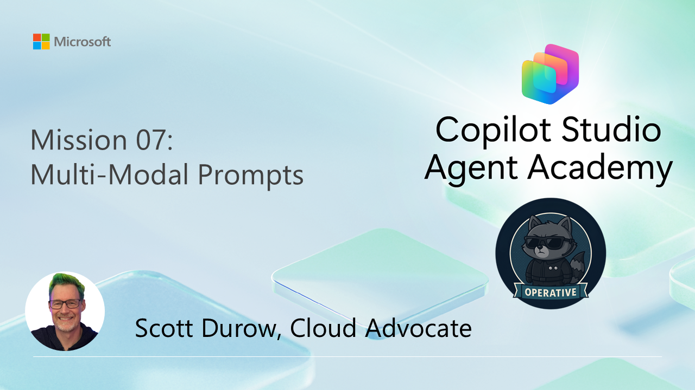](https://youtu.be/icP_qH8LFK8?si=VJjtdVi-ytUq0ymg "Watch the walkthrough on YouTube")

## 🎯 Mission Brief {#mission-brief}

Welcome, Operative. Your previous missions have equipped you with powerful agent orchestration skills, but now it's time to unlock a game-changing capability: **multimodal document analysis**.

Your assignment, should you choose to accept it, is **Document Resume Recon** - extracting structured data from any document with precision. While your agents can process text with ease, the real world requires handling PDFs, images, and complex documents daily. Resumes pile up, invoices need processing, and forms require instant digitization.

This mission will transform you from a text-only agent builder into a **multimodal expert**. You'll learn to configure AI that reads and understands documents like a human analyst - but with AI speed and consistency. By mission's end, you'll have built a complete resume extraction system that integrates with your hiring workflow.

The techniques you learn here will be essential for the advanced data grounding operations in your next mission.

> [!NOTE]
> This lab uses the **new Copilot Studio experience** (the **New experience** toggle in the upper-right is **on**). The screenshots and steps below reflect that experience.

## 🔎 Objectives {#objectives}

In this mission, you'll learn:

1. What multimodal document analysis is and how the agent's native model handles documents
1. How to capture document-extraction behavior as an agent **Skill**
1. How to ask the skill to return structured **JSON** for downstream processing
1. Best practices for instruction design with document analysis
1. How to persist extracted data to Dataverse using a **Workflow** tool

## 🧠 Understanding multimodal prompts {#understanding-multimodal-prompts}

### What makes a prompt "multimodal"?

Traditional prompts work with text only. But multimodal prompts can process multiple types of content:

- **Text**: Written instructions and content
- **Images**: Photos, screenshots, charts, and diagrams (.PNG, .JPG, .JPEG)  
- **Documents**: Invoices, resumes, forms (.PDF)

This capability opens up powerful scenarios like analyzing resumes, processing invoices, or extracting data from forms.

### Why multimodal matters for your workflows

Every day, your organization faces these document processing challenges:

- **Resume screening**: Manually reading hundreds of resumes takes valuable time
- **Invoice processing**: Extracting vendor details, amounts, and dates from varied document formats
- **Form analysis**: Converting paper forms into digital data

Multimodal prompts eliminate these bottlenecks by combining AI's language understanding with visual analysis capabilities. This gives your AI the ability to process documents as effectively as text.

### Common business scenarios

Here are some examples of how multimodal prompts can be applied:

| Scenario                | Task                                                                                                                                      | Example Output Fields                                                                                   |
|-------------------------|-------------------------------------------------------------------------------------------------------------------------------------------|---------------------------------------------------------------------------------------------------------|
| **Resume screening**    | Extract candidate name, email, phone, current title, years of experience, and key skills.                                                 | Candidate Name, Email Address, Phone Number, Current Job Title, Years of Experience, Key Skills         |
| **Invoice processing**  | Extract vendor information, invoice date, total amount, and line items from this invoice.                                                 | Vendor Name, Invoice Date, Total Amount, Invoice Line Items                                             |
| **Form analysis**       | Analyze this application form and extract all filled fields.                                                                              | Field Name (e.g., Applicant Name), Entered Value (e.g., John Doe), ...                                  |
| **ID document verification** | Extract name, ID number, expiration date, and address from this identification document. Verify that all text is clearly readable and flag any unclear sections. | Full Name, Identification Number, Expiration Date, Address, Unclear Sections Flag                        |

## ⚙️ Model selection {#model-selection-in-ai-builder}

In the new experience you don't pick an AI Builder prompt model — the **agent's own model** does the document analysis. Set it from the **Model** dropdown on the agent's **Build** page (top of the right rail). The default is **Claude Sonnet 4.6**, which is multimodal (it can read PDFs and images natively). Other models (the GPT-5 family, Claude Opus 4.6–4.8, and Mistral) are available from the same dropdown.

> [!NOTE]
> The AI Builder model table below is from the **classic** AI Builder Prompt experience and is retained
> for background only. In the new experience, model selection happens once at the agent level (Build →
> **Model**), not per prompt. For document analysis you still want a low-temperature, accurate model —
> the default Claude Sonnet 4.6 works well.

### Model comparison (classic AI Builder — background)

All of the following models support vision and document processing

| Model | 💰Cost | ⚡Speed | ✅Best for |
|-------|------|-------|----------|
| **GPT-4.1 mini** | Basic (most cost-effective) | Fast | Standard document processing, summarization, budget-conscious projects |
| **GPT-4.1** | Standard | Moderate | Complex documents, advanced content creation, high accuracy needs |
| **o3** | Premium | Slow (reasons first) | Data analysis, critical thinking, sophisticated problem-solving |
| **GPT-5 chat** | Standard | Enhanced | Latest document understanding, highest response accuracy |
| **GPT-5 reasoning** | Premium | Slow (complex analysis) | Most sophisticated analysis, planning, advanced reasoning |

### Temperature settings explained

Temperature controls how creative or predictable your AI responses are:

- **Temperature 0**: Most predictable, consistent results (best for data extraction)
- **Temperature 0.5**: Balanced creativity and consistency  
- **Temperature 1**: Maximum creativity (best for content generation)

For document analysis, use **temperature 0** to ensure consistent data extraction.

## 📊 Output formats: Text vs JSON {#output-formats-text-vs-json}

Choosing the right output format is critical for downstream processing.

### When to use text output

Text output works well for:

- Human-readable summaries
- Simple classifications
- Content that doesn't need structured processing

### When to use JSON output

JSON output is essential for:

- Structured data extraction
- Integration with databases or systems
- Power Automate flow processing
- Consistent field mapping

### JSON best practices

1. **Define clear field names**: Use descriptive, consistent naming
1. **Provide examples**: Include sample output and values for each field
1. **Specify data types**: Include examples for dates, numbers, and text
1. **Handle missing data**: Plan for null or empty values
1. **Validate structure**: Test with various document types

### Document quality considerations

- **Resolution**: Ensure images are clear and readable
- **Orientation**: Rotate documents to proper orientation before processing
- **Format support**: Test with your specific document types (PDF, JPG, PNG)
- **Size limits**: Be aware of file size restrictions in your environment

### Performance optimization

- **Choose appropriate models**: Upgrade models only when needed
- **Optimize prompts**: Often, shorter, clearer instructions perform better
- **Error handling**: Plan for documents that can't be processed
- **Monitor costs**: Different models consume different amounts of AI Builder credits

## 🧪 Lab 7 - Building a resume extraction system {#lab-7-building-a-resume-extraction-system}

Time to put your multimodal knowledge into practice. You'll build a comprehensive resume extraction system that analyzes candidate documents and transforms them into structured data for your hiring workflow.

### Prerequisites to complete this mission

1. You'll need to:

    - **Have completed Mission 06** and have your multi-agent hiring system ready
    - Download sample resume documents from [Test Resumes](https://download-directory.github.io/?url=https://github.com/microsoft/agent-academy/tree/main/docs/operative/test-data/resumes)

### 7.1 Create the resume-extraction Skill

Your first objective: capture the resume-analysis behavior as an agent **Skill**. In the new experience the agent's model is multimodal, so the skill just needs clear instructions — when a learner uploads a resume, the agent reads the document and applies the skill.

<!-- ⚠️ NEW FLOW: The classic AI Builder "Prompt" tool (Tools → + New tool → Prompt) no longer exists.
     The UI states "Prompt is now called Agent." There is no Prompt option in the "Add a tool" gallery
     (Featured / MCP / Connectors / Workflows). The multimodal extraction is rebuilt as a Skill. -->

1. Sign in to [Copilot Studio](https://copilotstudio.microsoft.com) and open your **Hiring Agent**.

1. On the **Build** page, find the **Skills** card in the right rail and select **+ (Add skill)**.

1. In the **Add skill** dialog, select **Create from blank**.

1. Set the **Name** to `summarize-resume`.

1. Set the **Description** to:

    ```text
    Extracts candidate name, email, and a structured profile summary from an uploaded resume (and optional cover letter) so it can be matched to open job roles and reviewed.
    ```

1. Copy and paste the following as the **Instructions**:

    ```text
    You extract candidate information from an uploaded resume (and optional cover letter) so it can be matched to open job roles and reviewed.

    When the user uploads or references a resume document:
    1. Read the attached resume (PDF or image) and any cover letter text.
    2. Extract the candidate's full name and email address.
    3. Produce a concise profile summary (max 2000 characters) with these sections:
       Candidate name; Role(s) applied for if present; Contact and location;
       One-paragraph summary; Experience snapshot (last 2-3 roles with outcomes);
       Key projects (1-3 with metrics); Education and certifications;
       Top skills (top 10); Availability and work authorization.

    Guidelines:
    - Use information only from the provided resume and cover letter.
    - Be accurate with contact details and skills.
    - Keep the summary concise but informative, suitable for quick application review.
    ```

    

    > [!NOTE] Why a Skill instead of a Prompt
    > The classic lab built an AI Builder **Prompt** with a `/document` and `/text` input. In the new
    > experience the agent's **model is natively multimodal** — it reads the uploaded PDF/image directly,
    > so you don't declare document/text input parameters. The skill simply describes the behavior.

### 7.2 Ask the skill for structured JSON output

The classic prompt had a separate **Output → JSON** toggle. A skill has no output-format setting, so you specify the JSON shape directly in the instructions.

1. Reopen the **summarize-resume** skill (Skills card → select the skill) and **append** this to the end of the Instructions:

    ```text
    Return the result as valid JSON with this structure:
    {
      "CandidateName": "string",
      "Email": "string",
      "Summary": "string max 2000 characters",
      "Skills": [{"item": "Skill 1"}, {"item": "Skill 2"}],
      "Experience": [{"item": "Experience 1"}, {"item": "Experience 2"}]
    }
    ```

1. Select **Save** / **Update** to save the skill.

    > [!TIP] Text vs JSON
    > Ask for **JSON** when another tool/workflow will consume the result (e.g., to write to Dataverse).
    > Ask for a **readable summary** when a human is reading the chat directly. You can include both — a
    > JSON block plus a friendly summary.

<!-- ⚠️ REMOVED: classic 7.2 steps "Change the Output setting from Text to JSON", "Configure for use in
     Agent → Cancel". A Skill has no Output toggle and no Configure-for-use-in-Agent dialog; JSON shape
     is expressed in the instructions instead. -->

### 7.3 Persist extracted data with a Workflow tool

The skill extracts data, but a skill (instructions only) **cannot write to Dataverse**. To create/update Candidate and Resume records you still need a tool. In the new experience the classic **Agent Flow** is now a **Workflow** (Workflows hub → **New Workflow**), attached to the agent via **Build → Tools → Add a tool → Workflows**.

<!-- ⚠️ NEW FLOW: Agent Flows are now standalone Workflows. The canvas node palette is:
     Agent, Classify, M365 Copilot, Human review, Connector, Function, Variable, If/Else, Loop, Note.
     Classic agent-flow actions map to the Connector node (Microsoft Dataverse: List rows, Download a
     file or an image, Add a new row, Update a row), and the classic "Condition" maps to If/Else.
     Use the trigger type "When an agent calls the workflow" so the agent can call it as a tool. -->

You'll create a **Workflow** that uses the extracted data to update resumes stored in Dataverse. This is the **optional, advanced** half of the mission — the conversational skill from 7.1/7.2 already delivers multimodal extraction; this section adds Dataverse persistence.

> [!NOTE] Workflow Connector nodes
> In the new experience, each classic Agent Flow action (Dataverse **List rows**, **Download a file or an image**, **Add a new row**, **Update a row**) is added on the Workflow canvas as a **Connector** node using the **Microsoft Dataverse** connector. The field mappings and `fx` expressions in the tables below are **unchanged** from the classic Agent Flow — only the node-adding gesture differs. The classic **Condition** action is the **If/Else** node, and **Respond to the agent** is configured from the **When an agent calls the workflow** trigger's outputs.

<!-- -->

> [!TIP] Workflow Expressions
> It is very important that you follow the instructions for naming your nodes and entering expressions exactly because the expressions refer to the previous nodes using their name! Refer to the [Agent Flow mission in Recruit](../../recruit/09-add-an-agent-flow/index.md#you-mentioned-expressions-what-are-expressions) for a quick refresher!

1. From the left navigation, open **Workflows**, then select **New Workflow**.

1. Select the **Start** (trigger) node, open the **Trigger type** dropdown, and choose **When an agent calls the workflow** (Trigger as a tool from an agent). Use **+ Add an input** to add the following parameter:

    | Type | Name | Description |
    |------|------|-------------|
    | Text | ResumeNumber | Be sure to use [ResumeNumber]. This must always start with the letter R |

    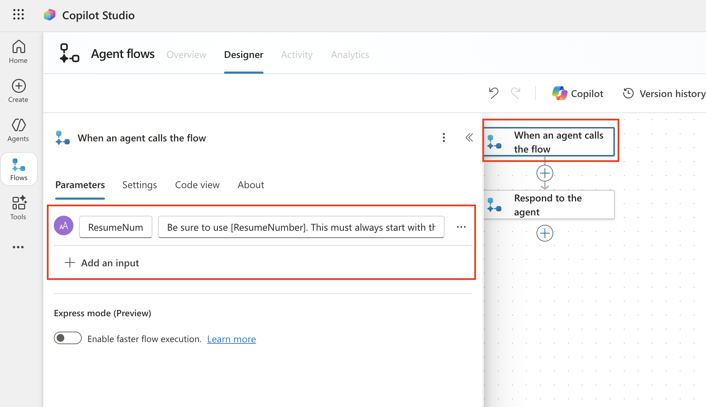

1. Add a **Connector** node, search for **Microsoft Dataverse**, and select the **List rows** action

1. Select the **ellipsis (...)** on the List rows node, and select **Rename** to `Get Resume Record`, and then set the following parameters:

    | Property | How to Set | Value |
    |----------|------------|-------|
    | **Table name** | Select | Resumes |
    | **Filter rows** | Dynamic data (thunderbolt icon) | `ppa_resumenumber eq 'ResumeNumber'` Replace **ResumeNumber** with **When an agent calls the flow** → **ResumeNumber** |
    | **Row count** | Enter | 1 |

    > [!TIP] Optimize those queries!
    > When using this technique in production, you should always limit the columns being selected to only those required by the Agent Flow.

    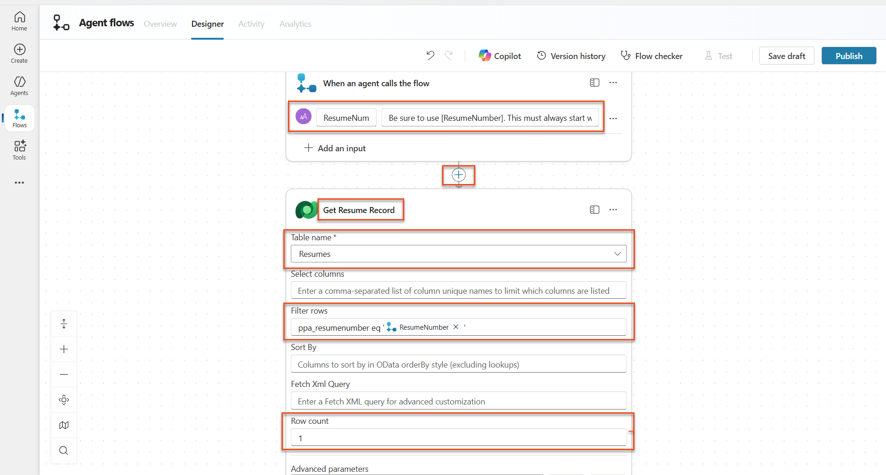

1. Select the **+** Insert action icon below the Get Resume Record node, search for **Dataverse download**, and select the **Download a file or an image** action.

    > [!TIP] Pick the correct action!
    > Be sure not to select the action that ends in "from selected environment"

    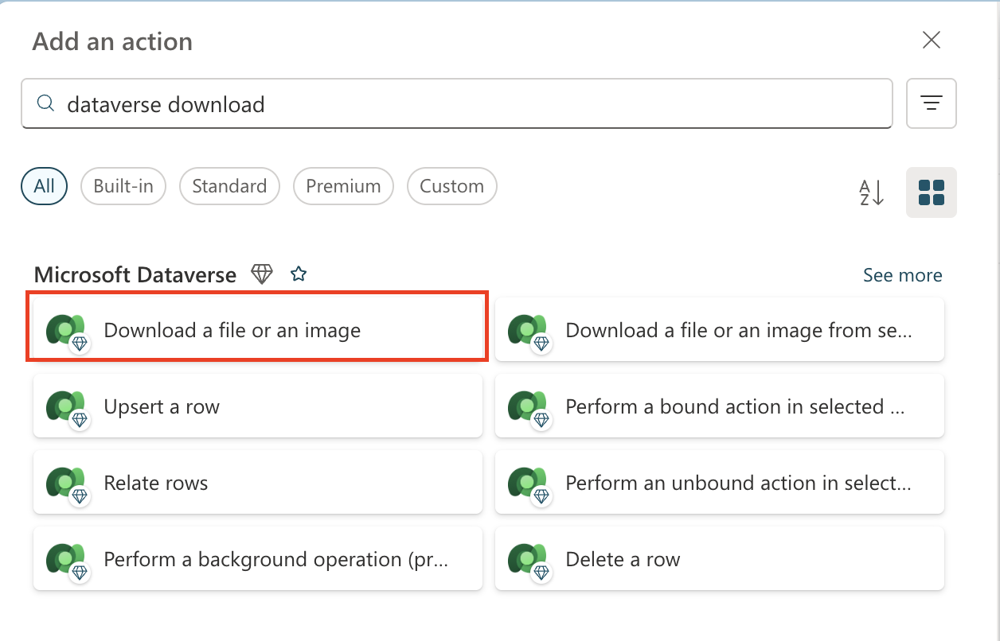

1. As before, rename the action `Download Resume`, and then set the following parameters:

    | Property | How to Set | Value |
    |----------|------------|-------|
    | **Table name** | Select | Resumes |
    | **Row ID** | Expression (fx icon) | `first(body('Get_Resume_Record')?['value'])?['ppa_resumeid']` |
    | **Column name** | Select | Resume PDF |

    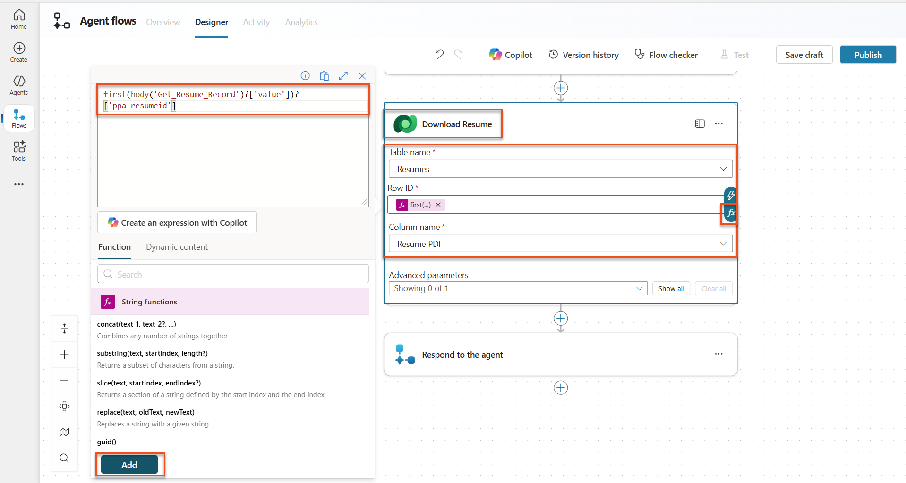

<!-- ⚠️ NEW FLOW: The classic "AI capabilities → Run a prompt" action is GONE.
     The standalone AI Builder Prompt was removed ("Prompt is now called Agent"), so there is no
     prompt to call from a workflow action. Extraction now happens via the agent's native
     multimodal model + the `summarize-resume` Skill (Labs 7.1/7.2), which was validated live.
     Two supported ways to get the extracted JSON into this workflow:
       (a) Add an **Agent** node ("Connect to Agent") that calls your Hiring Agent with the
           downloaded file, and have it apply the summarize-resume skill to return JSON; or
       (b) Keep extraction in the conversational skill (7.1/7.2/7.7) and pass the already-extracted
           fields into this workflow as trigger inputs.
     The Connector-based document action "AI – Extract field values from a document" is also
     available under the AI Builder connector if you prefer a deterministic field-extraction step. -->

1. Add an **Agent** node ("Connect to Agent") below **Download Resume**, name it `Summarize Resume`, and connect it to your **Hiring Agent**. Pass the **Download Resume → File or image content** as the message attachment and instruct it (in the node's message) to apply the **summarize-resume** skill and return the structured JSON. The downstream nodes reference this node's output the same way the classic flow referenced the prompt output.

    > [!NOTE] Why the change?
    > In the classic lab a dedicated AI Builder **Prompt** did the extraction. In the new experience that construct is replaced — the **agent model reads the document natively** and the **summarize-resume Skill** describes the extraction. The workflow simply orchestrates Dataverse persistence around that result.

### 7.4 Create candidate record

Next, you need to take the information that the Prompt gave you and create a new candidate record if it doesn't already exist.

1. Select the **+** Insert action icon below the Summarize Resume node, search for **Dataverse list**, and select the **List rows** action

1. Rename the node as `Get Existing Candidate`, and then set the following parameters:

    | Property | How to Set | Value |
    |----------|------------|-------|
    | **Table name** | Select | Candidates |
    | **Filter rows** | Dynamic data (thunderbolt icon) | `ppa_email eq 'Email'`  **Replace** `Email` with **Summarize Resume → Email** |
    | **Row count** | Enter | 1 |

    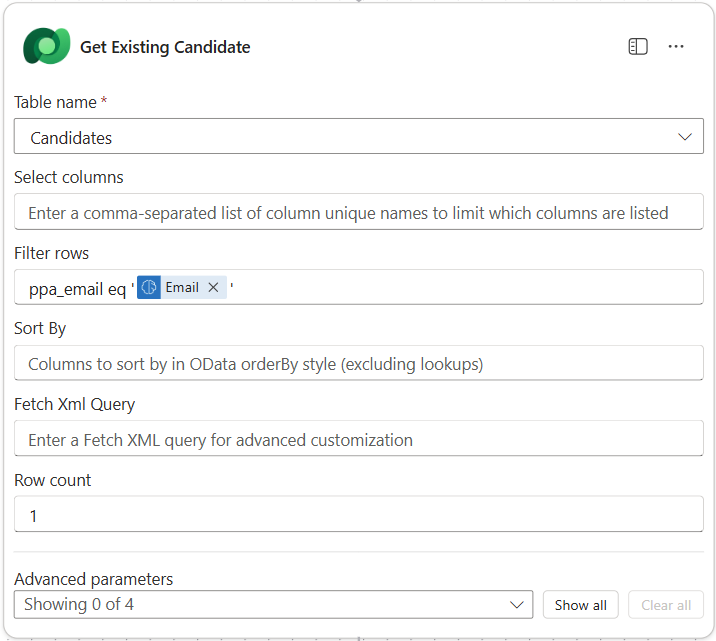

1. Add an **If/Else** node below the Get Existing Candidate node (the new-experience equivalent of the classic **Condition** control).

1. In the If/Else condition, set the following:

    | Condition | Operator | Value |
    |-----------|----------|-------|
    | Expression (fx icon): `length(outputs('Get_Existing_Candidate')?['body/value'])` | is equal to | 0 |

    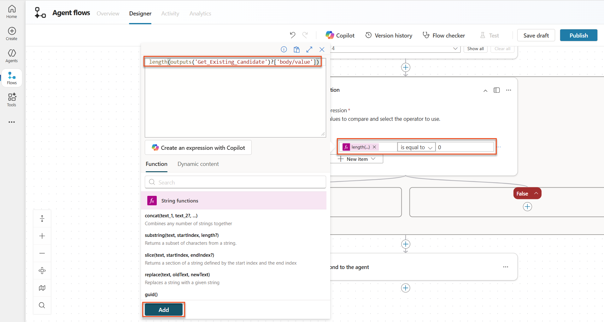

1. Select the **+** Insert action icon in the **True** branch, search for **Dataverse add**, and select the **Add a new row** action.

1. Rename the node as `Add a New Candidate`, and then set the following parameters:

    | Property | How to Set | Value |
    |----------|------------|-------|
    | **Table name** | Select | Candidates |
    | **Candidate Name** | Dynamic data (thunderbolt icon) | Summarize Resume → `CandidateName` |
    | **Email** | Dynamic data (thunderbolt icon) | Summarize Resume → `Email` |

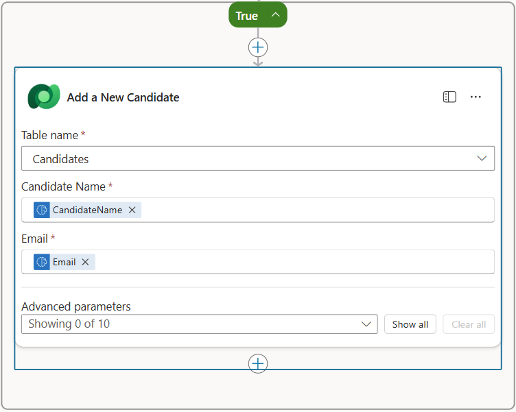

### 7.5 Update resume and configure flow outputs

Complete the flow by updating the resume record and configuring what data to return to your agent.

1. Select the **+** Insert action icon below the condition, search for **Dataverse update**, and select the **Update a row** action

1. Select the title to rename the node as `Update Resume`, select **Show all**, and then set the following parameters:

    | Property | How to Set | Value |
    |----------|------------|-------|
    | **Table name** | Select | Resumes |
    | **Row ID** | Expression (fx icon) | `first(body('Get_Resume_Record')?['value'])?['ppa_resumeid']` |
    | **Summary** | Dynamic data (thunderbolt icon) | Summarize Resume → Text |
    | **Candidate (Candidates)** | Expression (fx icon) | `concat('ppa_candidates/',if(equals(length(outputs('Get_Existing_Candidate')?['body/value']), 1), first(outputs('Get_Existing_Candidate')?['body/value'])?['ppa_candidateid'], outputs('Add_a_New_Candidate')?['body/ppa_candidateid']))` |

    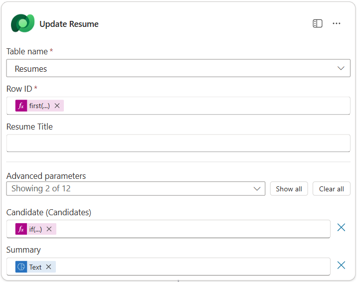

1. Select the **Respond to the agent** node (auto-added by the **When an agent calls the workflow** trigger) and then use **+ Add an output** to configure:

    | Type | Name              | How to Set                      | Value                                                        | Description                                            |
    | ---- | ----------------- | ------------------------------- | ------------------------------------------------------------ | ------------------------------------------------------ |
    | Text | `CandidateName`   | Dynamic data (thunderbolt icon) | Summarize Resume → See more → CandidateName                  | The [CandidateName] given on the Resume                |
    | Text | `CandidateEmail`  | Dynamic data (thunderbolt icon) | Summarize Resume → See more → Email                          | The [CandidateEmail] given on the Resume               |
    | Text | `CandidateNumber` | Expression (fx icon)            | `if(equals(length(outputs('Get_Existing_Candidate')?['body/value']), 1), first(outputs('Get_Existing_Candidate')?['body/value'])['ppa_candidatenumber'], outputs('Add_a_New_Candidate')?['body/ppa_candidatenumber'])` | The [CandidateNumber] of the new or existing candidate |
    | Text | `ResumeSummary`   | Dynamic data (thunderbolt icon) | Summarize Resume (Agent node) → response text (the structured JSON the skill returned) | The resume summary and details in JSON form            |

    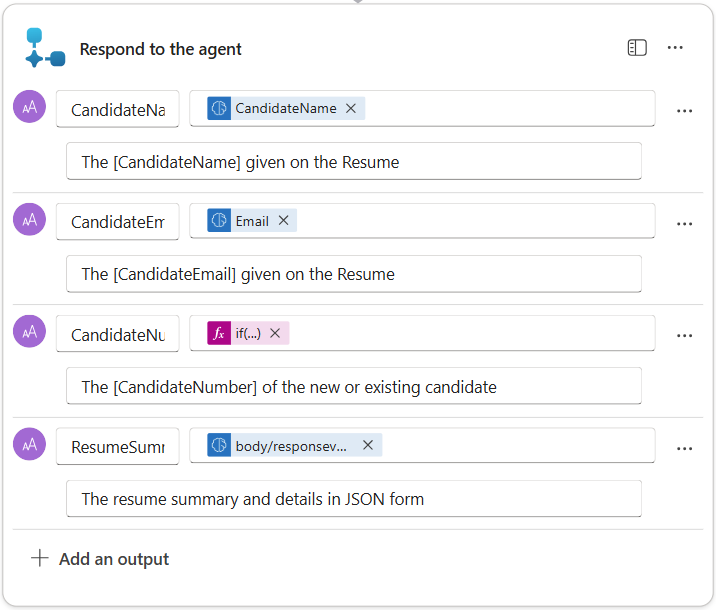

1. Select **Save draft** on the top right. Your Workflow should look like the following image. Make sure that your Update Resume step is outside the If/Else block.  
    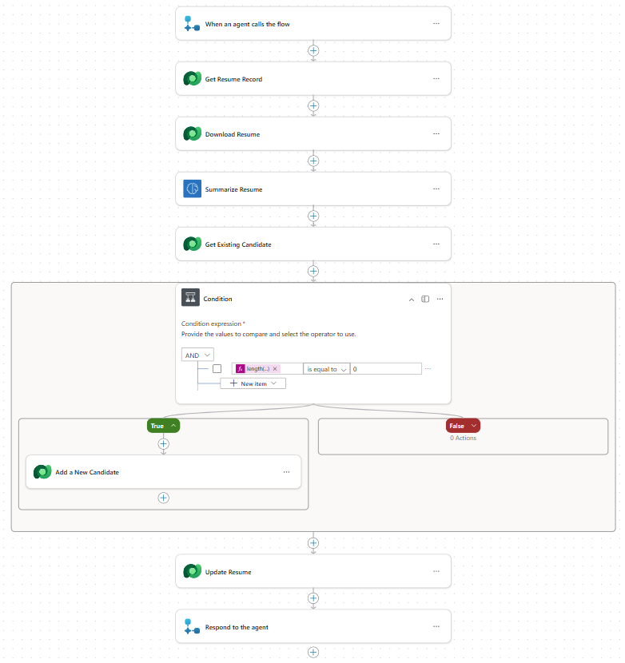

1. Rename the workflow to `Summarize Resume` (select the workflow name at the top of the canvas) and give it this description:

    ```text
    Summarize an existing Resume stored in Dataverse using a [ResumeNumber] as input, return the [CandidateNumber], and resume summary JSON
    ```

1. Select **Publish** to make the workflow available as an agent tool.

### 7.6 Connect the flow to your agent

Now you'll add the workflow as a tool and configure your agent to use it.

<!-- ⚠️ MODIFIED: The classic child "Application Intake Agent" is now a Skill named
     `application-intake` on the Hiring Agent (child agents were migrated to Skills in this env).
     Tools attach to the agent itself via Add a tool → Workflows (not "Flow"). -->

1. Open your **Hiring Agent** inside Copilot Studio.

1. On the **Build** page, locate the **Tools** card and select **+ Add a tool**.

1. In the gallery, select the **Workflows** tab, then choose **Summarize Resume**.

    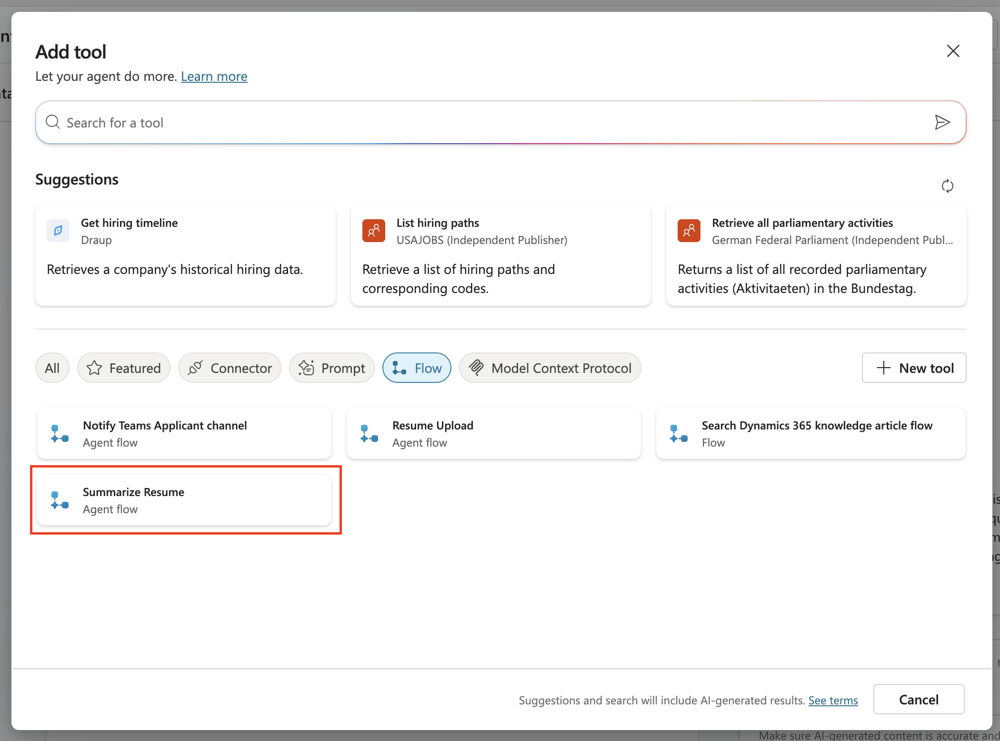

1. Select **Add and configure** and set:

    | Setting | Value |
    |---------|-------|
    | **Description** | Summarize an existing Resume stored in Dataverse using a [ResumeNumber] as input, return the [CandidateNumber], and resume summary JSON |
    | **When this tool may be used** | Only when referenced by instructions or agents |

1. Select **Save**.  
    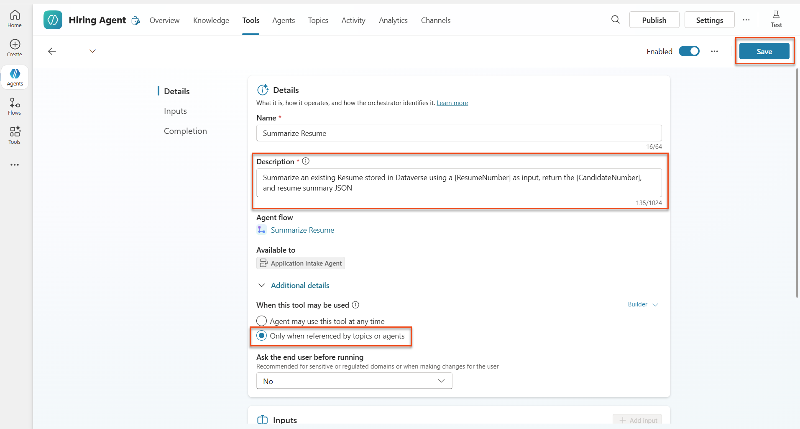

1. The agent now has both the resume-upload workflow and the **Summarize Resume** workflow, plus your **summarize-resume** Skill (Lab 7.1) and the **application-intake** Skill.

1. Open the **Skills** card and edit the **application-intake** skill instructions (this is the migrated child agent). **Remove** the two paragraphs that begin with `2.Post-Upload` and `Process for Resume Upload via Email`, then **append**:

    ```text
    2. Post-Upload Processing  
        - After uploading, be sure to also output the [ResumeNumber] in all messages
        - Pass [ResumeNumber] to Summarize Resume - Be sure to use the correct value that will start with the letter R.
        - Be sure to also output the [CandidateNumber] in all messages
        - Use the [ResumeSummary] to output a summary of the processed Resume and candidate
        - For document content extraction, apply the summarize-resume skill to the uploaded file
    ```

    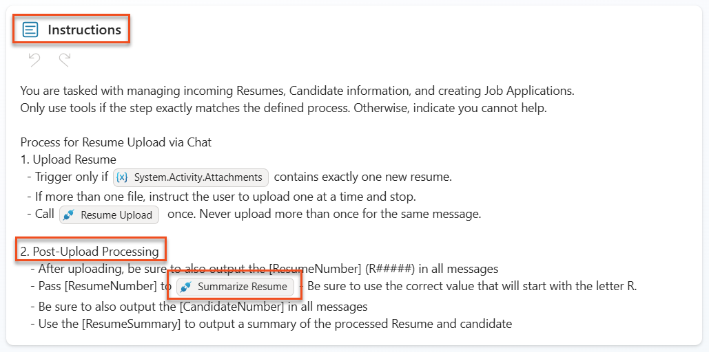

1. Select **Save**.

### 7.7 Test your agent

Test your complete multimodal system in the **Preview** tab. The conversational skill path (extraction) was validated live; verify it end-to-end here.

1. **Start testing**:

    - Select the **Preview** tab to open the test panel.
    - Select **Attach file** and upload one of the sample resumes from [Test Resumes](https://download-directory.github.io/?url=https://github.com/microsoft/agent-academy/tree/main/docs/operative/test-data/resumes).
    - Wait a few seconds for the attachment to register, then send a message such as `Here is a candidate Resume`.

    > [!TIP] Attachment timing
    > After attaching the file, pause a few seconds before sending — sending immediately can silently drop the attachment.

1. **Verify the extraction** (validated live): the agent loads the **summarize-resume** Skill, reads the PDF natively (multimodal), and returns the candidate's email, top skills, experience, projects, education, and a summary.

    

1. **(Optional, advanced) Verify Dataverse persistence** — only if you built the Summarize Resume workflow in 7.3–7.5:
    - Check that you receive a Resume Number (format: R#####), a Candidate Number, and a summary.
    - Navigate to [Power Apps](https://make.powerapps.com) → **Apps** → **Hiring Hub** → **Play**.
    - Go to **Resumes** to verify the resume has summary information and an associated candidate record; check **Candidates** for the extracted candidate. Running again should reuse the existing candidate (matched on email).  
    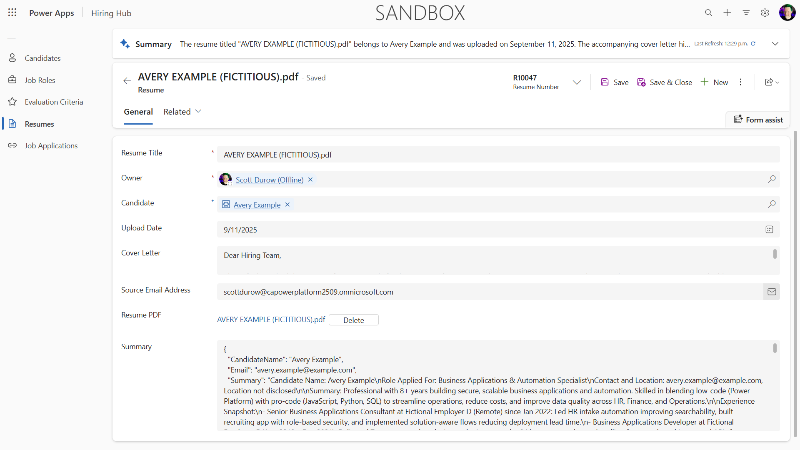

> [!TIP] Troubleshooting
>
> - **Attachment dropped**: Wait a few seconds after attaching before selecting Send.
> - **Resume not processing**: Ensure the file is a PDF and under size limits.
> - **No candidate created**: Check that the email was extracted correctly from the resume.
> - **Output not strict JSON**: The agent model may return a friendly markdown summary instead of raw JSON. Strengthen the Skill instructions ("respond with ONLY valid JSON, no prose") if a downstream system needs machine-readable output.
> - **Workflow errors**: Check that all Dataverse connections and expressions are configured correctly.

### Production readiness

Although not part of this mission, to make this agent flow production ready you might also consider the following:

1. **Error handling** - If the Resume Number was not found, or the prompt failed to parse the document, error handling should be added to return a clear error to the agent.
1. **Updating existing Candidates** - The candidate is found using the email, then the name could be updated to match that on the resume.
1. **Splitting the Resume summarization and the Candidate creation** - This functionality could be split into smaller agent flows to make them easier to maintain, and then the agent given instructions to use them in turn.

## 🎉 Mission Complete {#mission-complete}

Excellent work, Operative! **Document Resume Recon** is now complete. You've successfully mastered multimodal prompts and can now extract structured data from any document with precision.

Here's what you've accomplished in this mission:

**✅ Multimodal prompt mastery**  
You now understand what multimodal prompts are and when to use different AI models for optimal results.

**✅ Document processing expertise**  
You've learned that the agent's native multimodal model reads uploaded PDFs and images directly, and you described the extraction behavior as a **Skill** — including a JSON output structure for structured data extraction.

**✅ Resume extraction system**  
You've built a complete resume extraction system: a **summarize-resume Skill** for multimodal extraction plus an optional **Workflow** tool that persists results to Dataverse and integrates with your hiring workflow.

**✅ Best practices implementation**  
You've applied best practices for instruction/skill design with document analysis and integrated multimodal extraction with **Workflows** (the successor to Agent Flows).

**✅ Foundation for advanced processing**  
Your enhanced document analysis capabilities are now ready for the advanced data grounding features we'll add in upcoming missions.

🚀 **Next up:** In Mission 08, you'll discover how to enhance your prompts with real-time data from Dataverse, creating dynamic AI solutions that adapt to changing business requirements.

⏩ Move to [Mission 08](../08-dataverse-grounding/index.md): Enhanced prompts with Dataverse grounding

## 📚 Tactical resources {#tactical-resources}

📖 [Create a prompt](https://learn.microsoft.com/ai-builder/create-a-custom-prompt?WT.mc_id=power-power-182762-scottdurow)

📖 [Add text, image, or document input to your prompt](https://learn.microsoft.com/ai-builder/add-inputs-prompt?WT.mc_id=power-182762-scottdurow)

📖 [Process responses with JSON output](https://learn.microsoft.com/ai-builder/process-responses-json-output?WT.mc_id=power-182762-scottdurow)

📖 [Model selection and temperature settings](https://learn.microsoft.com/ai-builder/prompt-modelsettings?WT.mc_id=power-182762-scottdurow)

📖 [Use your prompt in Power Automate](https://learn.microsoft.com/ai-builder/use-a-custom-prompt-in-flow?WT.mc_id=power-182762-scottdurow)

📺 [AI Builder: JSON outputs in prompt builder](https://www.youtube.com/watch?v=F0fGnWrRY_I)

<analytics-tag section="operative" mission="07-multimodal-prompts" />
