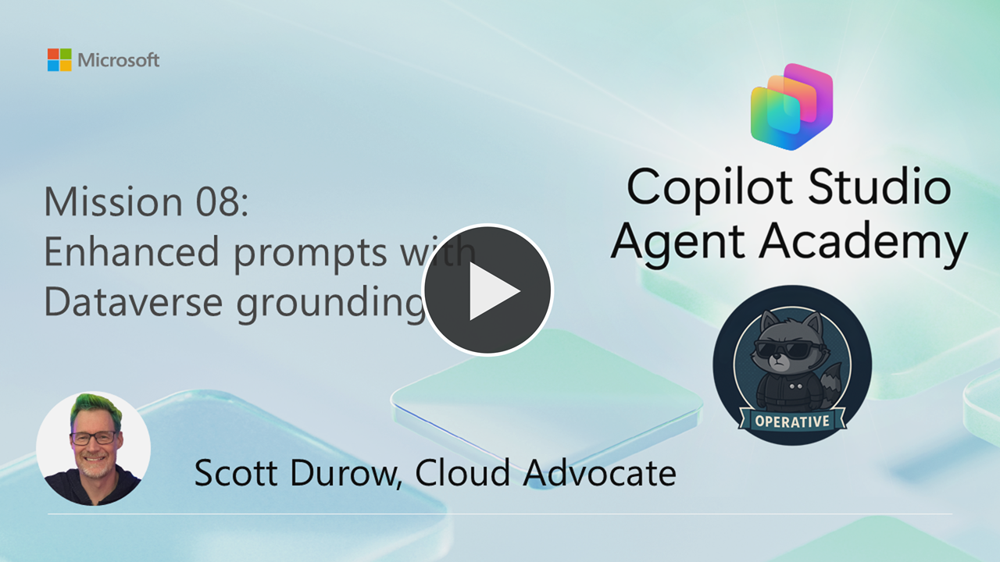
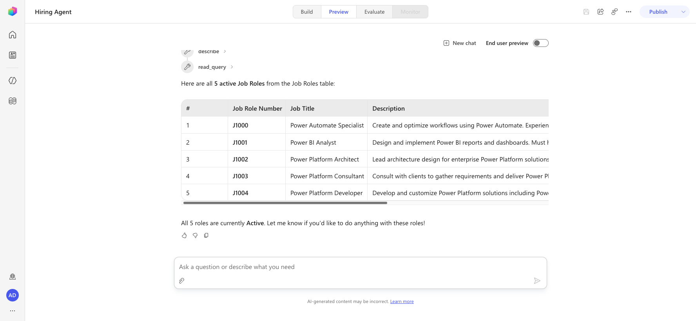
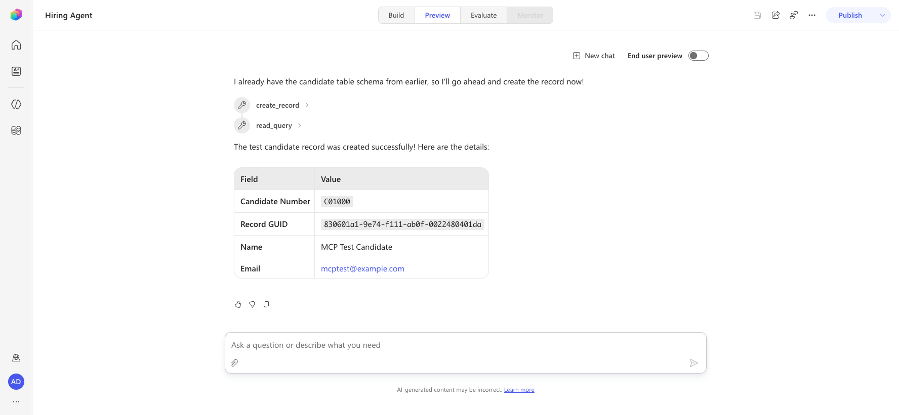
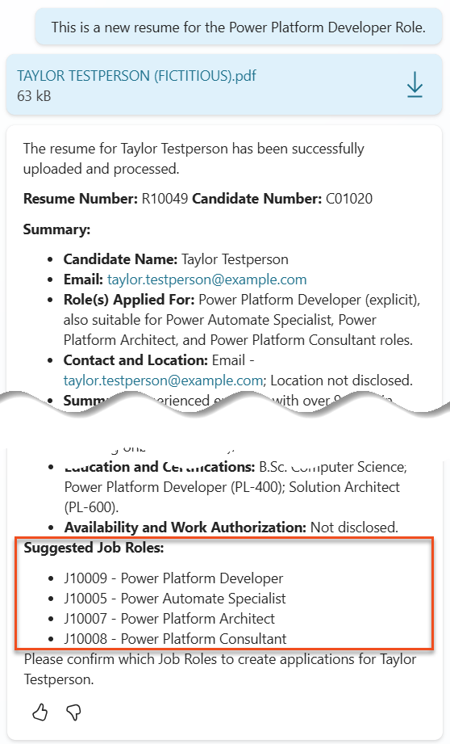
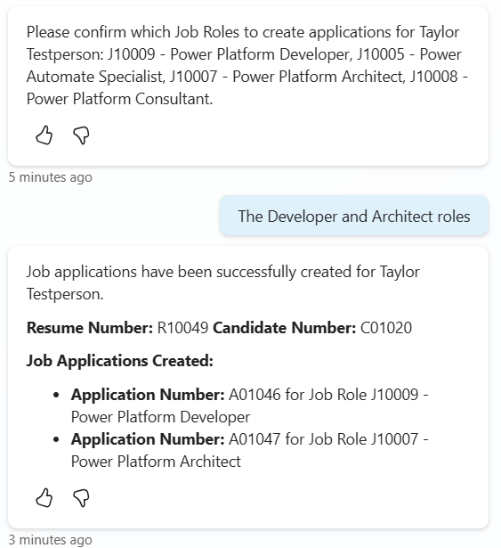

---
prev:
  text: Multimodal Prompts
  link: /operative/07-multimodal-prompts
next:
  text: Document Generation
  link: /operative/09-document-generation
short-description: Ground agents in enterprise data for accurate responses
difficulty: 2
codename: OPERATION GROUNDING CONTROL
time: 60
tags:
  - grounding
products: [copilot-studio, dataverse]
industries:
  - hr
created-date: 2026-01-14
last-edited-date: 2026-06-30
---
# 🚨 Mission 08: Enhanced prompts with Dataverse grounding {#mission-08-enhanced-prompts-with-dataverse-grounding}

<mission-meta />

> [!NOTE]
> **This lab has been rewritten for the new Copilot Studio experience (2026-06-30).** See `evaluation.md`
> for a full comparison with the original.
>
> The classic mission used an **AI Builder Prompt** with **Dataverse grounding** to match resumes to live
> job roles, plus an **Agent Flow** to create Job Applications. In the new experience **AI Builder Prompts
> no longer exist**, so both capabilities are rebuilt with the **Microsoft Dataverse MCP Server** tool
> (added under **Tools → Add a tool → Model Context Protocol (MCP)**) combined with a **Skill**:
>
> - **Grounding** → the agent uses the MCP `read_query` tool to read live **Job Roles** + **Evaluation
>   Criteria** from Dataverse at runtime (validated live).
> - **Create Job Application** → the agent uses the MCP `create_record` tool to insert rows directly — no
>   Agent Flow needed (validated live).

[](https://youtu.be/-cHP29cIu-U?si=RMi0Q5tieMltOvo6 "Watch the walkthrough on YouTube")

## 🎯 Mission Brief {#mission-brief}

Welcome back, Operative. Your multi-agent hiring system is operational, but there's a critical enhancement needed for **data grounding** - your AI models need real-time access to your organization's structured data to make intelligent decisions.

Currently, your resume-analysis Skill operates with static knowledge. But what if it could dynamically access your job roles database to provide accurate, up-to-date matches? What if it understood your evaluation criteria without you having to hardcode them?

In this mission, you'll enhance your hiring agent with **Dataverse grounding** - connecting it directly to live data sources. In the new Copilot Studio experience this is done with the **Microsoft Dataverse MCP Server** tool, which lets the agent read (and write) your Dataverse tables in real time. This transforms your agents from static responders to dynamic, data-driven systems that adapt to changing business needs.

Your mission: integrate real-time job role and evaluation criteria data into your resume analysis workflow, creating a self-updating system that stays current with your organization's hiring requirements.

> [!NOTE]
> The original lab used the **classic experience** with an AI Builder Prompt. This rewrite uses the **new
> experience** — AI Builder Prompts are gone, so grounding and record creation are done via the
> **Microsoft Dataverse MCP Server** tool plus a Skill.

## 🔎 Objectives {#objectives}

In this mission, you'll learn:

1. How **Dataverse grounding** works through the **Microsoft Dataverse MCP Server**
1. When to use data grounding vs static instructions
1. Designing skill instructions that dynamically read live data via the MCP `read_query` tool
1. Enhancing resume analysis with job role matching, and creating Job Applications via the MCP `create_record` tool

## 🧠 Understanding Dataverse grounding via the Dataverse MCP {#understanding-dataverse-grounding-for-prompts}

<!-- ⚠️ NEW FLOW: Classic "Dataverse grounding" was a setting on an AI Builder Prompt. AI Builder Prompts
     no longer exist in the new experience. Grounding is now achieved by adding the Microsoft Dataverse
     MCP Server tool to the agent: the agent's model calls MCP tools (search → describe → read_query) to
     pull live table data into its reasoning at runtime. Validated live: the agent read all 5 active Job
     Roles via read_query. -->

**Dataverse grounding** lets your agent access live data from your Dataverse tables when processing requests. Instead of static instructions, the agent reads real-time information to make informed decisions. In the new experience this is powered by the **Microsoft Dataverse MCP Server** tool — an MCP (Model Context Protocol) server that exposes Dataverse operations the agent can call, including:

| MCP tool | Purpose |
| -------- | --------- |
| `search` | Find table schemas, skills, and scopes by keyword |
| `describe` | Get a table's column schema (logical names) before querying or writing |
| `read_query` | Read rows from a table (the grounding/read path) |
| `create_record` | Insert a row and return its GUID (e.g. create a Job Application) |
| `update_record` | Update a row |
| `delete_record` | Delete a row (requires explicit user consent) |

### Why Dataverse grounding matters

Traditional skills work with fixed instructions:

```text
Match this candidate to these job roles: Developer, Manager, Analyst
```

With Dataverse grounding, your agent reads current data:

```text
Match this candidate to available job roles from the Job Roles table, 
considering current evaluation criteria and requirements
```

This approach provides several key benefits:

- **Dynamic updates:** Job roles and criteria change without skill modifications
- **Consistency:** All agents use the same current data sources
- **Scalability:** New roles and criteria are automatically available
- **Accuracy:** Real-time data ensures decisions reflect current needs

### How Dataverse grounding works via the MCP

When you add the **Microsoft Dataverse MCP Server** tool to your agent and instruct it (via a Skill) to use live data:

1. **Discovery:** The agent calls `search` to find the relevant table (e.g. *Job Roles*) and `describe` to learn its column schema.
1. **Data retrieval:** The agent calls `read_query` to read the matching rows (e.g. active Job Roles and their related Evaluation Criteria) at runtime.
1. **Intelligent filtering:** Your Skill instructions tell the agent how to filter (e.g. only **Active** roles), so only relevant data is pulled into context.
1. **Structured output:** The agent reasons over the retrieved rows and produces the output (e.g. a `MatchedRoles` list), then can call `create_record` to write results back.

> [!NOTE]
> **Validated live:** In Preview, the agent matched a request to list active roles by calling `search` →
> `describe` → `read_query` and returned all 5 active Job Roles (J1000–J1004) directly from Dataverse.

### From static to dynamic: The grounding advantage

Let's examine your current resume-analysis Skill from Mission 07 and see how Dataverse grounding via the MCP transforms it from static to dynamic intelligence.

**Current static approach:**
Your existing skill included hardcoded evaluation criteria and predetermined matching logic. This approach works but requires manual updates whenever you add new job roles, change evaluation criteria, or shift company priorities.

**Dataverse grounding transformation:**
By adding the Dataverse MCP tool and updating your Skill, your resume analysis will:

- **Access current job roles** from your Job Roles table via `read_query`
- **Use live evaluation criteria** instead of static descriptions
- **Provide accurate matches** based on real-time requirements

## 🎯 Why a grounded Skill vs ad-hoc agent conversations {#why-dedicated-prompts-vs-agent-conversations}

<!-- ⚠️ MODIFIED: Classic mission compared "dedicated AI Builder Prompts" to agent conversations.
     Prompts no longer exist; the equivalent is a dedicated Skill that grounds itself via the Dataverse
     MCP. Reframed accordingly. -->

In Mission 03, you experienced how the Interview Agent could match candidates to job roles, but required complex user prompts like:

```text
Upload this resume, then show me open job roles,
each with a description of the evaluation criteria, 
then use this to match the resume to at least one suitable
job role even if not a perfect match.
```

While this worked, a **dedicated Skill** that grounds itself with the Dataverse MCP offers significant advantages for specific tasks:

### Key advantages of a grounded Skill

| Aspect | Ad-hoc Agent Conversations | Grounded Skill (Dataverse MCP) |
| -------- | ------------------- | ------------------ |
| **Consistency** | Results vary based on user's prompt crafting skills | Standardized processing every time |
| **Specialization** | General-purpose reasoning may miss business nuances | Purpose-built with optimized business logic |
| **Automation** | Requires human interaction and interpretation | Reads live data and produces structured output automatically |

## ⚙️ Understanding record retrieval and filtering {#understanding-record-retrieval-settings}

<!-- ⚠️ MODIFIED: The classic "Record retrieval" slider on an AI Builder Prompt no longer exists. With the
     Dataverse MCP, the agent controls how much data it reads via read_query and your Skill's filtering
     instructions. The underlying principle — filter before you read — is still important. -->

In the classic experience, an AI Builder Prompt had a **Record Retrieval** slider controlling how many rows were injected into the prompt context. With the Dataverse MCP there is no slider — instead the agent reads exactly what it needs via `read_query`, guided by your Skill's filtering instructions. The underlying principle still matters.

### Why filtering still matters

Every row the agent reads consumes tokens from the model's context window, directly impacting cost, processing time, and response quality. Reading thousands of rows is rarely the right answer.

### Filter strategically

Instruct your Skill to **filter before reading** — by **Status = Active**, date ranges, categories, or other relevant criteria — so only the most pertinent records reach the model. For related data (e.g. Evaluation Criteria for a Job Role), read the parent rows first, then read only the related child rows.

## 🧪 Lab 8 - Ground your agent with the Dataverse MCP {#lab-8-add-dataverse-grounding-to-prompts}

Time to upgrade your resume analysis capabilities! You'll enhance the existing resume-analysis Skill with dynamic job role matching.

### Prerequisites to complete this mission

1. You'll need to:

    - **Have completed [Mission 07](../07-multimodal-prompts/index.md)** and have your resume analysis system ready
    - Have downloaded sample resume documents from [test Resumes](https://download-directory.github.io/?url=https://github.com/microsoft/agent-academy/tree/main/docs/operative/test-data/resumes)

### 8.1 Examine the Dataverse tables you'll ground with

You'll build on the resume-analysis **Skill** that you created in Mission 07. Currently it simply summarizes the resume, but now you'll ground it with the job roles as they currently exist in Dataverse, keeping it always current.

First, let's examine the Dataverse tables you'll be grounding with:

1. **Navigate** to [Power Apps](https://make.powerapps.com) and select your environment using the **Environment switcher** on the top right of the navigation bar.

1. Select **Tables** and locate the **Job Roles** table

1. Review the key columns you'll use for grounding:

    | Column | Purpose |
    | -------- | --------- |
    | **Job Role Number** | Unique identifier for role matching |
    | **Job Title** | Display name for the role |
    | **Description** | Detailed role requirements |

1. Similarly, review the other tables such as the **Evaluation Criteria** table.

### 8.2 Add the Dataverse MCP tool and ground your Skill

<!-- ⚠️ NEW FLOW: The classic step edited an AI Builder Prompt and used "+ Add content → Dataverse" to
     attach grounded tables/columns with a Filter and a Record-retrieval setting. AI Builder Prompts no
     longer exist. New flow: (1) add the Microsoft Dataverse MCP Server tool to the Hiring Agent, then
     (2) update the resume-analysis Skill to read live Job Roles + Evaluation Criteria via the MCP.
     Validated live: read_query returned all 5 active Job Roles. -->

First, give your agent the ability to read Dataverse at runtime by adding the **Microsoft Dataverse MCP Server** tool.

1. **Navigate** to Copilot Studio, select your environment, and open your **Hiring Agent**.

1. On the **Build** page, in the **Tools** card, select **+ Add a tool**.

1. In the tool picker, select the **Model Context Protocol (MCP)** tab.

1. Locate and select **Microsoft Dataverse MCP Server** (*"Provides Remote MCP Server access to Dataverse"*), choose your connection, and select **Add to agent**.

    > [!NOTE]
    > The MCP server exposes the Dataverse operations (`search`, `describe`, `read_query`, `create_record`,
    > `update_record`, `delete_record`, …) your agent will call. Leave the default **End user credentials**
    > authentication.

1. Select **Save** and **confirm the Save button becomes disabled** — this guarantees the tool is committed to the agent. (If you navigate away with unsaved changes, the tool addition is silently discarded.)

    

Now update the resume-analysis **Skill** so it grounds itself with live job-role data via the MCP.

1. In the **Tools** card, open your **summarize-resume** Skill from Mission 07 (or create one: **+ Add a tool → New tool → Skill → Create from blank**, Name `summarize-resume`).

1. Replace the Skill **Instructions** with the grounded version below:

    ```text
    You are tasked with extracting key candidate information from a resume and cover letter to facilitate matching with open job roles and creating a summary for application review.

    ### Grounding (read live data via the Dataverse MCP)
    - Use the Microsoft Dataverse MCP Server tools to read live data.
    - Call `search` to find the Job Roles table, then `describe` to confirm its columns.
    - Call `read_query` on the Job Roles table, filtering to Status = Active, to retrieve the
      current open roles (Job Role Number, Job Title, Description).
    - For each active Job Role, read its related Evaluation Criteria (Criteria Name, Description)
      via `read_query`.
    - Always filter before reading; never load unrelated rows.

    ### Instructions:
    1. Extract Candidate Details: full name and email address.
    2. Analyze the resume and cover letter for skills, experience, qualifications, and motivation.
    3. Match Against Open Job Roles:
       - Compare the candidate to the live job roles and evaluation criteria you read from Dataverse.
       - Identify all roles that align with the candidate's profile (perfect suitability not required).
       - Provide reasoning for each match based on the specific job requirements.
    4. Create a Candidate Summary covering: name, role(s) applied for, contact/location,
       one-paragraph summary, top skills (8–10), experience snapshot, key projects, education
       and certifications, availability and work authorization.

    ### Output Format
    Provide the output in valid JSON with this structure:

    {
      "CandidateName": "string",
      "Email": "string",
      "MatchedRoles": [
        {
          "JobRoleNumber": "ppa_jobrolenumber from the Dataverse data",
          "RoleName": "ppa_jobtitle from the Dataverse data",
          "Reasoning": "Detailed explanation based on job requirements"
        }
      ],
      "Summary": "string"
    }

    ### Guidelines
    - Extract candidate info only from the provided resume and cover letter.
    - Use the live Dataverse job-role data (read via the MCP) for all matching decisions.
    - If no suitable matches are found, return an empty MatchedRoles list and explain briefly.
    ```

1. Select **Save**.

> [!NOTE]
> **What replaced the classic grounding UI:** the old "+ Add content → Dataverse → select columns →
> Filter: Status = Active → Record retrieval = 1000" configuration is now expressed as plain instructions
> in the Skill. The agent performs the equivalent reads itself via `read_query`, filtering to **Active**
> and reading only the related Evaluation Criteria.

### 8.3 Test the grounded Skill

<!-- ⚠️ MODIFIED: Classic test ran inside the Prompt editor ("Test" + "Knowledge used" tab). New flow:
     test in the agent Preview pane; the agent calls search/describe/read_query against Dataverse.
     Validated live. -->

1. Open the **Preview** pane of your Hiring Agent and start a **New chat** (so the agent picks up the newly-added MCP tool).

1. Ask the agent to list the current open roles, for example: `List the active job roles from Dataverse.`

1. Confirm the agent invokes the Dataverse MCP (you'll see it call `search` → `describe` → `read_query`) and returns the live roles. In this environment it returned all 5 active Job Roles (J1000–J1004) with titles and descriptions.

    

1. **Upload** a sample resume and ask the agent to summarize and match it. Confirm the JSON output now includes **MatchedRoles** populated from the live Dataverse data.

### 8.4 Create Job Applications via the Dataverse MCP

<!-- ⚠️ NEW FLOW: The classic mission built a "Create Job Application" Agent Flow (List rows Get Resume →
     List rows Get Job Role → Add a new row Job Application → Respond) and attached it to the child agent.
     With the Dataverse MCP, the agent can create the Job Application row directly via the create_record
     tool — no Agent Flow needed. Validated live: the agent created (and cleaned up) a record via
     create_record, returning its GUID. -->

In the classic mission you built a separate **Agent Flow** to create Job Application rows. With the **Microsoft Dataverse MCP Server** tool already attached (Lab 8.2), your agent can create those rows directly using the MCP `create_record` tool — there's no separate flow to build or publish.

You only need to tell the agent *how* to create an application. Update your **summarize-resume** Skill (or the agent **Instructions**) to add the application-creation behavior:

1. Open the **summarize-resume** Skill (or the Hiring Agent **Instructions**) and **add** the following to the end:

    ```text
    ### Creating Job Applications (write via the Dataverse MCP)
    After presenting MatchedRoles, ask the user which roles to create applications for.
    When the user confirms one or more JobRoleNumbers for a given ResumeNumber:
    - Call `describe` on the Job Applications table to confirm its columns (only if the schema
      is unknown).
    - For EACH confirmed Job Role, call `create_record` on the Job Applications table, setting:
        - Candidate  → the candidate's record (from the Resume's related Candidate)
        - Job Role   → the confirmed Job Role record
        - Resume     → the Resume record
        - Application Date → the current date/time (utcNow)
    - Report back the Application Number (A#####) of each created application.

    Strict Rules (that must never be broken):
    1. The only valid identifiers are:
       - ResumeNumber (ppa_resumenumber) → format R#####
       - CandidateNumber (ppa_candidatenumber) → format C#####
       - ApplicationNumber (ppa_applicationnumber) → format A#####
       - JobRoleNumber (ppa_jobrolenumber) → format J#####
    2. Never guess or invent these values.
    3. Always extract identifiers from the current context (conversation, data, or MCP output).
    4. Deletes require explicit user confirmation.
    ```

1. Select **Save**.

    

> [!NOTE]
> **Validated live:** the agent created a Dataverse record via `create_record` (returning its GUID) and
> read it back via `read_query`. The full upload → match → create chain was not run end-to-end because the
> Resumes and Candidates tables are empty in this environment, but each MCP operation
> (`read_query`, `create_record`, `delete_record`) was confirmed working.

### 8.5 (Removed) Attaching the Create Job Application flow

<!-- ⚠️ REMOVED: There is no separate flow to attach. The Dataverse MCP Server tool added in Lab 8.2 already
     provides create_record. The agent calls it directly per the Skill instructions in Lab 8.4.
     Original: "Add Create Job Application to agent" — connect the published Agent Flow as a tool. -->

In the classic mission you connected the published **Create Job Application** Agent Flow to the Application Intake Agent as a tool. **This step is no longer needed** — the **Microsoft Dataverse MCP Server** tool you added in Lab 8.2 already exposes `create_record`, and the agent calls it directly using the instructions from Lab 8.4. There is no separate flow to attach.

### 8.6 Confirm and review application-creation behavior

The application-creation instructions you added in Lab 8.4 tell the agent when and how to use `create_record`. In this conversational flow the agent:

- presents the suggested roles (`[JobRoleNumber] - [RoleDescription]`),
- asks the user to confirm which roles to apply for,
- loops over each confirmed `JobRoleNumber` and calls `create_record` for the given `ResumeNumber`,
- summarizes the Job Applications created.

> [!TIP] Iterating over multiple items in Generative Orchestration
> The agent's generative orchestration iterates over the confirmed Job Roles, calling `create_record` once
> per role. The classic mission achieved the same looping by calling the Agent Flow per role; here the loop
> calls the MCP tool directly.

### 8.7 Test your agent

1. Open your **Hiring Agent** in Copilot Studio.

1. **Upload** a sample resume into the chat, and type:

    ```text
    This is a new resume for the Power Platform Developer Role.
    ```

1. Notice how the agent provides a list of Suggested Job Roles - each with a Job Role number.  
    

1. You can then provide which of these you would like the Resume to be added as a job application for.
    **Examples:**

    ```text
    "Apply for all of those job roles"
    "Apply for the J1004 Power Platform Developer role"
    "Apply for the Developer and Architect roles"
    ```

    

1. The agent will then call the Dataverse MCP **`create_record`** tool for each job role you specified. In the agent's **Activity** map you'll see a `create_record` call for each Job Role, each returning a new **Application Number** (A#####).  
    

## 🎉 Mission Complete {#mission-complete}

Outstanding work, Operative! **Operation Grounding Control** is now complete. You've successfully enhanced your AI capabilities with dynamic data grounding via the Dataverse MCP, creating a truly intelligent hiring system.

Here's what you've accomplished in this mission:

**✅ Dataverse grounding mastery**  
You now understand how to ground an agent in live data using the **Microsoft Dataverse MCP Server** tool (`read_query`).

**✅ Enhanced resume analysis**  
Your resume-analysis Skill now reads real-time job role data and evaluation criteria from Dataverse for accurate matching.

**✅ Data-driven decision making**  
Your hiring agents now adapt automatically to changing job requirements without manual updates.

**✅ Job Application Creation**  
Your agent creates Job Applications directly via the MCP `create_record` tool — no Agent Flow required.

🚀 **Next up:** In your next mission, you'll learn how to expand your skills to enable document generation.

⏩ Move to [Mission 09](../09-document-generation/index.md): Document generation

## 📚 Tactical Resources {#tactical-resources}

<!-- ⚠️ MODIFIED: Replaced the AI Builder Prompt / grounded-prompt links (the feature no longer exists)
     with Dataverse MCP and Copilot Studio MCP documentation. -->

📖 [Connect to a Model Context Protocol (MCP) server in Copilot Studio](https://learn.microsoft.com/microsoft-copilot-studio/agent-extend-action-mcp?WT.mc_id=power-182762-scottdurow)

📖 [Microsoft Dataverse MCP Server](https://learn.microsoft.com/power-apps/maker/data-platform/data-platform-mcp?WT.mc_id=power-182762-scottdurow)

📖 [Work with Dataverse in Copilot Studio](https://learn.microsoft.com/microsoft-copilot-studio/knowledge-add-dataverse?WT.mc_id=power-182762-scottdurow)

📖 [Add tools to a custom agent](https://learn.microsoft.com/microsoft-copilot-studio/advanced-plugin-actions?WT.mc_id=power-182762-scottdurow)

📖 [Model Context Protocol (MCP) overview](https://modelcontextprotocol.io/)

<analytics-tag section="operative" mission="08-dataverse-grounding" />
