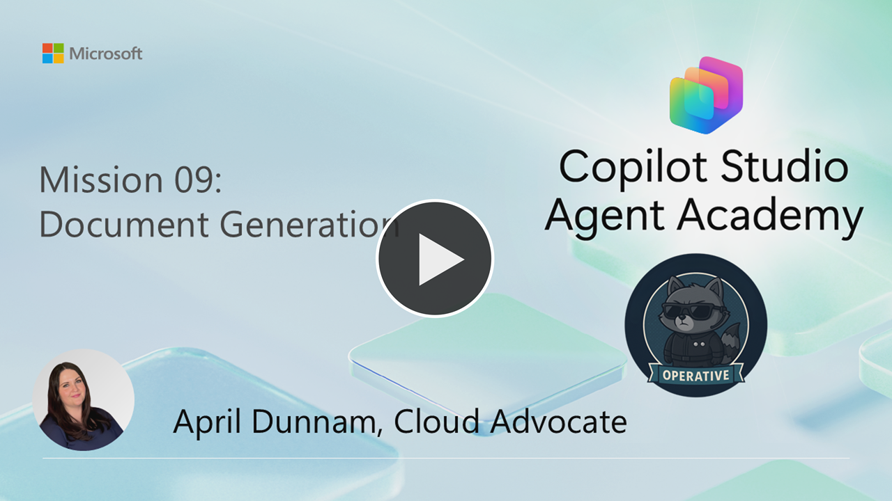
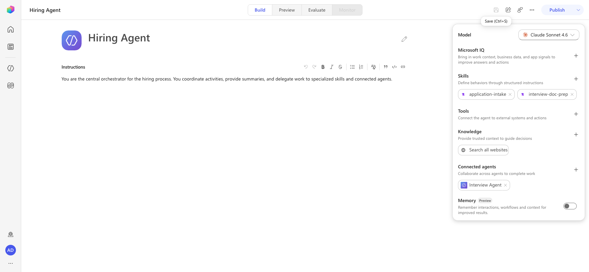
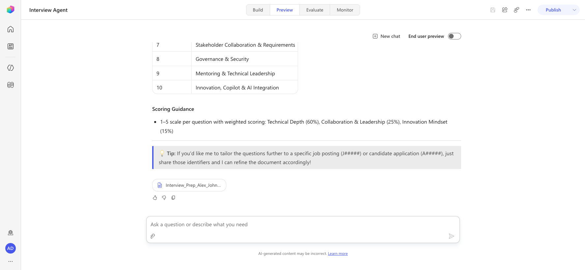

---
prev:
  text: Dataverse Grounding
  link: /operative/08-dataverse-grounding
next:
  text: Integrate with MCP Servers
  link: /operative/10-mcp
short-description: Generate a Word document natively with an agent skill
difficulty: 2
codename: OPERATION DOC ASSEMBLY
time: 45
tags:
  - document-generation
products: [copilot-studio, dataverse, word]
industries:
  - hr
created-date: 2026-01-14
last-edited-date: 2026-06-30
---
# 🚨 Mission 09: Generate a Candidate Interview Questions Document {#mission-09-generate-a-candidate-interview-questions-document}

<mission-meta />

> [!NOTE]
> This lab has been updated for the new Copilot Studio experience (2026-06-30).
> See `evaluation.md` for a full comparison with the original. **Key change:**
> AI Builder **Prompts** with Word-template *Document output* have been removed,
> and **Topics** are no longer authored in the new experience. Document generation
> is now handled **natively by the agent's built-in code interpreter** (Python with
> `python-docx` pre-installed), driven by a reusable **Skill** — no AI Builder Prompt,
> no Agent Flow, and no Topic required.

[](https://youtu.be/GYSEI0jbCvk?si=lYPZ4cmlxZ8-XBmi "Watch the walkthrough on YouTube")

## 🎯 Mission Brief {#mission-brief}

Welcome, Operative. Your previous missions have shown you how to ground an agent in Dataverse and have it reason over multimodal inputs. Now you'll unlock another capability: **document generation**.

Your assignment, should you choose to accept it, is **Operation Doc Assembly**. In this operation you'll have your agent produce a downloadable Word document of tailored interview prep questions — generated **natively** by the agent itself.

In the classic experience this required an AI Builder Prompt (with a Word template and *Document output*), an Agent Flow to extract the file bytes, and a Topic to return the file. **None of those constructs exist (or are authored) in the new experience.** Instead, the agent's model has a built-in **code interpreter** that runs Python (`python-docx` is pre-installed) to build a real `.docx` and return it as a downloadable file in chat. You'll package this behavior as a reusable **Skill** so the agent reliably produces the document on request.

## 🔎 Objectives {#objectives}

In this mission, you'll learn:

1. How an agent generates a Word document natively using its built-in code interpreter
1. How to package document-generation behavior as a reusable **Skill**
1. How to ground the document in Dataverse data (via the Dataverse MCP server from [Mission 08](../08-dataverse-grounding/index.md)) or in conversation context

## 🧪 Lab 9 - Generating an Interview Document

When a job application is added, you want to automate the process of preparing a detailed interview document. This should be a Word document that summarizes the applicant's key information (name, current role, experience, etc.), the role information (job title, requirements) and creates unique, specific interview questions based on the applicant's background and the role they are applying for.

### Prerequisites to complete this mission

1. Before starting this mission you need to:

    - **Have completed [Mission 08](../08-dataverse-grounding/index.md)** and have the agent ready, with the **Microsoft Dataverse MCP server** tool added if you want the document grounded in your Job Application data. (If you only want to generate a document from details supplied in the conversation, the MCP tool is optional.)

### 9.1 Create the document-generation skill

<!-- ⚠️ NEW FLOW: Replaces the classic "Create the prompt" (9.1) section.
     Original: Create an AI Builder Prompt "Interview Question Document Prep" with
     Dataverse grounding inputs, switch the model to GPT-4.1, choose "Document (preview)"
     output, upload a Word template with double-curly-brace placeholders, and have the prompt fill 19
     template fields.
     Reason: AI Builder Prompts are removed from the new experience ("Prompt" is now
     "Agent"), and the prompt "Document output" / Word-template feature no longer exists.
     New approach: the agent's model has a NATIVE code interpreter (python-docx is
     pre-installed) that builds a real .docx and returns it as a downloadable file. We
     package this as a Skill so it triggers reliably. VALIDATED LIVE — see
     assets/validation/m9-native-docgen.png (a downloadable
     Interview_Prep_<Candidate>_<Role>.docx was generated with no prompt, flow, or topic). -->

Your first objective: give your agent a reusable **Skill** that evaluates a candidate against a job and produces a downloadable Word document of tailored interview questions. The agent builds the `.docx` itself using its built-in code interpreter — there is no AI Builder Prompt, no Word template, and no placeholder fields to manage.

> [!NOTE]
> The agent's model (for example, **Claude Sonnet 4.6**) includes a built-in **code interpreter** with `python-docx` pre-installed. When asked for a downloadable Word file, the agent writes and runs Python to create a real `.docx` and returns it as a download in chat. This is a native capability — there is **no toggle** to enable it under **Settings → AI & behavior** (that tab only exposes Orchestration and Safety/Moderation).

1. Sign in to [Copilot Studio](https://copilotstudio.microsoft.com), select **Agents** from the left navigation, and open your **Hiring Agent** (the orchestrator from Mission 08). You'll author on the **Build** tab.

1. In the agent configuration panel on the right, find the **Skills** section and select **Add skill**.

    

1. In the **Add skill** dialog, select the **Create from blank** tab.

1. Copy and paste the following as the **Name** (skill names must be kebab-case — lowercase words separated by hyphens, or the **Create** button stays disabled):

    ```text
    interview-doc-prep
    ```

1. Copy and paste the following as the **Description**:

    ```text
    Generates a downloadable Word (.docx) interview prep document for a candidate's job application, containing applicant details, role details, and tailored interview questions. Use when asked to create or generate an interview prep document or file for an application, candidate, or role.
    ```

1. Copy and paste the following as the **Instructions**. These instructions carry over the same evaluation and question-generation logic from the classic prompt, and tell the agent to build the `.docx` with its code interpreter:

    ```text
    When this skill is activated, generate a downloadable Word (.docx) interview prep document for a candidate.

    ## Gather inputs
    - If an Application Number (starts with "A" followed by at least 5 digits) is provided and the Microsoft Dataverse MCP tool is available, look up the related records and extract:
        - Candidate (Candidate Name, Email)
        - Resume (Resume Title, Resume Number, Summary, Cover Letter)
        - Job Role (Job Title, Job Role Number, Description, requirements)
        - Evaluation Criteria for that Job Role (Criteria Name, Description, Weighting)
    - If Dataverse data is unavailable, use the candidate, role, and resume details supplied in the conversation. Ask for the candidate and the job role if neither is provided.

    ## Evaluate the resume
    - Extract the candidate's full name, email, current/most recent title, location, and total years of experience (only if supported by resume dates).
    - Identify the job's must-have requirements, nice-to-have requirements, key responsibilities, and required tools/technologies. Treat must-haves as highest priority.
    - For each must-have requirement, determine an evidence level (Strong / Moderate / Weak / Missing) with short supporting evidence grounded only in the inputs. Do not infer or invent experience.
    - Summarize top strengths (up to 5), key gaps (up to 5), and risks, plus a one-paragraph recruiter summary.

    ## Generate exactly 10 interview questions
    - 5 Core Requirement questions on the most critical must-haves.
    - 3 Gap/Clarification questions on weak, missing, or ambiguous areas.
    - 2 Scenario-Based questions derived from key job responsibilities.
    - Each question must map to a job requirement and note what to listen for. Questions must be specific, non-duplicative, and grounded in the inputs. Number them 1-10.

    ## Build and return the document
    - Use your built-in code interpreter (python-docx) to create a Word (.docx) document containing: a candidate info block, the role summary, interviewer notes, the 10 numbered questions (each with the requirement it maps to and what to listen for), and scoring guidance.
    - Return the .docx as a downloadable file named like ApplicationNumber_InterviewPrep.docx (or CandidateName_InterviewPrep.docx when no application number is available).
    - Be concise, professional, and evidence-based. Never address or message a candidate.
    ```

1. Select **Create**. The `interview-doc-prep` skill now appears in the **Skills** toolbar on your agent.

1. Select **Save** on the agent command bar and confirm the **Save** button goes **disabled** (it changes to **Saved**) — that confirms the change committed. If you see an *"Issue while saving"* toast, re-open the skill, verify the Name/Description/Instructions are populated, and save again.

    > [!TIP]
    > Add the skill to the **orchestrator** agent (the Hiring Agent). Generative orchestration will route a document request to this skill automatically. If a save error persists on one agent, the skill content is fine — try saving on the orchestrator agent, which reliably accepts the skill.

### 9.2 Generate and test the document

<!-- ⚠️ REMOVED: The classic "Create an agent flow to call the prompt" (9.2) section
     is no longer needed. Original: build a "Doc Prep" Agent Flow with a "Run a prompt"
     action and a "Respond to the agent" File output using the formula
     binary(outputs('Run_a_prompt')?['body/responsev2/predictionOutput/documentOutput/contentBytes']).
     Reason: the agent's code interpreter returns the .docx file directly in chat, so
     there is no prompt output to extract and no flow to author. The contentBytes
     extraction formula is obsolete. -->

In the classic lab you needed an Agent Flow to extract the file bytes from the prompt's output. That step is gone — the code interpreter returns the `.docx` directly as a downloadable file. You can test the behavior immediately.

1. Select the **Preview** tab, then select **New chat** to refresh the agent's tool context.

1. Ask the agent to generate the document. To ground it in Dataverse, reference a Job Application number from your **Job Application** table (it starts with **A** followed by digits, for example `A01001`):

    ```text
    Create an interview prep file for job application A01001
    ```

    Or, to generate from details supplied directly in the conversation:

    ```text
    Generate an interview prep document for Alex Johnson, applying for the Power Platform Developer role (8 years experience with Power Platform, Dataverse, and Azure). Return it as a downloadable Word file.
    ```

1. The agent reasons through the request, (optionally) looks up the application data via the Dataverse MCP tool, runs its code interpreter to build the `.docx`, and returns a **downloadable file** in chat along with an in-chat summary of the candidate, the role, and the 10 questions.

    

    > [!NOTE]
    > Document generation runs the code interpreter and can take 30-90 seconds. The agent shows **Working on it…** while it builds the file. Select the returned file to download it, then open it to confirm the candidate info, the 10 numbered questions, and the scoring guidance are filled in correctly.

### 9.3 (Removed) Tie it together with a topic

<!-- ⚠️ REMOVED: The classic "Create the topic" (9.3) section is not authored in the
     new experience. Original: on the Interview Agent, create a "Generate Interview Doc"
     Topic with a trigger description, a slot-filling input variable (VarApplicationNumber),
     a call to the "Doc Prep" flow, and a "Send a message" node returning the File with the
     name formula Topic.VarApplicationNumber&"InterviewPrep.docx".
     Reason: the new experience has no Topics tab — agents are driven by Instructions,
     Skills, Tools, and generative orchestration. The classic note said a Topic was
     "the only way to ensure a file object is returned every time"; that is no longer
     true. The agent returns the .docx directly from the code interpreter, and the
     interview-doc-prep Skill (9.1) makes the behavior reliable and reusable.
     Slot filling (capturing the Application Number from chat) is handled by generative
     orchestration plus the skill's "Gather inputs" instructions. -->

In the classic experience a **Topic** with slot filling was required to guarantee the file was returned. In the new experience there is no Topics tab — the agent is driven by its **Instructions**, **Skills**, **Tools**, and **generative orchestration**. The `interview-doc-prep` skill you created in 9.1 already makes the document-generation behavior reliable and reusable, and the agent captures the Application Number directly from the conversation (the skill's *Gather inputs* instructions describe the `A#####` pattern). **No Topic is needed.**

Congratulations! You just successfully added native document-generation capabilities to your agent — no AI Builder Prompt, Agent Flow, or Topic required.

## 🎉 Mission Complete {#mission-complete}

Great work, Operative! **Operation Doc Assembly** is now complete. You've successfully enhanced your agent with native document-generation capabilities, packaged as a reusable Skill and powered by the agent's built-in code interpreter.

🚀 **Next up:** In your next mission, you'll learn how to use the power of MCP servers to help add interview meeting scheduling and planning capabilities.

⏩ Move to [Mission 10](../10-mcp/index.md): Integrating with MCP

## 📚 Tactical Resources {#tactical-resources}

📖 [Add skills to an agent](https://learn.microsoft.com/microsoft-copilot-studio/authoring-skills?WT.mc_id=power-182762-apdunnam)

📖 [Agent instructions in Copilot Studio](https://learn.microsoft.com/microsoft-copilot-studio/authoring-agent-instructions?WT.mc_id=power-182762-apdunnam)

📖 [Generative orchestration overview](https://learn.microsoft.com/microsoft-copilot-studio/advanced-generative-actions?WT.mc_id=power-182762-apdunnam)

📖 [Connect to the Microsoft Dataverse MCP server](https://learn.microsoft.com/microsoft-copilot-studio/agent-extend-action-mcp?WT.mc_id=power-182762-apdunnam)

📖 [Work with Dataverse in Copilot Studio](https://learn.microsoft.com/microsoft-copilot-studio/knowledge-add-dataverse?WT.mc_id=power-182762-apdunnam)

📖 [python-docx documentation](https://python-docx.readthedocs.io/en/latest/)

<analytics-tag section="operative" mission="09-document-generation" />
