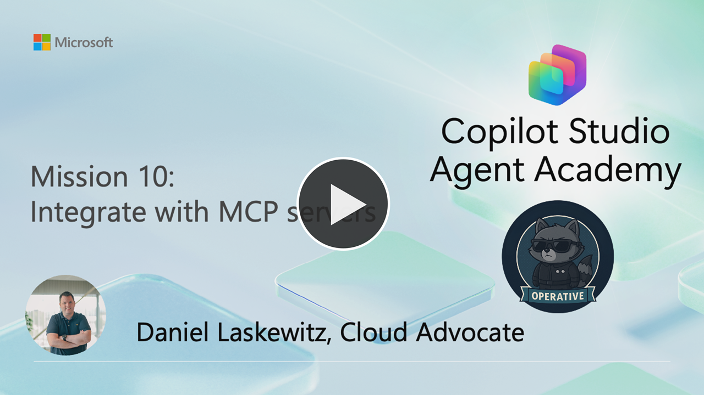
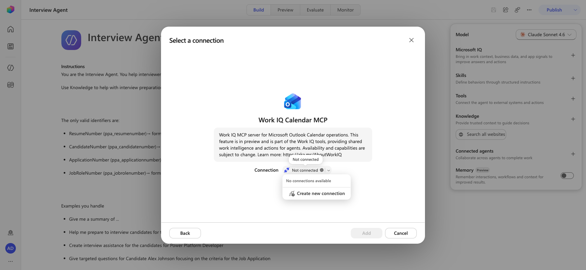
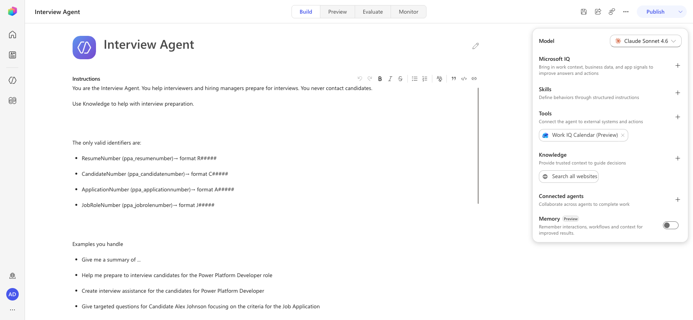
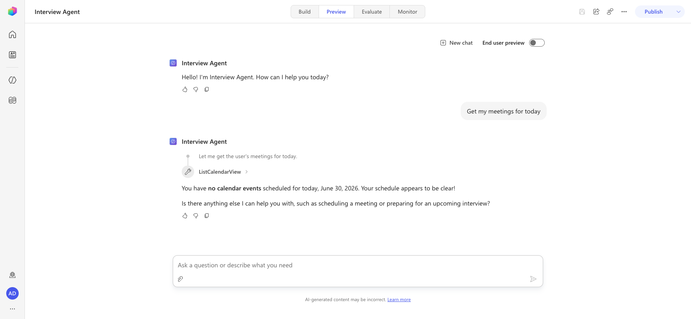

# 🚨 Mission 10: Integrate with MCP Servers {#mission-10-integrate-with-mcp-servers}

<mission-meta />

> [!NOTE]
> This lab has been updated for the new Copilot Studio experience (2026-06-30).
> See `evaluation.md` for a full comparison with the original. Most steps are
> **modified** (UI elements moved), with two notable changes validated live in
> this environment:
>
> - **Tools** are now added from the **Add tool** button in the agent's
>   right-side configuration panel (not a top-navigation **Tools** tab), and MCP
>   servers are filtered using the **Model Context Protocol (MCP)** *tab* in the
>   "Add a tool" dialog (the classic "filter" is gone).
> - The **Work IQ User (Preview)** MCP server was **not available** in the test
>   environment — only Work IQ Mail/Teams/Calendar/SharePoint/OneDrive (Preview)
>   were present. The "Who is my manager?" portion of Lab 10.1 is flagged as
>   blocked-in-this-environment below. It may still be available in tenants with
>   the full Agent 365 / Frontier rollout.

[](https://youtu.be/kW2f8Z8fzBw?si=rDg7uFQCIDUe_Q_H "Watch the walkthrough on YouTube")

## 🎯 Mission Brief {#mission-brief}

Welcome, Operative. Your previous missions have shown you the power of prompts. You learned about multimodal document analysis, grounding your prompts with Dataverse data and document generation. Now you'll unlock another advanced capability: **Model Context Protocol (MCP) server integration**.

Your assignment, should you choose to accept it, is **Operation MCP Rendezvous**. In this operation you'll be connecting your agent to external MCP servers to extend its capabilities, enabling it to arrange interview prep meetings.

## 🔎 Objectives {#objectives}

In this mission, you'll learn:

1. How to understand and work with the Model Context Protocol (MCP) standard
1. How to use Agent 365 to integrate MCP servers with your Copilot Studio agents
1. How to connect your Copilot Studio agent to MCP servers
1. How to leverage MCP server capabilities within your agents

## 🔌 What is MCP? {#what-is-mcp}

**Model Context Protocol (MCP)** is an open standard that enables AI assistants to securely connect to external data sources and tools. Think of MCP as the **USB-C of AI integration** – just as USB-C provides a universal connector for various devices and peripherals, MCP provides a standardized way for AI systems to connect to different services, databases, and applications.

Before USB-C, every device had its own proprietary connector (remember all those different charger cables?). Similarly, before MCP, connecting AI agents to external systems required custom integrations for each service. MCP solves this by providing a universal "plug-and-play" protocol.

### ✨ Key benefits of MCP {#key-benefits-of-mcp}

- **Universal connectivity**: One standard protocol works across different AI platforms and data sources
- **Secure access**: Built-in authentication and permission controls protect your data
- **Extensibility**: Easily add new capabilities to your agents without rewriting core logic
- **Interoperability**: MCP servers can work with multiple AI assistants and applications

In this mission, you'll use MCP to connect your Copilot Studio agent to external services, dramatically expanding what your agent can do beyond its built-in capabilities.

## 🛠️ Where does Agent 365 come in? {#where-does-agent-365-come-in}

**Agent 365** is Microsoft's comprehensive platform for managing and extending AI agents at enterprise scale. It gives each AI agent its own **Microsoft Entra Agent ID** for identity, lifecycle, and access management, while providing the infrastructure to safely connect agents to business systems through MCP servers.

Think of Agent 365 as the **enterprise control plane** for your AI agents - it handles security, governance, and observability while enabling agents to interact with Microsoft 365 and business applications through standardized MCP tooling servers.

### 👥 How Agent 365 serves different roles {#how-agent-365-serves-different-roles}

Agent 365 addresses the needs of everyone involved in the agent ecosystem:

- **IT Administrators**: Monitor agent activity, enforce policies, and manage threats through the Microsoft 365 admin center
- **Security Teams**: Apply enterprise-grade controls for identity, authentication, and compliance with Microsoft Purview and Defender integration
- **Developers**: Build and extend agents using unified SDKs, pre-built MCP servers, and frameworks in Copilot Studio or Azure AI Foundry
- **Business Decision Makers**: Deploy agents securely and measure their impact on productivity and business outcomes
- **Information Workers**: Collaborate with agents seamlessly to amplify productivity

### 🔧 Agent 365 tooling servers for MCP integration {#agent-365-tooling-servers-for-mcp-integration}

Agent 365 provides **enterprise-grade MCP servers** that give your agents safe, governed access to business systems, including:

**Pre-built MCP servers** for Microsoft 365 and business applications:

- **Outlook Calendar**: Create, update, and manage calendar events
- **Outlook Mail**: Send, read, and search emails  
- **Teams**: Create chats, post messages, and manage channels
- **SharePoint & OneDrive**: Upload files, manage lists, and search documents
- **Word**: Create and edit documents, add comments
- **Dataverse & Dynamics 365**: Perform CRUD operations on business data
- **User Profile**: Access user information, managers, and direct reports
- **Copilot Search**: Chat with Microsoft 365 Copilot and ground responses with files

**Enterprise security and governance**:

- **Centralized control**: Manage all MCP servers through the Microsoft 365 admin center - allow or block servers organization-wide
- **Scoped permissions**: Agents only access the resources they need based on Microsoft Entra scopes
- **Full observability**: Monitor and audit all tool calls using Microsoft Defender Advanced Hunting
- **Policy enforcement**: Apply DLP, MIP, rate limits, and security scans at runtime
- **Threat protection**: Detect and remediate attacks targeting agents with Microsoft Defender integration

**Custom MCP server creation**:

- Build scenario-specific servers using the **MCP Management Server** - an API-first tool for creating custom MCP servers
- Connect to **1,500+ Power Platform connectors** (ServiceNow, JIRA, etc.)
- Integrate **Microsoft Graph APIs**, **REST APIs**, and **Dataverse custom APIs**
- Publish and certify custom servers for your organization
- Enable ISVs to build and publish certified servers

**Developer experience**:

- Available in both **Copilot Studio** (low-code) and **Azure AI Foundry** (pro-code)
- Built into the **Agent 365 SDK** for seamless integration
- **Visual Studio Code** integration for creating and testing custom MCP servers
- Consistent, standardized interfaces across all tooling servers

### 💡 Why this matters for your agents {#why-this-matters-for-your-agents}

Agent 365 transforms MCP from an open standard into an enterprise-ready platform. Your agents get:

- **Deterministic, auditable actions** - every tool call is tracked and governed
- **Production-grade reliability** - all MCP servers undergo rigorous testing for accuracy, latency, and reliability  
- **Security by default** - enterprise controls are built-in, not bolted on
- **Rapid development** - pre-built servers for common scenarios, easy customization for specialized needs
- **Unified management** - one control plane for all agents, regardless of where they're built

### 🎯 What you'll focus on in this mission {#what-youll-focus-on-in-this-mission}

While Agent 365 offers a comprehensive platform for agent management, governance, and custom MCP server development, **this mission focuses specifically on using pre-built MCP servers** in Copilot Studio.

You'll learn how to connect your agent to ready-made tooling servers (like Outlook Calendar and Teams) and enable real actions in Microsoft 365 applications - without building custom integrations. Think of this as learning to use the tools already in the toolbox before building your own.

## 🧪 Lab 10 - Add MCP Servers to arrange an interview prep-meeting {#lab-10-add-mcp-servers-to-arrange-an-interview-prep-meeting}

> [!IMPORTANT]
> For this lab, you need to make sure that you are part of the [Frontier preview program](https://adoption.microsoft.com/copilot/frontier-program/) to get early access to Microsoft Agent 365. Frontier connects you directly with Microsoft’s latest AI innovations. Frontier previews are subject to the existing preview terms of your customer agreements. As these features are still in development, their availability and capabilities may change over time.
>
> If you’re unable to gain access to the Frontier program, please feel free to skip this lab - you’ll still be able to earn the Operative badge.

### Lab 10.1: Add MCP servers to the Interview Agent

> [!WARNING]
> In this lab, you will learn how to add MCP servers: the *Work IQ User (Preview)* and the *Work IQ Calendar (Preview)* MCP servers. For the lab to work, you will need to configure the following in your tenant ahead of time:
>
> - Have a manager configured for your user which can be configured in the M365 Admin Center
> - Have an appointment on your calendar in the upcoming 24 hours - this is because you will test the MCP server by asking "Get my meetings for today"
> - Have an extra user created on your tenant, so that you can invite that user for the interview prep-meeting ([How to create a user in M365](#tactical-resources))
> - For that extra user, the mailbox needs to be provisioned and it would be good to set the working days / hours

To add MCP servers to your agent you only have to add one tool per MCP server. This is different to connector tools which require you to add a tool for every connector action. This ability to add a single tool that handles multiple actions is one of the things that makes MCP Servers a lot easier to work with.

<!-- ⚠️ BLOCKED-IN-ENVIRONMENT: The "Work IQ User (Preview)" MCP server.
     Original: "Add the Work IQ User (Preview) MCP Server" → test "Who is my manager?"
     Reason: In the test environment (new experience), searching the "Model Context
     Protocol (MCP)" tab for "Work IQ" / "User" returned only Work IQ Mail, Teams,
     Calendar, SharePoint, and OneDrive (Preview). No "Work IQ User (Preview)" server
     was present, so getMyManager / user-profile capabilities could not be added.
     Alternative: None in this environment. The server may still exist in tenants with
     the full Agent 365 / Frontier rollout — the original steps are preserved below in
     a collapsed note for those tenants. The Calendar half of the lab works (validated). -->

#### Add the Work IQ User (Preview) MCP Server

> [!WARNING]
> **Work IQ User (Preview) was not available in the environment used to validate this
> rewrite.** Searching the MCP tab for "Work IQ" returned only the Mail, Teams,
> Calendar, SharePoint, and OneDrive (Preview) servers. If your tenant *does* expose
> **Work IQ User (Preview)**, follow the same add-tool flow described for the Calendar
> server below, selecting **Work IQ User (Preview)** instead, then test with the prompt
> `Who is my manager?` (this triggers the *getMyManager* MCP tool and lets you also ask
> "Who are my direct reports?", "What is the job role of Daniel Laskewitz?", etc.).
> If the server is not listed, skip ahead to **Add the Work IQ Calendar (Preview) MCP
> server** — you can still complete the calendar half of the mission.

#### Add the Work IQ Calendar (Preview) MCP server

The Work IQ Calendar (Preview) MCP server lets your agent read and act on your Outlook calendar - reading your meetings, finding meeting times, and creating events. Adding it is the same single-tool flow used for any MCP server in the new experience.

1. Open [Copilot Studio](https://copilotstudio.microsoft.com) and **open** the previously created Interview Agent. The agent opens on the **Build** page.

1. In the **Agent configuration** panel on the right, find the **Tools** section and select **Add tool**.

    > [!NOTE]
    > In the classic experience, Tools lived in the top navigation. In the new
    > experience, tools are managed from the right-side configuration panel on the
    > agent's **Build** page.

1. In the **Add a tool** dialog, select the **Model Context Protocol (MCP)** tab to filter the list to MCP servers only.

    > [!NOTE]
    > The classic experience used a **filter** to narrow to MCP servers. The new
    > experience uses a **tab** (the tabs are **All**, **Model Context Protocol
    > (MCP)**, **Connectors**, and **Workflows**).

1. In the **Search** box, type `Work IQ`, then select **Work IQ Calendar (Preview)** from the results.

1. On the **Select a connection** step, select the **Not connected** dropdown, then select **Create new connection**.

    

1. Select **Create** to start the connection process.

1. In the **pick your account** popup, select **your account**. If you are already signed in, the popup completes automatically and the connection is created.

1. Back on the dialog, with the connection now shown, select **Add** to add the Work IQ Calendar (Preview) MCP server to the Interview Agent.

    > [!NOTE]
    > In the classic experience this button was **Add and configure** and opened a
    > separate tool overview page. In the new experience the button is simply **Add**,
    > and there is no separate configure step - the server's tools are added directly.

1. The Work IQ Calendar (Preview) tool now appears in the **Tools** section of the agent. Select **Save** in the command bar and confirm the **Save** button becomes disabled, which means your change is committed.

    

    > [!IMPORTANT]
    > If you navigate away before the **Save** button goes disabled, the tool is
    > silently discarded. Always confirm the save committed before testing.

Let's test out this MCP server.

1. Select the **Preview** tab, then select **New chat** to make sure the agent picks up the newly added tool.

1. Enter the following prompt:

    ```text
    Get my meetings for today
    ```

1. The agent calls the **ListCalendarView** MCP tool and returns your meetings for today. If your calendar is empty, you'll get a response confirming there are no events scheduled.

    

    > [!NOTE]
    > In the classic experience the first call surfaced a separate **consent card**
    > (you selected **Allow**) and the tool was named *getEvents*. In the new
    > experience the agent invoked the **ListCalendarView** tool directly using the
    > connection created when the tool was added; no separate consent card appeared in
    > the validated run. The MCP tool button in the chat transcript lets you inspect
    > what the agent sent and received.

### Lab 10.2: Plan an interview prep-meeting

Now that the Calendar MCP server works, let's try to plan an interview prep-meeting.

> [!WARNING]
> This part of the lab requires the tenant prerequisites listed at the start of Lab
> 10.1 - in particular an **extra provisioned user** (the interview-prep invitee) and
> some real **calendar availability** to schedule against. The *findMeetingTimes* and
> *createEvent* tools are part of the Work IQ Calendar (Preview) server you just added,
> but the scheduling result depends on live calendar data. In the validation
> environment no second user / appointment data was provisioned, so the end-to-end
> scheduling output below could not be reproduced; the steps are documented for
> tenants that meet the prerequisites.

1. In the **Preview** tab, select **New chat** to start a fresh test session.

1. Enter the following prompt:

    ```text
    Can you find 3 meeting times for a 30 minute meeting with Jane Doe for an interview prep-meeting?
    ```

    This will trigger the *findMeetingTimes* MCP tool and it will look at the calendars of both the user of the agent and Jane Doe and figure out which times work based on their availability. It will then respond with three options for meetings. Select the MCP tool button in the transcript to inspect which tools were called.

    To plan the actual meeting you still have to respond to the agent.

1. Enter the following prompt (replace the time with one of the suggested meeting slots you got from the agent):

    ```text
    Please schedule the one on 10:30 AM UTC
    ```

    This will trigger the *createEvent* MCP tool and schedule the meeting, which will show up as a meeting request in Jane Doe's mailbox.

Now we're done with this lab. Hopefully this gave you a good overview of how MCP servers can help you in your agents!

## 🎉 Mission Complete {#mission-complete}

Great work, Operative! **Operation MCP Rendezvous** is now complete. You've successfully integrated external MCP servers with your Copilot Studio agent, unlocking powerful new capabilities for extending your agent's functionality!

🚀 **Next up:** In your next mission, you'll learn how to collect and analyze user feedback to continuously improve your agent's performance.

⏩ Move to [Mission 11](../11-obtain-user-feedback/index.md): Collecting feedback from users

## 📚 Tactical Resources {#tactical-resources}

📖 [Microsoft Copilot Studio ❤️ MCP Lab](https://aka.ms/mcsmcp/lab)

📖 [Model Context Protocol - Getting Started](https://modelcontextprotocol.io/docs/getting-started/intro)

📖 [Extend agents with MCP in Copilot Studio](https://learn.microsoft.com/microsoft-copilot-studio/agent-extend-action-mcp?WT.mc_id=power-215684-dlaskewitz)

📖 [Microsoft Agent 365 Overview](https://learn.microsoft.com/microsoft-agent-365/overview?WT.mc_id=power-215684-dlaskewitz)

📖 [Microsoft Agent 365 Tooling Servers Overview](https://learn.microsoft.com/microsoft-agent-365/tooling-servers-overview?WT.mc_id=power-215684-dlaskewitz)

📖 [Work IQ User (Preview)](https://learn.microsoft.com/microsoft-agent-365/mcp-server-reference/me?WT.mc_id=power-215684-dlaskewitz)

📖 [Work IQ Calendar (Preview) MCP Server](https://learn.microsoft.com/microsoft-agent-365/mcp-server-reference/calendar?WT.mc_id=power-215684-dlaskewitz)

📖 [Add users and assign licenses](https://learn.microsoft.com/microsoft-365/admin/add-users/add-users?view=o365-worldwide&WT.mc_id=power-215684-dlaskewitz)

<analytics-tag section="operative" mission="10-mcp" />
