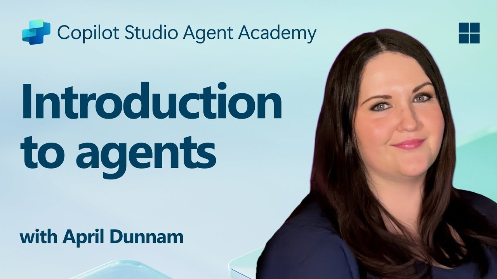

---
prev:
  text: 'Course Setup'
  link: '/recruit-v2-preview/00-course-setup'
next:
  text: 'Copilot Studio Fundamentals'
  link: '/recruit-v2-preview/02-copilot-studio-fundamentals'
---

# 🚨 Mission 01: Introduction to Agents

## 🕵️‍♂️ CODENAME: `OPERATION AI AGENT DECODE`

> **⏱️ Operation Time Window:** `~25 minutes – intel only, no fieldwork required`

🎥 **Watch the Walkthrough**

## 🎯 Mission Brief

Welcome, Recruit. This mission is about **how to think about agents**. We're not opening Copilot Studio yet. First you need the concepts, because the product only makes sense once you understand the ideas underneath it.

And those ideas have moved. A couple years ago, "building a bot" meant building out a conversation tree. Today, an **agent** reasons about what you want, pulls from trusted data, and *takes action* and our job has shifted from scripting dialogue to setting goals, supplying capabilities, and defining boundaries. By the end of this mission you'll know what's actually different and why it matters.

## 🔎 Objectives

In this mission, you'll learn:

1. The difference between a chatbot, an assistant, and an **agent**
1. How Large Language Models (LLMs) act as an agent's "brain"
1. How Retrieval-Augmented Generation (RAG) keeps answers grounded and current
1. What **orchestration** is, and why generative orchestration replaced the topic tree
1. The **agency spectrum** from reactive to autonomous, and the control boundaries that keep it safe
1. The two paths you'll build in this course: **declarative** vs. **custom-engine** agents

Let's decode it.

## Chatbot vs. Assistant vs. Agent

These words get used interchangeably. They're not the same, and the distinction is the whole point of this course.

- **Chatbot** — Matches your phrase to a pre-written answer or a branch in a scripted flow. Predictable, but brittle: say it differently and it breaks.
- **Assistant** — Uses an LLM to respond fluently to almost anything, but mostly *talks*. It answers; it doesn't reliably *do*.
- **Agent** — Reasons about your goal, decides which **knowledge** to consult and which **tools** to use, executes a multi-step plan, and can act on a **trigger** without you typing anything at all.

> [!INFO] The one-line definition
> An **agent** is an LLM given a goal, a set of tools and knowledge, and the autonomy to decide how to use them within boundaries you set.

## The Brain: Large Language Models (LLMs)

Every agent is built around an LLM which is a neural network trained on enormous amounts of text that predicts language one **token** at a time. A few concepts you'll lean on later:

- **Tokens & context window** — Models read and write in tokens (word fragments). The **context window** is how much it can "hold in mind" at once. These context windows tend to be big today, but not infinite. Long conversations and large documents can get summarized or dropped.
- **Instructions over prompts** — You don't just ask an agent a question; you give it standing **instructions** (its persona, rules, and how to behave). This is the single biggest lever on agent quality.
- **Not all models are equal** — Some are fast and cheap for chat. **Reasoning models** add a deliberate "think before answering" step that makes them far better at planning multi-step work. Choosing the right model for the job is important.

> [!TIP] The autocomplete analogy
> An LLM is a "super-smart autocomplete": it doesn't *understand* like a human, it predicts the next best token. That's why **clear instructions and good grounding matter more than clever phrasing** because you're steering a prediction engine, not briefing a colleague.

## The Memory: Retrieval-Augmented Generation (RAG)

An LLM only knows what it was trained on, which is frozen in time and knows nothing about *your* organization. **RAG** fixes that by letting the agent look things up before it answers:

1. **Ask** — The user poses a question.
1. **Retrieve** — The agent searches a **knowledge source** (your SharePoint, OneDrive, Dataverse, a website, a database) for relevant information.
1. **Augment** — That information is added to the model's context.
1. **Generate** — The model answers using that retrieved evidence (ideally **with citations**) back to the source.

This is the difference between an agent that *guesses* and one that *cites its sources*. In Copilot Studio this is called the **knowledge layer**, and it's read-only by design: knowledge informs answers, **tools** take actions. Keep those two ideas separate, it'll save you grief later.

## The Director: Orchestration

Here's the concept that changed everything. **Orchestration** is the layer that decides *what the agent does* with a request: which knowledge to pull, which tools to call, in what order.

In the old world, *you* were the orchestrator. You hand-authored a **topic** for every path the conversation could take. It worked until it didn't: too many topics, too many exceptions, and the whole thing fell apart the moment a user phrased something unexpectedly.

**Generative orchestration** flips this. An LLM acts as a **planner**: it reads the user's intent, looks at the knowledge, tools, and sub-agents available to it, and composes a plan on the fly:

> **plan → act → observe → replan**

You no longer script the path. You supply good building blocks like clearly named tools, well-described knowledge, sharp instructions, and let the planner assemble them. This is the most important shift in the course, and it changes the job:

> [!INFO] Your job changed
> You've gone from **writing the script** to **defining the operating environment**. Agent quality now lives in the quality of your *instructions, tool names, and data boundaries*, not in how many conversation branches you drew. A vaguely described tool isn't bad documentation anymore; it's a bad instruction handed to the planner.

## The Agency Spectrum

It's tempting to sort agents into two bins: "conversational" and "autonomous." The better way to think of it is a **dial**. The same agent can answer a chat now and run a scheduled job later. What varies is *how much it decides on its own*.

| | More **reactive** | More **autonomous** |
|---|---|---|
| **Starts from** | A user message | A trigger (schedule, new email, new record) |
| **Good for** | Q&A, guided help, support | Multi-step jobs, monitoring, back-office automation |
| **Human role** | In the conversation | Reviewing outcomes, approving high-stakes steps |
| **Example** | Teams agent answering HR-policy questions | Agent that triages an inbox and drafts replies for review |

Because autonomy cuts both ways, you set **control boundaries**, deciding, per action, whether the agent can:

- **Just do it** (low-risk: look up an answer, summarize a doc),
- **Ask first** (medium-risk: confirm before sending or changing something), or
- **Escalate** (high-risk: a human must approve—e.g., a payment or a deletion).

> [!TIP] Opinion: design the boundaries before the capabilities
> The failure mode of agentic AI isn't a wrong sentence, it's a confident wrong *action* against a real system. Decide what the agent is allowed to do **before** you wire up what it *can* do.

## Two Paths You'll Build: Declarative vs. Custom-Engine

This course builds both kinds of agent, so meet them now as *concepts* (the how-to is in later missions):

- **Declarative agent** — You *declare* the agent's instructions, knowledge, and actions, and it runs on **Microsoft 365 Copilot's** orchestrator and models. Fastest path to value; lives natively inside M365 Copilot. *(You'll build one in Mission 03.)*
- **Custom-engine agent** — You bring your own orchestration, model choice, tools, and channels, built in **Copilot Studio**. More control and flexibility; deploy to M365 and beyond. *(You'll build one starting in Mission 05.)*

The rule of thumb: **start declarative; reach for a custom engine when you need control the M365 Copilot orchestrator doesn't give you** like a specific model, custom logic, or a channel outside Microsoft 365.

## Why This Lands in Microsoft 365

Concepts are universal, but in this course the agents you build **meet people where they already work**: in **Microsoft Teams** and the **Microsoft 365 Copilot** experience, grounded in Work IQ, acting through your connected tools, and bound by your organization's identity and permissions. An agent that's brilliant in isolation but invisible in the flow of work doesn't get used. That integration is the payoff and the subject of the rest of the curriculum.

## 🎉 Mission Complete

You now have the mental model. You can explain:

1. **Agent ≠ chatbot ≠ assistant** — an agent reasons, retrieves, acts, and can self-start.
1. **LLM = the brain**, steered by instructions and model choice.
1. **RAG = the memory** — grounded, cited answers from *your* data (the knowledge layer).
1. **Generative orchestration = the director** — a planner that composes tools and knowledge instead of a hand-drawn topic tree.
1. **Agency is a spectrum** — set control boundaries before capabilities.
1. **Declarative vs. custom-engine** — start simple, escalate to control when needed.

Next up, you'll open the toolbox: the [**fundamentals of Copilot Studio**](../02-copilot-studio-fundamentals/index.md), where every concept here becomes a building block you can click.

Stay sharp, Recruit - your AI journey is just beginning!

## 📚 Tactical Resources

🔗 [Copilot Studio Documentation Home](https://learn.microsoft.com/microsoft-copilot-studio/)

🔗 [Apply generative orchestration capabilities](https://learn.microsoft.com/en-us/microsoft-copilot-studio/guidance/generative-orchestration) — the concept, in Microsoft's words

<!-- markdownlint-disable-next-line MD033 -->

