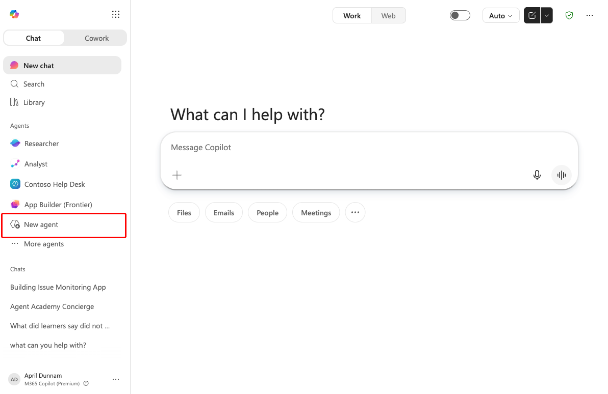
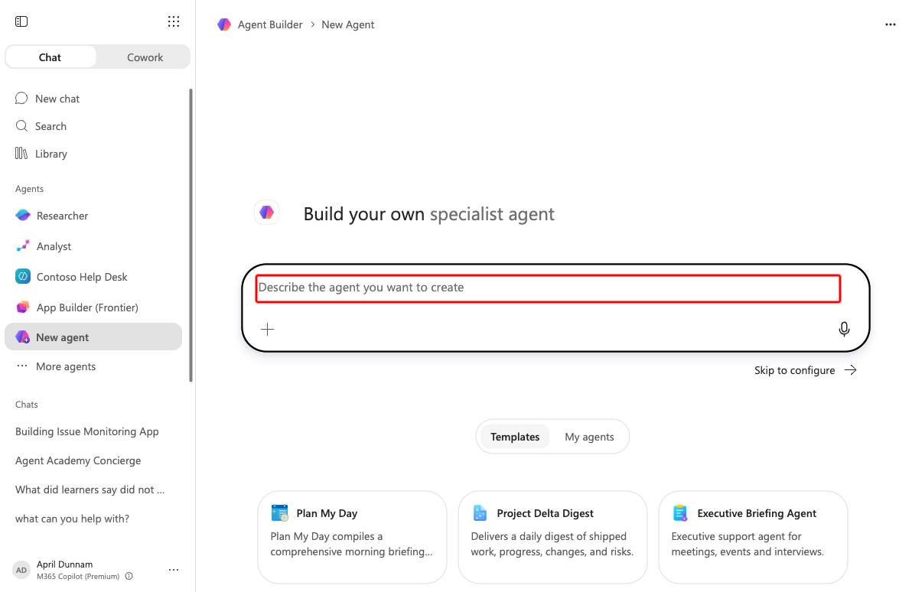
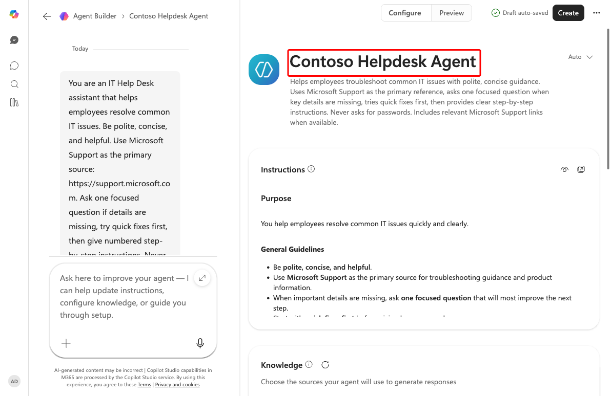
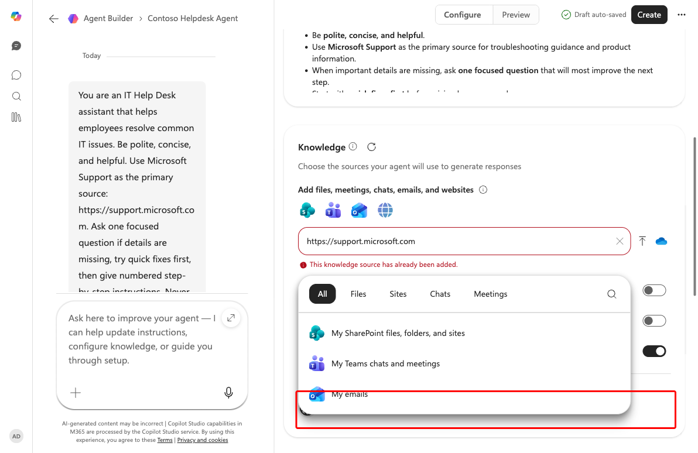
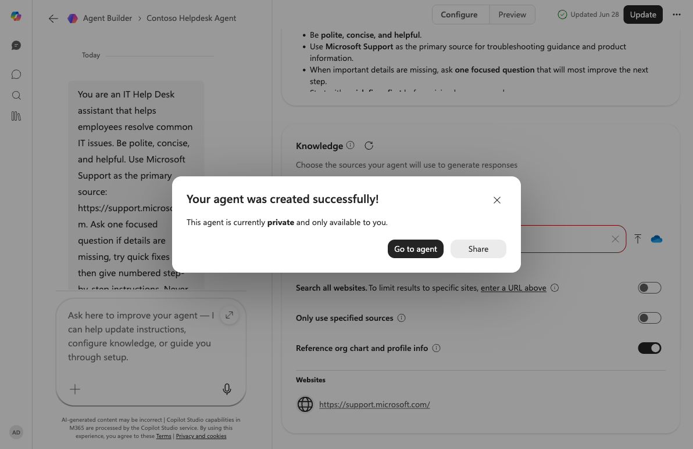
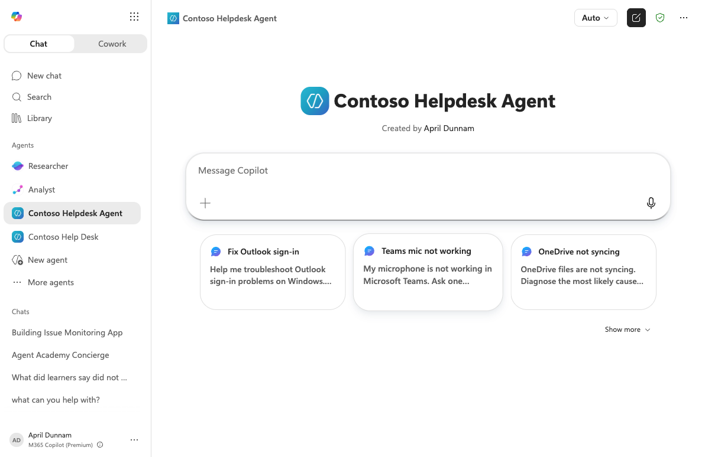
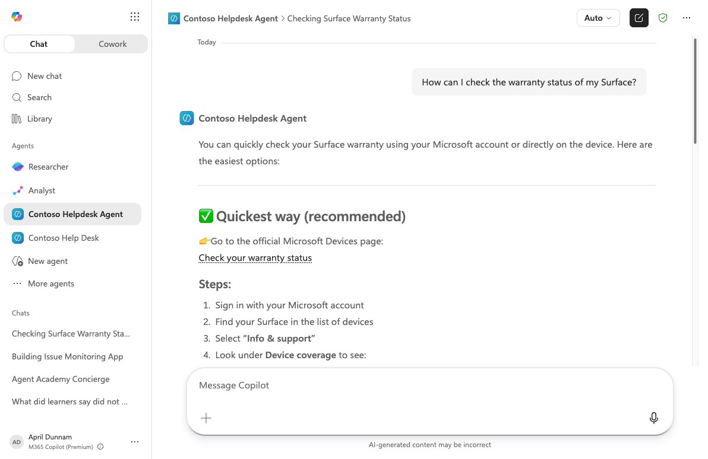

---
prev:
  text: Introduction to agents
  link: /recruit-v2-preview/01-introduction-to-agents
next:
  text: Copilot Studio fundamentals
  link: /recruit-v2-preview/03-copilot-studio-fundamentals
short-description: Build and deploy a declarative agent in Microsoft 365 Copilot using Agent Builder
difficulty: 1
codename: OPERATION AGENT DECLARE
time: 45
tags:
  - declarative-agents
products: [microsoft-365, copilot, sharepoint]
industries:
  - it
created-date: 2026-06-28
last-edited-date: 2026-06-28
---

# 🚨 Mission 02: Build a Declarative Agent {#mission-02-declarative-agents}

<mission-meta />

## 🎯 Mission Brief {#mission-brief}

Welcome back, Agent. This mission puts you in the command seat of the fastest way to ship an agent: building one with natural language right where your users already work — **Microsoft 365 Copilot**.

This isn't another chatbot. You're building a **declarative agent**, one that uses the Copilot orchestrator, layered with your own instructions, knowledge, and starter prompts. You describe what you want, Agent Builder drafts it, you test it, and you deploy it in minutes, not hours.

Your weapon of choice? Natural language. Your mission? Design, test, and deploy an IT helpdesk agent that answers questions using internal and external knowledge sources, all inside Copilot.

In the next mission (**04 - Creating a Custom Engine Agent**) you'll export this same agent to Copilot Studio to customize it further. Let's get started.

## 🔎 Objectives {#objectives}

In this mission, you'll learn:

1. What a **declarative agent** is and how it differs from a custom engine agent
1. How to create an agent in Microsoft 365 Copilot using **Agent Builder**
1. How to describe an agent in natural language and let AI draft the instructions
1. How to ground the agent with a website knowledge source
1. How to test and deploy the agent so others can use it

## 🤔 What is a declarative agent? {#what-is-a-declarative-agent}

A **declarative agent** runs on the existing Microsoft 365 Copilot infrastructure using the same large language model and orchestrator that M365 Copilot uses and you simply *declare* how it should behave. You provide:

- **Instructions** - the agent's purpose, tone, and rules.
- **Knowledge** - websites, files, or SharePoint sources it can reference.
- **Starter prompts** - example questions to get users going.

You don't manage a model, orchestration, or hosting. That makes declarative agents the quickest way to put a focused assistant in front of users, right inside Teams, Outlook, and Word via Microsoft 365 Copilot.

> [!TIP]
> When you outgrow a declarative agent and need custom tools, topics, multi-agent orchestration, or your own model, you graduate to a **custom engine agent** in Copilot Studio. That's exactly what Mission 04 covers by exporting this agent.

## 🧪 Lab 02: Build a declarative agent in Microsoft 365 Copilot {#lab-02-build-a-declarative-agent}

### ✨ Use case {#use-case}

**As an** employee, **I want to** get quick and accurate help from an IT helpdesk agent for issues like device problems and network troubleshooting, so that I can stay productive and resolve technical issues without delays.

### ✨ Prerequisites {#prerequisites}

- A Microsoft 365 Copilot license
- Access to [Microsoft 365 Copilot](https://m365.cloud.microsoft/chat) (the Copilot chat experience)

### 2.1 Open Agent Builder

1. Go to [Microsoft 365 Copilot](https://m365.cloud.microsoft/chat) and sign in.

1. In the left navigation, under **Agents**, select **New agent**. This opens **Agent Builder**.

    

### 2.2 Describe your agent in natural language

1. In the **Describe the agent you want to create** box, paste the following description.

    ```text
    You are an IT Help Desk assistant that helps employees resolve common IT issues. Be polite, concise, and helpful. Use Microsoft Support as the primary source: https://support.microsoft.com. Ask one focused question if details are missing, try quick fixes first, then give numbered step-by-step instructions. Never ask for passwords. Include relevant Microsoft Support links.
    ```

    

1. Press **Enter** to submit. Agent Builder drafts your agent by generating a name, description, instructions, and suggested prompts. This takes a few moments.

    > [!WARNING] AI-generated content varies
    > The drafted name, description, instructions, and starter prompts can differ each session.

### 2.3 Name and review your agent

1. The builder switches to the **Configure** view. In **Enter agent name**, replace the suggested name with:

    ```text
    Contoso Helpdesk Agent
    ```

    Review the AI-generated instructions below the name. You'll see the role, tone, and numbered troubleshooting flow reflected from your description.

    

### 2.4 Add a website knowledge source

1. In the **Knowledge** section, select the **Enter a URL or name or drop files here** box and add the following, then press **Enter**:

    ```text
    https://support.microsoft.com
    ```

    The site appears under **Websites**. To keep the agent grounded only on your sources, you can turn on **Only use specified sources**.

    

### 2.5 Create and deploy the agent

1. Select **Create**. Agent Builder saves the agent and confirms it was created. It's **private** to you by default but you can select **Share** to deploy it to teammates, or **Go to agent** to start using it.

    

1. Select **Go to agent**. Your declarative agent opens in Microsoft 365 Copilot, ready with its suggested prompts.

    

### 2.6 Test the agent

1. In the **Message Copilot** box, enter:

    ```text
    How can I check the warranty status of my Surface?
    ```

1. The agent responds with numbered, step-by-step instructions and references a [https://support.microsoft.com](https://support.microsoft.com) link, exactly as defined in the instructions, grounded in your website knowledge source.

    

🎉 Congratulations! You built, tested, and deployed a declarative agent entirely inside Microsoft 365 Copilot.

## ✅ Mission Complete {#mission-complete}

You forged a declarative agent that speaks your language, references Microsoft Support, and lives right inside Copilot. In **Mission 04: Creating a Custom Engine Agent**, you'll export this agent into Copilot Studio to add tools, custom knowledge, and deeper orchestration. But before that, you need to learn more about Copilot Studio.

⏭️ [Move to the **Copilot Studio Fundamentals** mission](../03-copilot-studio-fundamentals/index.md)

## 📚 Tactical Resources {#tactical-resources}

🔗 [Build agents with Agent Builder](https://learn.microsoft.com/microsoft-365-copilot/extensibility/agent-builder)

🔗 [Declarative agents overview](https://learn.microsoft.com/microsoft-365-copilot/extensibility/overview-declarative-agent)

<analytics-tag section="recruit" mission="02-declarative-agents" />
