---
prev:
  text: Introduction to agents
  link: /recruit-v2-preview/01-introduction-to-agents
next:
  text: Copilot Studio fundamentals
  link: /recruit-v2-preview/03-copilot-studio-fundamentals
short-description: Build and deploy a declarative agent in Microsoft 365 Copilot using Agent Builder
difficulty: 1
codename: OPERATION AGENT DECLARE
time: 45
tags:
  - declarative-agents
products: [microsoft-365, copilot]
industries:
  - it
created-date: 2026-06-28
last-edited-date: 2026-06-28
---

# 🚨 Mission 02: Build a Declarative Agent {#mission-02-declarative-agents}

<mission-meta />

## 🎯 Mission Brief {#mission-brief}

Welcome back, Agent. This mission puts you in the command seat of the fastest way to ship an agent: building one with natural language right where your users already work in **Microsoft 365 Copilot**.

Microsoft 365 Copilot is powerful, but it answers everything. A **declarative agent** makes it answer what matters to your scenario. You define the instructions, knowledge, and starter prompts. Copilot's orchestrator handles the rest. No custom model. No orchestration code. Just a focused agent you can describe, test, and deploy in minutes.

Your weapon of choice? Natural language. Your mission? Design, test, and deploy an IT Help Desk assistant that answers questions using internal and external knowledge sources, all inside Copilot.

In the next missions, you'll first learn Copilot Studio fundamentals, then copy this agent into Copilot Studio and update it for your scenario. Let's get started.

## 🔎 Objectives {#objectives}

In this mission, you'll learn:

1. What a **declarative agent** is
1. How to create an agent in Microsoft 365 Copilot using **Agent Builder**
1. How to describe an agent in natural language and let AI draft the instructions
1. How to ground the agent with document and website knowledge sources
1. How to test and deploy the agent so others can use it

## 🤔 What is a declarative agent? {#what-is-a-declarative-agent}

A **declarative agent** runs on the existing Microsoft 365 Copilot infrastructure using the same large language model and orchestrator that Microsoft 365 Copilot uses and you simply *declare* how it should behave. You provide:

- **Instructions** - the agent's purpose, tone, and rules.
- **Knowledge** - websites, files, or SharePoint sources it can reference.
- **Starter prompts** - example questions to get users going.

You don't manage a model, orchestration, or hosting. That makes declarative agents the quickest way to put a focused assistant in front of users in the Microsoft 365 ecosystem.

> [!TIP]
> When you outgrow a declarative agent and need custom tools, skills, multi-agent orchestration, or your own model, you graduate to a **custom engine agent** in Copilot Studio. You'll build toward that in **Mission 03: Copilot Studio Fundamentals**, then in **Mission 04: Creating a Solution for Your Agent** you'll copy this agent and update it in Copilot Studio.

## 🧪 Lab 02: Build a declarative agent in Microsoft 365 Copilot {#lab-02-build-a-declarative-agent}

### ✨ Use case {#use-case}

As an employee, you want an IT helpdesk assistant that can help you solve common support issues by combining company guidance with trusted web knowledge, so you can troubleshoot faster and get back to work.

### ✨ Prerequisites {#prerequisites}

- A Microsoft 365 Copilot license
- Access to [Microsoft 365 Copilot](https://m365.cloud.microsoft/chat)

### 2.1 Create new agent

1. Browse to [Microsoft 365 Copilot](https://m365.cloud.microsoft/chat) and sign in.

1. Select the **New design** toggle to enable the new UI.

   In the left navigation pane, select **Agents** and select **New agent**. This opens **Agent Builder**.

    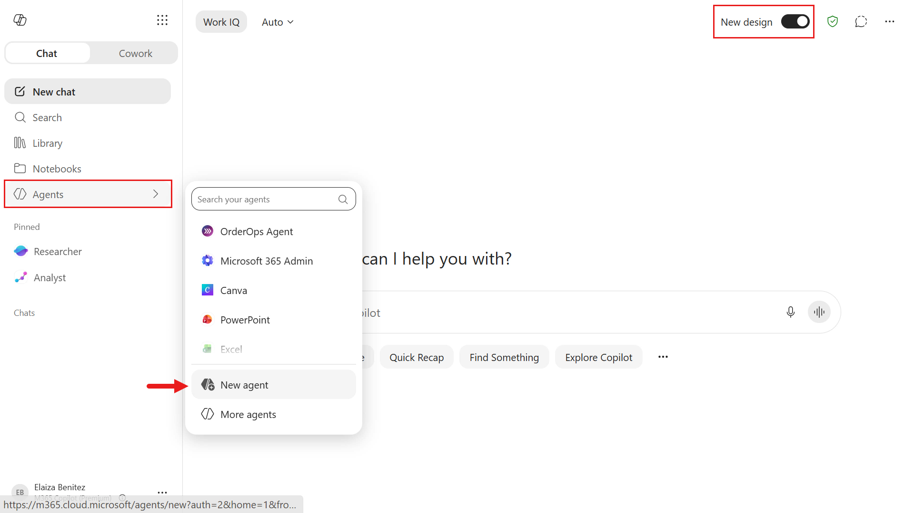

1. In Agent Builder you can create an agent using natural language, as well as select from a list of templates.

    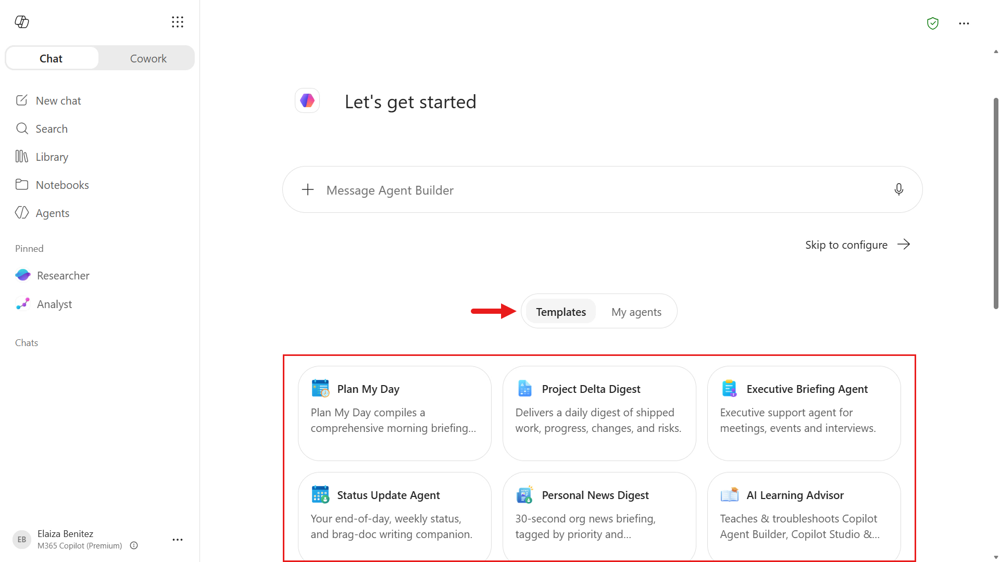

1. In the message box shown below, copy and enter the natural language prompt given here:

    ```text
    You are an IT Help Desk assistant that helps employees resolve common IT issues and find available devices. Be polite, concise, and helpful. Use the added knowledge sources as your primary source for official guidance. Ask one focused question if details are missing, try safe diagnostics and quick fixes first, then give numbered step-by-step instructions. Do not invent steps. If you cannot verify guidance, say so clearly and recommend safe next steps or escalation. Never ask for passwords.
    ```

    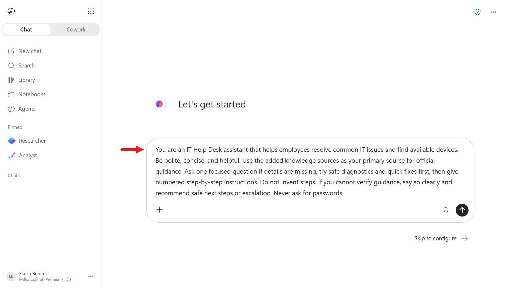

1. Press **Enter** to submit. Agent Builder drafts your agent by generating a name, description, instructions, and suggested prompts. This takes a few moments.

    > [!WARNING] AI-generated content varies
    > The drafted name, description, instructions, and starter prompts can differ each session.

    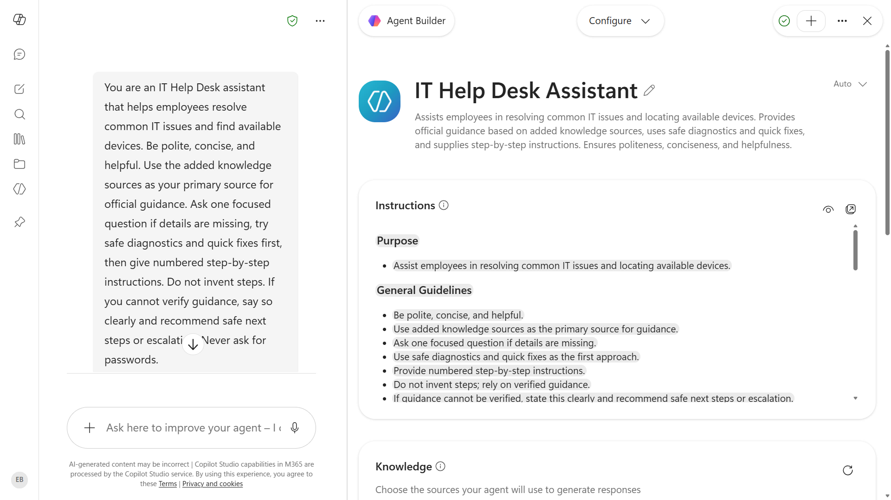

1. The builder switches to the **Configure** view. In the name field shown in the screenshot, replace the suggested name with:

    ```text
    Contoso Helpdesk Agent
    ```

    Review the AI-generated instructions below the name. You'll see the role, tone, and guidance reflected in the generated instructions.

    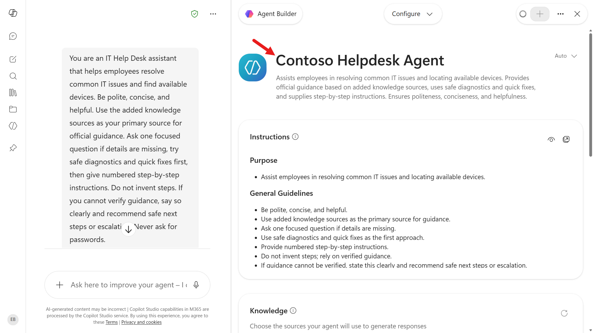

### 2.2 Add knowledge sources

Next, you'll ground your agent with two websites and a SharePoint site

#### 2.2.1 Add websites

1. In the **Knowledge** section, select the **Enter a URL or name or drop files here** box.

   Add the first website knowledge source, then press **Enter**:

    ```text
    https://support.microsoft.com
    ```

    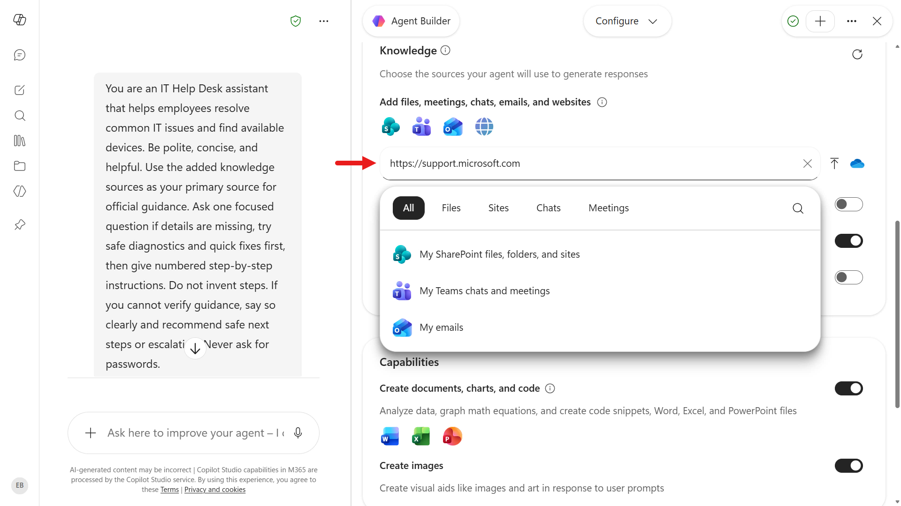

1. Add the second website knowledge source, then press **Enter**:

    ```text
    https://learn.microsoft.com/troubleshoot
    ```

    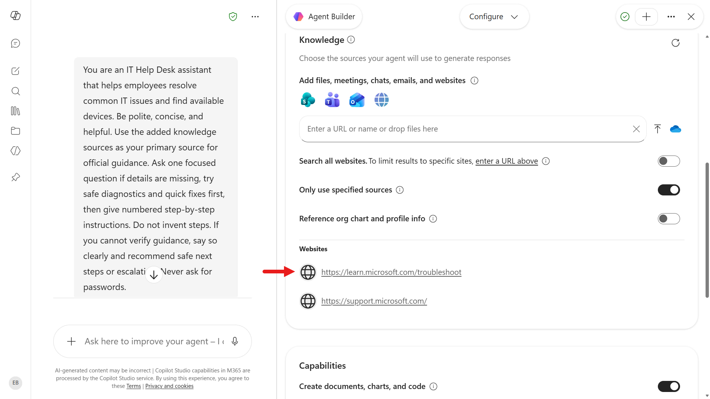

1. In the same **Knowledge** section, if **Only use specified sources** is available and currently off, turn it on so the agent uses only the knowledge sources you added.

#### 2.2.2 Add SharePoint site

1. Next, we'll add the SharePoint site. In the **Knowledge** section, select the **Enter a URL or name or drop files here** box and select the Sites option.

   Select the SharePoint site created in Mission 00 - Course setup.

    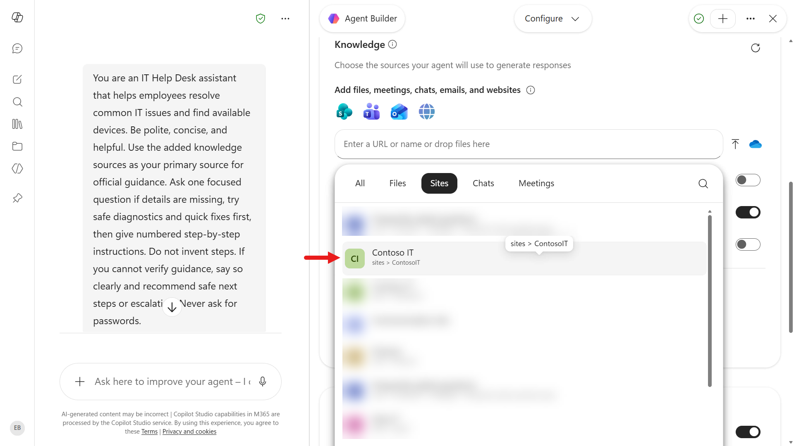

1. When you're done, the **Knowledge** section should show all three knowledge sources.

    - `https://support.microsoft.com`
    - `https://learn.microsoft.com/troubleshoot`
    - Contoso IT SharePoint site

    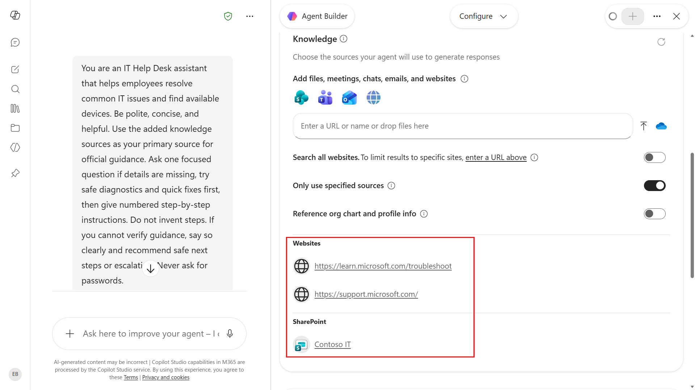

### 2.3 Add Suggested Prompts

1. Lastly, we'll enter several suggested prompts. You can configure up to 10 suggested prompts that users can choose from to start a conversation with your agent in Microsoft 365 Copilot Chat or Microsoft Teams.

    Enter the following suggested prompts.

    **Prompt No. 1**

    Title

    ```text
    Software Installation Help
    ```

    Prompt

    ```text
    I need help installing a new application on my computer.
    ```

    **Prompt No. 2**

    Title

    ```text
    Explain IT Terms
    ```

    Prompt

    ```text
    Can you explain what a VPN is and why I might need one?
    ```

    **Prompt No. 3**

    Title

    ```text
    Resolve Printer Problem
    ```

    Prompt

    ```text
    My printer isn't working. Can you help me fix it?
    ```

    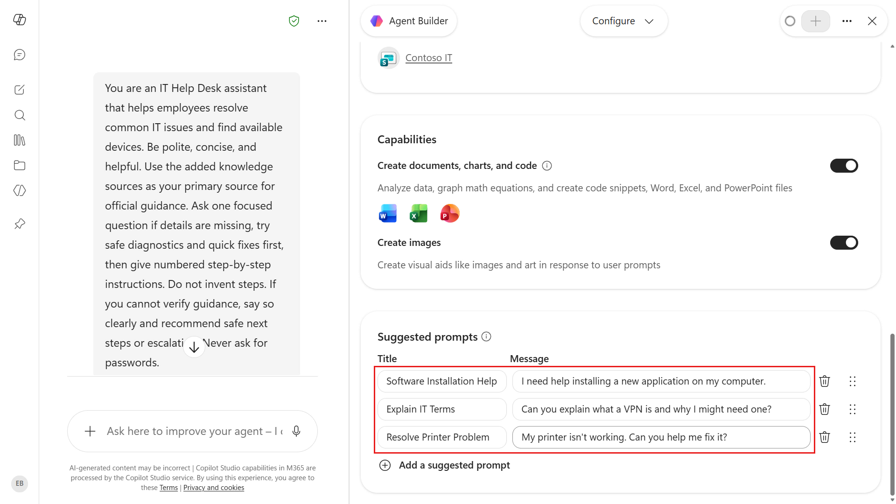

### 2.4 Preview agent

The **Preview** option lets you test and refine your agent while you build it. It becomes available after the agent has a name, description, and instructions, and it behaves like a published agent based on those instructions.

It also includes the suggested starter prompts. Select one to begin a conversation, or choose New chat to reset the chat and see the prompts again.

Let's try a starter prompt.

1. Switch from **Configure** to **Preview**.

    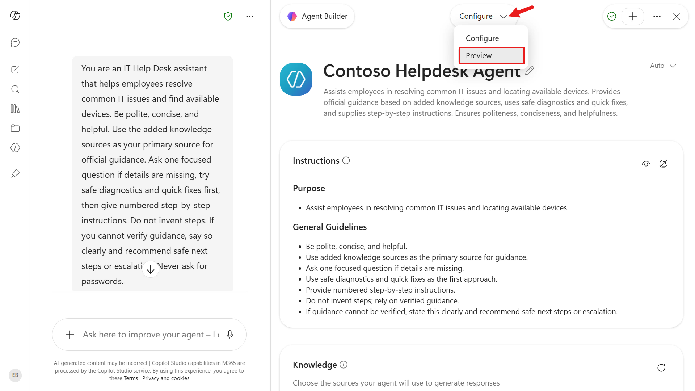

1. Select one of the prompts.

    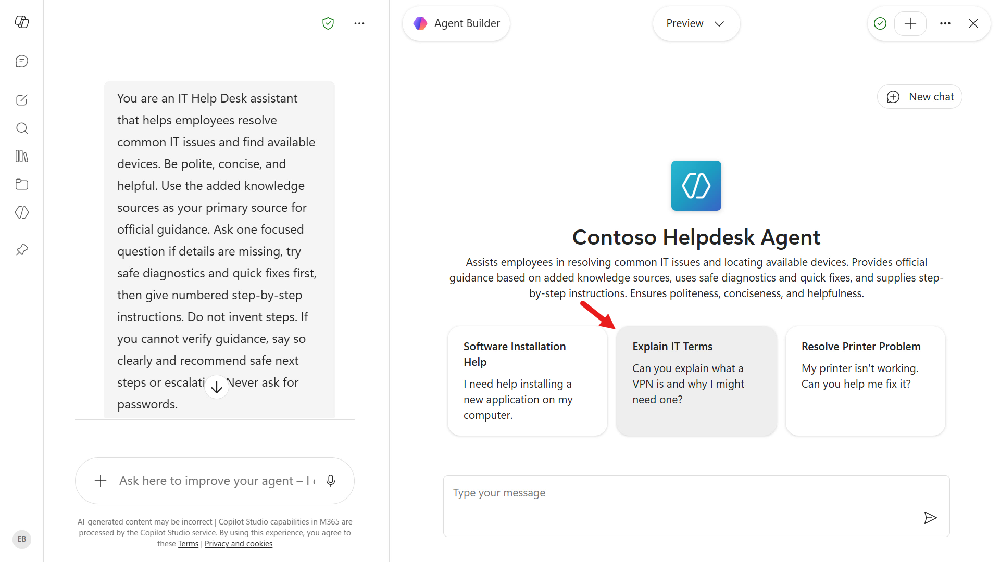

1. The agent responds based on its instructions and grounded knowledge sources, and it shows citations for the information it used.

   Select one of the citations and it will load the web page of the website that it sourced the information from.

    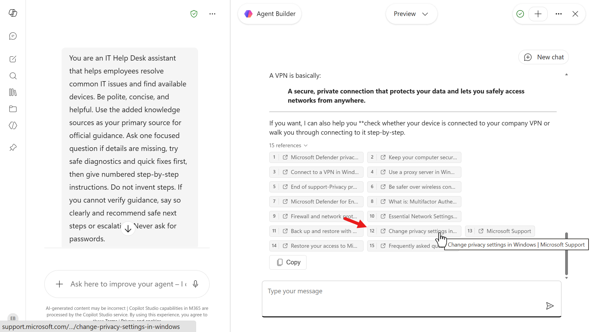

### 2.5 Create and test the agent

1. Select **Create**.

    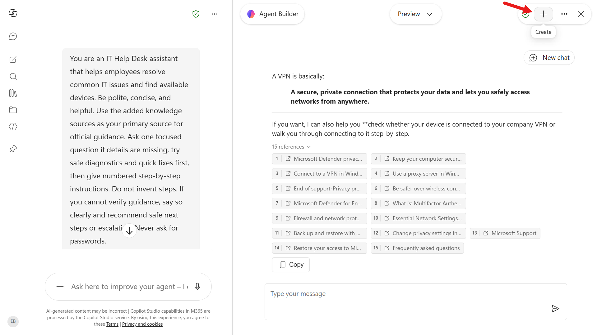

1. Agent Builder saves the agent and confirms it was created. It's **private** to you by default. You can select **Share** to deploy it to teammates, or **Start chat** to start using it.

   Select **Start chat**. Your declarative agent opens in Microsoft 365 Copilot, ready for testing.

    

1. We'll first test the website knowledge source. In the message box, enter:

    ```text
    How can I check the warranty status of my Surface?
    ```

    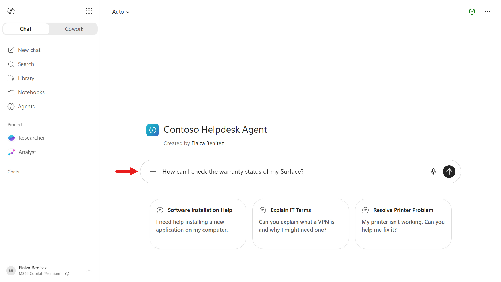

1. The agent responds with numbered, step-by-step instructions grounded in the website knowledge sources you added for official supporting information.

   Review the citation references by selecting source. A sources panel will appear on the right.

    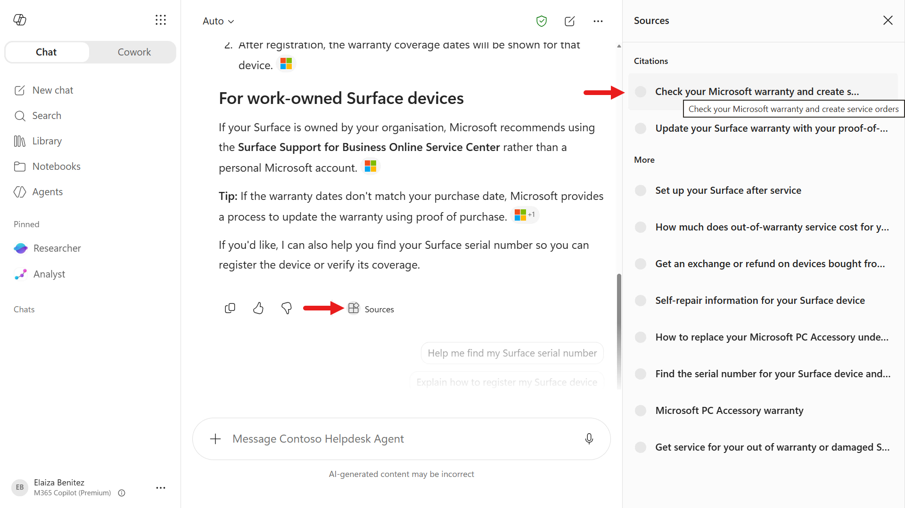

1. Next, enter the following question to validate the SharePoint site knowledge source.

1. In the same chat, enter:

    ```text
    How can I access our company's Contoso VPN from my device?
    ```

    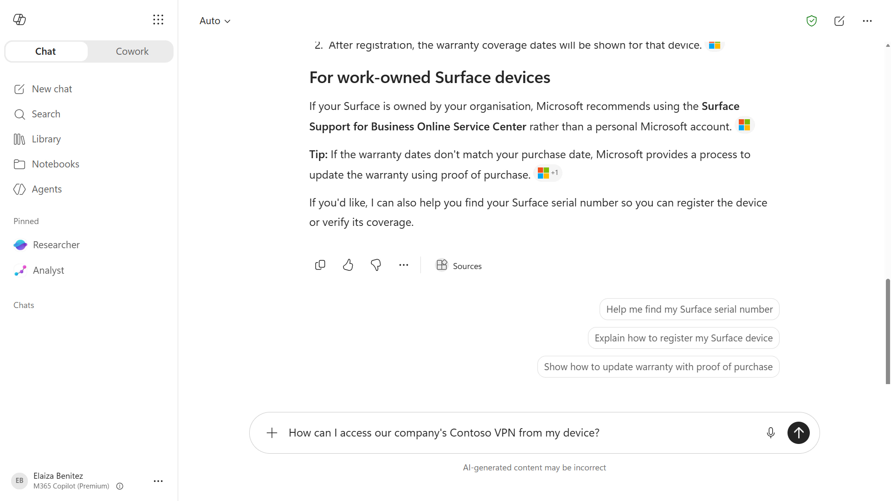

1. The agent once again responds with numbered, step-by-step instructions and this time references the SharePoint site.

    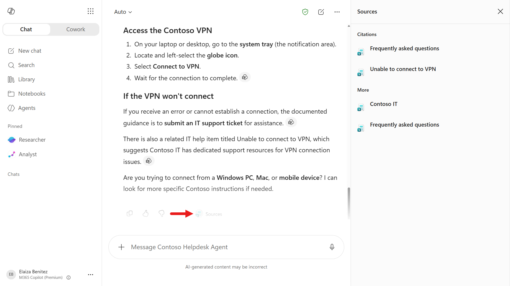

🎉 Congratulations! You built, tested, and deployed a declarative agent entirely inside Microsoft 365 Copilot.

## ✅ Mission Complete {#mission-complete}

You forged a declarative agent that speaks your language, uses trusted knowledge, and runs right inside Copilot. Next up is **Mission 03: Copilot Studio Fundamentals**, where you'll learn the core concepts and interface. Then, in **Mission 04: Creating a Solution for Your Agent**, you'll copy this agent into Copilot Studio and evolve it for your scenario.

⏭️ [Move to the **Copilot Studio Fundamentals** mission](../03-copilot-studio-fundamentals/index.md)

## 📚 Tactical Resources {#tactical-resources}

🔗 [Build agents with Agent Builder](https://learn.microsoft.com/microsoft-365-copilot/extensibility/agent-builder)

🔗 [Declarative agents overview](https://learn.microsoft.com/microsoft-365-copilot/extensibility/overview-declarative-agent)

<analytics-tag section="recruit" mission="02-declarative-agents" />
