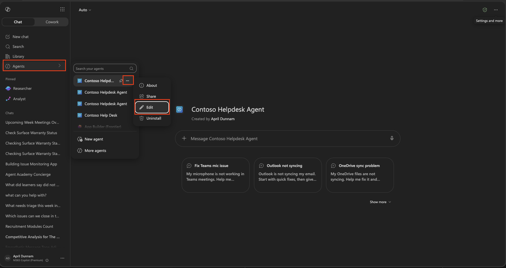
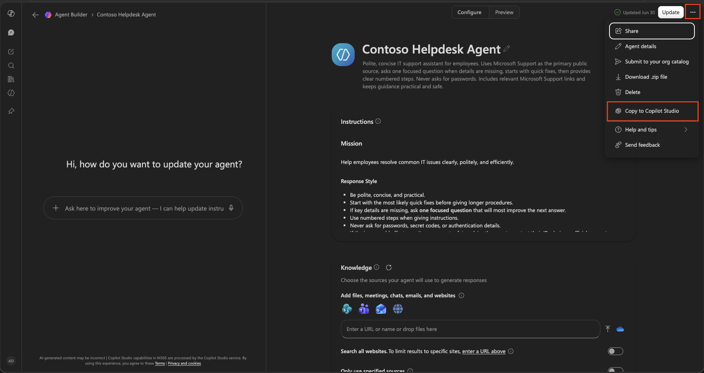
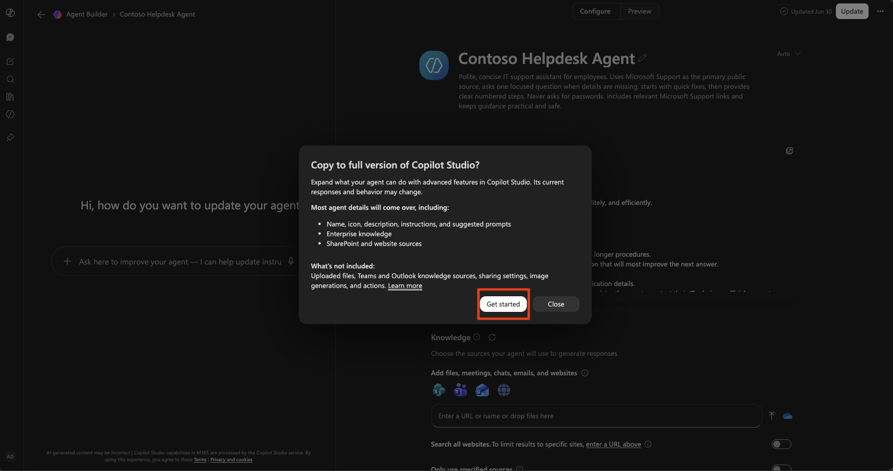
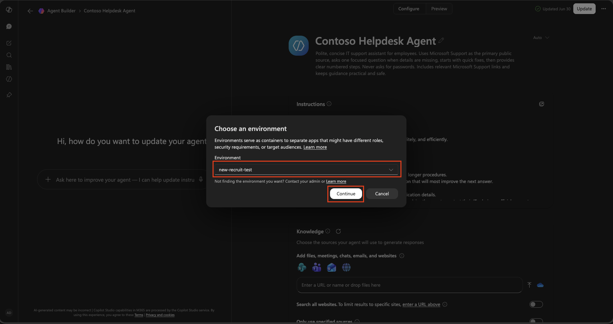
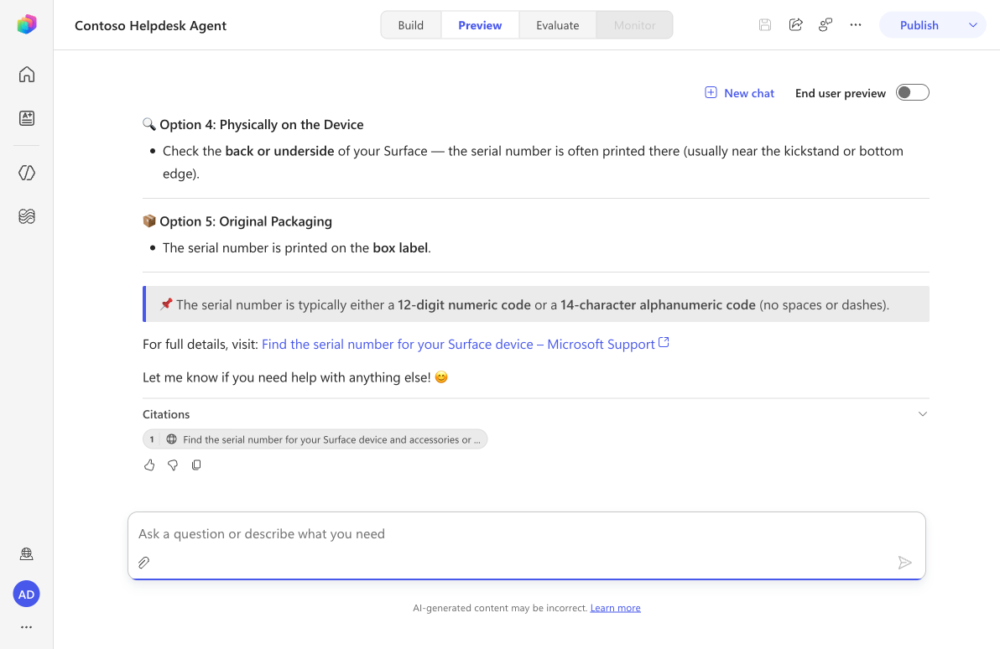
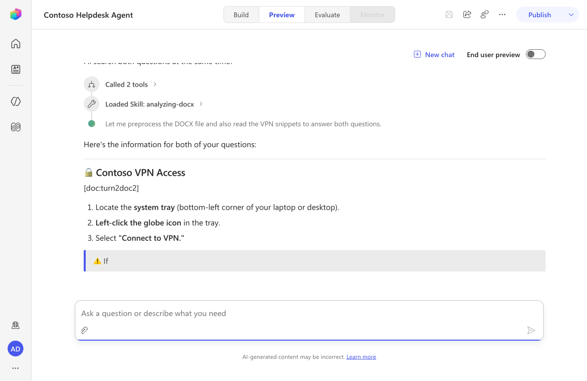
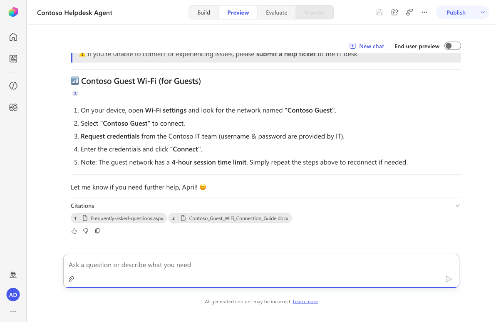
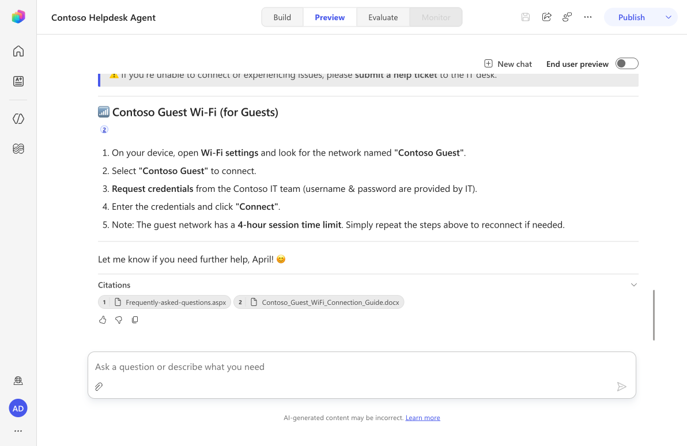

---
prev:
  text: Creating a solution
  link: /recruit-v2-preview/04-creating-a-solution
next:
  text: Add a skill
  link: /recruit-v2-preview/06-add-a-skill
short-description: Transition a declarative agent into a custom engine agent in Copilot Studio
difficulty: 1
codename: OPERATION ENGINE SHIFT
time: 60
tags:
  - custom-engine-agents
  - declarative-agents
  - solutions
products:
  - copilot-studio
  - power-platform
  - sharepoint
industries:
  - it
created-date: 2026-06-28
last-edited-date: 2026-06-28
---

# 🚨 Mission 05: Build a custom engine agent from your declarative agent {#mission-05-build-a-custom-engine-agent-from-your-declarative-agent}

<mission-meta />

> [!NOTE]
> This lab uses the **new Copilot Studio experience**.
> Make sure the **New experience** toggle in the upper-right corner of the Home page is **on** so your screen matches the screenshots in this lesson.

## 🎯 Mission Brief {#mission-brief}

Welcome back, Agent. In this mission, we'll take the declarative agent you built in Agent Builder in Mission 2 and bring it into Copilot Studio to make it a custom agent.

We'll use the out-of-the-box copy to functionality to bring it over and verify what carried over from the original agent, including instructions and knowledge, add it to your solution, and test it.

This gives you a clean transition point so future missions can extend the same agent with more advanced capabilities.

## 🔎 Objectives {#objectives}

In this mission, you'll learn:

1. How to transition an existing declarative agent into Copilot Studio by using **Copy to**
1. How to validate the copied agent's instructions and knowledge sources
1. How to add the copied agent to your dedicated Power Platform solution
1. How to run baseline tests before adding more functionality in upcoming labs

## 🧠 Why this transition matters {#why-this-transition-matters}

Your declarative agent is a great starting point, but custom agents in Copilot Studio give you a broader authoring surface for enterprise scenarios.

By transitioning now, you can:

- Keep your existing investment (agent identity, instructions, and grounding intent)
- Move into a solution-based lifecycle for better ALM practices
- Establish a stable baseline before adding tools, actions, and orchestration patterns in later missions

## 🧪 Lab 05: Transition your declarative agent to a custom engine agent {#lab-05-transition-your-declarative-agent-to-a-custom-engine-agent}

### ✨ Use case {#use-case}

We'll continue using the same IT helpdesk scenario introduced earlier in the course:

**As an** employee

**I want to** get quick and accurate IT support for common issues like device setup, network access, and troubleshooting

**So that I can** stay productive and resolve technical issues faster

### ✅ Prerequisites {#prerequisites}

Before starting this lab, make sure you have:

- The declarative agent from [Lesson 03 - Create a declarative agent for Microsoft 365 Copilot](../03-create-a-declarative-agent-for-M365Copilot/index.md)
- The solution from [Lesson 04 - Creating a solution](../04-creating-a-solution/index.md)
- Access to Copilot Studio with the **new experience** enabled
- Your test knowledge source(s), for example the **Contoso IT** SharePoint site from [Lesson 00 - Course setup](../00-course-setup/index.md#step-4-create-new-sharepoint-site)

### 5.1 Open your existing declarative agent

1. Go to **Microsoft 365 Copilot**, locate the Contoso Help Desk Agent you created in Module 2. Select the **three dots ..** next to it and choose **Edit**

   

1. Confirm the agent still has your expected identity and behavior:

   - Name
   - Description
   - Instructions
   - Knowledge references

1. Run one quick test prompt so you have a baseline response to compare later.

> [!TIP]
> Save one representative response from your declarative agent before you copy it. You will compare this to your custom agent test in step 5.5.

### 5.2 Use **Copy to** to move it into Copilot Studio

1. In your agent, select the **three dots ...** in the upper right hand corner and select **Copy to Copilot Studio**.

   

1. Choose the **Get started** button in the pop up.

   

1. Choose the target environment to move the agent to (the same developer environment used in this course) and click **Continue**.

   

1. Complete the copy flow.

After the operation completes, open the copied agent in Copilot Studio.

### 5.3 Validate what carried over

1. In Copilot Studio, open the copied agent on the **Build** tab.
1. Review the agent details and verify the following carried over correctly:

   - Agent name
   - Agent instructions
   - Knowledge sources and grounding intent

1. Check for any warnings or disconnected resources and resolve them if prompted.
1. Select **Save**.

> [!NOTE]
> The exact carryover experience can vary by tenant capabilities and resource permissions. The goal is to confirm your core setup is intact before moving forward.

### 5.4 Add the copied agent to your solution

1. In Copilot Studio, go to **Solutions**.
1. Open the solution you created in Lesson 04 (for example, **Contoso Helpdesk Agent**).
1. Add the copied custom engine agent to this solution.

   Depending on your environment experience, you may do this from either:

   - **Solutions** by adding an existing component, or
   - The agent's **More options** / settings experience if **Add to solution** is available

1. Confirm the agent now appears in your solution component list.

Why this step matters:

- Keeps your agent in a managed ALM container
- Makes future changes easier to track and deploy
- Ensures upcoming labs build on the same packaged artifact

### 5.5 Test agent

We'll test our four knowledge sources by asking questions to our Contoso Helpdesk Agent.

1. Select the **Preview** tab, then select **New chat** to start a fresh session. Enter the following question to test our public website (external) knowledge source.

   ```text
   How can I find the serial number on my Surface device?
   ```

1. The agent reviews the knowledge sources and responds using the website knowledge source. Notice the **Citations** bar references the Microsoft Support web page it formed its answer from.

   

1. Let's now test both our SharePoint site knowledge source and document knowledge source in a single message. Enter the following question.

   ```text
   How can I access our company's Contoso VPN from my device? How do guests connect to the Contoso Guest wifi?
   ```

1. The agent shows a real-time activity trace (for example, **"Called 2 tools"** and **"Loaded Skill: analyzing-docx"**) as it searches the knowledge sources, then answers both questions in a single message.

   

1. Scroll through the response. The **Contoso VPN Access** section is grounded using the **Contoso IT** SharePoint site, and the **Contoso Guest Wi-Fi** section is grounded using the uploaded document. The **Citations** bar lists both sources separately - **Frequently-asked-questions.aspx** (SharePoint) and **Contoso_Guest_WiFi_Connection_Guide.docx** (document).

   

1. It's always good to verify the generated response is correct. Review the inline `[n]` citation markers and the **Citations** bar to see exactly which source grounded each part of the answer. For web and SharePoint citations, selecting the citation opens the source page so you can confirm the information.

   

The agent can answer multiple questions in a single message, search the knowledge sources, and cite the sources it used in its response. Make sure to always verify the response is correct by reviewing the citations.

### 5.6 Capture your transition checkpoint

Before moving to the next mission, confirm this checklist:

- Declarative agent successfully copied to Copilot Studio
- Instructions and knowledge verified
- Agent added to your solution
- Baseline preview tests completed

You now have a working custom engine agent baseline ready for extension.

## ✅ Mission Complete {#mission-complete}

Excellent work. You completed the transition from declarative agent to custom engine agent and prepared it for lifecycle management in a Power Platform solution.

This is your foundation for the next missions, where you will extend the same agent with additional functionality.

⏭️ [Move to **Add a skill** lesson](../06-add-a-skill/index.md)

## 📚 Tactical Resources {#tactical-resources}

🔗 [Create and delete agents](https://learn.microsoft.com/microsoft-copilot-studio/authoring-first-bot?WT.mc_id=power-172617-ebenitez)

🔗 [Power Platform solutions overview](https://learn.microsoft.com/power-platform/alm/solution-concepts-alm)

🔗 [Key concepts - Authoring agents](https://learn.microsoft.com/microsoft-copilot-studio/authoring-fundamentals/?WT.mc_id=power-172617-ebenitez)

<analytics-tag section="recruit" mission="05-custom-agent" />
