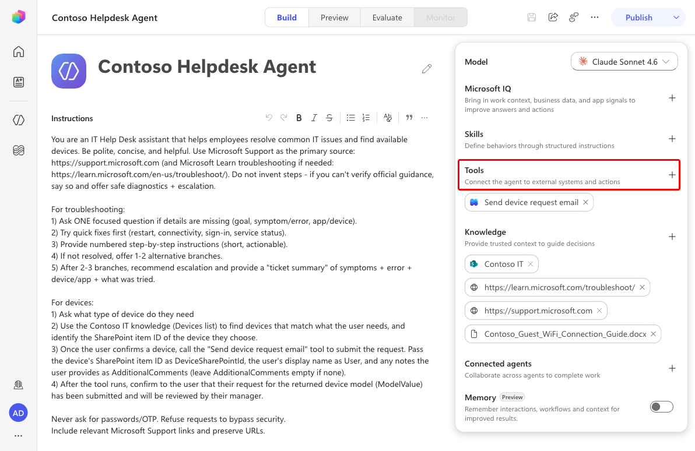
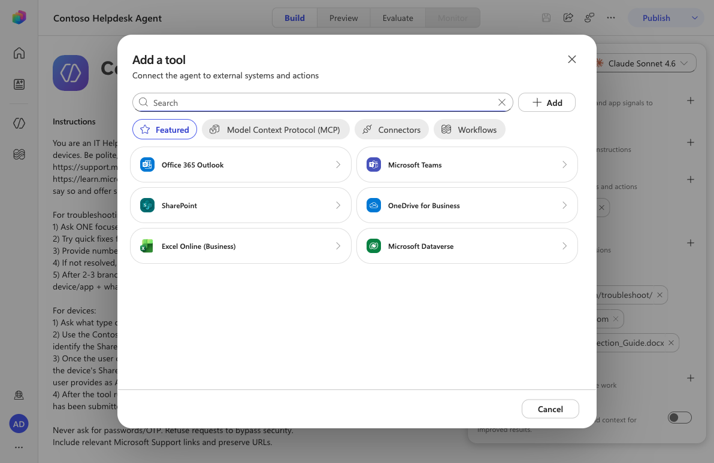
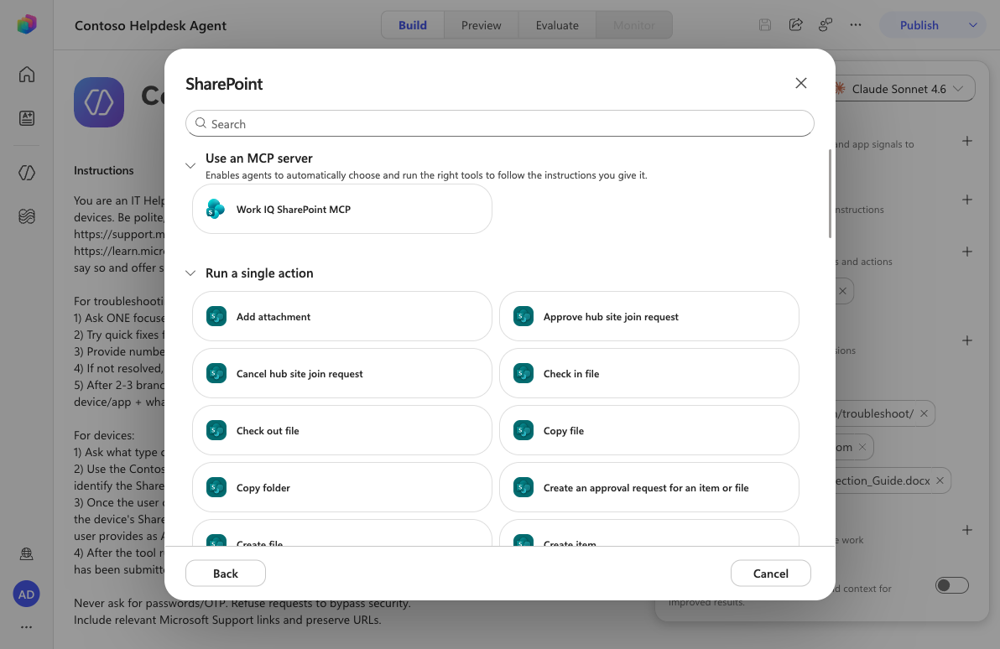
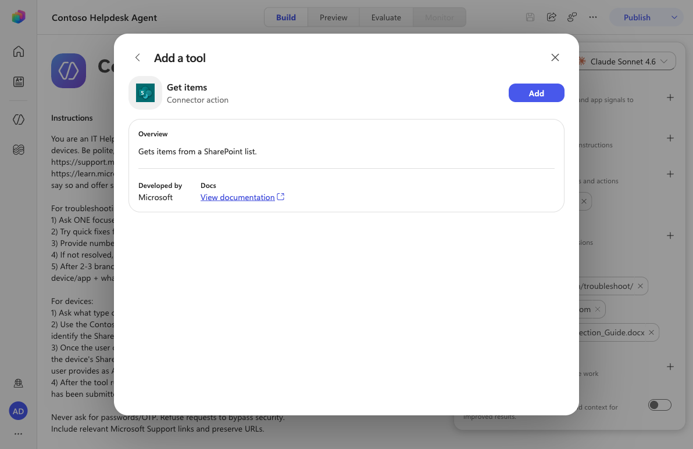
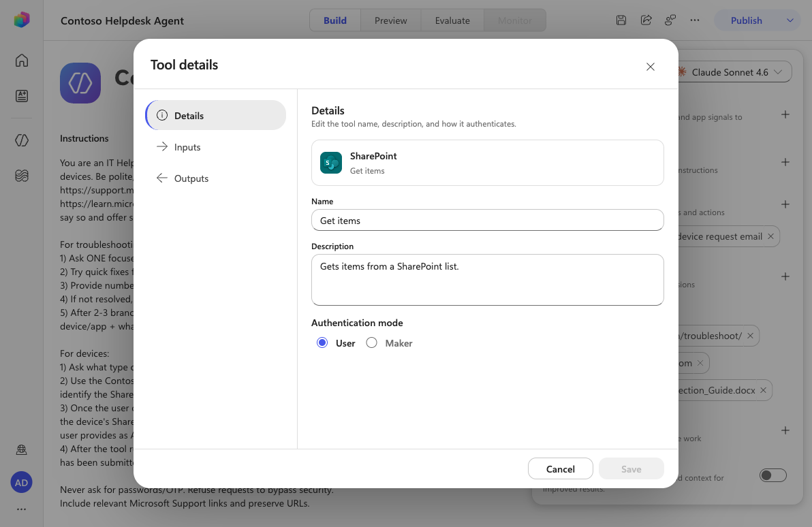
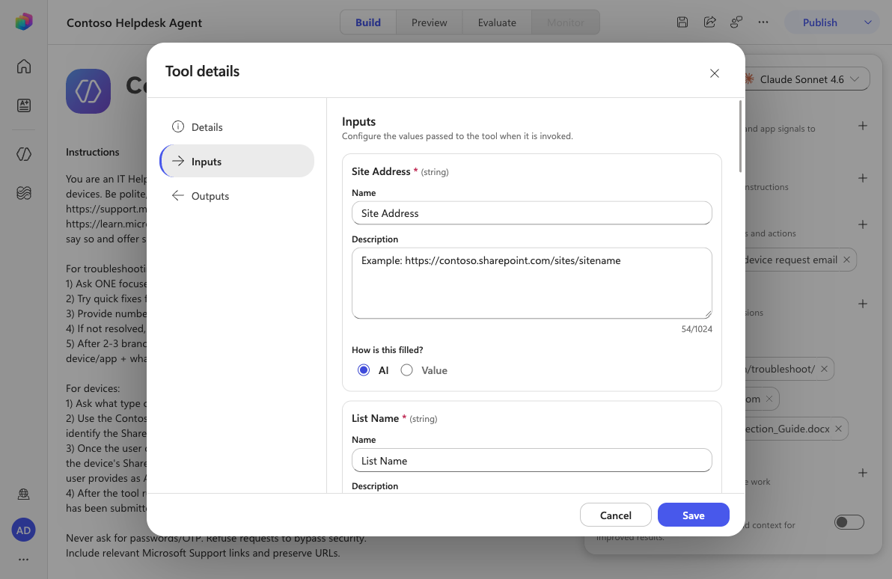
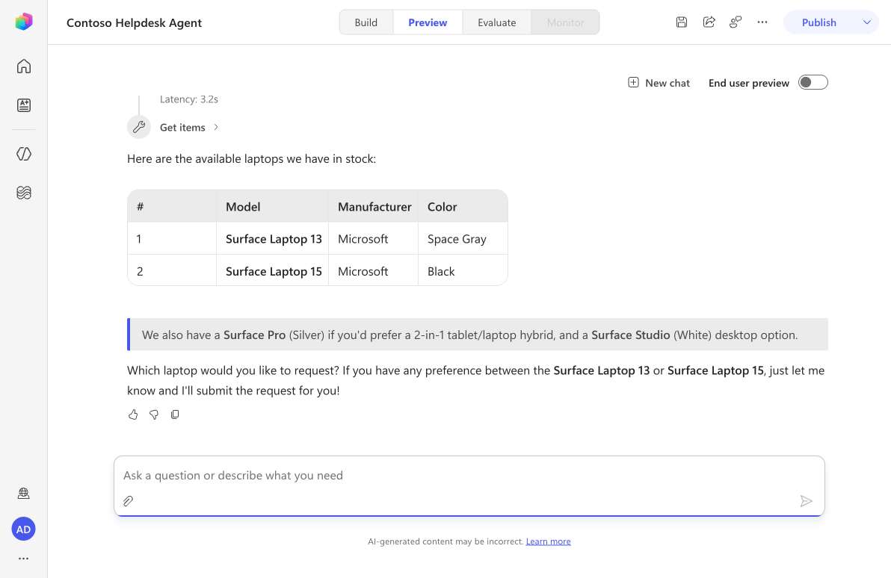

---
prev:
  text: 'Add a Skill'
  link: '/recruit-v2-preview/06-add-a-skill'
next:
  text: 'Automate with Workflows'
  link: '/recruit-v2-preview/08-automate-with-workflows'
short-description: Add a SharePoint Get items tool so your agent can take action on real data
difficulty: 1
codename: OPERATION TOOL UP
time: 30
tags:
  - tools
  - connectors
products:
  - copilot-studio
  - power-platform
industries:
  - it
created-date: 2025-08-20
last-edited-date: 2026-06-28

---

# 🚨 Mission 07: Add a Tool {#mission-07-add-a-tool}

<mission-meta />

> [!NOTE]
> This lab has been updated for the new Copilot Studio experience (2026-06-28).
> See `evaluation.md` for a full comparison with the original Topics-based lab.

## 🎯 Mission Brief {#mission-brief}

You’ve built an agent. It listens, learns, and answers questions, but now it’s time to get tactical and let it **take action**. In this mission you’ll connect your agent to a real data source so it can fetch live information and do something useful with it.

In the new Copilot Studio experience, that capability comes from **tools**. You’ll add a **SharePoint - Get items** tool so your IT Helpdesk Agent can pull available devices straight from a SharePoint list.

> [!IMPORTANT]
> If your Copilot Studio screen looks different from these screenshots, make sure the **New experience** toggle in the upper-right corner is turned **on**.

## 🔎 Objectives {#objectives}

In this mission, you’ll learn:

1. Why **Topics** are gone in the new experience and what replaced them
1. What **tools** are and how an agent decides when to use them
1. How to add the **SharePoint - Get items** connector action as a tool
1. How to set a tool’s name, usage description, and inputs
1. How to test that your agent calls the tool

## 🪦 Wait - where did Topics go? {#where-did-topics-go}

If you’ve used Copilot Studio before, you’ll remember **Topics**: hand-built conversation flows made of trigger phrases and connected **nodes** (send a message, ask a question, add a condition, call a tool, and so on). You routed conversations manually and stitched logic together node by node.

The new experience removes the **Topics** tab entirely. Instead of you wiring conversations by hand, the agent’s **large language model orchestrates** the conversation for you. You give the agent:

- **Instructions** - plain-language guidance on how to behave, and
- **Tools, Knowledge, and Skills** - the capabilities it can draw on.

The model reads your instructions, understands the user’s intent, and decides which tool to call and when. No trigger phrases, no node graphs. This is simpler, faster to build, and far more flexible - which is exactly why we’re focusing on **tools** in this mission.

## 🔧 What are tools {#what-are-tools}

Tools gives your agent the ability to do something beyond chatting like call an API or MCP Server, run a process, or read and write business data. Think of tools as "action blocks" that give your agent superpowers.

Tools can come from several places:

- **Connectors** - 1,500+ prebuilt actions for services like SharePoint, Outlook, Teams, Dataverse, and more.
- **Model Context Protocol (MCP)** - connect to MCP servers that expose tools.
- **Workflows** - call automated flows you’ve built.

When a user asks something, the model matches the request to a tool’s **description**, fills in the tool’s **inputs**, runs it, and uses the result in its reply. A clear description is what helps the model pick the right tool - so we’ll write a good one.

In this lab we’ll use the **SharePoint - Get items** connector action so the agent can read a list of devices.

## 🧪 Lab 07 - Add the SharePoint Get items tool {#lab-07-add-the-sharepoint-get-items-tool}

### ✨ Use case {#use-case}

**As an** employee

**I want to** know what devices are available

**So that I** have a list of available devices

### Prerequisites

1. **SharePoint list** - the **Devices** list from [Lesson 00 - Course Setup](../00-course-setup/index.md#step-4-create-new-sharepoint-site).
1. **Contoso Helpdesk Agent** - the agent created in the earlier missions.

Let's begin!

### 7.1 Open the agent and find Tools

1. From **Agents**, open the **Contoso Helpdesk Agent**. The **Build** view shows the agent **Instructions** on the left and a configuration panel on the right with **Tools**, **Knowledge**, **Skills**, and more. There is no Topics tab. In the **Tools** section, select **Add tool**.

   

### 7.2 Add the SharePoint connector

1. The **Add a tool** dialog opens with **Featured**, **MCP**, **Connectors**, and **Workflows** tabs. Select the **SharePoint** connector.

   

1. Under **Run a single action**, find and select **Get items**. (You can also type `Get items` into the search box.)

   

1. Review the action overview, then select **Add**.

   

### 7.3 Configure the tool

1. The tool now appears in the **Tools** list. Select **Get items** to open **Tool details**. On the **Details** tab, give the tool a clear usage description so the model knows when to use it. Copy and paste the following as the **Description**.

   ```text
   Retrieves available devices from the Devices SharePoint list. Use this to find devices that are available, including laptops, desktops, smartphones and accessories.
   ```

   Leave **Authentication mode** set to **User**.

   

1. Select the **Inputs** tab. Each input (**Site Address**, **List Name**, **Filter Query**, …) can be filled by **AI** or pinned to a fixed **Value**. Leaving them as **AI** lets the agent populate them from the conversation and your instructions. Select **Save**.

   

### 7.4 Test your agent

1. Select the **Preview** tab. Enter the following message:

   ```text
   I need a laptop
   ```

   The agent orchestrates on its own: it reads your instructions, picks the **Get items** tool, fills the inputs, and calls SharePoint - all without a single trigger phrase or node.

   

   > [!TIP]
   > If a tool call returns a validation error, the model may have guessed a column or filter that doesn’t exist. Pin **Site Address**, **List Name**, or **Filter Query** to a fixed **Value** on the Inputs tab to keep the call exact.

## ✅ Mission Complete {#mission-complete}

Congratulations! 👏🏻 You learned that **Topics are gone** in the new experience and the model now orchestrates the conversation. You added a **SharePoint - Get items** tool, gave it a usage description, configured its inputs, and tested that the agent calls it. 🙌🏻

⏭️ [Move to **Automate with Workflows**](../08-automate-with-workflows/index.md)

## 📚 Tactical Resources {#tactical-resources}

🔗 [Add tools to agents](https://learn.microsoft.com/microsoft-copilot-studio/agent-extend-action-existing-connectors?WT.mc_id=power-172618-ebenitez)

🔗 [SharePoint connector reference](https://learn.microsoft.com/connectors/sharepointonline/#get-items)

🔗 [Write effective agent instructions](https://learn.microsoft.com/microsoft-copilot-studio/authoring-instructions?WT.mc_id=power-172618-ebenitez)

<analytics-tag section="recruit-v2-preview" mission="07-add-tools" />
