---
prev:
  text: Add Tools
  link: /recruit-v2-preview/07-add-tools
next:
  text: Publish your agent
  link: /recruit-v2-preview/09-publish-your-agent
short-description: Automate a device request and build an autonomous ticket workflow with the new Workflows experience
difficulty: 1
codename: OPERATION AUTOMATION POWERHOUSE
time: 60
tags:
  - automation
  - triggers
products: [copilot-studio, power-automate, outlook, sharepoint]
industries:
  - it
created-date: 2026-06-28
last-edited-date: 2026-06-28

---

# 🚨 Mission 09: Automate with Workflows {#mission-09-automate-with-workflows}

<mission-meta />

> [!NOTE]
> This lab has been rewritten for the **new Copilot Studio experience** (2026-06-28).
> In the new experience, **topics no longer exist** — automations are built in the new
> **Workflows** experience as standalone, reusable workflows that your agent calls as a tool.
> Make sure the **New experience** toggle in the upper-right corner is **on**.

## 🎯 Mission Brief {#mission-brief}

Your agent can converse with users and provide information, but true operational excellence requires it to take action. This mission transforms your conversational agent into an automation powerhouse by equipping it with a **workflow**.

By mission's end, you'll have built an end-to-end device request automation in the new **Workflows** experience that retrieves data from SharePoint, sends a notification email to a manager, and returns a value to your agent — then connected that workflow to your **Contoso Helpdesk Agent** as a tool.

You'll then go a step further and build an **autonomous workflow** — one that isn't called by an agent at all, but **triggers itself** the moment a new support ticket is created in SharePoint and automatically emails an acknowledgment to the person who submitted it.

## 🔎 Objectives {#objectives}

In this mission, you'll learn:

1. What the new **Workflows** experience is and how it differs from the classic agent flows you built inside topics
1. How the **workflow designer**, **node palette**, and **triggers** work together
1. How to use connector actions, dynamic content, and expressions to handle data dynamically
1. How to build a complete device request automation and call it from an agent as a tool
1. How to build an **autonomous, event-triggered workflow** that runs by itself when a SharePoint item is created — no agent and no user required

## 🤔 What is the new Workflows experience? {#what-is-the-new-workflows-experience}

In the classic experience, automations called **agent flows** were created _inside a topic_ — you added a node to a conversation tree and the flow was tied to that topic. **In the new experience, topics are gone.**

Instead, automations are first-class objects called **workflows**. A workflow is a standalone, reusable, step-by-step automation that lives in its own **Workflows** hub. You build it once on a visual canvas, publish it, and then any agent in your environment can call it as a **tool**.

Think of it this way:

- **Agents** are the smart decision-makers — they understand the user and decide _what_ to do.
- **Workflows** are the reliable executors — they do the same deterministic steps _every_ time.

Unlike the AI-driven agent, a workflow follows the **same path every time** for the same input, which makes it **reliable**, **predictable**, and **rule-based** — exactly what you want for actions like "look up a device and email a manager."

### Why build automations as workflows?

- **Reusable** — build once, attach to many agents. No more copy-pasting flows between topics.
- **Connected** — reach 1,400+ connectors (SharePoint, Outlook, ServiceNow, Salesforce…) or your own custom connector.
- **Tightly integrated** — an agent triggers the workflow as a tool during a conversation and reads its outputs back.
- **All-in-one** — design, test, publish, and monitor workflows in one place inside Copilot Studio. No separate Power Automate license is required, since billing is based on usage inside Copilot Studio.

### 🙋🏽 How is this different to Power Automate cloud flows? {#how-is-this-different-to-power-automate-cloud-flows}

| Use this                       | When you want to                                             |
| :----------------------------- | :----------------------------------------------------------- |
| **Workflows** (Copilot Studio) | Automate tasks an agent invokes during a conversation, use AI actions, and keep everything in Copilot Studio |
| **Power Automate cloud flows** | Automate across apps and services independently of an agent, and share/co-own across teams (requires a Power Automate license) |

## ⚙️ How workflows work {#how-workflows-work}

Every workflow has two ingredients:

1. **A trigger** — the event that starts the workflow. The new designer offers several trigger types:

   | Trigger type                         | Starts the workflow when…                                    |
   | :----------------------------------- | :----------------------------------------------------------- |
   | **Manual**                           | You run it on demand with a button click                     |
   | **Recurrence**                       | A schedule fires                                             |
   | **Connector**                        | An external service raises an event                          |
   | **When a HTTP request is received**  | An HTTP request arrives                                      |
   | **When an agent calls the workflow** | An agent invokes it as a tool — **this is the one we'll use** |

1. **Actions (nodes)** — the steps the workflow runs after the trigger. You add them from the **node palette** on the left of the canvas:

   | Node             | What it does                                                 |
   | :--------------- | :----------------------------------------------------------- |
   | **Agent**        | Hand work to an agent                                        |
   | **Classify**     | Categorize input with AI                                     |
   | **M365 Copilot** | Call Microsoft 365 Copilot                                   |
   | **Human review** | Add an approval / review step                                |
   | **Connector**    | Run an action from any of 1,400+ connectors (e.g., SharePoint, Outlook) |
   | **Function**     | Transform data with an expression                            |
   | **Variable**     | Store and reuse values                                       |
   | **If/Else**      | Branch on a condition                                        |
   | **Loop**         | Repeat over a collection                                     |
   | **Note**         | Document your workflow                                       |

### 🎨 The workflow designer

The designer is a **visual canvas**. You can zoom, fit-to-view, switch between horizontal/vertical layout, and tidy up nodes. A **Health Center** continuously checks for errors — you must resolve them before you can publish or test. Every save creates a **version** you can restore from **Version history**.

## 🔤 Expressions and functions {#expressions-and-functions}

Many parameters can be set to a static value, to **dynamic content** (an output from the trigger or an earlier action, inserted with the **lightning bolt ⚡** icon), or to an **expression / function** (inserted with the **fx** icon).

Expressions are small formulas that work with your data — much like Excel functions, but referencing workflow data instead of cells. Common ones:

- `concat()` — join text, e.g. `concat('Hello ', firstName)`
- `if()` — `if(condition, valueIfTrue, valueIfFalse)`
- `empty()` — checks whether a value is empty
- `coalesce()` — returns the first non-empty value
- `length()` — counts characters or items

For the full list, see the [functions reference guide](https://learn.microsoft.com/azure/logic-apps/workflow-definition-language-functions-reference?WT.mc_id=power-172621-ebenitez).

## ⭐ Best practices {#best-practices}

1. **Start simple and build gradually** — get a basic action working, then add steps.
1. **Rename your nodes** — e.g. rename the SharePoint _Get item_ action to _Get Device_ so the canvas is self-documenting.
1. **Fix errors before publishing** — use the **Health Center**; you can't publish with unresolved errors.
1. **Test thoroughly** — saving and publishing doesn't guarantee correct behavior.
1. **Use version history** — save often so you can roll back.
1. **Use dynamic content and expressions** — make parameters dynamic instead of hard-coding values.

## 🧪 Lab 09 - Build a device request workflow and call it from your agent {#lab-09-build-a-device-request-workflow-and-call-it-from-your-agent}

### ✨ Use case {#use-case}

**As a** manager of an employee

**I want to** receive device requests by email

**So that I** can review the device requested by the employee.

### Prerequisites

1. **SharePoint list** — the **Devices** SharePoint list from [Lesson 00 - Course Setup](../00-course-setup/index.md#step-4-create-new-sharepoint-site). If you haven't set it up, head back and create it.

1. **Contoso Helpdesk Agent** — the agent created in [Lesson 06](../06-create-agent-from-conversation/index.md).

1. The **New experience** toggle (upper-right) is turned **on**.

### 9.1 Create a new workflow

In this exercise, we'll build a workflow that retrieves the SharePoint item of the selected device, emails a manager with the details, and returns a value to the agent.

1. From the Copilot Studio **Home** page, select the **Workflow** card under _"what do you want to build?"_.

   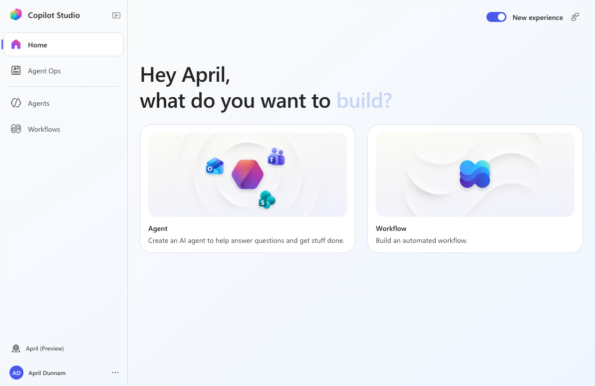

   > [!TIP]
   > You can also select **Workflows** in the left navigation and choose **New Workflow**. The Workflows hub lists every workflow in your environment along with its status (Draft / Published).
   >
   > 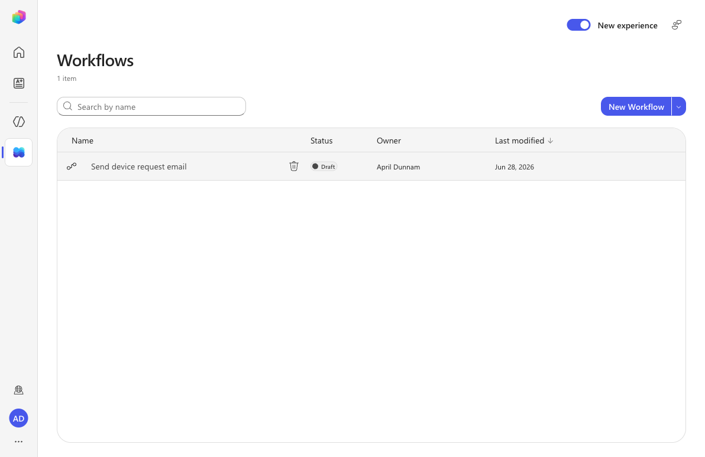

1. The **workflow designer** opens with an empty canvas, a **Start** trigger, and the **node palette** on the left.

   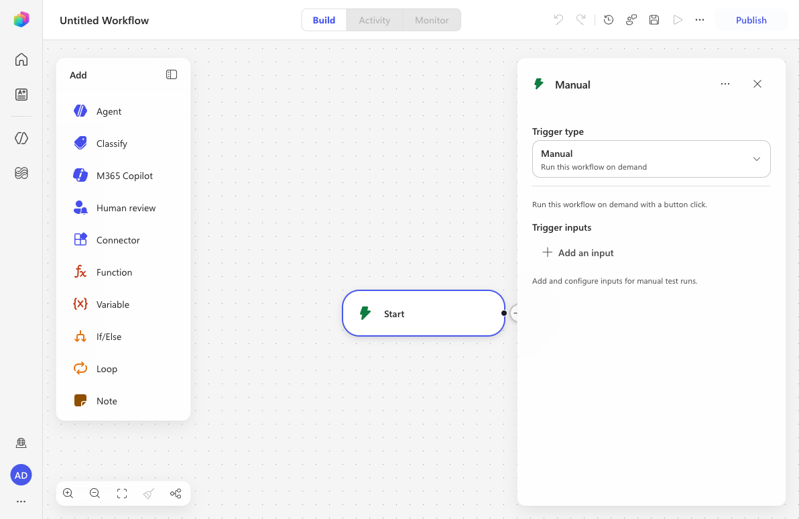

### 9.2 Configure the trigger and inputs

1. Select the **Start** trigger node. In the configuration panel, open the **Trigger type** dropdown and select **When an agent calls the workflow** (_Trigger as a tool from an agent_).

   The trigger is renamed to **When an agent calls the flow** and a **Respond to the agent** action is added automatically.

1. We'll now add three inputs the agent will pass to the workflow:

   - `DeviceSharePointId` — the **ID** of the selected SharePoint device item.
   - `User` — the display name of the user making the request.
   - `AdditionalComments` — an optional comment from the user.

   Under **Inputs**, select **Add an input**, then choose **Text** as the input type.

1. For the first input, set the label to the following.

   ```text
   DeviceSharePointId
   ```

1. Select **Add an input** again, choose **Text**, and set the label to the following.

   ```text
   User
   ```

1. Select **Add an input** a third time, choose **Text**, and set the label to the following.

   ```text
   AdditionalComments
   ```

1. We'll make the comment optional. Select the **More options (⋯)** icon on the **AdditionalComments** input and select **Make optional**.

   Your trigger should now have three inputs, with **AdditionalComments** optional.

   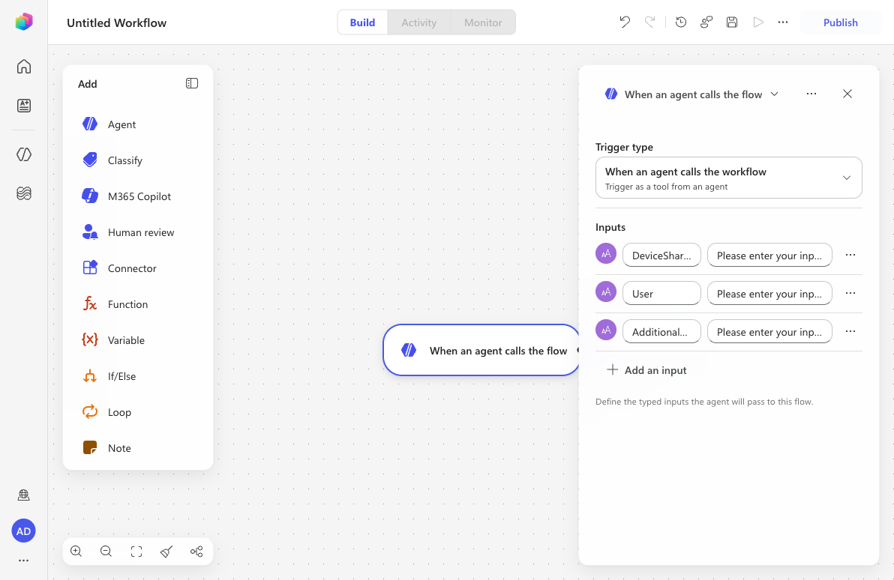

### 9.3 Add the SharePoint Get item action

1. In the **node palette** on the left, select **Connector**. A **Connector** action node is inserted after the trigger and the **Select a connector** dialog opens.

1. In the connector list (or the search box), select **SharePoint**.

1. From the SharePoint actions, select **Get item**.

1. The **Get item** configuration panel opens. At the top of the panel, select the node name (**Get item**) under **Node name** and rename the action to the following.

   ```text
   Get Device
   ```

1. Configure the parameters:

   - **Site Address** — select the **Contoso IT** SharePoint site created in [Lesson 00](../00-course-setup/index.md#step-4-create-new-sharepoint-site).
   - **List Name** — select the **Devices** list.
   - **Id** — select the **lightning bolt ⚡** icon, then in the **Dynamic content** tab choose the **DeviceSharePointId** input from the trigger and select **Add**.

   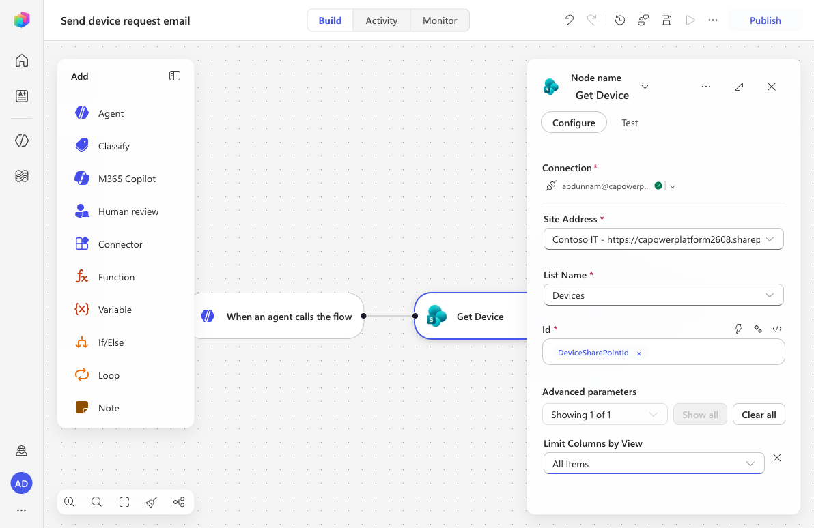

1. Select **Advanced parameters → Show all**, find **Limit Columns by View**, and select the **All Items** view to limit the columns returned.

### 9.4 Add the Send an email action

1. Select **+ Add a step** after the _Get Device_ node. In the **Add an action** dialog, search for `Office 365 Outlook`, select it, then select the **Send an email** action.

   If prompted, the connection is created automatically using your account (the connector shows **Connected** after a moment).

1. At the top of the panel, select the node name under **Node name** and rename the action to the following.

   ```text
   Send an email to manager
   ```

1. Configure the parameters:

   - **To** — select yourself (in production this would be the employee's manager).

   - **Subject** — enter the following.

     ```text
     Request type: new device
     ```

1. Now build the **Body**. The body is a **rich-text editor**: type the static text, then use the body toolbar's **Insert token** button to drop in dynamic values at the cursor. Type the following text, pressing **Enter** for each new line.

   ```text
   Hi,
   
   A new device has been requested by
   
   Manufacturer:
   Model:
   Link to item in SharePoint:
   Additional comments from:
   
   This is an automated email from Contoso Helpdesk Agent
   ```

1. Place the cursor after `by` on the _A new device has been requested by_ line, select **Insert token**, and on the **Insert dynamic content** tab select the **User** input from the trigger.

1. Place the cursor after `Manufacturer:`, select **Insert token**, and in the **Get Device** group find **Manufacturer**. **Manufacturer** is a SharePoint lookup column, so it has a child **Value** property directly beneath it (it previews the manufacturer name, e.g. _Microsoft_). Select the **Value** property — **not** the parent **Manufacturer** entry.

   > [!IMPORTANT]
   > If you select the parent **Manufacturer** token, the email shows the raw lookup object (e.g. `{"@odata.type":"#…SPListExpandedReference","Id":3,"Value":"Microsoft"}`) instead of just `Microsoft`. Always pick the **Value** child for lookup/choice columns.

1. Place the cursor after `Model:`, select **Insert token**, search `model`, and select the **Model** value from the **Get Device** action.

1. Place the cursor after `Link to item in SharePoint:`, select **Insert token**, search `link`, and select the **Link to item** output from the **Get Device** action.

1. Place the cursor after `Additional comments from:`, select **Insert token**, and insert the **User** input from the trigger. Then, after the user token, insert the **AdditionalComments** input from the trigger.

   > [!NOTE]
   > The classic lab used the expression `if(empty(triggerBody()?['AdditionalComments']), 'None', triggerBody()?['AdditionalComments'])` to show `None` when no comment was supplied. **Expression mode is not available for rich-text fields** in the new experience, so the **AdditionalComments** token is inserted directly. The field is optional, so when no comment is provided the line simply renders empty.

1. **Make the link clickable and format the email as HTML.** The "Send an email" action sends an **HTML** body, and the rich-text editor lets you edit that HTML directly. On the body toolbar, select **More formatting options (⋯)**, then select **Edit HTML source**. You'll see your body as HTML, with each dynamic value shown as an `@{…}` expression — for example the link line looks like:

   ```html
   <div>Link to item in SharePoint:&nbsp;@{outputs('connector-xxxxxxxx')?['body/{Link}']}</div>
   ```

   Wrap the link's `@{…}` expression in an anchor tag, and (optionally) bold the labels with `<strong>`. Edit the source so it reads like the following — **keep your own `@{…}` expressions exactly as generated** (the `connector-xxxxxxxx` id is unique to your flow):

   ```html
   <div>Hi,</div>
   <div><br></div>
   <div>A new device has been requested by @{…User…}.</div>
   <div><br></div>
   <div><strong>Manufacturer:</strong> @{…Manufacturer/Value…}</div>
   <div><strong>Model:</strong> @{…Model…}</div>
   <div><strong>SharePoint item:</strong> <a href="@{…Link to item…}">Open the device record in SharePoint</a></div>
   <div><strong>Additional comments from @{…User…}:</strong> @{…AdditionalComments…}</div>
   <div><br></div>
   <div>This is an automated email from Contoso Helpdesk Agent.</div>
   ```

1. On the body toolbar, select **Visual editor** to switch back. The link now appears as a hyperlink (**Open the device record in SharePoint**) and the labels are bold. The dynamic values remain bound to your tokens.

   > [!NOTE]
   > The classic lab built the hyperlink by typing raw `<a href="…">` tags. In the new experience you use **More formatting options → Edit HTML source** instead. Wrapping the **Link to item** expression in `<a href="…">` makes it a real clickable link in the email; without it, the message shows only the plain URL text.

   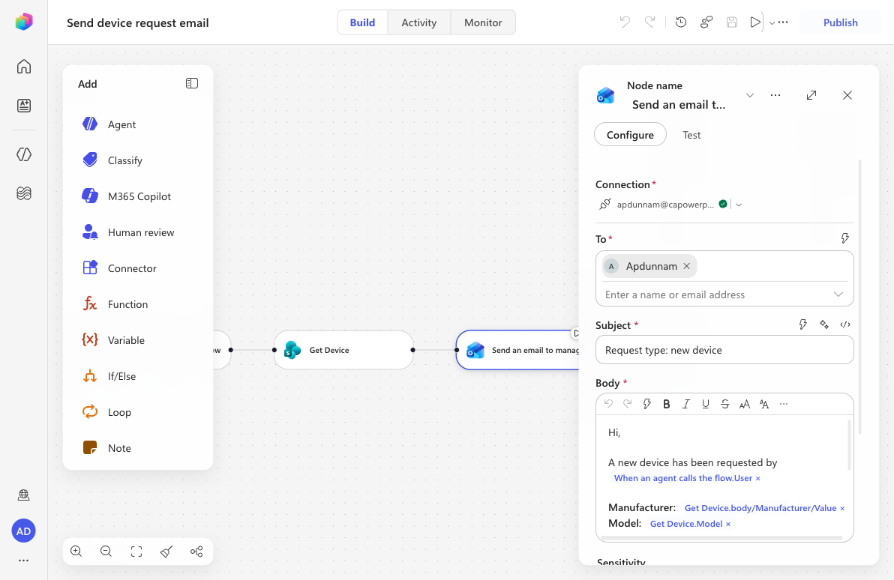

### 9.5 Configure the Respond to the agent output

1. Select the **Respond to the agent** action at the end of the canvas.

1. Add a **Text** output and name it the following.

   ```text
   ModelValue
   ```

1. For the value, select **Insert token**, search `model`, and select the **Model** value from the **Get Device** action.

   This returns the device model to the agent so it can confirm the request to the user.

   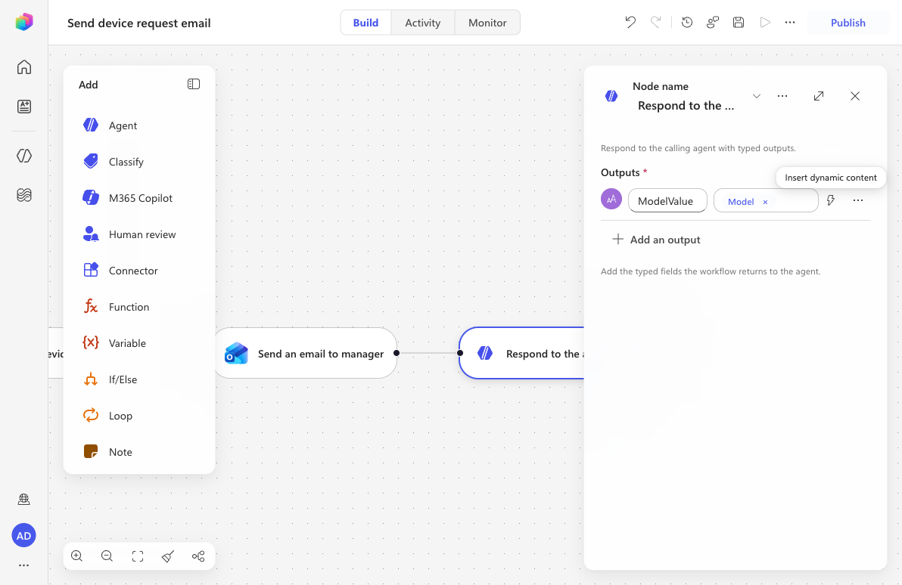

### 9.6 Name, save, and publish the workflow

1. Select the workflow title (**Untitled Workflow**) at the top and rename it to the following.

   ```text
   Send device request email
   ```

1. Select **Save** to save a draft. If the **Health Center** reports issues, open it and resolve any remaining errors.

1. When the workflow is error-free, select **Publish**. A confirmation appears once it's published — only published workflows can be added to an agent.

   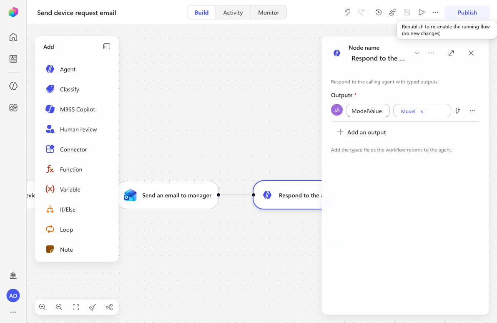

### 9.7 Add the workflow to your agent

Because there are no topics in the new experience, you attach the workflow to your agent as a **tool**.

1. Select **Agents** in the left navigation and open the **Contoso Helpdesk Agent**.

1. In the **Build** view, find the **Tools** section in the right-hand panel and select the **+ (Add tool)** icon.

   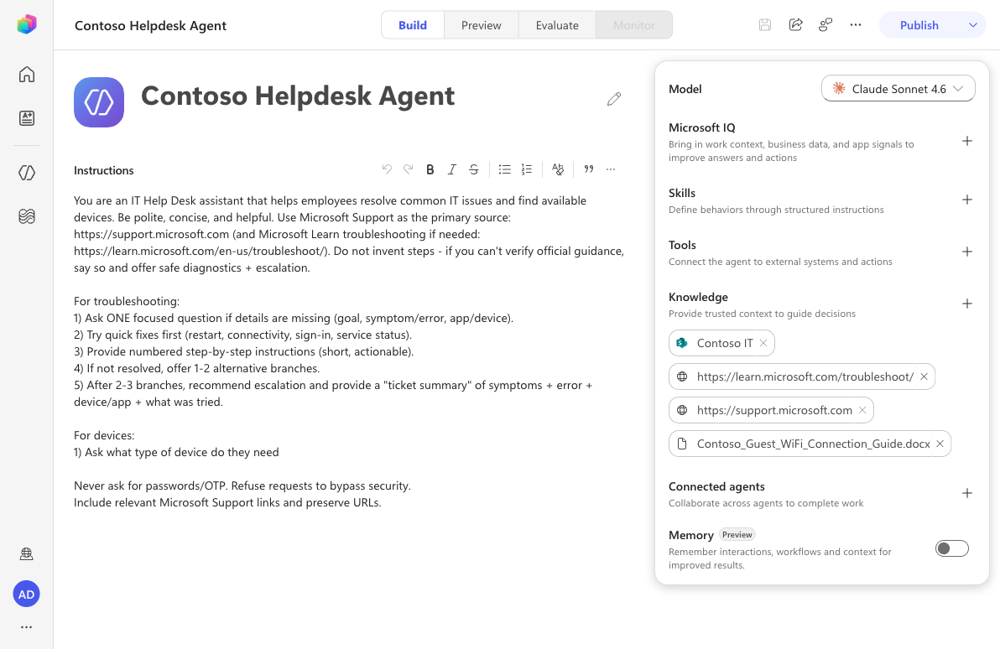

1. In the **Add a tool** dialog, select the **Workflows** tab, then select **Send device request email**.

   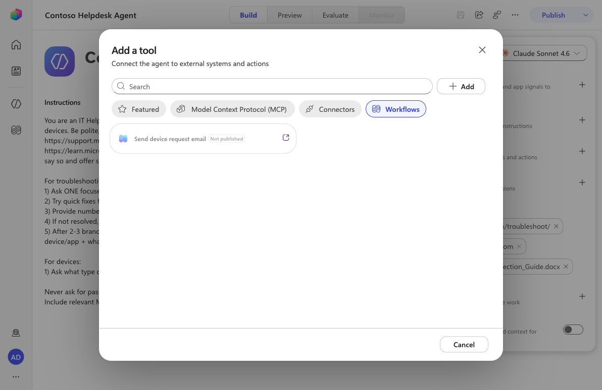

1. With the tool added, update the agent **Instructions** so the agent knows to call the workflow when a user requests a device — passing the selected device's **SharePoint item ID**, the user's display name, and any comment, then confirming the returned model to the user. **Save** the agent (the agent auto-saves).

   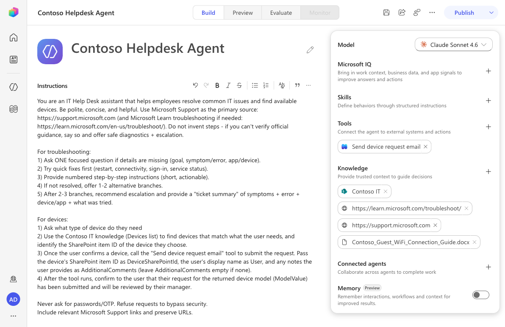

### 9.8 Test the agent

1. Select the **Preview** (test) tab and start a new conversation.

1. Enter the following.

   ```text
   I need a new laptop
   ```

   The agent responds using its knowledge sources. Because the new experience has no adaptive-card device picker, the agent needs the **SharePoint item ID** of the device to submit a request.

1. Submit the request by giving the agent the device's SharePoint item ID and an optional comment, for example.

   ```text
   Please submit a request for the device with SharePoint item ID 1. Additional comments: needed for a new hire.
   ```

1. Approve the connection prompts if asked. The agent calls the **Send device request email** workflow, passing your three inputs, then confirms back to you that the request was submitted.

   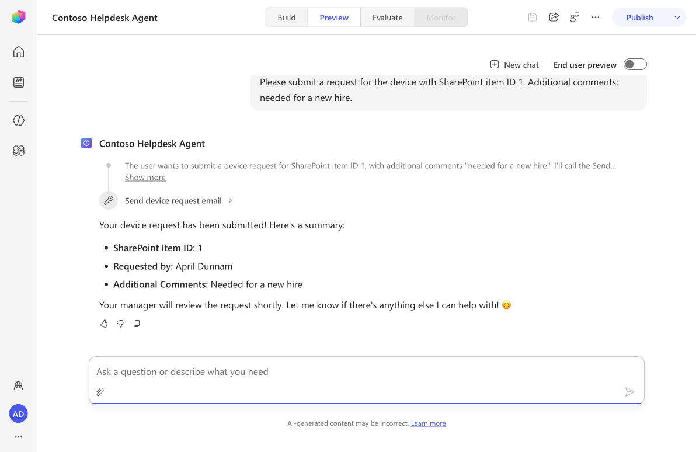

1. Check your inbox — you'll receive the HTML manager email showing the **Manufacturer** name (e.g. _Microsoft_), the model, and a clickable **Open the device record in SharePoint** hyperlink.

   > [!NOTE]
   > The workflow returns the device **Model** to the agent via the **ModelValue** output. If the chosen SharePoint item has an empty **Model** column, the workflow still succeeds but returns an empty value — populate the **Model** field on your **Devices** list items to see the model echoed back in the chat.

## 🤖 Autonomous workflows with event triggers {#autonomous-workflows-with-event-triggers}

The workflow you just built is **agent-triggered** — it only runs when your Contoso Helpdesk Agent decides to call it as a tool during a conversation. But workflows can also be **autonomous**: they run entirely on their own, with **no agent and no user involved**, the moment something happens in a connected system.

This is the modern replacement for the classic **event triggers** that used to be attached to an agent. In the old experience, you added an event trigger to the agent itself, which spun up a hidden Power Automate cloud flow that sent a prompt back into the agent. **In the new experience, the event trigger _is_ the workflow** — you simply choose a **Connector** trigger (like SharePoint's _When an item is created_) as the workflow's starting point, and the workflow runs autonomously each time that event fires.

### Connector (event) triggers

When you create a workflow, the **Trigger type** dropdown offers several ways to start it:

| Trigger type                         | Starts the workflow when…                                    |
| ------------------------------------ | ------------------------------------------------------------ |
| **When an agent calls the workflow** | an agent invokes it as a tool (this is what Lab 09 used)     |
| **Connector**                        | an external event occurs — e.g. a SharePoint item is created, an email arrives, a Teams message is posted |
| **Recurrence**                       | a schedule elapses (e.g. every morning at 9 AM)              |
| **Manual**                           | you press **Run** by hand                                    |
| **When a HTTP request is received**  | an external system calls the workflow's URL                  |

Choosing a **Connector** trigger is what makes a workflow **autonomous and event-driven**.

### Autonomous vs agent-called workflows

| **Autonomous (event-triggered) workflow**                    | **Agent-called workflow**                         |
| ------------------------------------------------------------ | ------------------------------------------------- |
| Started by an external system event                          | Started by an agent during a conversation         |
| Runs with **no user interaction**                            | Runs because a user asked the agent for something |
| Uses the **maker's** credentials (the connection you signed in with) | Uses the agent/user's context                     |
| Example: acknowledge every new support ticket                | Example: submit a device request on demand        |

### How the SharePoint event trigger works

The SharePoint **When an item is created** trigger **polls** the list on a short interval rather than firing instantly — so after you add an item, the workflow run typically starts within a few minutes. Each run receives the new item's columns as **trigger outputs** (`triggerOutputs()?['body/<column>']`), which you bind into your downstream actions exactly like the dynamic content in Lab 09.

> [!IMPORTANT]
> **Maker authentication.** An autonomous workflow signs in to SharePoint and Outlook using **your** connections (the maker's credentials) and acts "as you" every time it runs — even though no user triggered it. Before publishing autonomous automations to production, review what data the trigger can read, narrow the trigger to a specific site and list, and avoid putting sensitive data into the email body.

## 🧪 Lab 10 - Build an autonomous ticket-acknowledgment workflow {#lab-10-build-an-autonomous-ticket-acknowledgment-workflow}

### ✨ Use case {#use-case-2}

You'll enhance the IT Help Desk experience so that **new support tickets are acknowledged automatically**. When someone creates a new item in the **Tickets** SharePoint list, an autonomous workflow will:

1. **Trigger by itself** when the SharePoint ticket is created — no agent, no user.
1. Read the ticket's details from the trigger output.
1. **Email an acknowledgment** to the person who submitted the ticket, confirming it was received and will be reviewed within 3 working days.

This is the new-experience equivalent of the classic "event trigger" lab — but instead of attaching a trigger to an agent and editing a hidden Power Automate flow, you build one self-contained, autonomous **workflow**.

### Prerequisites

1. **Tickets SharePoint list** — a list on your **Contoso IT** site with at least these columns: **Title** (displays as _Issue_), **Description** (displays as _Issue description_), and a **Priority** choice column. The built-in **ID** and **Author** (Created by) columns are used automatically.
1. The **New experience** toggle (upper-right) is turned **on**.

### 10.1 Create a workflow with a SharePoint event trigger

1. From the Copilot Studio **Home** page, select the **Workflow** card (or select **Workflows → New Workflow**). The workflow designer opens with an empty canvas.

1. Select the **Start** trigger node. In the configuration panel, open the **Trigger type** dropdown and select **Connector**.

1. In the connector search, enter `When an item is created` and select the **When an item is created** trigger listed under **SharePoint**.

1. Configure the trigger parameters:

   - **Site Address** — select the **Contoso IT** SharePoint site.
   - **List Name** — select the **Tickets** list.

   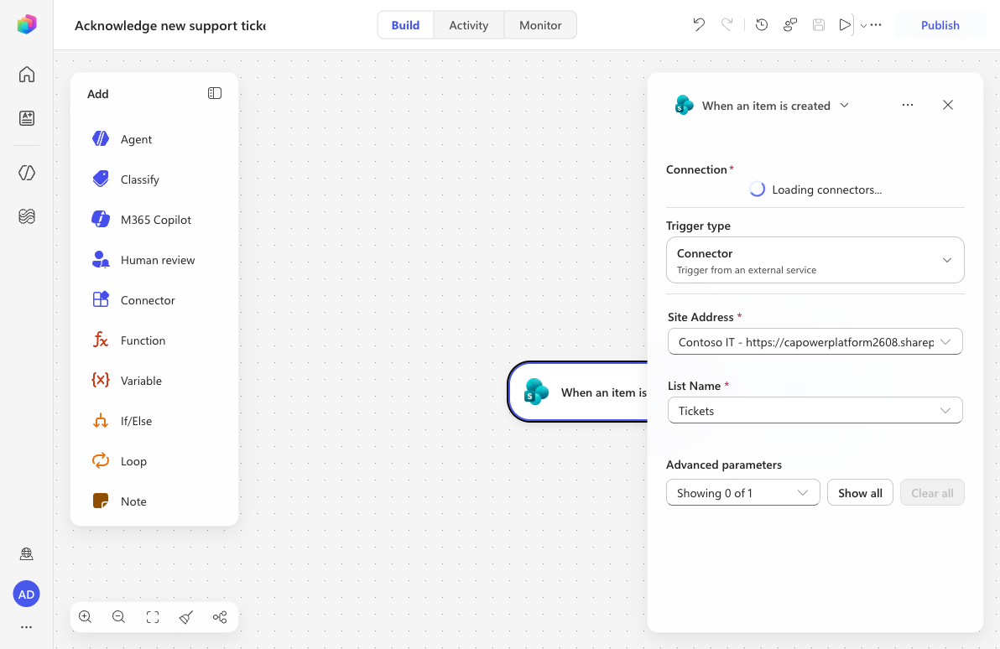

   > [!NOTE]
   > Unlike Lab 09's _When an agent calls the workflow_ trigger, this trigger has **no inputs you define** — its outputs are the columns of the newly created SharePoint item, available as dynamic content in the next steps.

### 10.2 Add the acknowledgment email

1. In the **node palette** on the left, select **Connector**, choose **Office 365 Outlook**, then select the **Send an email (V2)** action. If prompted, the connection is created automatically using your account.

1. Configure the **Subject**. Type the following static text, then use **Insert dynamic content** to add the **Title** token from the trigger after the colon:

   ```text
   We received your support ticket: <Title>
   ```

1. Configure the **To** field. The recipient must be the person who created the ticket — the SharePoint **Author** (Created by) person. The most reliable way to bind this is with an **expression** rather than the people-picker token:

   1. On the **To** field, select **Switch to expression mode**.

   1. Enter the following expression and confirm it shows **Expression is valid**:

      ```text
      triggerOutputs()?['body/Author/Email']
      ```

   > [!IMPORTANT]
   > In the people-picker (token) mode, the **Author** person token can serialize to an empty value at runtime — the run then fails with **`To Field cannot be null or empty`**. Binding **To** with the explicit expression `triggerOutputs()?['body/Author/Email']` returns the submitter's email address as a plain string and resolves reliably. (See the [evaluation notes](./evaluation.md) for the full root-cause analysis.)

1. Build the **Body** as **HTML**, reusing the Lab 09 technique. On the body toolbar, select **More formatting options (⋯) → Edit HTML source**, then enter the following — replacing each `@{…}` placeholder by leaving the editor's generated trigger tokens in place, or by selecting **Visual editor** afterward and inserting the matching tokens:

   ```html
   <div>Hello,</div>
   <div><br></div>
   <div>Thank you for contacting the Contoso IT Helpdesk. We have received your support ticket and a member of our team will review it shortly. We aim to respond within 3 working days.</div>
   <div><br></div>
   <div>Here is a summary of your request:</div>
   <div><strong>Ticket ID:</strong> @{triggerOutputs()?['body/ID']}</div>
   <div><strong>Title:</strong> @{triggerOutputs()?['body/Title']}</div>
   <div><strong>Description:</strong> @{triggerOutputs()?['body/Description']}</div>
   <div><strong>Priority:</strong> @{triggerOutputs()?['body/Priority/Value']}</div>
   <div><br></div>
   <div>If you need to add more information, simply reply to this email and we will append it to your ticket.</div>
   <div><br></div>
   <div>Thank you,</div>
   <div>Contoso IT Helpdesk</div>
   <div><br></div>
   <div>This is an automated message from the Contoso Helpdesk Agent.</div>
   ```

1. Select **Visual editor** to switch back. Each `@{…}` expression rebinds to a token chip. Note that **Priority** is a choice column, so you bind its **Value** child (`Priority/Value`) — exactly like the **Manufacturer/Value** lookup in Lab 09 — to email the readable text (e.g. _High_) instead of the raw choice object.

   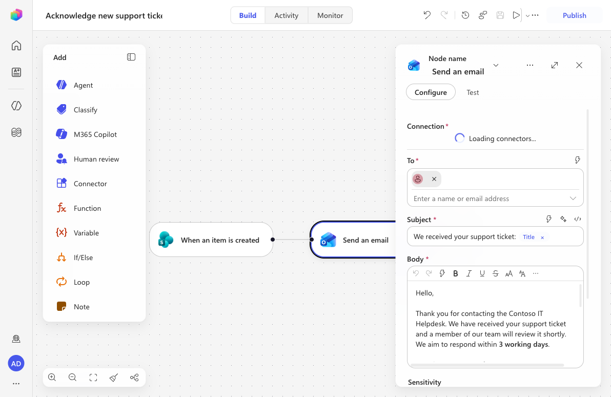

### 10.3 Name, save, and publish

1. Select the workflow title at the top and rename it to the following.

   ```text
   Acknowledge new support ticket
   ```

1. Select **Save**, resolve any **Health Center** issues, then select **Publish**. Only a published workflow runs autonomously.

   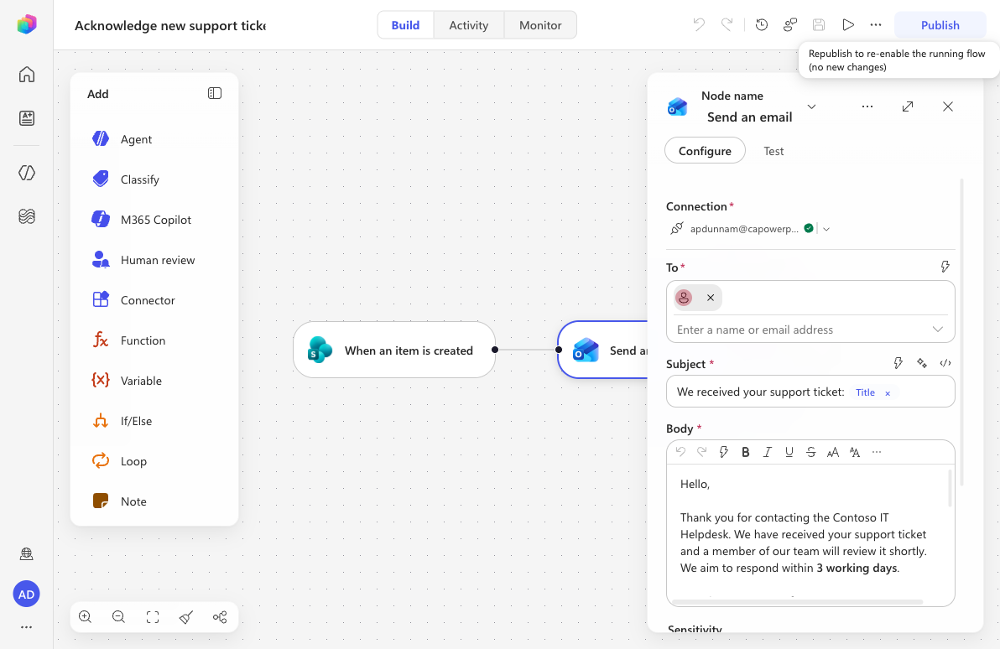

### 10.4 Test the autonomous workflow

1. Open a new browser tab and navigate to your **Contoso IT → Tickets** list. Select **+ New** (Add new item) and create a test ticket, for example:

   - **Issue (Title)**: `Outlook keeps crashing on launch`
   - **Issue description**: `Outlook crashes immediately every time I open it after the latest Windows update. I cannot access any of my email.`
   - **Priority**: `High`

   **Save** the item.

   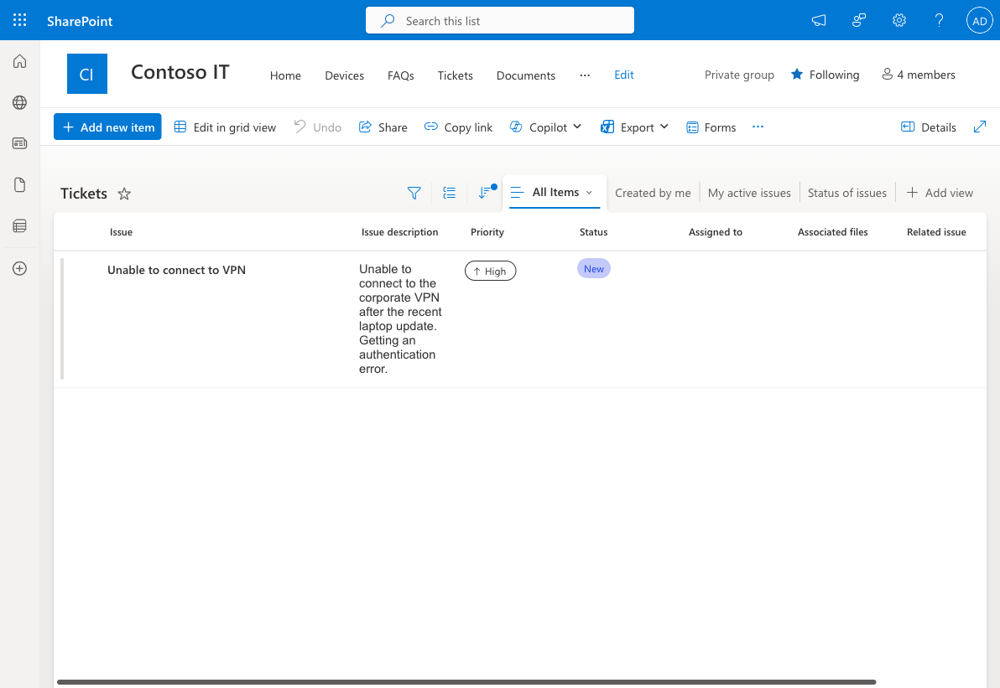

   > [!TIP]
   > The **Issue description** field is read-only until you select its **Edit** button, which opens an _Edit Issue description_ dialog — type your text there and **Save** the dialog before saving the item.

1. Return to your workflow and open the **Activity** tab. The SharePoint trigger **polls on an interval**, so wait a few minutes and select **Refresh** until a new run appears. When it does, it should show **Succeeded**.

   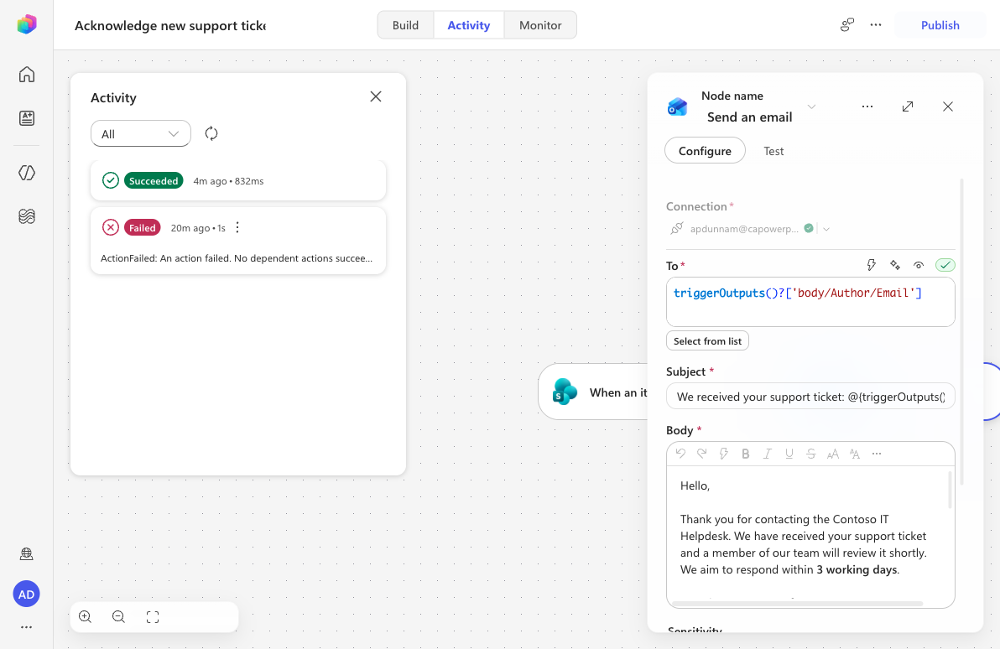

1. Check the inbox of the ticket submitter (here, your own mailbox). You'll find the acknowledgment email with the subject **"We received your support ticket: Outlook keeps crashing on launch"** and an HTML body showing the resolved **Ticket ID**, **Title**, **Description**, and **Priority** (e.g. _High_).

   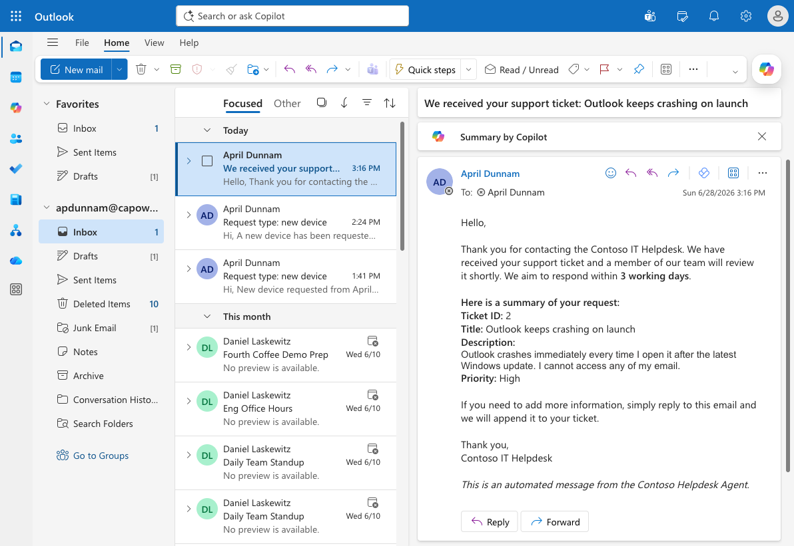

   > [!NOTE]
   > Because the workflow runs under **maker authentication**, it sent the email "as you." In a multi-user deployment, every new ticket would be acknowledged automatically to whoever submitted it — with no agent conversation and no manual step.

## ✅ Mission Complete {#mission-complete}

Congratulations! 👏🏻 You've built **two** automations in the **new Workflows experience**, all without a single topic:

- An **agent-called workflow** that retrieves a SharePoint device item, emails a manager an HTML notification, and returns the model to your **Contoso Helpdesk Agent** as a tool (Lab 09).
- An **autonomous, event-triggered workflow** that fires by itself when a new SharePoint ticket is created and emails an acknowledgment to the submitter (Lab 10).

Together they show the two halves of the new experience: workflows your agent calls **on demand**, and workflows that act **autonomously** on real-world events.

⏭️ [Move to **Publish your agent** lesson](../11-publish-your-agent/index.md)

## 📚 Tactical Resources {#tactical-resources}

🔗 [Introducing agent flows: Transforming automation with AI-first workflows](https://www.microsoft.com/microsoft-copilot/blog/copilot-studio/introducing-agent-flows-transforming-automation-with-ai-first-workflows/)

🔗 [Agent flows overview](https://learn.microsoft.com/microsoft-copilot-studio/flows-overview?WT.mc_id=power-172621-ebenitez)

🔗 [Use workflows with your agent](https://learn.microsoft.com/microsoft-copilot-studio/advanced-flow?WT.mc_id=power-172621-ebenitez)

🔗 [List of functions in the reference guide](https://learn.microsoft.com/azure/logic-apps/workflow-definition-language-functions-reference?WT.mc_id=power-172621-ebenitez)

🔗 [Make your agent autonomous in Copilot Studio](https://learn.microsoft.com/training/modules/autonomous-agents-online-workshop/?WT.mc_id=power-177340-scottdurow)

🔗 [SharePoint "When an item is created" trigger reference](https://learn.microsoft.com/connectors/sharepointonline/#when-an-item-is-created)

🔗 [Data loss prevention for Copilot Studio](https://learn.microsoft.com/microsoft-copilot-studio/admin-data-loss-prevention?WT.mc_id=power-177340-scottdurow)

<analytics-tag section="recruit" mission="08-automate-with-workflows" />
