---
tags:
  - rag
  - azure-ai-search
difficulty: 3
time: 60
description: >-
  Ground a Copilot Studio agent in your own documents with Retrieval-Augmented
  Generation (RAG) using Azure AI Search vector search, wired in as a connector
  tool in the new Copilot Studio experience.
badge: ./assets/Academy_AzureAISearchRAG_Badge.png
products:
  - copilot-studio
  - azure
industries:
  - hr
created-date: 2026-07-02
last-edited-date: 2026-07-02
---

# 🔎 Azure AI Search RAG {#azure-ai-search-rag}

<mission-meta />

<!-- markdownlint-disable-next-line MD033 -->
<p align="center">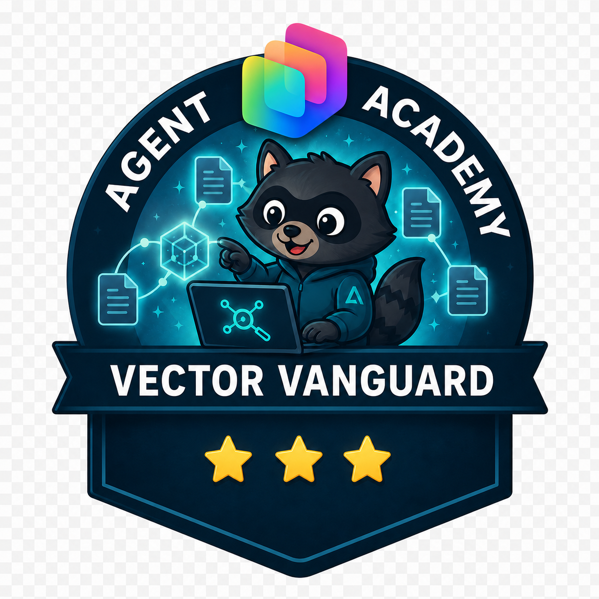</p>

Welcome, agent. Your mission — should you choose to accept it — is **Operation Vector Vault**: give a Copilot Studio agent the ability to reason over your organization's own documents using **Retrieval-Augmented Generation (RAG)** powered by **Azure AI Search** vector search. You'll stand up a search service, vectorize a stack of candidate resumes, and wire the index into an **HR Knowledge Agent** so it answers questions by *meaning*, not just keywords — with document-backed citations. 🎯

> [!NOTE] This mission uses the **new** Copilot Studio experience
> This mission was authored and validated against the **new** Copilot Studio authoring experience (2026-07-02). Keep **New Experience** turned **on** in the upper-right corner. The most important change from older RAG guidance: **Azure AI Search is no longer a Knowledge source** — you now connect it as a **connector tool**. This mission walks you through that new path.

## ❓ What is Retrieval-Augmented Generation (RAG)? {#what-is-rag}

Retrieval-Augmented Generation (RAG) is a technique for improving the quality of a language model's answers by letting it look things up before it responds.

Imagine a smart assistant that writes answers to your questions. Sometimes it doesn't know everything it needs to give a great answer. RAG lets the assistant first **retrieve** relevant information from a large collection of documents, then **generate** a response grounded in what it found.

So RAG combines two steps:

- **Retrieval:** finding relevant information from a large pool of data.
- **Generation:** using that information to compose a detailed, accurate response.

This makes answers more informed and trustworthy — ideal for question answering, research assistance, and any scenario where the truth lives in your documents rather than in the model's memory.

## 🧠 Why vector search? {#why-vector-search}

Vector search finds information based on **meaning** rather than exact keywords. Instead of matching words literally, it converts content into numeric vectors and finds content that is *conceptually* similar to your query. That lets it handle:

- **Semantic similarity:** matching concepts that mean the same thing in different words (for example, "recruitment" and "hiring").
- **Multilingual content:** finding equivalent content across languages (for example, "resume" and "curriculum vitae").
- **Multiple content types:** searching across formats such as text documents and PDFs.

Here's how it works:

1. **Convert text to vectors:** documents are turned into vectors that capture their meaning, using an **embedding model**.
1. **Store vectors:** the vectors are stored in a search index (Azure AI Search) built to handle them efficiently.
1. **Search with vectors:** your query is also converted to a vector, and the index returns the vectors closest in meaning.

For example, a search for "software engineering skills" can surface candidates described as having "programming expertise" or "development capabilities" — even without the exact words from your query.

## ⚙️ Prerequisites {#prerequisites}

- Microsoft Copilot Studio trial or paid account with the **new experience** enabled. If you don't have an account, see the [course setup](https://microsoft.github.io/agent-academy/recruit/00-course-setup/) instructions for a free trial.
- An **Azure subscription** with permission to create resources (Azure AI Search, Storage, and Azure OpenAI / Microsoft Foundry).
- Familiarity with basic Copilot Studio agent creation and basic Azure resource management.

> [!NOTE]
> Exercises 1 and 2 happen in the **Azure Portal** and **Microsoft Foundry**, outside Copilot Studio. Those portals are unchanged by the new Copilot Studio experience. The Copilot Studio changes begin in **Exercise 3**.

## 🎯 The Scenario {#the-scenario}

Contoso's HR team is drowning in candidate resumes across formats and languages. They want an agent that lets recruiters ask natural-language questions — "who speaks Spanish and knows Python?" — and get accurate, cited answers pulled from the actual resume documents. You're the agent builder wiring up RAG with Azure AI Search.

## 🧪 Exercise 1 — Set up the Azure AI Search service {#exercise-1}

In this exercise you create and configure the Azure AI Search service that will store and index your documents.

### Step 1 — Create the Azure AI Search service

Navigate to the [Azure Portal](https://portal.azure.com) and create an Azure AI Search service:

1. Select **Create a resource** and search for `Azure AI Search`.
1. Select **Azure AI Search**, then **Create**.
1. Fill out the following details and select **Review + Create**:

    - **Subscription:** your Azure subscription
    - **Resource group:** an existing group or a new one, for example `agent-academy-rg`
    - **Service name:** a globally unique name, for example `agentacademy-ai-search`
    - **Location:** the same region as your other Azure resources
    - **Pricing tier:** **Basic** (sufficient for this mission)

    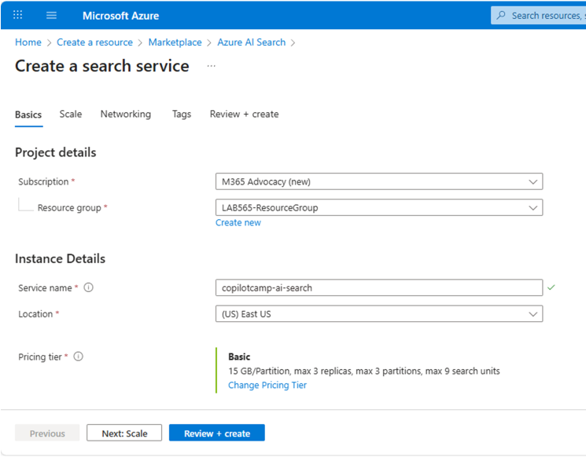

Once the service is created, open the resource and capture two values you'll need later:

1. On the **Overview** page, copy the **URL** (the search **endpoint**).
1. Under **Settings → Keys**, copy the **Primary admin key**.

> [!TIP]
> Keep the endpoint URL and admin key somewhere safe — you'll paste them into the Azure AI Search **connection** in Copilot Studio in Exercise 3.

### Step 2 — Create an Azure Storage account

You need somewhere to hold the documents before they're indexed.

1. In the Azure Portal, select **Create a resource** and search for `Storage Account`.
1. Select **Storage Account**, then **Create**.
1. Fill out the following and select **Review + Create**:

    - **Subscription:** your Azure subscription
    - **Resource group:** the same group as your Azure AI Search service
    - **Storage account name:** a globally unique name, for example `agentacademystorage`
    - **Region:** the same region as your Azure AI Search service
    - **Performance:** Standard
    - **Redundancy:** Locally redundant storage (LRS)

    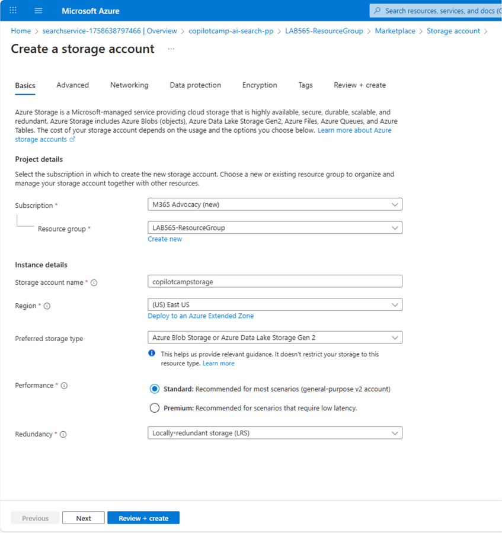

### Step 3 — Deploy a text embedding model

Vector search needs an **embedding model** to turn documents and queries into vectors.

If you don't already have an **Azure OpenAI** service, create one first (**Create a resource → Azure OpenAI → Create**, Standard S0 tier, in a region that supports Azure OpenAI).

Then open [Microsoft Foundry](https://oai.azure.com/portal), select your Azure OpenAI instance, and deploy the embedding model:

1. Select **Deployments** in the left navigation.
1. Select **+ Deploy model → Deploy base model**.
1. Search for `text-embedding-ada-002` and select **Confirm**.
1. Configure the deployment:

    - **Deployment name:** `text-embeddings` (remember this name)
    - **Deployment type:** Standard
    - **Model version:** 2 (Default)
    - **Content Filter:** DefaultV2
1. Select **Deploy** and wait for it to complete.

    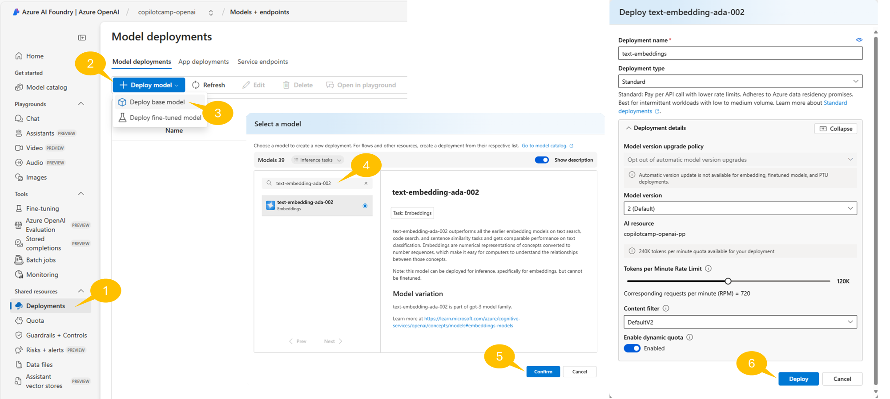

> [!NOTE]
> **What does `text-embedding-ada-002` do?** It converts text into numeric vectors that represent meaning, enabling vector search that finds semantically similar text across languages and formats. Paired with Azure AI Search, it returns the most relevant, contextually accurate content instead of exact keyword matches.

## 🧪 Exercise 2 — Create and populate the search index {#exercise-2}

Now you'll create a search index in Azure AI Search and populate it with candidate resume documents using the integrated vectorization feature.

### Step 1 — Preparing sample documents

For this lab, download the sample resume documents that will be indexed for search. Download [fictitious_resumes.zip](assets/fictitious_resumes%20(1).zip) and unzip the folder to access the PDF files.

These sample resumes contain diverse candidate profiles with information such as:

- Candidate names and contact information
- Technical skills and expertise areas
- Work experience and role history
- Education backgrounds
- Language proficiencies
- Professional certifications

Review the content of these files to understand the type of information that will be searchable through your RAG-enabled agent. Notice also that the documents are written in various languages. This will not be a problem for the text-embedding-ada-002 model or for the vector index.

### Step 2 — Uploading sample documents in the Storage Account

Using Azure AI Search, you'll create a vector index with your resume documents using the integrated vectorization feature.

Navigate to [Azure Portal](https://portal.azure.com/) and access the Azure Storage Account service instance.

1. Select **Containers** under **Data storage** from the group of commands in the left navigation
1. Select **+ Add container** command in the command bar
1. Provide a name for the new container, for example **resumes**
1. Select **Create** to create the actual container

    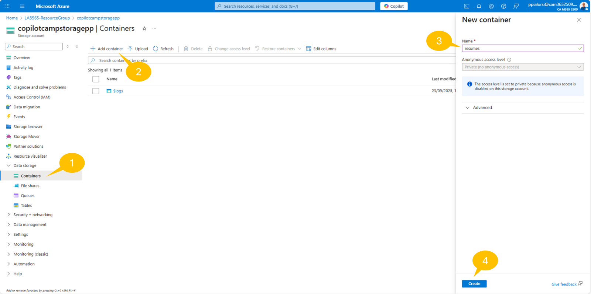

Once the container has been created, you can upload the resume files following these steps:

1. Select **Upload**
1. Drag and drop the resume files or select **Browse for files** and select the resume files
1. Select the **Upload** command and wait for the upload to complete

    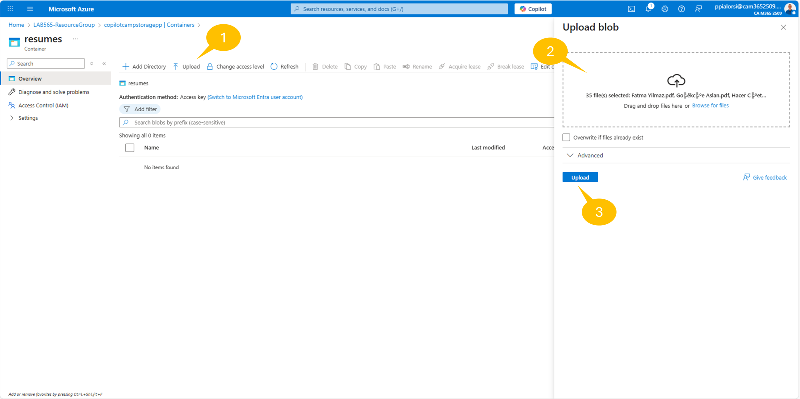

### Step 3 — Populating the Vector Index with Integrated Vectorization

Once the resume files are uploaded go back to the home page of the Azure Portal and access the Azure AI Search service instance. Then select the Import data (new) command in the top command bar.

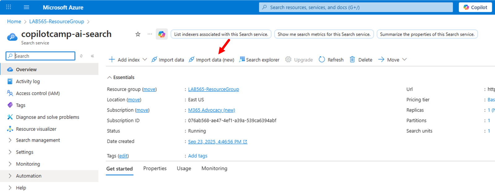

A new page will show up, through which you can configure the data import process. Select the Azure Blob Storage data source.

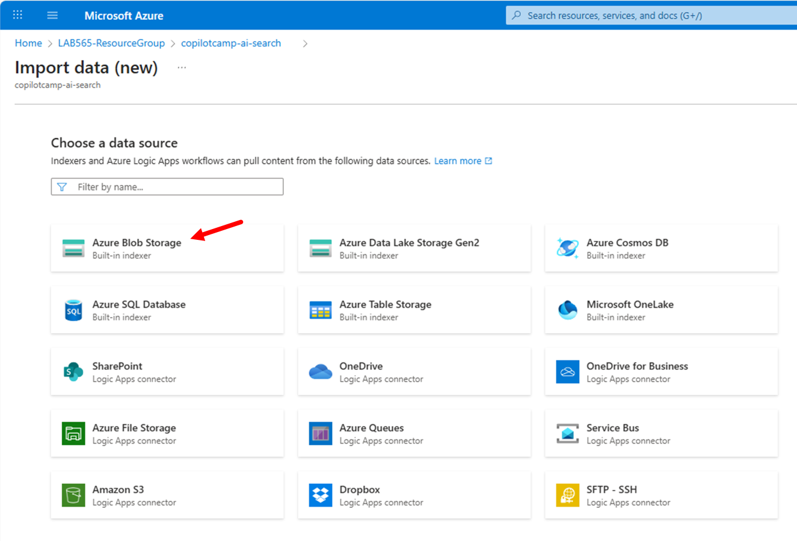

Right after, select RAG as the scenario that you are targeting.

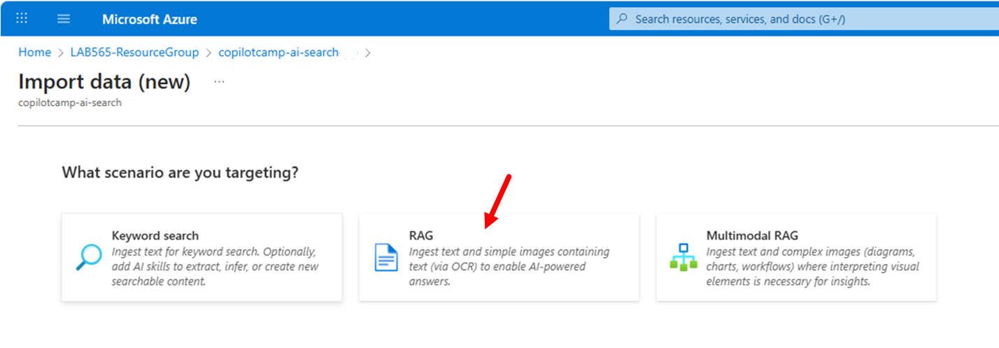

Now configure the RAG scenario accordingly to the following settings:

1. Configure your **Azure Blob Storage** section:
    1. **Subscription**: Your Azure subscription
    1. **Storage account**: the storage account you created before
    1. **Blog container**: the new container that you just created and where you uploaded the resume files
    1. **Blog folder**: you can leave it blank, unless you created a folder structure in the storage container
    1. **Parsing mode**: use the **Default** value
    1. Move **Next**
1. **Vectorize your text** section:
    1. **Kind:** Azure OpenAI
    1. **Subscription:** your subscription
    1. **Azure OpenAI service:** your Azure OpenAI instance
    1. **Model deployment:** the `text-embeddings` model you deployed
    1. **Authentication type:** API Key (default)
    1. Check the box acknowledging that connecting to Azure OpenAI incurs additional cost, then select **Next**.
1. **Vectorize your images** section:
    1. In case you are willing to process images and text in images, you could configure specific settings
    1. Here you can simply move **Next**
1. **Advanced ranking and relevancy** section:
    1. If you like you can schedule recurring updates of the index, on a timer based model. You can also choose whether to use the semantic ranker to get results also based on semantic and not only on lexical analysis. Last but not least, you can configure the fields that will be created in the target index
    1. Here you can simply move **Next**
1. **Review and create** section:
    1. Here you can provide a prefix for the index, indexer, data source, and skill set that will be created. For example you can use the value resumes
    1. Review the settings and when you are ready select Create to create and feed the vector index

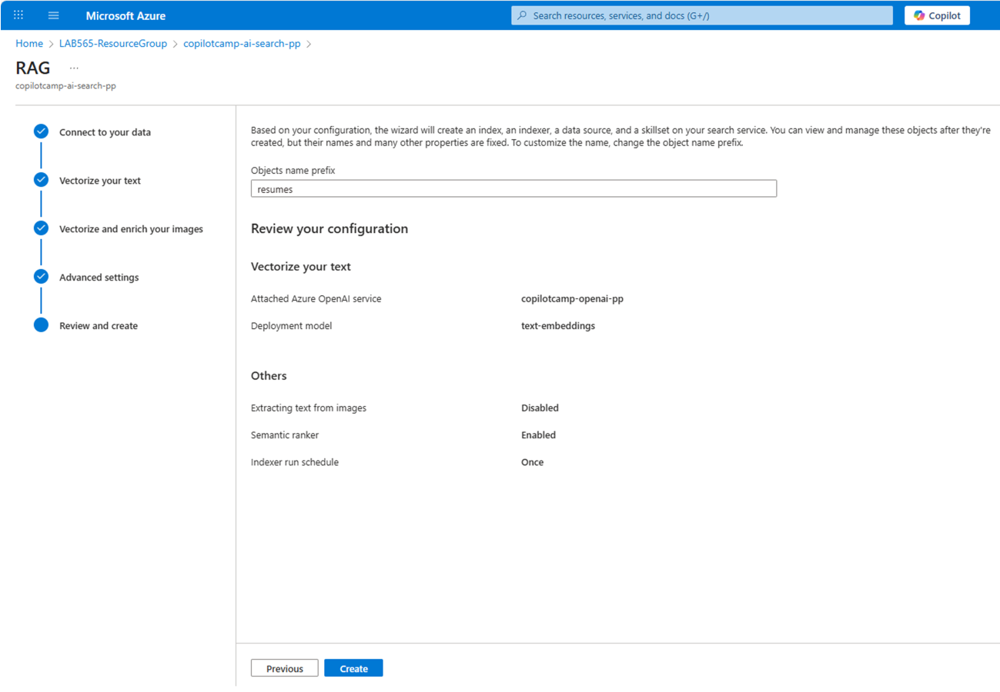

Once the vector index is created, a small dialog confirms the index creation and availability. Select the Start searching command to start playing with the index. In the search index page, you can simply select the Search command and see the output. Notice that, for every value in the index, you also have a text_vector field that contains the text vectorized using the text-embedding-ada-002 model.

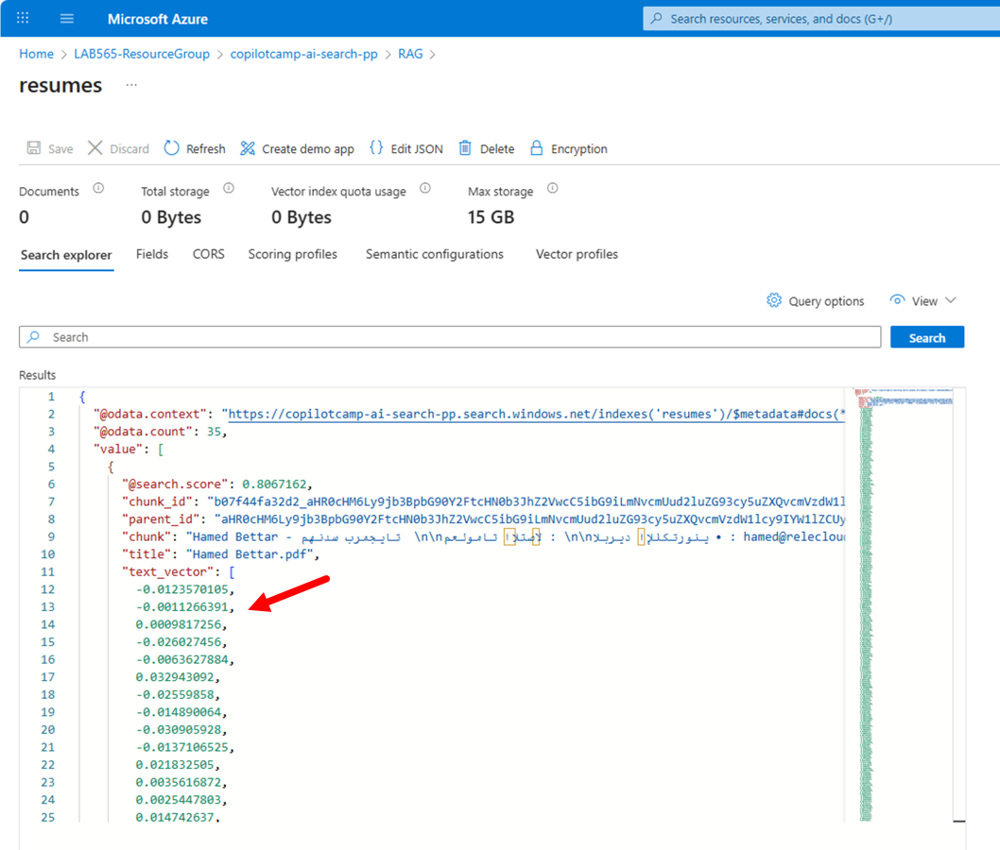

## 🧪 Exercise 3 — Build the RAG-enabled agent {#exercise-3}

In this exercise you will create a Microsoft Copilot Studio agent that leverages your Azure AI Search index to provide intelligent, document-backed responses about HR candidates.

### Step 1 — Create the HR Knowledge Agent

1. Navigate to [Microsoft Copilot Studio](https://copilotstudio.microsoft.com) and sign in. Make sure **New experience** is turned **on**.

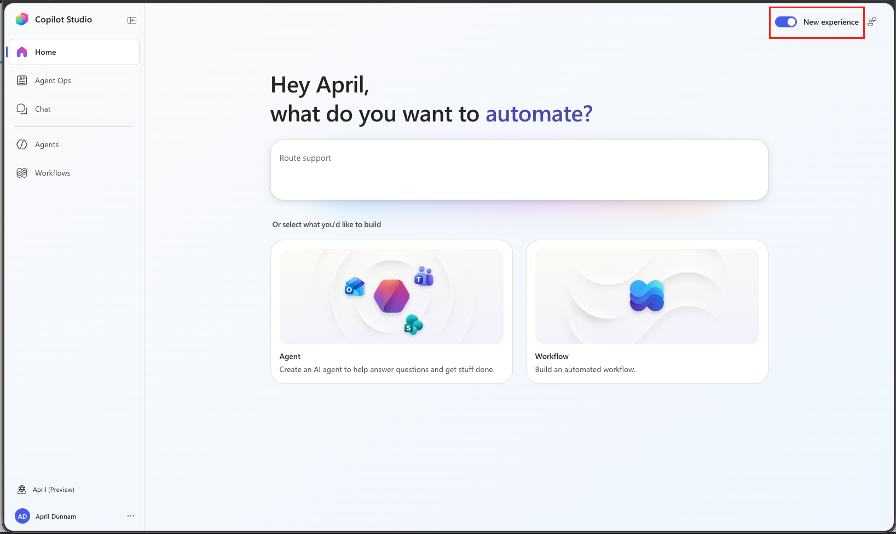

1. Select **New Agent**

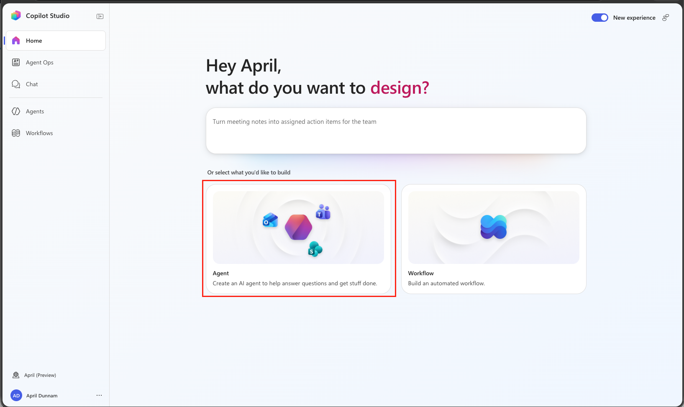

1. Enter the following as the agent **Name** (in the title box at the top):

    ```text
    HR Knowledge Agent
    ```

1. Copy and paste the following into the **Instructions** field. The first paragraph is the agent's description; the rest tells it how to behave and, importantly, to call the Azure AI Search tool for retrieval:

    ```text
    You are an intelligent HR Knowledge Assistant specializing in candidate search. You have access to a database of candidate resumes indexed in Azure AI Search, which you can query using the Semantic Hybrid Search tool.

    When a user asks a question, you should:
    1. Call the Semantic Hybrid Search tool to retrieve the most relevant candidate documents using semantic (vector) understanding.
    2. Provide detailed, accurate information based only on the retrieved documents.
    3. Always cite the candidate name(s) and source documents your answer is based on.
    4. Explain your reasoning when matching candidates to requirements.
    5. Suggest alternative candidates when an exact match isn't available.
    6. Help users understand the skills and qualifications of different candidates.

    You excel at:
    - Finding candidates with specific technical skills
    - Matching language requirements with candidate profiles
    - Identifying experience levels and career progression
    - Understanding educational backgrounds and certifications
    - Semantic search that goes beyond keyword matching

    If the search returns no relevant results, say so clearly rather than guessing. Always be professional and respect candidate privacy.
    ```

1. Select **Save** in the upper right hand corner to save your changes.

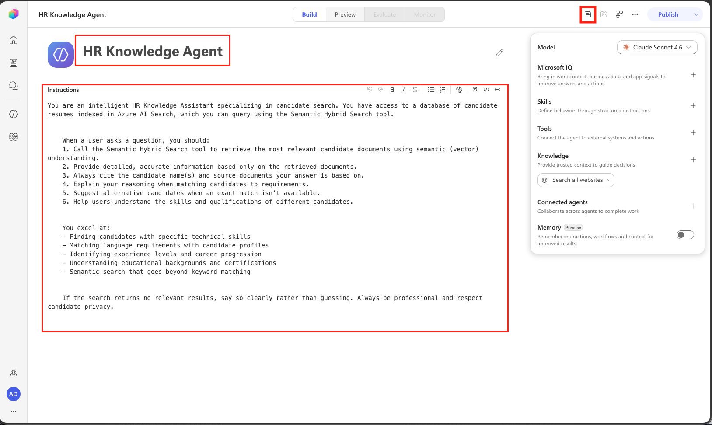

### Step 2 — Connect Azure AI Search as a tool

> [!IMPORTANT]
> In the new Copilot Studio experience, **Azure AI Search is not a Knowledge source**. The **Add knowledge** dialog only offers Public websites, SharePoint, and OneDrive. Instead, you connect Azure AI Search as a **connector tool** and let the agent call it for retrieval.
>
> 

1. In the right-hand **Agent configuration** panel, find the **Tools** card and select **Add tool**.

1. In the **Add a tool** dialog, search for `Azure AI Search`. The **Azure AI Search** connector appears with its actions, including **Semantic Hybrid Search**, **Search vectors with natural language**, **Get search indexes**, and **Get index statistics**.

    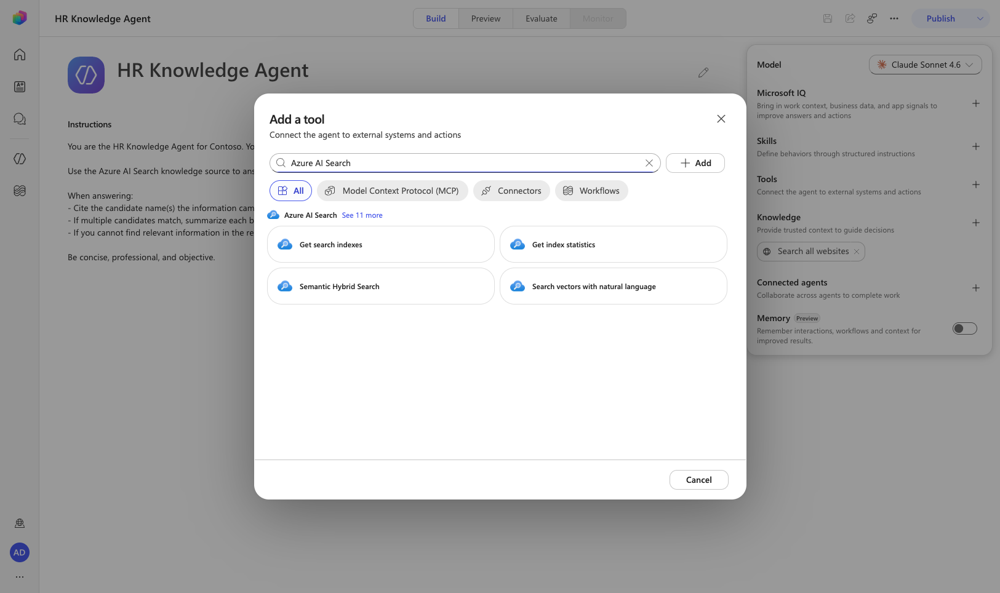

1. Select the **Semantic Hybrid Search** action, then select **Add**. (This action performs semantic hybrid search — combining vector and keyword search — against your index. **Search vectors with natural language** is a good alternative for pure vector queries.)

    <!-- ⚠️ NEW FLOW: This replaces the entire classic "Add knowledge → Featured →
         Azure AI Search → Create new connection → select index → Add to agent" flow. -->

1. The tool is added under **Tools**. Select it to open **Tool details**. Here you set the tool **Name**, **Description**, and **Authentication mode** (**User** or **Maker**). Configure the connector **connection** with your Azure AI Search **endpoint URL** and **admin key** (the values you saved in Exercise 1), and point it at the `resumes` index.

    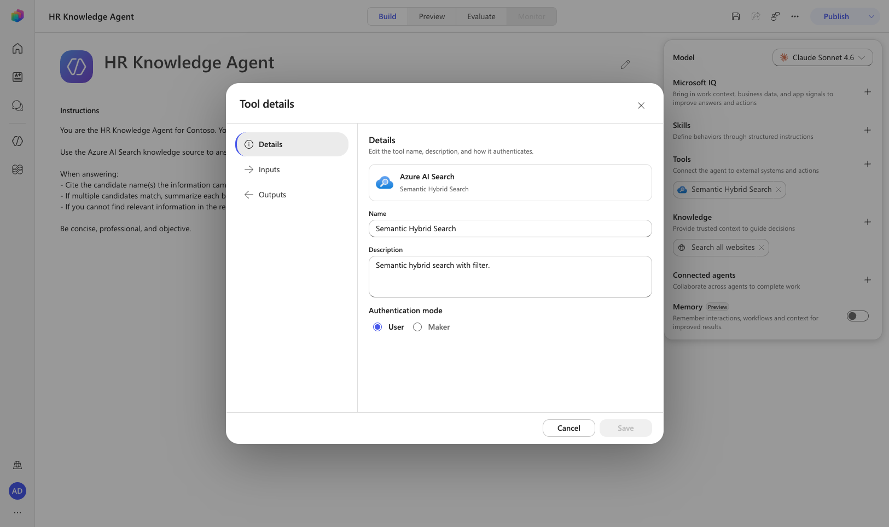

    > [!TIP]
    > Choose **User** authentication if each user should connect with their own credentials, or **Maker** if the agent should always use the connection you (the maker) configured. For a shared HR knowledge base, **Maker** is usually the right choice.

1. Select **Save** and confirm the **Save** button becomes disabled — that means the tool is committed to the agent.

    > [!WARNING]
    > If you navigate away with unsaved changes, they are silently discarded. Always confirm **Save** goes disabled before leaving the Build canvas.

## 🧪 Exercise 4 — Test the agent {#exercise-4}

Now validate retrieval in the **Preview** tab.

<!-- ⚠️ MODIFIED: Classic used the "test panel." In the new experience, testing happens
     in the "Preview" tab. Start a New chat after adding/saving a tool so the tool
     context refreshes. -->

1. Select the **Preview** tab. If you just added the tool, select **New chat** so the agent picks up the new tool context.

1. Try these basic queries to confirm the agent retrieves and cites indexed documents:

    ```text
    Hello! Can you help me find candidates with software engineering experience?
    ```

    ```text
    I'm looking for candidates who speak multiple languages. Can you help?
    ```

    ```text
    Show me candidates with machine learning or AI experience.
    ```

    Watch how the agent calls the **Semantic Hybrid Search** tool, returns relevant candidate information, cites the source documents, and uses semantic understanding rather than exact keyword matching.

    > [!NOTE]
    > The first time the tool runs you may be prompted to confirm or create the Azure AI Search connection. Complete the connection prompt, then retry the message.

1. Now try more sophisticated, multi-criteria queries that show off vector search:

    ```text
    Find candidates suitable for a senior role that requires 5+ years of Python experience and fluency in Spanish
    ```

    ```text
    I need someone with both frontend and backend development skills. Who would be good for a full-stack position?
    ```

    ```text
    Can you recommend candidates for a data science position that requires experience with machine learning frameworks?
    ```

    ```text
    Who has project management experience combined with technical skills?
    ```

    Notice how the agent combines multiple criteria, explains its reasoning, suggests alternatives when there's no exact match, and grounds every recommendation in the retrieved resumes.

## ✅ Mission Accomplished {#mission-accomplished}

Congrats, agent — **Operation Vector Vault** is complete! Your Copilot Studio agent now answers questions by retrieving from your own documents through Azure AI Search vector search.

In this mission, you accomplished:

✅ **Azure AI Search**: created and configured a search service for enterprise knowledge
✅ **Integrated Vectorization**: built a vector index from PDFs using an embedding model
✅ **Connector-based RAG**: connected Azure AI Search as a **tool** in the new Copilot Studio experience — the modern replacement for the retired "Azure AI Search knowledge source"
✅ **Instruction Engineering**: directed the agent to call the search tool and cite its sources
✅ **Semantic Testing**: validated meaning-based retrieval with basic and complex queries

The RAG pattern you built applies far beyond HR — customer support knowledge bases, technical documentation, policy guides, and any domain where users need to search large document collections through natural conversation.

## 🏅 Claim your completion badge {#claim-your-completion-badge}
<!-- markdownlint-disable-next-line MD033 -->
<p align="center"></p>

Congrats, agent - mission accomplished! Now it's time to claim your badge.

Simply submit the badge request form and answer all required questions:

[https://aka.ms/agent-academy-special-ops/azure-ai-search-rag/form](https://aka.ms/agent-academy-special-ops/azure-ai-search-rag/form)

Once your submission is reviewed, you will receive an email from Global AI Community with instructions to claim your badge.

> [!TIP]
> If you do not see the email, check your spam or junk folder.

## 📚 Tactical Resources {#tactical-resources}

📖 [What is Azure AI Search?](https://learn.microsoft.com/azure/search/search-what-is-azure-search)

📖 [Integrated vectorization in Azure AI Search](https://learn.microsoft.com/azure/search/vector-search-integrated-vectorization)

📖 [Azure AI Search connector reference](https://learn.microsoft.com/connectors/azureaisearch/)

📖 [Add tools to a Copilot Studio agent](https://learn.microsoft.com/microsoft-copilot-studio/advanced-plugin-actions)

📖 [Retrieval-Augmented Generation (RAG) overview](https://learn.microsoft.com/azure/search/retrieval-augmented-generation-overview)

<analytics-tag section="special-ops" mission="azure-ai-search-rag" />
