# Microsoft Copilot Studio ➕ Docusign MCP

Welcome, agent. Your objective is simple: reuse what already works. Connect Docusign MCP server to your Copilot Studio agent, and invoke a Maestro workflow to execute an _already-operational_ document automation workflow. You gather the intel. Maestro runs the op. Minimal new logic. Maximum leverage.

## 🎯 Mission Brief

TBC

## 🔎 Objectives

In this mission, you'll learn:

1. How to create Docusign Web Forms, Document Templates and a workflow using Workflow Builder
1. How to add the Docusign MCP server as a tool to your agent
1. How to add the Outlook MCP server as a tool to your agent
1. How to invoke the workflow from the agent
1. How to provide inputs in natural language for the workflow

## ❓ What is Docusign?

[Docusign](https://www.docusign.com) is best known as an electronic signature platform that allows people and organizations to securely send, sign, approve, and manage documents digitally instead of relying on paper-based processes. Today, Docusign has evolved into a broader [Intelligent Agreement Management (IAM) platform](https://www.docusign.com/intelligent-agreement-management) that helps businesses create, sign, automate, track, and manage agreements from start to finish.

At its core, Docusign helps organizations manage the full lifecycle of agreements - from creating contracts and collecting signatures, through to storing, tracking, and analyzing agreement data. The platform integrates with commonly used business tools such as Microsoft, Salesforce, and other enterprise systems.

### Why Docusign is essential for organizations

For organizations, agreements are everywhere:

- Employee contracts
- Sales proposals
- NDAs
- Procurement approvals
- Customer onboarding forms
- Vendor agreements

Managing these manually can be slow, repetitive, and error-prone and this is where Docusign shines by streamlining these processes digitally.

#### Faster business processes
Instead of waiting days for signatures or approvals, documents can be reviewed and signed from anywhere on almost any device. This helps businesses move faster and reduce delays.

#### Reduced manual work
Docusign removes much of the printing, scanning, emailing, and data entry involved in traditional paperwork processes.

#### Better visibility and tracking
Teams can see where agreements are in the process, who still needs to sign, and where bottlenecks exist.

#### Improved security and compliance
Docusign provides secure digital signing and audit trails, helping organizations manage sensitive agreements more safely.

#### Works with existing business tools
Docusign integrates with platforms many organizations already use, including Microsoft applications, CRM systems, and productivity tools

## 🏗️ What is Docusign Workflow Builder?
You'll be building a workflow with Docusign Workflow Builder in this mission so let's learn more about it. Docusign Workflow Builder is a workflow automation platform that helps organizations automate agreement processes from beginning to end.

Rather than manually sending documents, collecting information, chasing approvals, and tracking progress, Workflow Builder connects everything into a structured digital workflow.

Docusign describes Workflow Builder as a way to automate, customize, and connect agreement workflows across the business.

### What Workflow Builder can do
Workflow Builder allows organizations to automate processes such as:

- Employee onboarding
- Customer onboarding
- Procurement approvals
- Vendor agreements
- NDAs
- Compliance and identity checks

### Key Workflow Builder capabilities

#### Identity Verification
Identity Verification helps organizations confirm a signer’s identity before agreements are completed. This adds an extra layer of security and is especially important for sensitive or regulated processes.

#### Web Forms
Web Forms allow organizations to collect structured information through browser-based forms before generating agreements. Data entered into the form can automatically populate documents.

#### eSignature
Docusign eSignature enables legally recognized electronic signing directly within workflows, reducing delays and removing paper-based processes.

#### App Center
The App Center connects Workflow Builder with third-party applications and services so organizations can integrate agreement workflows into existing business systems.

#### Workflow Templates
Workflow Templates provide pre-built workflows for common business scenarios, helping teams quickly deploy standardized agreement processes without starting from scratch.

#### Agreement Desk
Agreement Desk helps centralize and coordinate agreement preparation, review, and collaboration activities across teams involved in the process. The sources reference workflow coordination and agreement process visibility as part of the broader Workflow Builder platform.

#### Document Generation
Document Generation helps automatically create agreements and documents using collected business data and reusable templates, reducing repetitive manual document creation.

### Why Workflow Builder adds value

#### Faster processes
Automated workflows reduce delays caused by back-and-forth emails and manual handoffs.

#### Better consistency
Templates and standardized workflows ensure every agreement follows the same approved process.

#### Less manual work
Teams spend less time creating documents, chasing approvals, and entering data.

#### Improved visibility
Organizations can track workflow progress and agreement status more easily.

#### Scalability
As businesses grow, Workflow Builder helps manage larger volumes of agreements without increasing administrative overhead.

#### No-code accessibility
Business users can build workflows without needing developers or complex custom software.

## 🧪 Docusign MCP lab

For this Special Ops mission, we're going to:

- 1.0 Create templates and a workflow in Docusign
- 2.0 Build an agent and add the Docusign MCP server as a tool in Copilot Studio
- 3.0 Add the Outlook MCP server as a tool in Copilot Studio
- 4.0 Test end-to-end

### ✅ Prerequisites

To complete this Special Ops mission, you'll need the following outlined in this section.

#### Docusign

- Sign up for a free **Docusign developer account**
  - Browse to [https://developers.docusign.com](https://developers.docusign.com)
  - Create a new **App and key** under **Admin**
  - In your **App and key**,
    - add a new **Secret** and _securely_ save the value as you'll be copying and pasting the value when we add the Docusign MCP server as a tool in a later lab exercise
    - scroll down to the **Allowed HTTP Methods** section and tick all the checkboxes for `GET`, `POST`, `PUT`, `DELETE` and `HEAD`
    - **Save** your app and key

#### Microsoft

- Copilot Studio license
- Access to a Copilot Studio developer environment
- Administrative permissions to create solutions and agents
- A SharePoint site where you have permissions to create a new folder in the Documents library - this will be used in a workflow step

> [!TIP] Prerequisites help:
> If you need help getting a Copilot Studio license, please reference the [Recruit Course Setup lab](./../../recruit/00-course-setup/index.md) which walks you through setting up a Power Platform environment with a Copilot Studio trial.

#### Two email addresses

You'll need two different email addresses to complete this lab:

- Email address to use as the employee
- Email address to use as the hiring manager

### 1.1 Create a Docusign Web Form

> [!IMPORTANT]
> You need a Docusign developer account to complete these Docusign lab exercises. Follow the steps outlined in the above **Prerequisites** section.

1. From the Home page of Docusign developers portal, select **Templates**.

    

1. On the left hand side navigation pane, select **Start**. Select **Web Forms** followed by **Create Web Form**.

    

1. We'll now be asked how we want to create our Web Form. Select **Start From Scratch**.

    

1. Enter a name for the Web Form. For example,

    ```text
    Request for your contact information
    ```

    

1. The Web Form designer will next appear. This is where we can add pages and fields to the Web Form. By default there will be 3 pages - Welcome page, Untitled page, Thank you page.

    In the **Welcome page** update the following fields,

    **Page title**

    ```text
    👋🏻 Hey there!
    ```

    **Page subtitle**

    ```text
    As we kick-off the next stage in sending you an offer, we need some details from you.

    Please complete this form and shortly after you'll receive an Employment Agreement and Offer Letter.
    ```

    

1. Next, select the **Untitled** page and update the following fields,

    **Page title**

    ```text
    Your name
    ```

    **Page subtitle**

    ```text
    Please provide us with your name
    ```

    **API reference name**

    ```text
    Step_CandidateName
    ```

    

1. We're now going to add fields to this page. Select the **plus icon** below the page title section in the middle of the designer.

    

1. Select **Text Field**.

    

1. You'll now see different attributes of the field. The following are the attributes of the field to update,

    | Field name    | Field description | Required field | API reference name    |
    |---------------|-------------------|----------------|-----------------------|
    | `First Name`  | `Your first name` | Yes            | `TextBox_FirstName`   |

    

    

1. We'll repeat the same steps to add the remaining **Text Fields**. Select the **plus icon** and add new **Text Fields** using the following attributes for each one,

    | Field name    | Field description  | Required field | API reference name   |
    |---------------|--------------------|----------------|----------------------|
    | `Middle Name` | `Your middle name` | No             | `TextBox_MiddleName` |
    | `Surname`     | `Your surname`     | Yes            | `TextBox_Surname`    |
    | `Full Name`   | `Your fullname`    | Yes            | `TextBox_FullName`   |

    After the **Text Fields** have been added, select the **plus icon** on the left hand side pane and select **New Blank Page**.

    

1. Update the following fields for the new page,

    **Page title**

    ```text
    Address
    ```

    **Page subtitle**

    ```text
    Please provide us with your physical address
    ```

    **API reference name**

    ```text
    Step_CandidateAddress
    ```

    We'll repeat the same steps to add the remaining **Text Fields**. Select the **plus icon** and add new **Text Fields** using the following attributes for each one,

    | Field name    | Field description  | Required field | API reference name   |
    |---------------|--------------------|----------------|----------------------|
    | `Middle Name` | `Your middle name` | No             | `TextBox_MiddleName` |
    | `Surname`     | `Your surname`     | Yes            | `TextBox_Surname`    |
    | `Full Name`   | `Your fullname`    | Yes            | `TextBox_FullName`   |

    

1. After the **Text Fields** have been added, select the **Thank you page** on the left hand side pane.

    

1. Update the following fields for the **Thank you page**.

    **Page title**

    ```text
    ✨ Thank you
    ```

    **Page subtitle**

    ```text
    We've received your form. Expect an email soon with documents to sign.
    ```

    

1. Great, you've now finished configuring the Web Form. Let's take a look at what the Web Form will look like for the end user, select **Preview**.

    

1. The Web Form is now enabled in preview mode where you can complete each page with the required information. Complete the **Your Name page** by entering a name and select **Next**.

    

1. The next page to complete is the **Address page**.

    

1. Complete the **Address page** with information and select **Next**.

    

1. You'll then see a summary of the information entered for the two pages to review.

    

1. Scroll down and select **Next**.

    

1. An error will appear next, this is fine as it's due to the web form being in preview mode. Select **Create**.

    

1. We'll now activate the web form. Select **Activate** on the upper right of the designer.

    

1. A confirmation modal will appear with an **Access setting** field. We'll leave this as **Public** as the web form we'll be used in a step in the workflow we'll create in a later lab exercise. Select **Activate**.

    

1. A confirmation message will appear to let you know that the web form has been successfully activated. Select **Go to Web Forms**.

    

1. The Web Form will appear with a status of **Active**. Hooray, you've built a web form! 👏🏻

    

### 1.2 Create Document Templates

A Document Template is a reusable setup for sending agreements that lets you pre‑define documents, recipient roles, routing order, and messages, so you can quickly create and send consistent envelopes without starting from scratch each time.

In this lab exercise, we'll create two Document Templates

1. An employment agreement - [download the sample employment agreement](assets/Sample%20Employment%20Agreement.docx)
1. An employee offer letter - [download the sample offer letter](assets/Sample%20Offer%20Letter.docx)

These document templates will be used in the next lab exercise when we create a workflow in Workflow Builder.

Let's begin!!! ⤵️

1. Navigate to **Templates** and select **Document Templates** in the left hand side menu pane. Select **Create**.

    

1. We can now select files to upload. Select **Upload**.

    

1. Select the Sample Employment Agreement file. [Download the Sample Employment Agreement](assets/Sample%20Employment%20Agreement.docx) if you haven't already.

    

1. The **Name** field is automatically populated with the file name. In the **Agreement Type** field, select the **chevron icon** and scroll down to the **Human Resources** list of values, select **Offer Letter**.

    

1. Next we'll define the roles for the document template. On the **Fields** left hand side pane, select the **chevron icon** by **Sender 1** and select **Edit recipients**.

    ::: info What is a "Role" in a template? :thinking:
    A role is a placeholder in a template that represents an individual who will act on the document, such as signing or approving. Roles define _who_ is involved and _what action_ they take, while allowing the actual recipient to be assigned when the template is used.

    🐦 **What roles are used for**

    - Define who participates in the agreement
    - Enable reusability of templates across multiple envelopes
    - Allow documents and fields to be prepared without knowing the final recipients

    When someone uses the template, they assign real people (name and email) to each predefined role before sending.
    :::

    

1. Rename the **Signer 1** role to,

    ```text
    Hiring Manager
    ```

    Add a new recipient and name the role as,

    ```text
    Employee
    ```

    

1. Next, we'll replace placeholders in the document with fields. We'll start by switching to the **Sender** role.

    ::: info What is a "Field" in a template? :thinking:
    A field is an interactive element added to a document that captures or displays information for a recipient. Fields are placed on documents so recipients can take action, such as signing or entering data when the envelope is sent.

    🐦 **What fields are used for**

    - Collect recipient input (for example, signatures or entered information)
    - Assign actions to specific recipients or roles (fields are tied to the individual who must act)
    - Pre‑fill information in documents when setting up a template

    In short:
    Fields define where and how recipients interact with the document during the signing process.

    The two fields types we'll be using in this lab exercise are,

    - Standard Fields: Displays the set of primary, out-of-the-box fields that you can add to your document.
    - Custom Fields: User-defined fields created to capture specific data not covered by standard options.
    :::

    

1. Each of the sample documents have blue colored text to easily identify the placeholders of where we'll be adding fields to the template. This is for the purpose of learning and completing the lab exercise so keep in mind you would not have colored text in _Production-used_ templates.

    Highlight the first placeholder `{EffectiveDate}` and select the standard field, **Effective Date**, on the left hand side menu.

    

1. Once selected, the **Effective Date** field will now be added to the template.

    

1. The next field we'll add is a custom field. Highlight the `{EmployeeFullName}`placeholder and select the **+ icon** in the **Fields** pane. Select **Field**.

    

1. In the field attribute fly-out pane, enter the following in the **Field Name**.

    ```text
    Employee Full Name
    ```

    As you type a value into **Field Name**, the template designer searches for an existing field with the same name. If no results are found, you’ll have the option to create a new custom field using the entered value.

    Select the **plus icon** to create a new custom field for Employee Full Name.

    

1. Let's now configure the rest of the attributes. Enter the following in the **Field Description**,

    ```text
    The full name of the employee
    ```

    Enable the **Required Field** option to ensure this field must be completed.

    By default the **Field type** is **Text**. We'll keep as **Text**.

    

1. **Save** the **Employee Full Name** custom field.

    

1. Repeat the same steps to add the remaining custom fields, using them in place of the Sender role placeholders.

    | Placeholder              | Field name             | Field description                      | Required field | Field Type         |
    |--------------------------|------------------------|----------------------------------------|----------------|--------------------|
    | **{EmployeePosition}**   | `Employee Position`    | `Position the employee is fulfilling`  | Yes            | Text               |
    | **{EmployeeStartDate}**  | `Start Date`  | `The start date of the employee`       | Yes            | Date               |
    | **{SalaryAmount}**       | `Salary`               | `The salary of the employee`           | Yes            | Text               |

    

1. Next, we'll add the **Employee Full Name** field to the _**16. Signatures**_ section of the template. Highlight the `{EmployeeFullName}` placeholder and select the corresponding field in the **Fields** left hand side pane.

    

1. We'll now switch to the **Hiring Manager** role to define the fields that this recipient should complete.  On the **Fields** left hand side pane, select the **chevron icon** by **Sender** and select **Hiring Manager**.

    

1. Highlight the `{ManagerSignature}` placeholder and select **Signature** in the **Fields** left hand side pane.

    

1. The **Signature** field will now be added.

    

1. Repeat the same steps to add the remaining fields for the **Hiring Manager** role and the **Employee** role.

    ::: tip :computer_mouse: Don't forget to switch roles
    Remember to switch to the Employee role using the chevron icon in the Fields left hand side pane.

    
    :::

    | Role            | Placeholder                          | Field       |
    |-----------------|--------------------------------------|-------------|
    | Hiring Manager  | **{ManagerFullNameSignature}**       | Name        |
    | Hiring Manager  | **{ManagerSignedDateSignature}**     | Date Signed |
    | Employee        | **{EmployeeSignature}**              | Signature   |
    | Employee        | **{EmployeeFullNameSignature}**      | Name        |
    | Employee        | **{EmployeeSignedDateSignature}**    | Date Signed |

1. The Template should now look like the following after the fields for the **Hiring Manager** and **Employee** roles have been added.

    

1. Select **Save as Draft** on the upper right which will redirect to the Document Templates web page with a confirmation message on the bottom left that the template has been saved as a draft. Next select the **ellipsis icon (...)** and select **Publish**.

    

1. Another confirmation message on the bottom left will appear to let you know the Draft template has been Published.

    We'll now create the second Document Template, using the [Sample Offer Letter file](assets/Sample%20Offer%20Letter.docx). We'll be following the same steps previously from when we created the first Document Template.

    Select **+ Create new**.

    

1. Repeat the same steps previously by uploading the Sample Offer Letter file and selecting **Offer Letter** as the **Agreement Type**.

    Select **Continue**.

    

1. Repeat the same steps previously to create two new roles for the document template, Hiring Manager and Employee.

    On the **Fields** left hand side pane, select the **chevron icon** by **Sender 1** and select **Edit recipients**.

    Rename the **Signer 1** role to,

    ```text
    Hiring Manager
    ```

    Add a new recipient and name the role as,

    ```text
    Employee
    ```

    

1. Next, we'll replace placeholders in the document with fields. We'll start by switching to the **Sender** role. Highlight the `{EmployeeFullName}`placeholder and select the Employee Full Name field on the left hand side menu. The field will now display instead of the placeholder.

    

1. Repeat the same steps for the remainder of the placeholders for the **Sender** role by selecting existing fields on the left hand side menu or creating new fields.

    | Placeholder                   | Field name                   | Create New Field | Field description                          | Required field | Field Type |
    |-------------------------------|------------------------------|------------------|--------------------------------------------|----------------|--------------------|
    | **{EmployeeAddressLine1}**    | `Employee Address Line 1`    | Yes              | `Apt or House No. and street name`         | Yes            | Text               |
    | **{EmployeeAddressLine2}**    | `Employee Address Line 2`    | Yes              | `Suburb`                                   | Yes            | Text               |
    | **{EmployeeAddressCity}**     | `Employee Address City`      | Yes              | `City`                                     | Yes            | Text               |
    | **{Employee AddressPostCode}**| `Employee Address Post Code` | Yes              | `Post code`                                | Yes            | Text               |
    | **{EmployeePosition}**        | `Employee Position`          | No               |                                            |                |                    |
    | **{EmployeeStartDate}**       | `Start Date`        | No               |                                            |                |                    |
    | **{DueDate}**                 | `Signed Due Date`            | Yes              | `Due date of signed agreement by employee` | Yes            | Date               |

1. Next, we'll add the fields for the **Hiring Manager** and **Employee** roles using the same steps as last time.

    ::: tip :computer_mouse: Don't forget to switch roles
    Remember to switch to the Employee role using the chevron icon in the Fields left hand side pane.
    :::

    | Role            | Placeholder                          | Field       |
    |-----------------|--------------------------------------|-------------|
    | Hiring Manager  | **{ManagerSignature}**               | Signature   |
    | Hiring Manager  | **{ManagerFullNameSignature}**       | Name        |
    | Employee        | **{EmployeeSignature}**              | Signature   |
    | Employee        | **{EmployeeFullNameSignature}**      | Name        |
    | Employee        | **{EmployeeSignedDateSignature}**    | Date Signed |

    Great, you've now finished configuring the second Document Template 👏🏻

    You can also view the **Preview** mode for the Document Template by selecting **Preview** on the upper right.

    

1. Enter in values in the fields to see it appear on the template viewer.

    

1. Exit from **Preview** mode by select the **X icon** on the upper left and select **Save As Draft**.

    

1. A confirmation message on the bottom left that the template has been saved as a draft. Next select the **ellipsis icon (...)** and select **Publish**.

    

1. The Sample Offer Letter document template is now published.

    

🏃🏻‍♀️‍➡️ Right, let's move on to creating the workflow in Workflow Builder!

### 1.3 Create Docusign Maestro workflow

For our HR scenario, we need to process the following:

- Send the employment agreement and offer letter
- Get the candidate to sign it
- Then get the manager to sign
- Save the final document to SharePoint

All of this can be handled automatically by a Docusign workflow created in Workflow Builder instead of doing it manually. Let's begin building 🏗️

1. Navigate to **Agreements** and select **Workflows**. Then select **Create Workflow**.

Note: The label on the menu has since changed from _Maestro Workflows_ to **Workflows**.

    

1. Select **+Blank Workflow**

    

1. The Workflow Builder designer will now load. Select the ellipsis (...) icon and select **Rename** to name our workflow.

    

1. Enter the following as the name of the workflow and select **Save**.

    ```text
    Send employment agreement and offer letter workflow
    ```

    

1. Select **Add workflow start**. This step in the workflow determines how the workflow will be initiated.

    

1. There are several methods to choose one and the one to select is **From an API Call** to enable the agent built in Microsoft Copilot Studio to invoke the workflow through the Docusign MCP server.

   Select **Apply**.

    

1. Select **Next**.

    

1. We're now going to add variables which will act as input parameters for the workflow. We'll be sending data from the agent built in Microsoft Copilot Studio to the workflow. This data will be consumed by other steps in the workflow.

   Select **Text**.

    

1. Repeat the same steps to create the remaining variables listed in the table below.

    | Variable type | Value                       |
    |:--------------|:----------------------------|
    | Email         | `Employee Email`            |
    | Text          | `Employee Position`         |
    | Date          | `Effective Date`            |
    | Text          | `Salary`                    |
    | Text          | `Hiring Manager Full Name`  |
    | Email         | `Hiring Manager Email`      |
    | Date          | `Due Signed Date`           |
    | Start Date    | `Start Date`                |

    

1. Now that the variables have been configured, we can proceed to the next configuration step. Select **Next**.

    

1. In this step you define how the API call will be initiated or triggered with two options. Select the second option, **Automated process** since the agent built in Microsoft Copilot Studio will be invoking the workflow through the Docusign MCP server.

   Select **Apply**. That's it - we've now completed configuring the workflow start step, so let's continue with the remainder of the workflow steps.

    

1. Select **Add a step** in the workflow designer.

    

1. Select **Set Up Invite** which enables participants to be added to the workflow steps.

    

1. Select **Configure**.

    

1. Select **Add Participant** as we'll create participants for the Employee and Hiring Manager.

    

1. Enter `Employee` as the value in the **Employee role** field and select **Add**.

    

1. You'll next see two fields appear, **Employee name** and **Employee email** which need to be mapped to either a workflow variable from the start step, or a different step. Since we added variables in the workflow start step, this is what we'll map the participant fields to.

    

1. Select the dropdown (chevron) icon for the **Employee name** field. In the list of **Variables from Workflow Start** select **Employee Full Name** variable.

    

1. For the **Employee email** field, select the  **Employee Email** variable.

    

1. Select **Apply**.

   You've now completed configuring the **Set Up Invite** step.

    

1. Next, select **Add a step**.

    

1. Select **Collet Data with Web Forms** as the next step.

    

1. Select **Configure** to configure the Web Form step.

    

1. You'll now need to select the web form created earlier. Select the **Request for contact information** web form.

    

1. Select **Next** to configure the participant of the Web Form.

    

1. Select **Employee** in the Participant dropdown field.

    

1. Select **Continue to map data fields**.

    

1. For the **Full Name** field, select the **Employee Full Name** variable from the workflow start list.

    

1. Great! We're now done configuring the Web Form step. Select **Apply** to add the next step in the workflow.

    

1. Select **Add a step**.

    

1. Scroll down to the **Documents** list and elect **Prepare a Document Template** step.

    

1. Select **Configure** to configure the Document Template step.

    

1. You'll now need to select the document template created earlier. Select the **Sample Employment Agreement** document template.

    

1. Select **Next** to proceed with the rest of the configuration.

    

1. In this configuration step, you have the option to generate the document automatically without a review. For the purpose of this lab, we'll leave it as **Yes** to showcase how the turnaround time of sending an employment agreement with the employee's information can be reduced. In the real-world, the document template would have been approved internally including its input values that are to be mapped to the workflow start variables.

   Select **Next**.

    

1. Now in this configuration step, we're defining how the values in the employment agreement are to be mapped to generate the document. Let's start with the Effective Date field. In the **Variables from Workflow Start** list, select **Effective Date**.

    

1. Repeat the same steps for the remainder of the employment agreement fields using the values in the table below as guidance. Make sure the Employee Full Name field is mapped to the **Full Name** field under the **Collect Data with Web Forms** list.

   Select **Next** to configure the naming of the file.

    | Agreement Field    | Workflow Component           | Component Field      |
    |:-------------------|:-----------------------------|:---------------------|
    | Effective Date     | Variables from Workflow Start| Effective Date       |
    | Employee Full Name | Collect Data with Web Forms  | Full Name            |
    | Employee Position  | Variables from Workflow Start| Employee Position    |
    | Start Date         | Variables from Workflow Start| Start Date  |
    | Salary             | Variables from Workflow Start| Salary               |

    

1. In this step we can configure the naming convention of the generated file. We'll keep it simple by referencing the employee's full name, the effective date and append the text value of `EmploymentAgreement`.

   Select the option **Use variables to customize a title** to reference values from our workflow steps. Select **Full Name** from the **Web Form** list.

    

1. Select the **+** icon to select the **Effective Date** from the **Collect Data with Web Forms** list.

    

1. Next enter `_` in-between the two variables and at the end, enter the text value of `_EmploymentAgreement`.

   Update the file format to **.pdf** in and select **Next**.

    

1. Great! You've completed configured the step so let's continue with the next step. Select **Apply**.

    

1. Select **Add a step**.

    

1. You'll repeat the same steps to add the second Document Template created earlier, Sample Offer Letter, to the workflow. Select **Prepare Document Template**.

    

1. Select the **Sample Offer Letter** document template and configure the agreement fields mapping to the relevant workflow components using the below table as guidance.

   Make sure you select the relevant workflow component fields to map to, such as **Employee Full Name** from the **Collect Data with Web Forms** list.

    | Agreement Field            | Workflow Component            | Component Field   |
    |:---------------------------|:------------------------------|:------------------|
    | Employee Full Name         | Collect Data with Web Forms   | Full Name         |
    | Employee Address Line 1    | Collect Data with Web Forms   | Address Line 1    |
    | Employee Address Line 2    | Collect Data with Web Forms   | Address Line 2    |
    | Employee Address City      | Collect Data with Web Forms   | City              |
    | Employee Address Post Code | Collect Data with Web Forms   | Post Code         |
    | Employee Position          | Variables from Workflow Start | Employee Position |
    | Start Date                 | Variables from Workflow Start | Start Date        |
    | Signed Due Date            | Variables from Workflow Start | Due Signed Date   |

    

1. For the naming convention of the generated file, we'll apply the same references of the employee's full name from **Collect Data with Web Forms**, the effective date from **Variables from Workflow Start** and append the text value of `_OfferLetter`.

   Update the file format to **.pdf**, select **Next** and select **Apply**.

    

1. We'll add another step to send the documents for signature by selecting **Add a step**.

    

1. Select **Send Documents for Signature**.

    

1. Select **Configure**.

    

1. In this step, select the previous **Generate Document** steps so the generated documents are added to an envelope and sent to participants for signature.

   For the primary document, select the **Document** variable under **Generate Document - Employment Agreement**.

    

1. Next, we'll add the document variable for the Offer Letter as the secondary document for the envelope. Select **Add Document**.

    

1. Select the **Document** variable under **Generate Document - Offer Letter**.

    

1. Select **Next** to continue with the configuration of the workflow step.

    

1. For sending of the envelope, leave the setting as **Automatically** as the envelope with the attached documents are to be automatically sent. By default, the sender will be your Docusign developer user. Select **Next**.

    

1. Next you'll configure the recipients of the document agreements. These will be the Employee and Hiring Manager roles you defined earlier when the document templates were created. You'll map them to the Employee participant you set up earlier in the **Set Up Invite** step, and we'll also add a new participant for the Hiring Manager.

   Enable the **Set a signing order** setting to configure the Employee to receive the envelope first, followed by the Hiring Manager when the Employee completes signing the document agreements.

    

1. Update the integer value to `2` for the **Hiring Manager**.

    

1. Update the integer value to `1` for the **Employee**.

    

1. For the Employee recipient, select the **Employee** variable in the dropdown field.

    

1. Since we already mapped the participant fields in the **Set Up Invite** step, there's no need to configure mapping. Leave these as-is.

    

1. Next we'll add a new participant to the workflow for the Hiring Manager. Select **Add Participant**.

    

1. Enter `Hiring Manager` and select **Add**.

    

1. For the **Hiring Manager Name** participant field, map it to **Hiring Manager Full Name** under **Variables from Workflow Start**.

    

1. For the **Hiring Manager Email** participant field, map it to **Hiring Manager Email** under **Variables from Workflow Start**.

   Select **Next** to continue with the configuration of the workflow step.

    

1. In the final step is to select the signing session. **Use a direct signing session** is the default which we'll use.

   Select **Next**.

    

1. Select **Apply** to completing configuring the workflow step.

    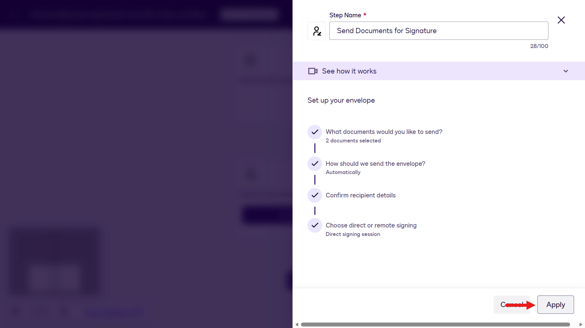

1. Select **Add a step**, we'll next add a Confirmation Screen for the Employee participant which will be displayed to them when they complete signing the document agreements.

    

1. Select **Show a Confirmation Screen**.

    

1. Select **Configure** to configure the step.

    

1. Select **Employee** as the participant for the confirmation screen.

    

1. Next, you have the option to configure the fields for message type, message title and message body. By default, there will be values already selected and entered. You can stick with the default values for the purpose of this lab. Select **Apply**.

    

1. OK home stretch, the final step in the workflow is to upload the signed document agreements into SharePoint for visibility of the agreements. To do this, you'll need to set up a connection to your SharePoint site and authorize the connection. Select **App Center** on the upper right of the designer.

    

1. A list of support services will appear. Scroll down and select **SharePoint**.

    

1. Select **Install App**.

    

1. Next, select **Install and Authorize**.

    

1. Select **Connect Account**.

    

1. You'll see a couple of options on how to connect a SharePoint account - either as a private connection for individual use or a shared connection for team access, before proceeding to the next step. Since you created your own Docusign developer account, stick with **Private** for the purpose of this lab.

   Select **Next**.

    

1. Enter a name for your SharePoint account such as `YourName_SharePoint_Docusign` or your Copilot Studio environment name.

   Select **Log In** on the bottom right.

    

1. Enter your credentials for your SharePoint site when prompted to sign in, and tick the checkbox to allow permissions. Then select **Accept**.

    

1. You'll now see confirmation you've been logged into your SharePoint account. Select **X** icon to exit from the App Center and you should be back in the workflow designer. Otherwise navigate to **Agreements**, select **Workflows**, and open the workflow to edit it.

    

1. Select **Add a step** as we'll add the SharePoint step as the final step for the workflow.

    

1. Select the **Apps** tab and select **Store files in SharePoint**.

    

1. Select **Configure** to configure the step.

    

1. Select the **Combined Envelope File** variable in the dropdown field. This represents the signed document agreements from the **Send Documents for Signature** step.

    

1. Next, select the **Connection** created earlier for your SharePoint site. This connection will be used in this step.

    

1. Next select your SharePoint site from the **Select site** dropdown. If you have more than one site, it will be listed so select the one that you want to upload the signed document agreements to.

    

1. For the drive, select **Document**.

    

1. For the folder, select the folder of your choice in your SharePoint site. For example in the screenshot, there's an existing folder - _Signed employees_ under _Documents_ in the _HR Team_ site.

    

1. Select **Next**.

    

1. In the final configuration step, you'll need to define the naming convention of the uploaded file. This can be achieved using variables from the workflow steps. We'll keep it simple by referencing the Envelope ID and the Employee Full name. Enter `env` and select **Envelope ID**.

    

1. Next, we'll add an underscore character. Select **Add Text**.

    

1. Enter `_` and select **Add**.

    

1. Select **Add Variable** and enter `full name`. Select the **Full Name** variable under **Collect data with web forms**.

    

1. You've completed naming the file 👏🏻 Select **Apply**.

    

1. Now it's time to publish the workflow. Select **Save Draft** on the upper right of the designer.

    

1. You'll see confirmation that the workflow has been saved. Select **Review & Publish**.

    

1. There will be confirmation on whether you workflow has errors. Select **Next**.

    

1. Next, we'll name the workflow instance which will be the name given to a workflow run. We'll use the name builder to select variables as part of the naming convention. Select the **+** icon to insert a variable.

    

1. Select the **Instance ID** variable.

    

1. Select the **+** icon again to insert another variable. Select the **Start Date and Time** variable.

    

1. In-between the variables, enter the underscore character, `_` to complete the naming convention.

   Select **Done**.

    

1. Select **Publish**.

    

1. Next, you'll authorize the sender of the workflow which will be yourself. Select **Authorize My Account**.

    

1. You'll be prompted to allow access for Workflow Builder (previously known as Docusign Maestro) to use your account. Select **Allow Access**.

    

1. Select **Publish**.

    

1. You'll see confirmation that the workflow has published successfully. Select **Go to Workflows**.

    

1. The workflow will now show a status of **Published**.

    

## 1.4 Test the workflow

Before we move onto building the agent in Microsoft Copilot Studio, it's best practice to run the workflow to test it. You can manually run the workflow by starting a new instance.

1. Open the workflow and on the upper right, select **Start Instance**.

    

1. A new modal will appear where you'll be required to provide the variables for the workflow start step. Fill in the fields with some sample data.

    ::: info Reminder on email address values
    Use two different email addresses that you have access to for the employee and hiring manager

    

1. After you've entered the values for the variables, select **Start**.

    

1. A confirmation will appear that the workflow instance has started.

    

1. For the email address you entered for the Employee participant, navigate to the email Inbox and open the Docusign email - it should have the subject of `***Test Email*** Review and complete workflow`. Select **Review**.

    

1. The first page of the Web Form will load, select **Start**.

    

1. You'll now see the **Your Name** page of the Web Form. Enter the first name and last name of the employee you provided earlier when entering sample data for the variables in the workflow start step.

    

1. Enter sample address information in the **Address** page of the Web Form.

    

1. The final step of the Web Form is to review the information entered. Select **Next**.

    

1. Once the Web Form has been submitted, the next steps in the workflow will execute which is generating the Employment Agreement and Offer Letter using the data from the Web Form for the document templates, and then requesting the Employee participant to sign. As the Employee participant you'll immediately be directed to signing the document.

   In a matter of minutes, the Employee participant goes from providing data in the Web Form, to signing the document which reduces the turnaround time for HR teams.

   **Tick the terms and conditions checkbox** and select **Continue**.

    

1. You'll now see the Employment Agreement. Notice how the text in blue displays the values entered from the variables in the Workflow Start step and from the Web Form you completed as the Employee (participant). Review the remainder of the Employment Agreement and then sign the agreement. Select **Start**.

    

1. Select the **Sign** icon to sign the Employment Agreement.

    

1. Next a modal will appear where you can confirm your signature details and select the style. The options are to use the default style, draw your signature or upload your signature. Continue with the default style and select **Adopt and Sign**.

    

1. Review the Offer Letter next, notice how the address information is now displayed - this is the information you entered in the Address page of the Web Form as the the Employee participant. Select the **Sign** tab icon which will direct you to the **Sign** icon in the Offer Letter.

   Select the **Sign** icon.

    

1. Select **Adopt and Sign** for the Offer Letter and then select **Finish**.

    

1. You'll next see the Confirmation Screen which is the step configured earlier.

    

1. Next, for the email address you entered for the Hiring Manager participant, navigate to the email Inbox and open the Docusign email - it should have the subject of `Complete this envelope with Docusign`. Select **Review Documents**.

1. Sign the Employment Agreement and Offer Letter, then select **Finish**.

    

1. If you're using the same email address of you Docusign Developer user account, you may see the following modal appear. Select **No Thanks**.

    

1. You'll see confirmation that the documents have been successfully signed.

    

1. For your Docusign Developer user account, if you navigate to the Inbox of the associated email address, you'll see an email with the signed document agreements.

    

1. The final step in the workflow was uploading the signed document agreements to SharePoint. Navigate to your SharePoint location of the folder and you'll see the .PDF file of the signed document agreements listed.

    

1. Open the .PDF file to see the document. You've now completed testing your workflow end-to-end manually! 🎉 Let's now build the agent in Microsoft Copilot Studio.

    

## 1.5 Build a custom agent in Microsoft Copilot Studio, connect to Docusign MCP, and trigger the workflow

1. Navigate to [https://copilotstudio.microsoft.com](https://copilotstudio.microsoft.com)

1. Sign in with your Microsoft 365 work or school account

> [!WARNING]
> You must be in a tenant where Copilot Studio is enabled.
> Make sure you switch to your dedicated developer environment.

1. Select **+ Create blank agent** and enter a name for your agent.

   For example,

   ```text
   Docusign MCP Demo
   ```

    It's also best practice to use a solution, select an existing solution for your agent. Refer to our [Recruit mission](../../recruit/04-creating-a-solution/index.md) to learn how to create a solution.

    Select **Create**.

    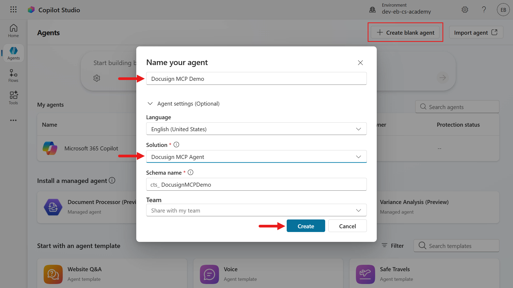

1. Edit the description for the agent. Copy and paste the following, then select **Save**.

   ```text
   This agent automates the HR recruitment process when hiring an employee by triggering Docusign Workflow Builder workflows. It sends Employment Agreements and Offer Letters to candidates for signature, and then routes the documents to the hiring manager for final signing.
   ```

    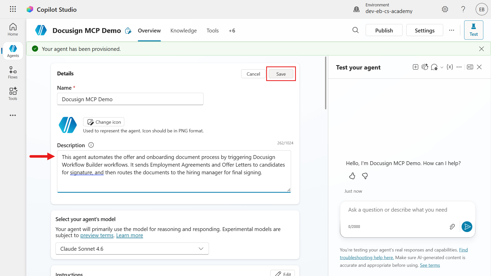

1. You'll next add instructions to the agent so that it has clear guidelines of how it should invoke the Workflow Builder workflow using the Docusign MCP Demo tool.

   Copy and paste the following, then select **Save**.

   ```text
   #Docusign Workflow Builder workflows
   - Get Docusign workflow requirements for 'Send Employment agreement and offer letter' workflow, collect the mandatory inputs from the user and only then trigger the workflow to send the documents to the candidate. Respond to the user to let them know if the workflow is triggered successfully.
   - For the startDate input in Docusign workflows, use today's date. Do not prompt or ask the user for the startDate
   ```

    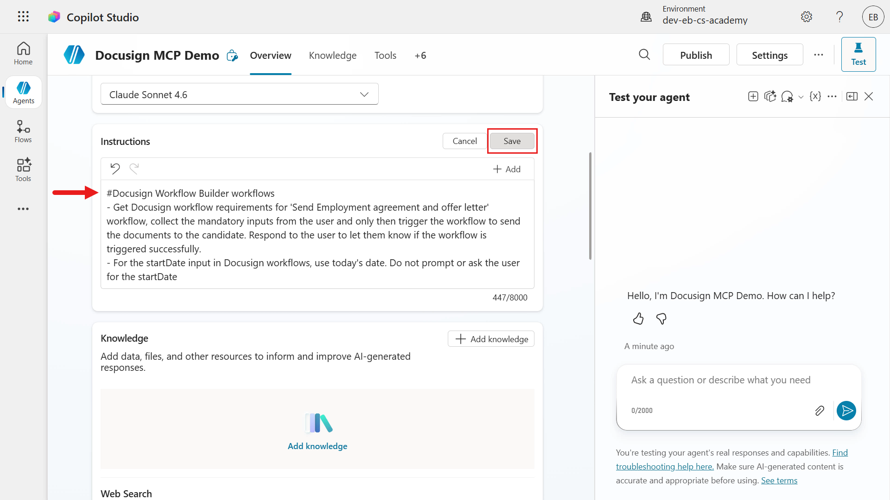

1. Next step is to add the Docusign MCP Demo server as a tool for our agent. Scroll down to the **Tools** section and select **+Add tool**.

   Enter `docusign` in the search field and select the **Model Context Protocol** filter.

    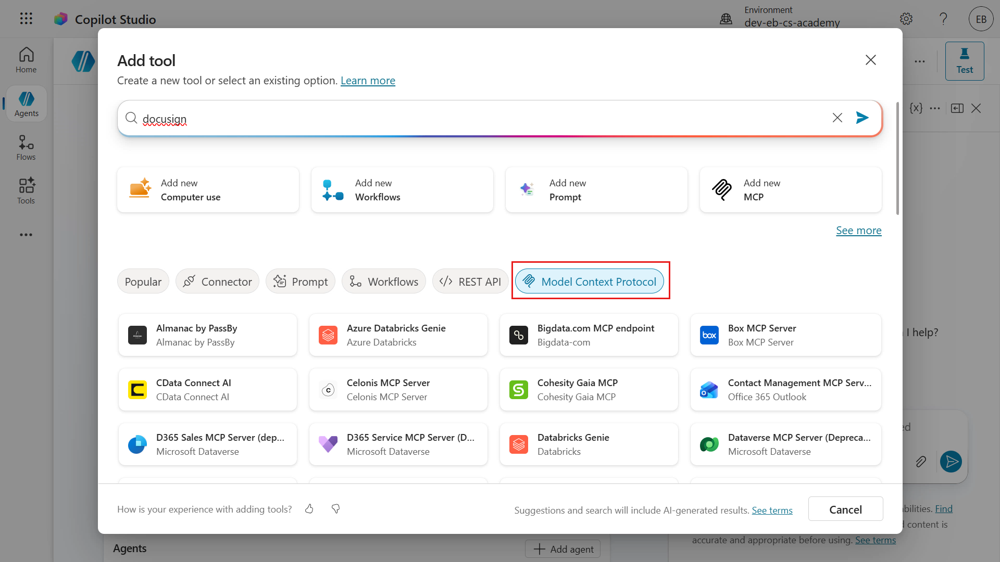

1. You may see multiple Docusign MCP servers listed. Select the **Docusign MCP Demo** tool.

    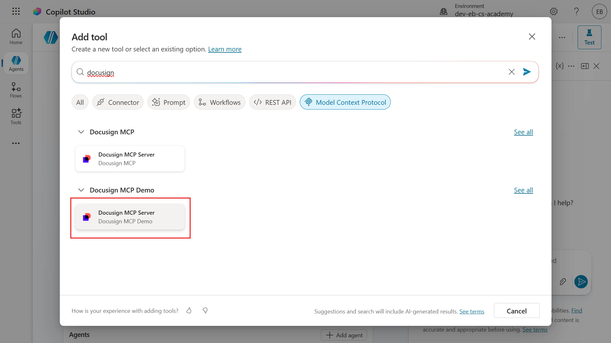

1. Next you'll need to add a new connection for your Docusign developer user account. Select the **chevron** icon and select **Create new connection**.

    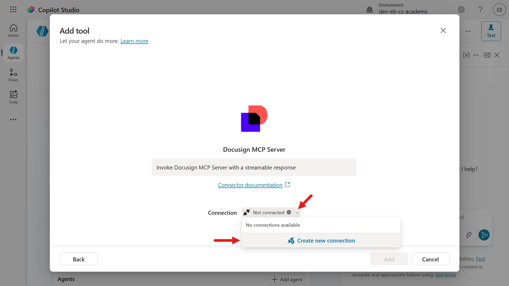

1. Select **Create** to enter your Docusign developer user account credentials.

    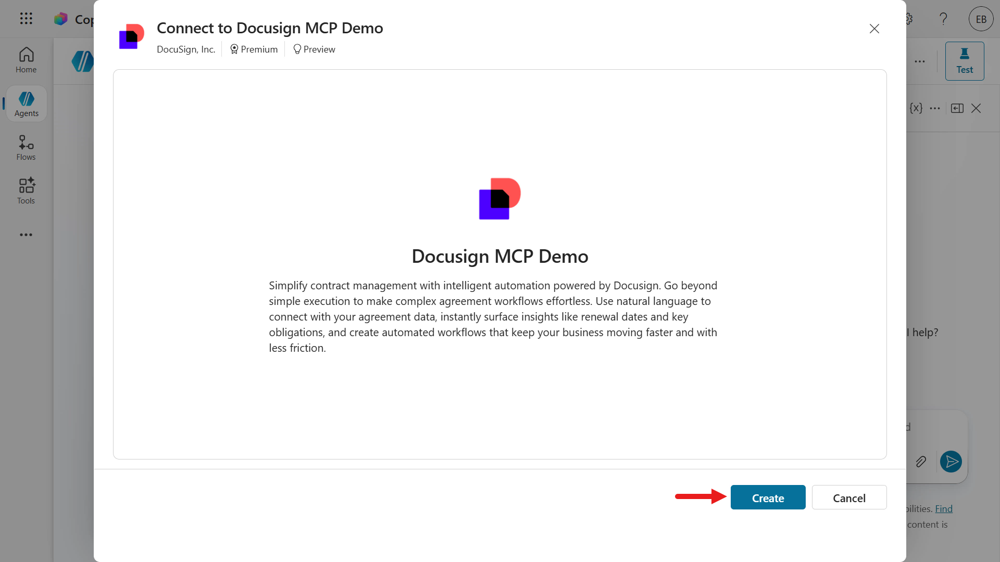

1. Enter your username and password for your Docusign developer user account.

    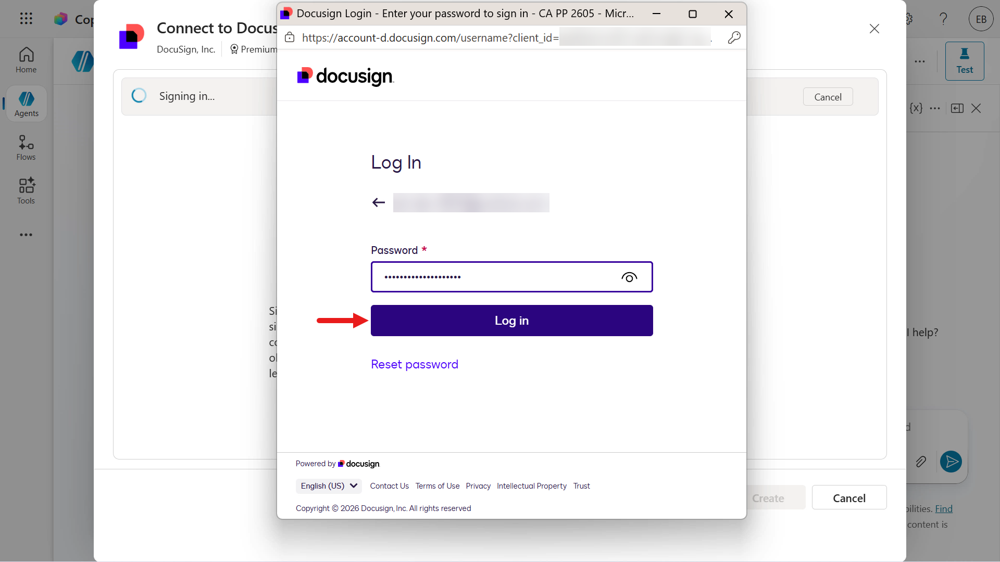

1. Next you'll need to verify your identity. Enter the SMS code you would've received and select **Verify**.

    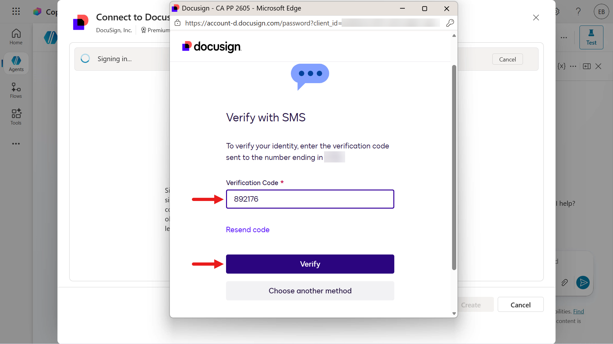

1. Select **Allow Access**. The connection will now be created, hooray! Let's now test the agent.

    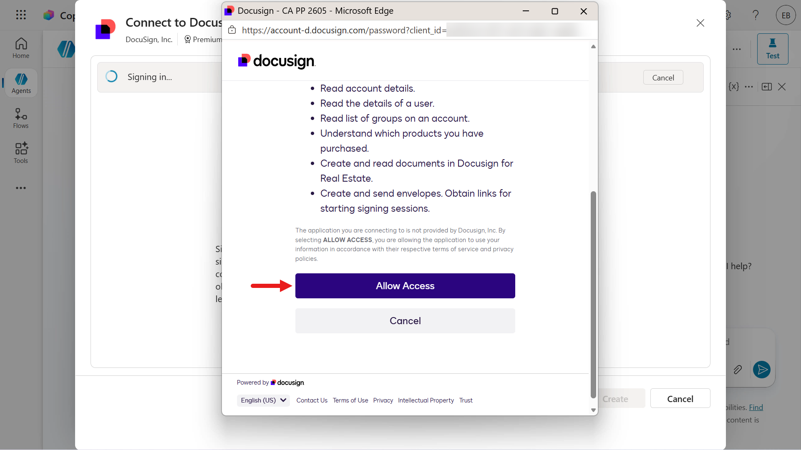

1. Start a new test session by selecting the **+** icon in the test pane and enter the below text.

   ```text
   Send an employment agreement and offer letter to [employee name], [email address]
   ```

   - Replace the `[employee name]` with a name.
   - Replace the `[email address]` placeholder using an email address for the employee (use the same one for the Employee participant when you manually tested the workflow earlier in Docusign).

    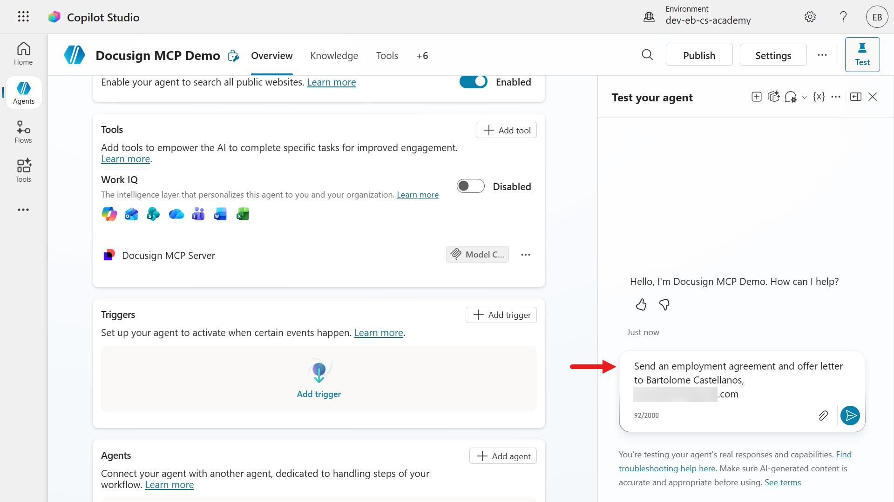

1. In the test pane, the agent prompts you to select **Open connect manager** to verify your credentials.

   Select **Open connect manager**.

    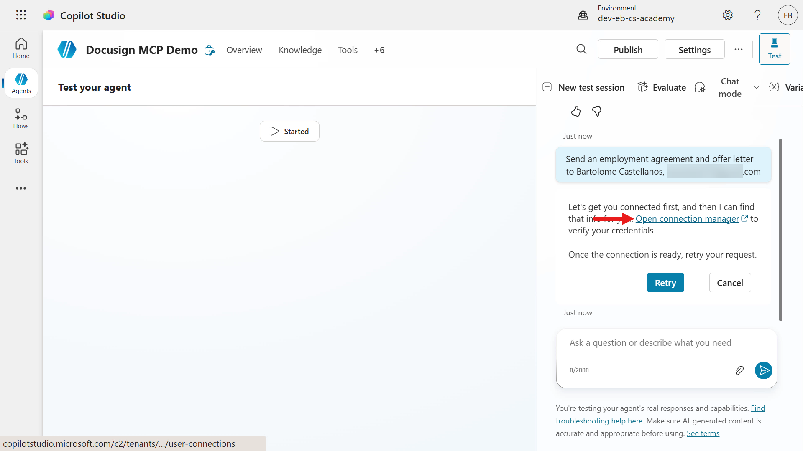

1. Select **Connect** to authorize the agent to use the tool.

    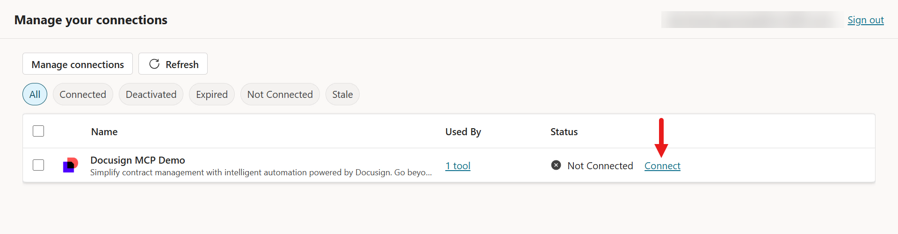

1. Next, it will load the connection using the credentials you entered earlier for your Docusign developer user account.

   Select **Submit**.

    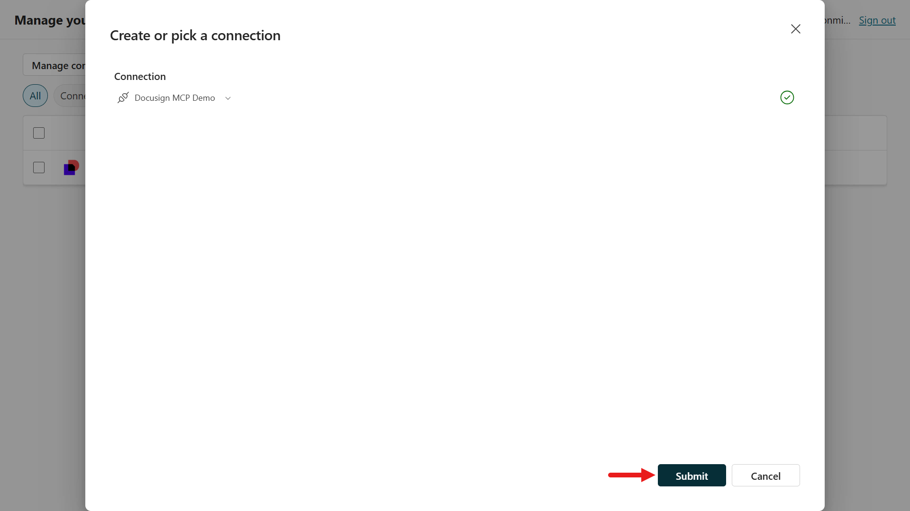

1. Back in the test pane, select **Retry**.

    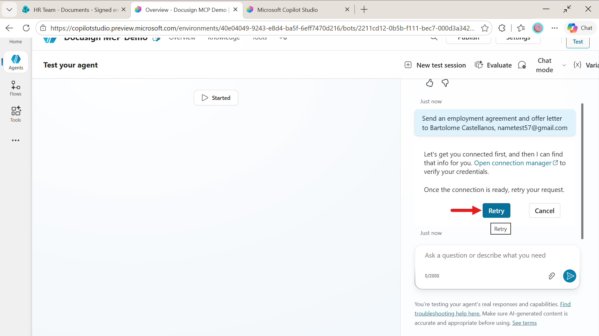

1. Your agent will now interact with the Docusign MCP Demo tool based on the instructions entered earlier, where it will retrieve the Docusign workflow requirements for `Send Employment agreement and offer letter` workflow.

   First, the orchestrator will fetch details about your Docusign developer user account, then retrieve the list of workflows to identify the `Send Employment agreement and offer letter` workflow, and then retrieve the workflow requirements which are the variables you configured for the **Start** step of the workflow.

   Then you'll be prompted to enter the missing variable values needed since you only provided the employee name and the email address.

    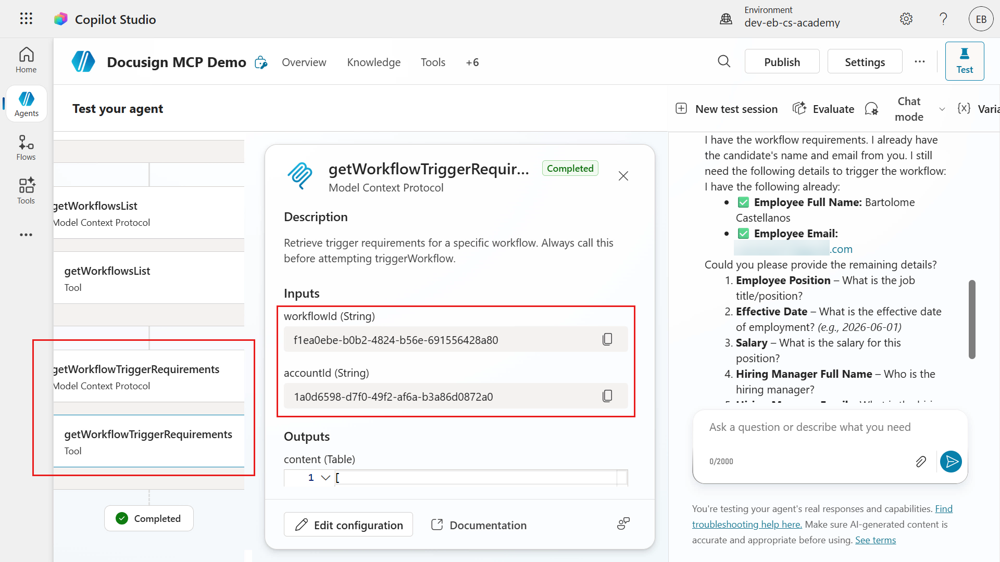

1. Enter the below text.

   ```text
   employee position is [position], effective date and start date is [MMMM d], salary is [salary dollar amount], based in [city], reporting to [manager full name] [manager email address], and due signed date is [MMMM d]
   ```

   - Replace the `[position]` placeholder with job position such as `Power Platform Engineer`.
   - Replace the `[MMMM d]` placeholder with the full month name and day such as `August 25`. `d` means no leading zero (August 5).
   - Replace the `[salary dollar amount]` with a dollar amount value.
   - Replace the `[city]` placeholder with a city of where the employee will be working in.
   - Replace the `[manager full name]` with a name of the manager.
   - Replace the `[manager email address]` placeholder using an email address for the manager (use the same one for the Hiring Manager participant when you manually tested the workflow earlier in Docusign).

1. The orchestrator will trigger the workflow as all the variables for the workflow start step have bene provided. You'll see confirmation that the workflow was successfully triggered.

    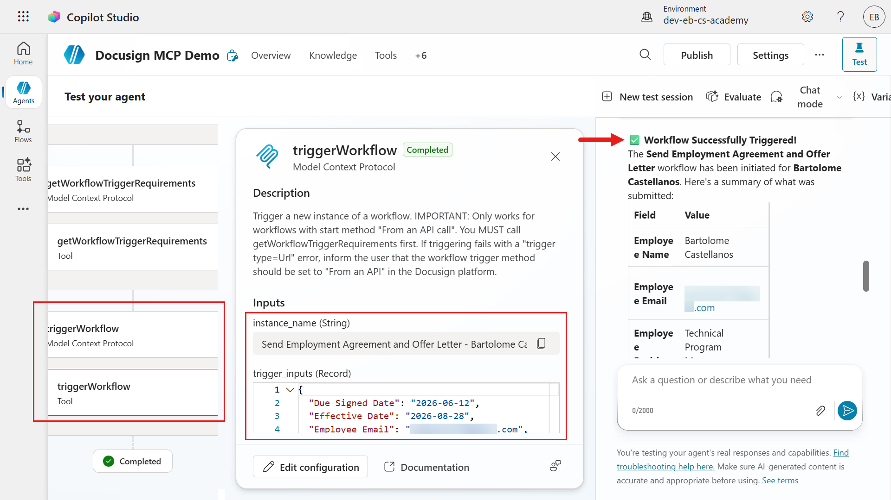

   You'll also see the Instance ID reference of the workflow.

    

1. Follow the same steps of completing the workflow.

   - First navigate to the email Inbox of the email address you entered for the Employee participant and open the Docusign email. It should have the subject of `***Test Email*** Review and complete workflow`. Select **Review** to complete the web form followed by signing the agreements.

        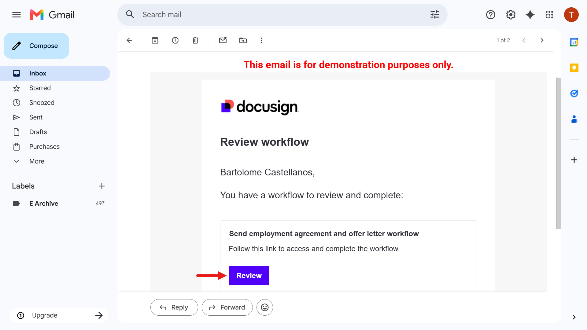

   - Navigate to the email Inbox of the email address you entered for the Hiring Manager participant and open the Docusign email to sign the agreements.
   - Lastly the final signed agreements should be uploaded to SharePoint.

        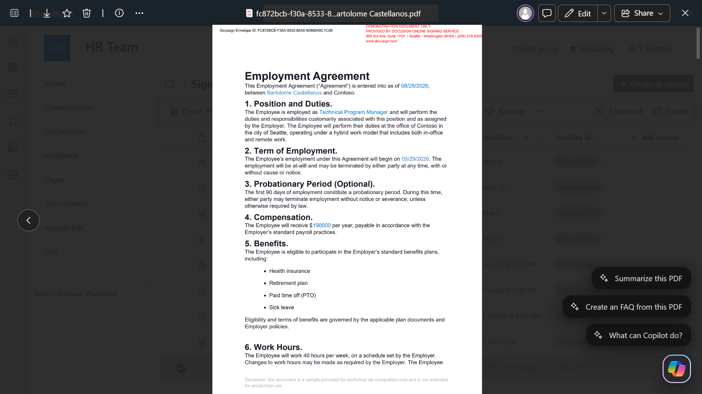

**Congrats!!!** 🥳 You've now learnt how to invoke your workflow created in Workflow Builder from your agent through the **Docusign MCP Demo** tool.

If you want to continue to the bonus exercise of this lab, feel free to do so.

## 1.6 BONUS - Add Work IQ Calendar tool (Frontier program) for multi-MCP capabilities

If your tenant and user has been enabled to use Frontier features, try the following exercise for your agent to combine the power of a first-party Microsoft MCP server (Work IQ Calendar) with a third-party service MCP server (Docusign MCP Demo).

The agent will be updated to automatically create an Outlook meeting in your calendar to dedicate time in reviewing the HR pre-onboarding checklist. To achieve this, we'll use the Work IQ Calendar (Preview) tool.

    ::: info IT Admin Guide to enabling Frontier
    Refer to the [IT Admin Guide](https://www.microsoft.com/microsoft-365-copilot/frontier-it-admins) which outlines the requirements and details of enabling Frontier in your tenant.

1. Update the agent instructions to include details in creating an Outlook meeting in your calendar after the Workflow Builder workflow has successfully triggered. You can provide instructions such as creating the meeting invite 2 working days before the effective date, or specify the time zone to use. Below is an example.

   ```text
   - After sending the response to confirm the workflow was triggered successfully, automatically create a 1-hour Outlook meeting in the user's calendar without asking for any additional input. Schedule the meeting exactly 2 workdays before the agreement's Effective Date, ensuring it does not fall on a Saturday or Sunday, and use the user's work hours. Hardcode the time zone to (UTC+12:00) Auckland, Wellington so that no time zone selection is required. Set the subject to: Review pre-onboarding checklist for [Employee Fullname] where [Employee Fullname] comes from the Docusign Workflow Builder workflow.
   - Finally, send a response to the user confirming that the meeting has been created.
   ```

   The orchestrator will insert the variable value of the Employee Fullname placeholders in square brackets.

   Make sure select **Save** after updating the agent instructions.

    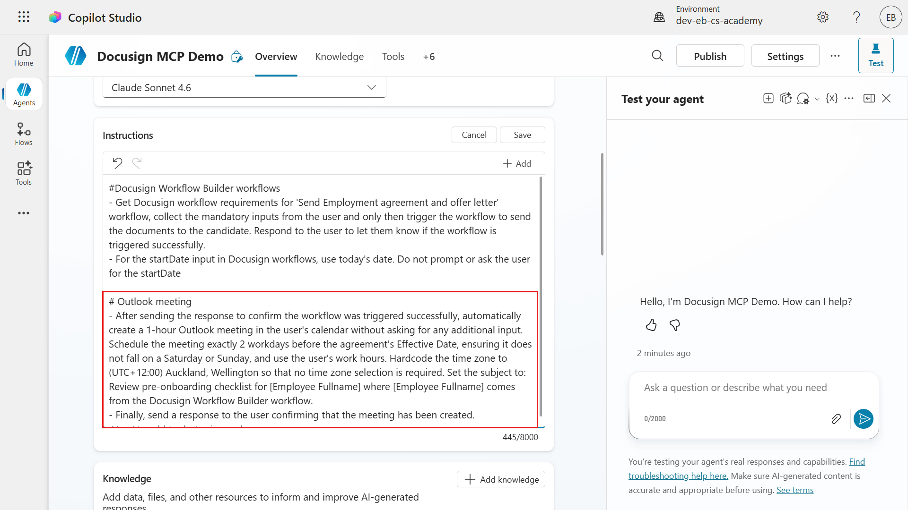

1. Next scroll down to **Tools** and **+Add tool**.

    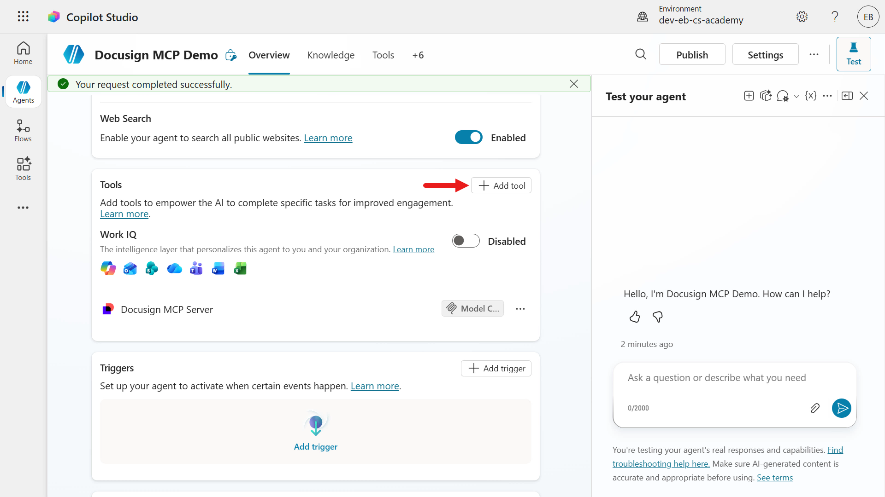

1. Select the **Model Context Protocol** filter.

    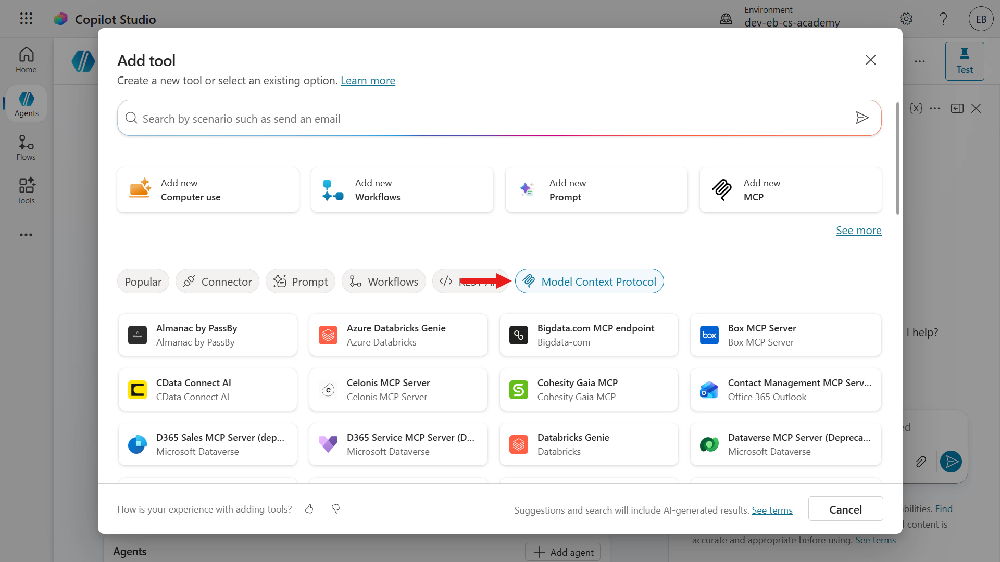

1. In the search field, enter `work iq`. Select the **Work IQ Calendar (Preview)** tool.

    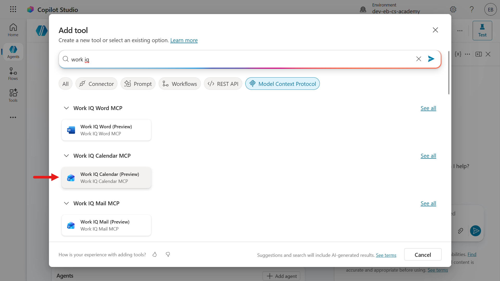

1. You'll next need to create a connection for the tool using your signed in user account for your developer environment. Select the **chevron icon** and select **Create new connection**.

    

1. Select your signed in user account.

    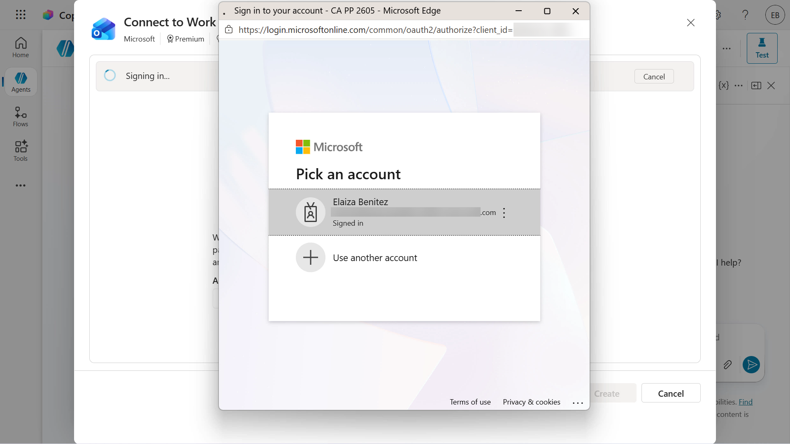

1. Now that the connection has been created, select **Add**.

    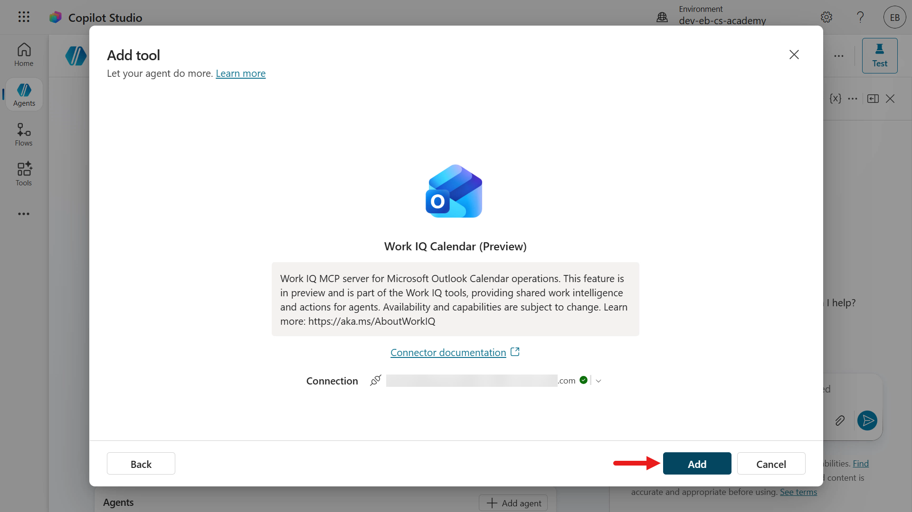

1. The tool has now been added so you can now test your updated agent. Start a new test session by selecting the **+** icon in the test pane and enter the below text.

   ```text
   Send an employment agreement and offer letter to [employee name], [email address]
   ```

   - Replace the `[employee name]` with a name.
   - Replace the `[email address]` placeholder using an email address for the employee (use the same one for the Employee participant when you manually tested the workflow earlier in Docusign).

    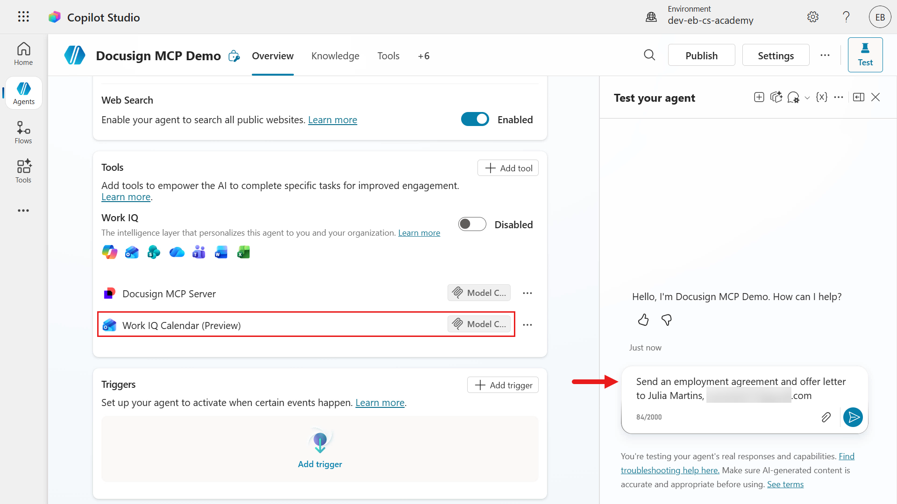

1. The agent will respond with a consent card. Select **Allow** to consent with the MCP server using your data.

    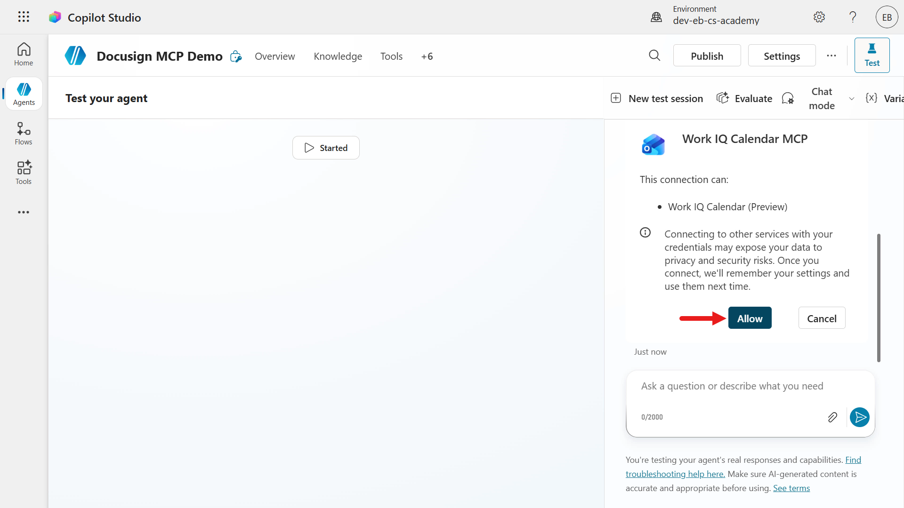

1. Next, the orchestrator will invoke the Docusign MCP Demo tool to retrieve the workflow and the workflow trigger requirements. Repeat the same step in the previous exercise by entering the below text, replacing the placeholders and submitting the information to the agent.

   Use a date value for the effective date and start date that falls on a Monday or Tuesday to confirm the instructions of creating it _2 working days_ before the date is adhered to.

   ```text
   employee position is [position], effective date and start date is [MMMM d], salary is [salary dollar amount], based in [city], reporting to [manager full name] [manager email address], and due signed date is [MMMM d]
   ```

    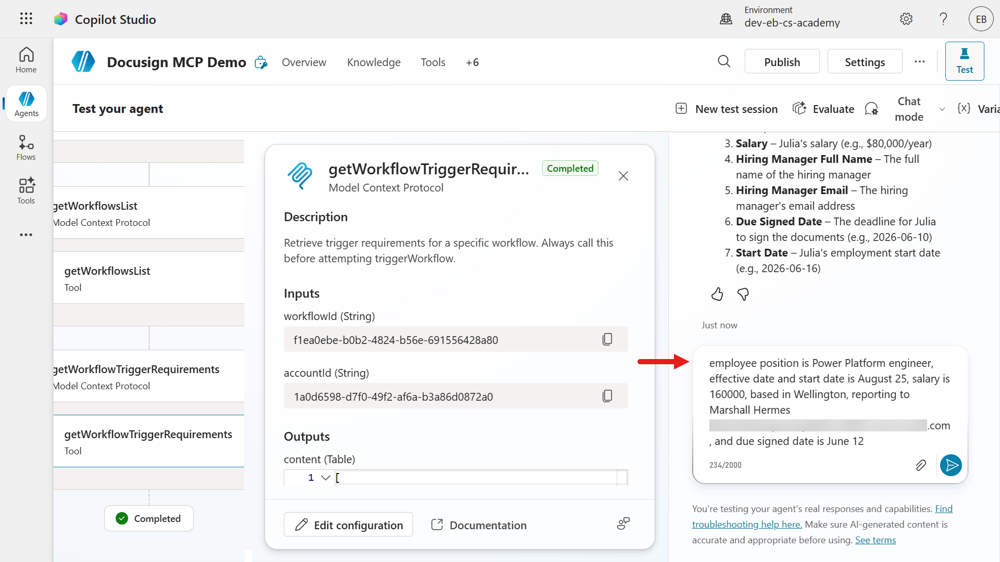

1. The workflow will successfully be triggered.

    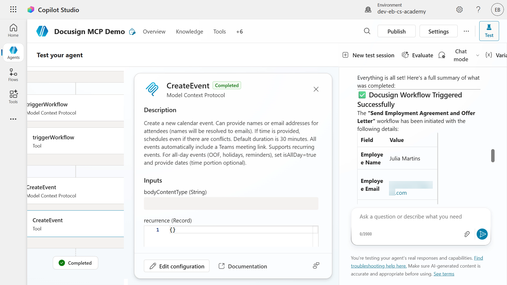

1. The agent will also confirm that the Outlook Meeting has been created successfully 🙌🏻

    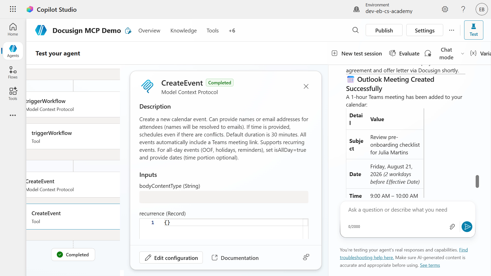

1. Navigate to your Outlook calendar and find the meeting invite. In the screenshot below the meeting has been created for the Friday, 2 working days before the Tuesday effective date.

    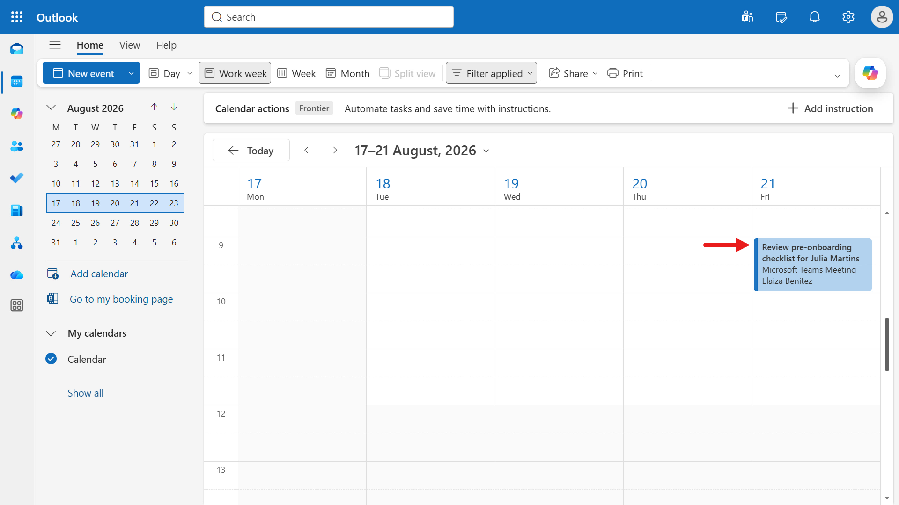

1. After you completed the workflow process, once again the signed document will be uploaded to SharePoint.

    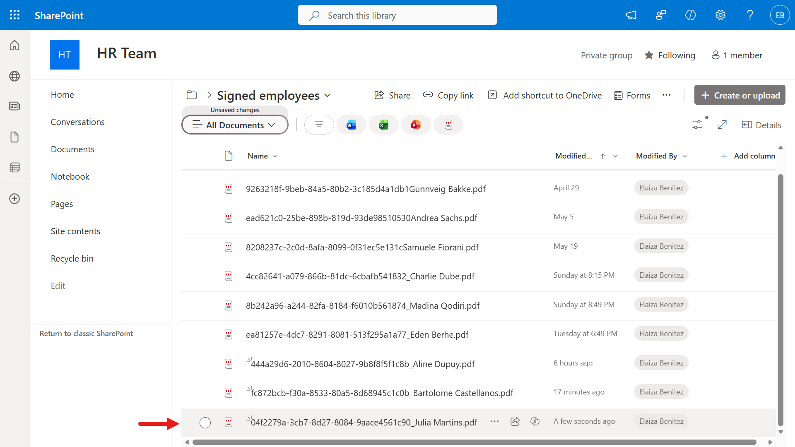

## ✅ Mission Accomplished {#mission-accomplished}

TBC

## 📚 Tactical Resources {#tactical-resources}

> [!NOTE]
> 🚧 This mission is under construction. Check back soon for the full walkthrough.
