---
tags:
  - mcp
  - oauth
difficulty: 3
time: 45
description: >-
  Consume a secured MCP server protected with OAuth 2.0 authorization from a
  Microsoft Copilot Studio agent.
badge: ./assets/Academy_OAuth_Badge.png
products:
  - copilot-studio
  - entra-id
  - visual-studio-code
industries:
  - it
created-date: 2026-07-23
last-edited-date: 2026-07-23
hide: true
---

# 🔐 Consuming a Secured MCP Server with OAuth 2.0 {#consuming-a-secured-mcp-server-with-oauth-20}

<mission-meta />

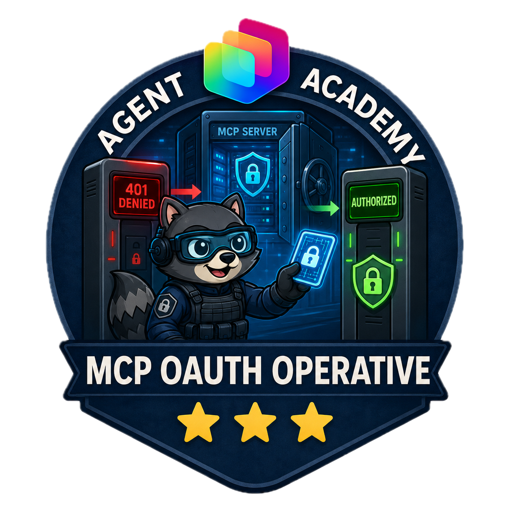

Welcome, agent. Your mission is **Operation Clearance**: connect a **secured MCP server** to a Microsoft Copilot Studio agent, with **OAuth 2.0** standing guard at the door. No token, no entry. You'll register the credentials, wire up the Authorization Code Flow, and prove that only authenticated operatives can reach the HR candidate files. 🎯🔑

> [!NOTE]
> This mission has been updated for the **new Copilot Studio experience**.

This mission builds on the concepts from the [Microsoft Copilot Studio ❤️ MCP](../mcs-mcp/index.md) mission. You worked with an unauthenticated MCP server there; here you'll secure a custom MCP server with OAuth 2.0 Authorization.

## 🔧 What You'll Build {#what-youll-build}

- A pre-built **HR MCP server** (.NET) that validates OAuth 2.0 JWT bearer tokens
- Two **Microsoft Entra ID** app registrations — a backend (the API) and a client (Copilot Studio)
- A Copilot Studio agent that consumes the secured MCP tools using **OAuth 2.0 Authorization**

## ⚙️ Prerequisites {#prerequisites}

- Microsoft Copilot Studio trial or paid account. If you don't have one, see the [course setup](https://microsoft.github.io/agent-academy/recruit/00-course-setup/) instructions.
- Permission to register applications in **Microsoft Entra ID** (and to grant admin consent).
- **Visual Studio Code**, the **.NET SDK**, and the **dev tunnel** CLI installed locally.

> [!NOTE]
> Labs 1.1 and 1.2 run on your local machine and in the Entra admin center. Labs 1.3–1.5 run in Copilot Studio. Keep the server and dev tunnel running for the whole mission.

### What is OAuth 2.0 Authorization Code Flow?

Think of OAuth 2.0 as the **clearance checkpoint** for your agent. Here's how the flow plays out in this mission:

1. **User authentication** — when a user triggers an MCP tool in your agent, they're asked to sign in to Microsoft Entra ID.
1. **Authorization code issued** — after login, Entra ID returns an authorization code to Copilot Studio via the redirect URI.
1. **Token exchange** — Copilot Studio exchanges that code (plus client credentials) for an access token.
1. **API access** — Copilot Studio sends the access token to your MCP server, which validates it before processing the request.

This ensures user credentials are never exposed to the server, tokens have limited lifetimes and scopes, and the server can verify identity and permissions.

## 🎯 The Scenario {#the-scenario}

Zava's HR team runs a candidate-management MCP server exposing sensitive people data. An unauthenticated endpoint is a non-starter for production. Your job: put OAuth 2.0 in front of it and connect it to a Copilot Studio agent so only authenticated employees can list, search, add, update, or remove candidates.

## 🧪 Lab 1.1 - Set Up the Secured MCP Server {#lab-11-set-up-the-secured-mcp-server}

The secured HR MCP server is an OAuth-protected version of a standard HR candidate server. It exposes the same tools:

- **list_candidates** — return the full list of candidates
- **search_candidates** — search by name, email, skills, or role
- **add_candidate** — add a new candidate
- **update_candidate** — update an existing candidate by email
- **remove_candidate** — remove a candidate by email

The difference: every request requires a valid OAuth 2.0 access token in the `Authorization` header, validated as a JWT against your Entra ID tenant.

1. Download the pre-built secured HR MCP server files [from here](./assets/hr-mcp-server-secured).

1. Extract the zip and open the folder in **Visual Studio Code**. The server is already implemented with OAuth 2.0 security.

    The main elements of the project are:

    - `Configuration/HRMCPServerConfiguration.cs` — configuration settings, including OAuth
    - `Data/candidates.json` — the candidate list
    - `Services/` — `ICandidateService.cs` / `CandidateService.cs` and `IAuthorizationService.cs` / `AuthorizationService.cs`
    - `Tools/HRTools.cs` and `Tools/Models.cs` — the MCP tools and their data models
    - `appsettings.json.sample` — the configuration template
    - `Program.cs` — entry point, where the MCP server initializes JWT authentication

> [!NOTE]
> The server includes JWT bearer authentication middleware that validates incoming tokens against your Entra ID tenant, so only authenticated users can reach the HR tools.

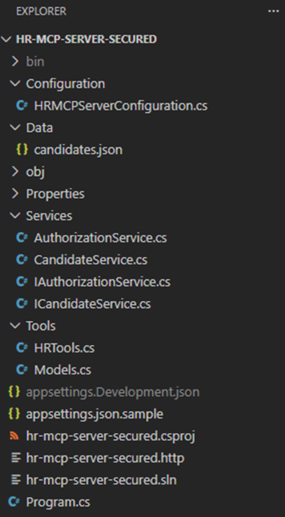

## 🧪 Lab 1.2 - Configure Microsoft Entra ID Applications {#lab-12-configure-microsoft-entra-id-applications}

You'll register two applications: one for the HR MCP Server (backend/API) and one for the Copilot Studio client (frontend).

### Register the HR MCP Server application (backend)

1. Open [https://entra.microsoft.com](https://entra.microsoft.com) with your work account.

1. In the left navigation, select **App registrations** → **+ New registration**.

    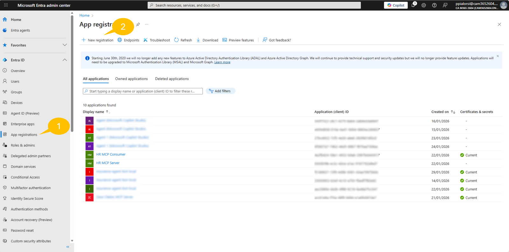

1. Configure the application with these settings:

    - **Name**:

    ```text
    HR MCP Server
    ```

    - **Supported account types**: **Accounts in this organizational directory only**
    - **Redirect URI**: leave blank for now (we'll configure this later if needed)

1. Select **Register** to create the application.

    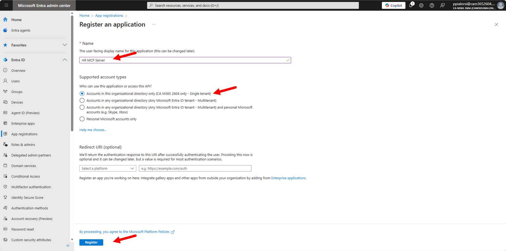

### Expose an API on the backend

1. In the **HR MCP Server** application, select **Expose an API**.

1. Next to **Application ID URI**, select **Add**, accept the default (`api://<client-id>`), and select **Save**.

    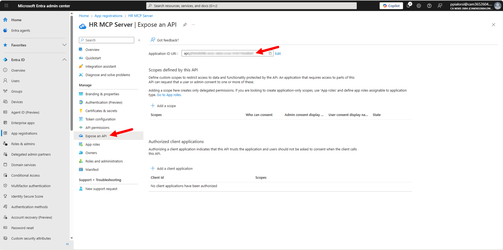

1. In **Scopes defined by this API**, select **+ Add a scope** and configure:

    - **Scope name**: `HR.Manage`
    - **Who can consent?**: **Admins and users**
    - **Admin consent display name**: `Manage HR data`
    - **Admin consent description**:

        ```text
        Allows managing HR data as an Admin
        ```

    - **User consent display name**: `Manage HR data`
    - **User consent description**:

        ```text
        Allows managing HR data as a user
        ```

    - **State**: **Enabled**

1. Select **Add scope**.

    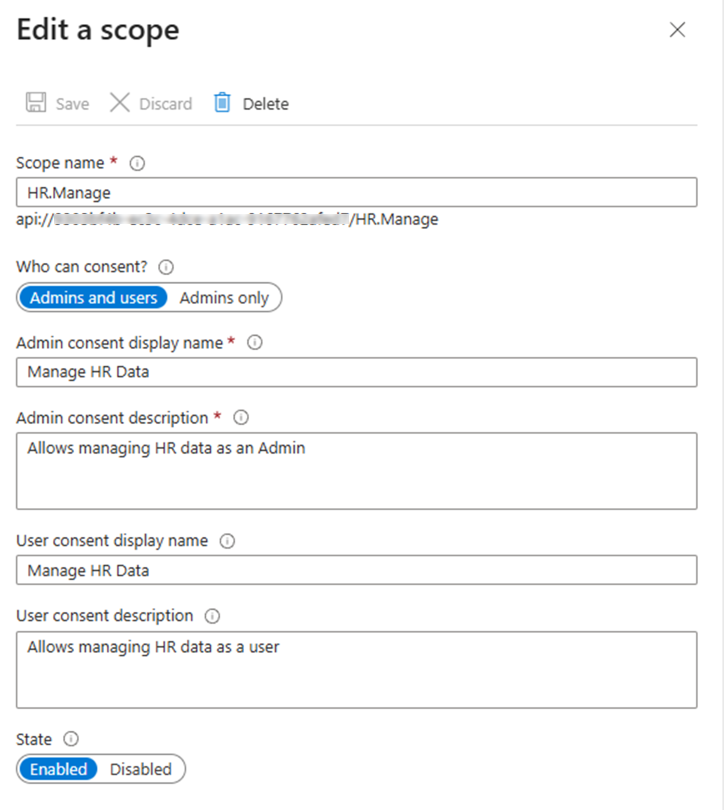

1. On the **Overview** page, record the **Application (client) ID** and **Directory (tenant) ID** — you'll need them later.

### Register the Copilot Studio client application (frontend)

Now you need to create a second application that represents Copilot Studio as a client consuming the HR MCP Server.

1. Back in **App registrations**, select **+ New registration**.

1. Configure with the following properties and **Register**:

    - **Name**: `HR MCP Consumer`
    - **Supported account types**: **Accounts in this organizational directory only**
    - **Redirect URI**: leave blank (Copilot Studio provides it later)

### Create a client secret

After registration, configure the client application with the necessary permissions and credentials.

1. In the **HR MCP Consumer** application, select **Certificates & secrets** → **+ New client secret**.

1. Set a **Description** and an **Expires** period (e.g., 12 months), then select **Add**.

> [!IMPORTANT]
> Copy the secret **Value** immediately and store it securely — it will not be shown again.

### Configure API permissions

1. Select **API permissions** → **+ Add a permission** → **APIs my organization uses**, search **HR MCP Server**, and select it.

    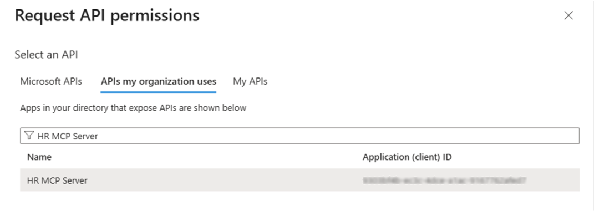

1. Select **Delegated permissions**, check **HR.Manage**, then select **Add permissions**.

    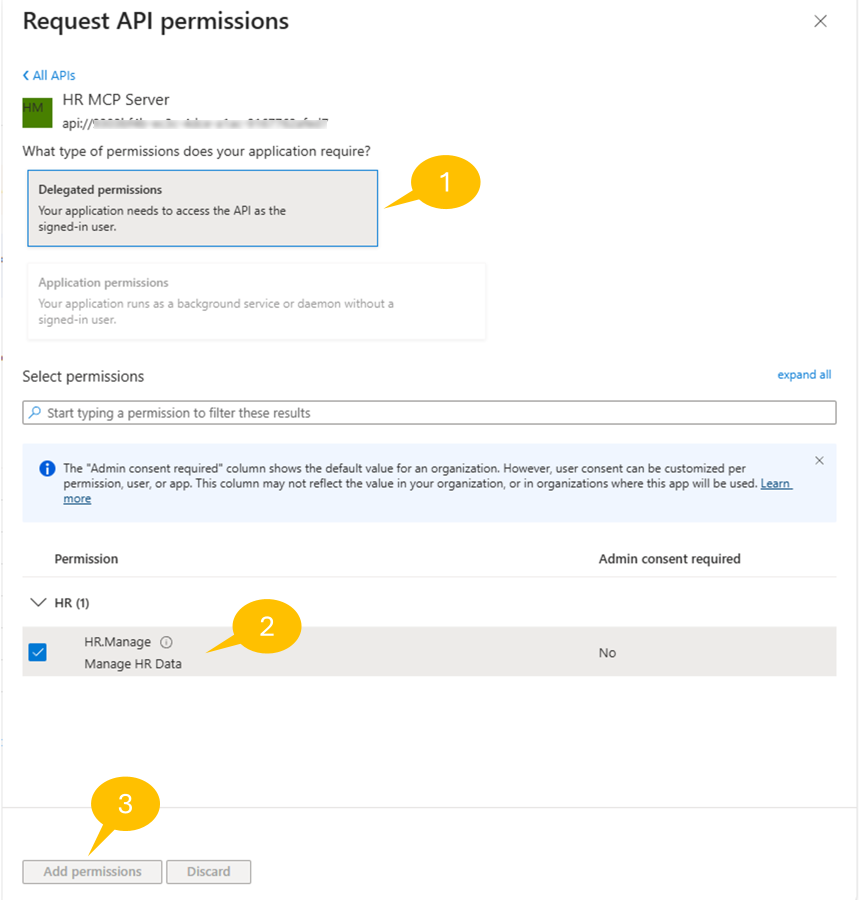

1. Add Microsoft Graph delegated permissions: **+ Add a permission** → **Microsoft Graph** → **Delegated permissions** → select **email**, **openid**, **profile**, **User.Read** → **Add permissions**.

1. Select **Grant admin consent for [Your Tenant]** and confirm with **Yes**.

    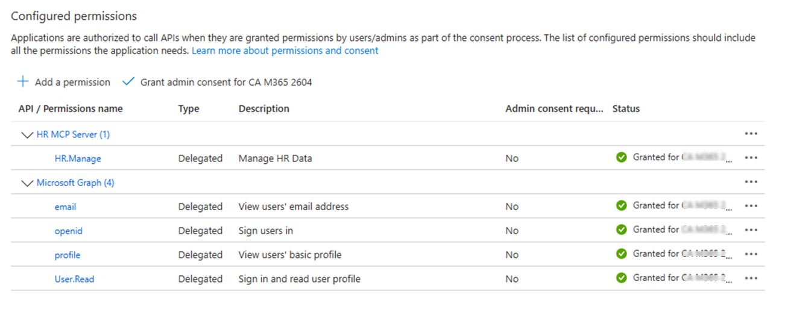

1. From the **Overview** page, record the **Application (client) ID** (you already have the secret value).

### Configure and run the MCP server

1. Copy `appsettings.json.sample` to a new file named `appsettings.json` and update the `AzureAd` section:

    ```json
    {
      "AzureAd": {
        "Instance": "https://login.microsoftonline.com/",
        "TenantId": "[YOUR_TENANT_ID]",
        "ClientId": "[YOUR_HR_MCP_SERVER_CLIENT_ID]",
        "Audience": "[YOUR_HR_MCP_SERVER_CLIENT_ID]",
        "Scopes": "[YOUR_APPLICATION_ID_URI]/HR.Manage"
      }
    }
    ```

    Replace `[YOUR_TENANT_ID]` and `[YOUR_HR_MCP_SERVER_CLIENT_ID]` with the values from the backend app, and `[YOUR_APPLICATION_ID_URI]` with the Application ID URI (e.g., `api://xxxxxxxx-...`).

1. Save the file and start the server:

    ```bash
    dotnet run
    ```

    Any request without a valid access token is now rejected with **401 Unauthorized**.

### Expose the server with a dev tunnel

1. If you haven't installed dev tunnel, follow the [dev tunnels get-started guide](https://learn.microsoft.com/azure/developer/dev-tunnels/get-started), then host a tunnel:

    > [!IMPORTANT]
    > Replace `hr-mcp-secured` with a unique name (e.g., `hr-mcp-secured-alex`).

    ```bash
    devtunnel create hr-mcp-secured -a --host-header unchanged
    devtunnel port create hr-mcp-secured -p 47002
    devtunnel host hr-mcp-secured
    ```

1. Copy the **Connect via browser** URL and save it — you'll use it in Copilot Studio and in Entra ID.

    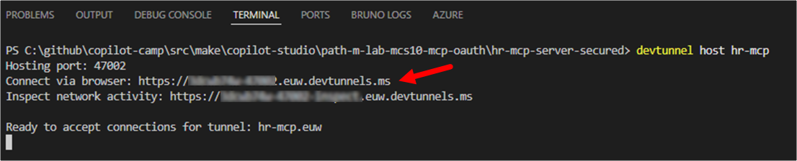

> [!TIP]
> Keep both the server (`dotnet run`) and the tunnel (`devtunnel host hr-mcp-secured`) running throughout the mission.

### Update the Application ID URI and configuration

1. In the [Entra admin center](https://entra.microsoft.com), open the **HR MCP Server** app → **Expose an API** → next to **Application ID URI** select **Edit**, replace `api://<guid>` with your dev tunnel URL (no trailing slash, e.g., `https://hr-mcp-secured.devtunnels.ms`), and **Save**.

1. Update `appsettings.json` so `Scopes` uses the dev tunnel URL:

    ```json
    {
      "AzureAd": {
        "Instance": "https://login.microsoftonline.com/",
        "TenantId": "[YOUR_TENANT_ID]",
        "ClientId": "[YOUR_HR_MCP_SERVER_CLIENT_ID]",
        "Audience": "[YOUR_HR_MCP_SERVER_CLIENT_ID]",
        "Scopes": "[YOUR_DEVTUNNEL_URL]/HR.Manage"
      }
    }
    ```

1. Save, stop the server (`Ctrl+C`), and start it again with `dotnet run`.

<!-- REFORMAT-ONLY: Lab 1.2 runs in the Entra admin center and local terminal; it does not
     depend on the Copilot Studio experience. Screenshots were not recaptured. -->

## 🧪 Lab 1.3 - Create the Agent in Copilot Studio {#lab-13-create-the-agent-in-copilot-studio}

Now create the agent that will consume the secured MCP server.

1. Navigate to [Microsoft Copilot Studio](https://copilotstudio.microsoft.com) and sign in. On the home page, under **Or select what you'd like to build**, select the **Agent** card. You land directly in the Build editor.

1. Copy and paste the following as the **Name your agent** value:

    ```text
    HR Candidate Management (Secured)
    ```

    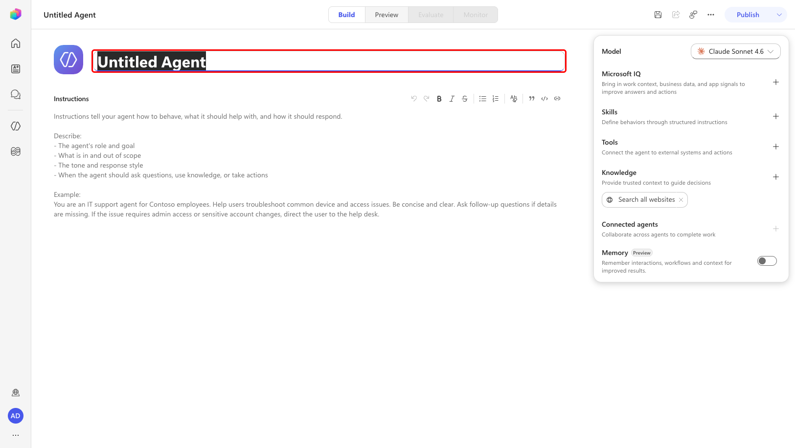

1. Select the **Instructions** field on the Build tab and copy and paste the following as the **Instructions**:

    ```text
    You are a helpful HR assistant that specializes in secure candidate management. You can help users search for candidates, check their availability, get detailed candidate information, and add new candidates to the system.

    All operations require user authentication through OAuth 2.0 to ensure data security and compliance with enterprise policies.

    Always provide clear and helpful information about candidates, including their skills, experience, contact details, and availability status.
    ```

1. In the right-hand configuration panel, open the **Model** dropdown and select **GPT-5 Chat**.

    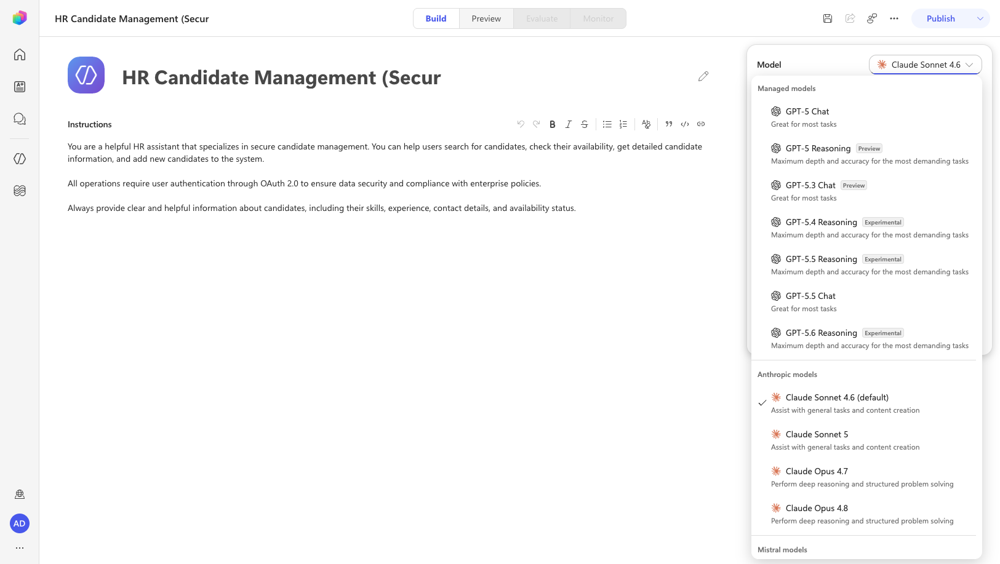

1. Select **Save** in the top toolbar.

    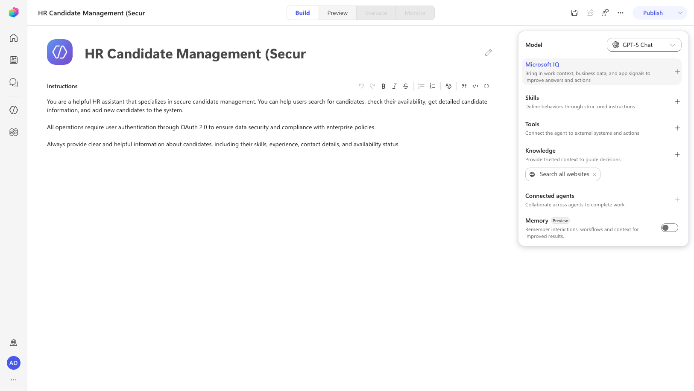

1. In the **Knowledge** section on the Build tab, remove the **Search all websites** source by selecting its **X** (Remove). This restricts the agent to the tools and knowledge you explicitly configure.

1. Configure conversation starters. Select **More options (…)** in the top toolbar → **Settings** → the **Greeting & prompts** tab → under **Suggested prompts**, select **Add a suggested prompt** and fill in each **Title** and **Message**:

    - Title: `List all candidates` — Message: `Show me all candidates in the HR system`
    - Title: `Search candidates` — Message: `Search for candidates with skills in [SKILL]`
    - Title: `Add new candidate` — Message: `Add a new candidate with firstname [FIRSTNAME], lastname [LASTNAME], email [EMAIL], role [ROLE], languages [LANGUAGES], and skills [SKILLS]`

    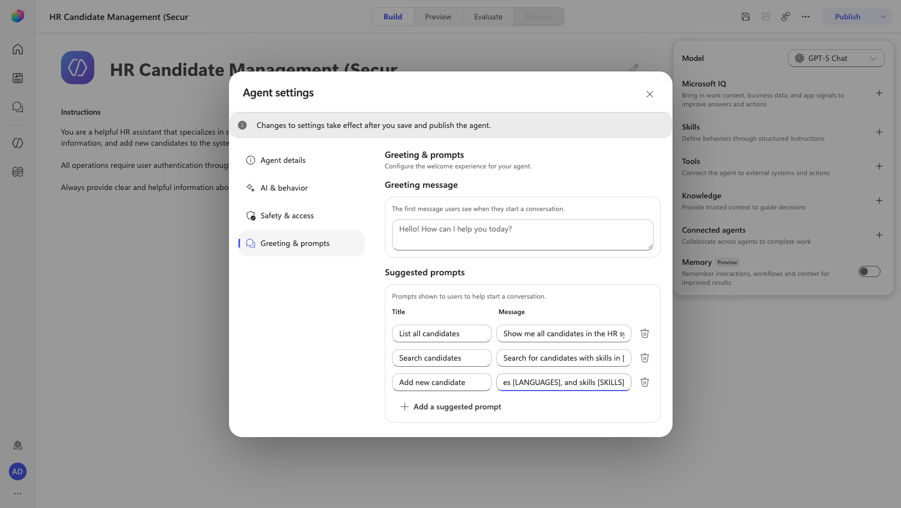

1. Close **Settings** and select **Save**.

## 🧪 Lab 1.4 - Register the MCP Tool with OAuth 2.0 {#lab-14-register-the-mcp-tool-with-oauth-20}

Now add the secured MCP server as a tool and wire up OAuth 2.0.

1. In the right-hand configuration panel, on the **Tools** section, select **Add tool**. In the **Add a tool** dialog, select the custom **Add** (+) control and choose **Model Context Protocol (MCP)** to create a new custom MCP server.

    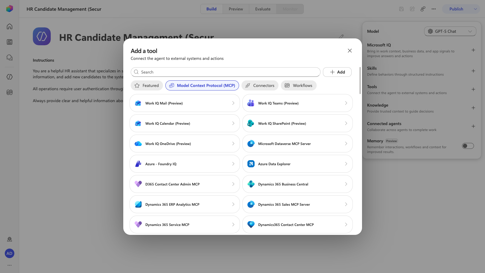

1. In the **Add MCP server** dialog, enter the basic settings:

    - **Server name**:

        ```text
        HR MCP Server Secured
        ```

    - **Server description**:

        ```text
        Securely manages HR candidates with OAuth 2.0 authentication for enterprise compliance
        ```

    - **Server URL**: the dev tunnel **Connect via browser** URL you saved earlier

    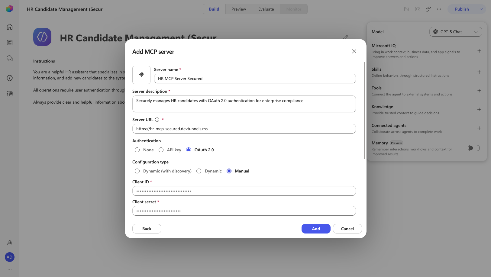

1. Under **Authentication**, select **OAuth 2.0**, then set **Configuration type** to **Manual** and configure:

    - **Client ID**: the **Application (client) ID** of your **HR MCP Consumer** app
    - **Client secret**: the client secret **Value** you saved earlier
    - **Authorization URL**:

        ```text
        https://login.microsoftonline.com/[YOUR_TENANT_ID]/oauth2/v2.0/authorize
        ```

    - **Token URL**:

        ```text
        https://login.microsoftonline.com/[YOUR_TENANT_ID]/oauth2/v2.0/token
        ```

    - **Refresh token URL**:

        ```text
        https://login.microsoftonline.com/[YOUR_TENANT_ID]/oauth2/v2.0/token
        ```

    - **Scopes**: enter the scopes separated by spaces

        > [!IMPORTANT]
        > These scopes are temporary — you'll replace them with the secured server's real scope (`[YOUR_DEVTUNNEL_URL]/HR.Manage`) once the connection is established.

    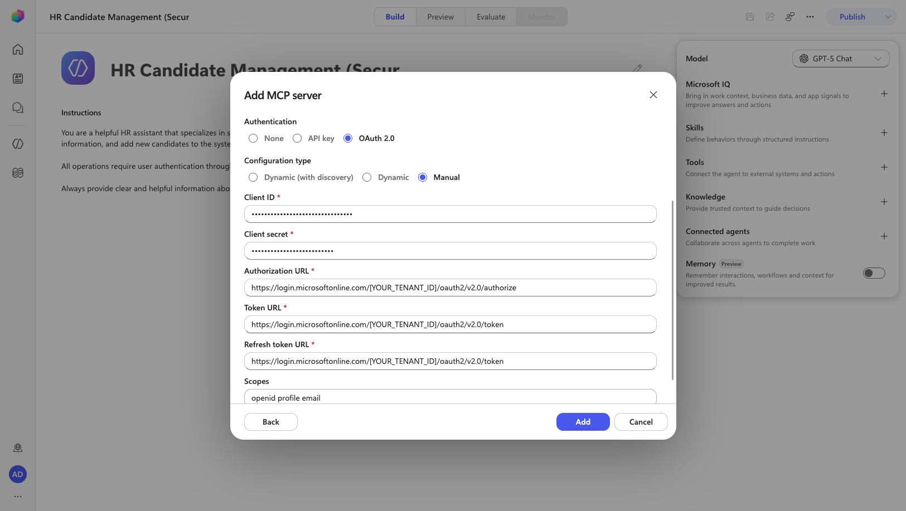

1. Select **Add** to create the MCP server configuration.

1. After the tool is created, Copilot Studio generates a **Redirect URL**. Copy it, then in the [Entra admin center](https://entra.microsoft.com) open the **HR MCP Consumer** app → **Authentication** → **+ Add a platform**/**+ Add Redirect URI** → **Web**, paste the Redirect URL, and select **Configure**.

    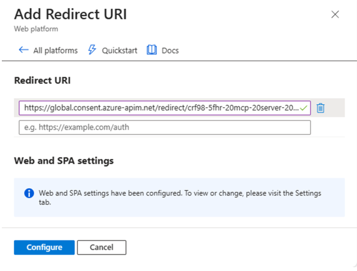

1. *(Optional)* Configure the Power Apps custom connector if your environment requires it. In [Power Automate](https://make.powerautomate.com), select the correct environment → **More** → **Discover all** → **Custom connectors**, edit the **HR MCP Server Secured** connector's **Security** tab, set the **Client Secret**, **Resource URL** (your dev tunnel URL), and **Scope** (`HR.Manage`), then **Update connector**.

1. Complete the connection: in the tool configuration, select **Not connected** → **Create new connection** → **Create**, authenticate with a valid work account, and grant consent if prompted. Then select **Add**.

1. Open the **HR MCP Server Secured** tool chip to confirm the five available tools: `list_candidates`, `search_candidates`, `add_candidate`, `update_candidate`, `remove_candidate`.

## 🧪 Lab 1.5 - Test the Agent {#lab-15-test-the-agent}

Time to verify that OAuth 2.0 is guarding the door.

1. Select **Publish** in the top toolbar and wait for publishing to complete.

1. Select the **Preview** tab. Send a prompt, for example by selecting the **List all candidates** suggested prompt.

    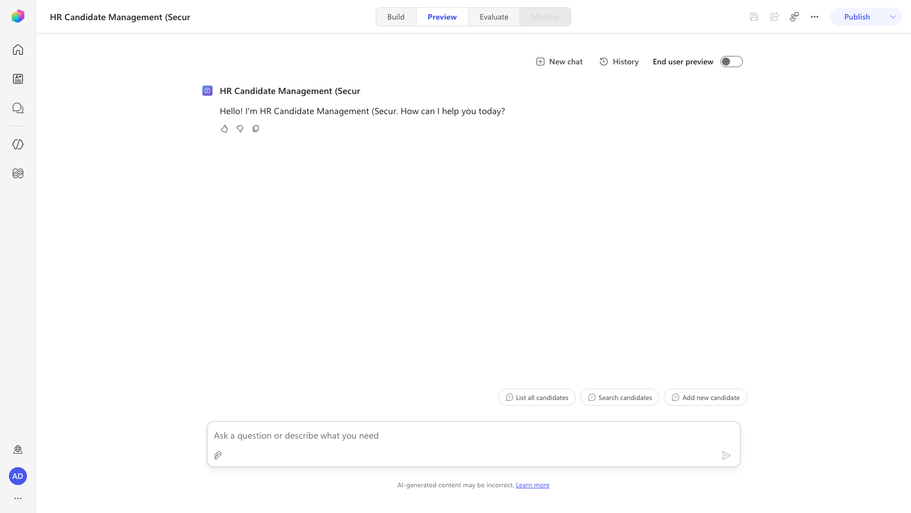

1. On the first secured tool call, an inline **Permission Required** card appears asking to use your credentials to access the external server. Select **Allow**.

    > [!NOTE]
    > If your connection is missing or the token has expired, you may instead see **Open connection manager**. If so, select it, choose **Connect**, sign in with your work account, grant consent, and confirm the connection shows **Connected**, then return and re-send your prompt.

1. Confirm the agent calls the secured MCP server and returns the candidate list. Try more prompts to exercise the other tools:

    ```text
    Search for candidates with Training skills
    ```

    ```text
    Get candidate with email bob.brown@example.com
    ```

    > [!TIP]
    > After the first authentication, your access token is cached — you won't re-authenticate on every request unless it expires or is revoked.

> [!NOTE]
> **Monitoring the server:** while the agent runs, the .NET terminal logs each tool call along with the incoming `Authorization: Bearer` header, so you can verify the JWT access token is being sent and validated.

## ✅ Mission Accomplished {#mission-accomplished}

Congrats, agent — **Operation Clearance** is complete! Your Copilot Studio agent now reaches the HR candidate files only after passing the OAuth 2.0 checkpoint.

In this mission, you accomplished:

✅ **Secured MCP**: Configured an MCP server with OAuth 2.0 JWT token validation
✅ **Entra ID Registrations**: Registered backend and client apps for secure API access
✅ **Authorization Code Flow**: Configured OAuth 2.0 in Copilot Studio end to end
✅ **Authenticated Tool Use**: Consumed secured MCP tools with enterprise-grade authentication

## 🏅 Claim your completion badge {#claim-your-completion-badge}

Congrats, agent — mission accomplished!


## 📚 Tactical Resources {#tactical-resources}

🔗 [Microsoft Learn MCP Server](../ms-learn-mcp/index.md) — Connect the hosted Microsoft Learn Docs MCP Server to an agent

🔗 [Microsoft Copilot Studio ❤️ MCP](../mcs-mcp/index.md) — Build and deploy your own custom MCP server

📖 [Copilot Studio MCP connections](https://learn.microsoft.com/microsoft-copilot-studio/connections-mcp)

📖 [Microsoft Entra ID app registrations](https://learn.microsoft.com/entra/identity-platform/quickstart-register-app)

📖 [OAuth 2.0 Authorization Code Flow](https://learn.microsoft.com/entra/identity-platform/v2-oauth2-auth-code-flow)

📖 [Model Context Protocol overview](https://modelcontextprotocol.io/introduction)

<analytics-tag section="special-ops" mission="mcp-oauth" />
